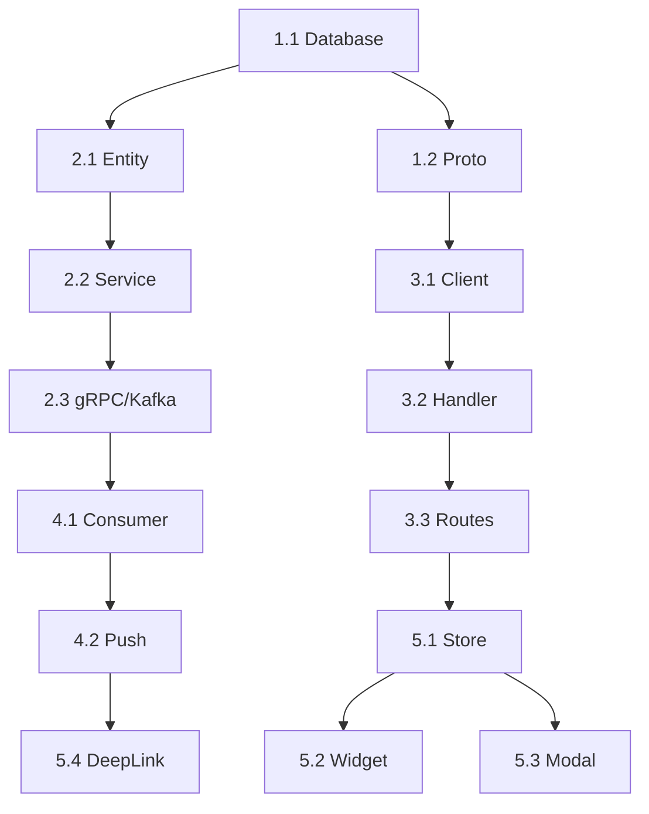

# Implementation Plan: US 1.3 - Gửi Lời Động Viên

> **Version:** v1.1 (Updated with Lessons Learned)  
> **Date:** 2026-02-04  
> **Total Effort:** 54 hours (~6.75 man-days)  
> **Status:** Ready for Sprint Planning  
> **Revision:** Added DB-SCHEMA-001 compliance notes and gRPC registration requirements

---

## Executive Summary

| Service | Impact | Effort | Deliverables |
|---------|:------:|:------:|--------------|
| user-service | 🟡 MEDIUM | 24h | Entity, Service, gRPC, Kafka |
| api-gateway | 🟡 MEDIUM | 10h | Handler, Client, Routes |
| schedule-service | 🟢 LOW | 4h | Kafka consumer, Push task |
| Mobile App | 🟡 MEDIUM | 16h | Widget, Modal, Store |

---

## Phase 1: Database & Proto (6h)

### Task 1.1: Database Migration (2h)

**Service:** user-service  
**Priority:** P0 - Blocker

- [ ] Create `encouragement_messages` table
- [ ] Create 4 indexes
- [ ] Add constraints (content_length, different_users)

**Files:**
- `user-service/src/main/resources/db/migration/V2026.02.04.1__create_encouragement_messages.sql`

---

### Task 1.2: Proto Definitions (4h)

**Service:** user-service, api-gateway-service  
**Priority:** P0 - Blocker

- [ ] Create `encouragement_service.proto` (4 RPC methods)
- [ ] Sync proto to api-gateway-service
- [ ] Generate stubs

**Files:**
- `user-service/src/main/proto/encouragement_service.proto`
- `api-gateway-service/src/main/proto/user/encouragement_service.proto`

---

## Phase 2: user-service Core (18h)

### Task 2.1: Entity & Repository (6h)

- [ ] Create `EncouragementMessage.java` entity
- [ ] Create `EncouragementRepository.java` (message CRUD)
- [ ] Create `ConnectionPermissionRepository.java` (interface)
- [ ] **Create `ConnectionPermissionRepositoryImpl.java`** (implementation)
- [ ] Implement queries: countToday, findUnread24h, batchMarkRead, isPermissionEnabled

> ⚠️ **DB-SCHEMA-001 CRITICAL**: For permission check query, use:
> - Table: `connection_permission_types` (NOT `permission_types`)
> - Column: `permission_code` VARCHAR FK (NOT `permission_type_id` INT FK)
>
> ```sql
> SELECT is_enabled FROM connection_permissions
> WHERE contact_id = $1 AND permission_code = 'encouragement';
> ```

**Files:**
```
user-service/src/main/java/com/userservice/
├── entity/EncouragementMessage.java                    [NEW]
├── repository/EncouragementRepository.java             [NEW]
├── repository/ConnectionPermissionRepository.java      [NEW]
├── repository/impl/ConnectionPermissionRepositoryImpl.java [NEW]
```

---

### Task 2.2: Service Layer (8h)

- [ ] Create `EncouragementService.java` interface
- [ ] Implement `EncouragementServiceImpl.java`
- [ ] Business logic: permission check, quota check, save, Kafka publish

**Files:**
```
user-service/src/main/java/com/userservice/
├── service/EncouragementService.java           [NEW]
└── service/impl/EncouragementServiceImpl.java  [NEW]
```

---

### Task 2.3: gRPC Handler & Service Registration (4h)

- [ ] Create `EncouragementServiceGrpcImpl.java`
- [ ] Create `EncouragementKafkaProducer.java`
- [ ] **CRITICAL: Register in `UserServiceApplication.java`**
  - Add import for `EncouragementServiceGrpcImpl`
  - Add service/repository fields
  - Initialize in `initializeServices()`
  - Register in `startGrpcServer()` with `.addService(...)`

> ⚠️ **Missing gRPC registration causes 404 NOT_FOUND error!**

**Files:**
```
user-service/src/main/java/com/userservice/
├── grpc/EncouragementServiceGrpcImpl.java [NEW]
├── kafka/EncouragementKafkaProducer.java  [NEW]
└── UserServiceApplication.java            [MODIFY - Add gRPC registration]
```

**Registration Code (in UserServiceApplication.java):**
```java
// In initializeServices()
this.connectionPermissionRepository = new ConnectionPermissionRepositoryImpl(pool);
this.encouragementRepository = new EncouragementRepositoryImpl(pool);
this.encouragementService = new EncouragementServiceImpl(
    encouragementRepository, connectionPermissionRepository, ...);

// In startGrpcServer()
.addService((io.grpc.BindableService) new EncouragementServiceGrpcImpl(encouragementService))
```

---

## Phase 3: api-gateway-service (10h)

### Task 3.1: gRPC Client (3h)

- [ ] Create `EncouragementServiceClient.java`
- [ ] Configure channel and timeout

**Files:**
- `api-gateway-service/src/main/java/com/apigateway/client/EncouragementServiceClient.java` [NEW]

---

### Task 3.2: REST Handler (5h)

- [ ] Create `EncouragementHandler.java`
- [ ] Implement 4 endpoints
- [ ] Create DTOs

**Files:**
```
api-gateway-service/src/main/java/com/apigateway/
├── handler/EncouragementHandler.java              [NEW]
├── dto/request/CreateEncouragementRequest.java    [NEW]
├── dto/request/MarkAsReadRequest.java             [NEW]
├── dto/response/EncouragementResponse.java        [NEW]
├── dto/response/QuotaResponse.java                [NEW]
```

**Endpoints:**

| Method | Path |
|:------:|------|
| POST | `/api/v1/encouragements` |
| GET | `/api/v1/encouragements` |
| POST | `/api/v1/encouragements/mark-read` |
| GET | `/api/v1/encouragements/quota` |

---

### Task 3.3: Routes & Swagger (2h)

- [ ] Add routes to `RouteConfig.java`
- [ ] Create Swagger documentation

---

## Phase 4: schedule-service (4h)

### Task 4.1: Kafka Consumer (2h)

- [ ] Create `encouragement_consumer.py`
- [ ] Subscribe to `topic-encouragement-created`

**Files:**
- `schedule-service/consumers/encouragement_consumer.py` [NEW]

---

### Task 4.2: Push Notification (2h)

- [ ] Create `send_encouragement_notification.py`
- [ ] FCM payload template

**Files:**
- `schedule-service/tasks/encouragement/send_notification.py` [NEW]
- `schedule-service/constants/encouragement_templates.py` [NEW]

---

## Phase 5: Mobile App (16h)

### Task 5.1: Store & Service (4h)

- [ ] Create `encouragementStore.ts` (Zustand)
- [ ] Create `encouragement.service.ts` (API client)
- [ ] Define types

**Files:**
```
app-mobile-ai/src/
├── stores/encouragementStore.ts        [NEW]
├── services/encouragement.service.ts   [NEW]
├── types/encouragement.types.ts        [NEW]
```

---

### Task 5.2: Caregiver Widget (6h)

- [ ] Create `EncouragementWidget.tsx`
- [ ] TextInput with 150 char limit
- [ ] CharCounter, SendButton
- [ ] Quota display

**Files:**
- `app-mobile-ai/src/components/encouragement/EncouragementWidget.tsx` [NEW]

---

### Task 5.3: Patient Modal (4h)

- [ ] Create `EncouragementModal.tsx`
- [ ] Create `EncouragementCard.tsx`
- [ ] 24h window, mark read on close

**Files:**
```
app-mobile-ai/src/components/encouragement/
├── EncouragementModal.tsx  [NEW]
├── EncouragementCard.tsx   [NEW]
```

---

### Task 5.4: Push Handling (2h)

- [ ] Modify `DeepLinkHandler.ts`
- [ ] Handle encouragement deeplink

---

## Task Dependencies



---

## Testing Plan

### Unit Tests (8h included)

| Service | Coverage | Priority |
|---------|:--------:|:--------:|
| user-service | 80% | P0 |
| schedule-service | 80% | P1 |
| api-gateway | 70% | P1 |

### Integration Tests

| Scenario | Priority |
|----------|:--------:|
| E2E: Send → Push → Modal → Mark Read | P0 |
| Quota enforcement (11th message blocked) | P0 |
| Permission #6 OFF → Feature hidden | P0 |

---

## Risks & Mitigations

| Risk | Level | Mitigation |
|------|:-----:|------------|
| Push delivery delay | 🟢 LOW | Retry queue |
| Permission race | 🟢 LOW | Real-time check |
| Quota bypass | 🟢 LOW | Server enforcement |
| **DB Schema mismatch** | 🔴 HIGH | **Verify against `_Alio_database_create.sql`** |
| **gRPC missing registration** | 🔴 HIGH | **Add `.addService()` in UserServiceApplication** |

---

## ⚠️ Lessons Learned (2026-02-04)

> **This section was added after production bug fix**

### Common Mistakes to Avoid

| ❌ Wrong | ✅ Correct | Impact |
|----------|------------|--------|
| `permission_types` | `connection_permission_types` | 500 error: relation not found |
| `permission_type_id` (INT) | `permission_code` (VARCHAR) | Query fails |
| Missing gRPC registration | Add `.addService()` in `startGrpcServer()` | 404 UNIMPLEMENTED |

### DB-SCHEMA-001 Compliance Checklist

Before writing ANY repository code, verify:

- [ ] Table name matches `_Alio_database_create.sql`
- [ ] Column names match exactly
- [ ] FK types match (VARCHAR vs INT)
- [ ] Check lookup tables (`connection_permission_types`, `relationships`, etc.)

### Permission Check Query Pattern

```sql
-- CORRECT (v2.24)
SELECT cp.is_enabled
FROM connection_permissions cp
WHERE cp.contact_id = $1 AND cp.permission_code = 'encouragement';

-- WRONG ❌ (causes 42P01 error)
SELECT cp.is_enabled
FROM connection_permissions cp
JOIN permission_types pt ON cp.permission_type_id = pt.id
WHERE cp.contact_id = $1 AND pt.code = 'encouragement';
```

---

## Sign-off

| Role | Name | Date |
|------|------|------|
| Solution Architect | | |
| Tech Lead | | |
| Product Owner | | |
