# Implementation Tasks: KOLIA-1517 - Kết nối Người thân

> **Phase:** 2 - Architecture Planning  
> **Date:** 2026-02-13  
> **SRS Version:** v4.0  
> **Revision:** v4.0 - 5-phase plan, ~80h, 5 services

---

## Overview

| Phase | Focus | Effort | Dependencies |
|:-----:|-------|:------:|:------------:|
| 0 | Database Migration & Family Group | ~12h | None |
| 1 | user-service Core Logic | ~18h | Phase 0 |
| 2 | api-gateway-service Endpoints | ~20h | Phase 1 |
| 3 | Cross-Service Integration | ~15h | Phase 1, 2 |
| 4 | Testing & Verification | ~15h | Phase 1-3 |
| **Total** | | **~80h** | |

---

## Phase 0: Database Migration & Family Group Entity (~12h)

### TASK-001: Database Migration Script
- **Service:** user-service
- **Priority:** P0 | **Effort:** 4h
- **Dependencies:** None
- **Description:** Create migration for family_groups, family_group_members tables; ALTER user_emergency_contacts (+permission_revoked, +family_group_id); UPDATE invite_type CHECK constraint
- **Acceptance Criteria:**
  - `family_groups` table created with admin_user_id, subscription_id, name, status
  - `family_group_members` table with UNIQUE(user_id) constraint (BR-057)
  - `permission_revoked` BOOLEAN DEFAULT false on user_emergency_contacts
  - `family_group_id` UUID FK on user_emergency_contacts
  - `invite_type` CHECK updated to `add_patient`/`add_caregiver`
  - Rollback script included

### TASK-002: Family Group Entity & Repository
- **Service:** user-service
- **Priority:** P0 | **Effort:** 4h
- **Dependencies:** TASK-001
- **Description:** Create FamilyGroup and FamilyGroupMember Java entities + repositories
- **Acceptance Criteria:**
  - FamilyGroup entity maps to family_groups table
  - FamilyGroupMember entity with user_id UNIQUE constraint
  - Repository methods: findByAdminUserId, findByUserId, existsByUserId
  - UserEmergencyContact entity updated with new fields

### TASK-003: Family Group Service Layer
- **Service:** user-service
- **Priority:** P0 | **Effort:** 4h
- **Dependencies:** TASK-002
- **Description:** Create FamilyGroupService with group lifecycle management
- **Acceptance Criteria:**
  - createGroup (linked to subscription)
  - addMember (with exclusive group validation, BR-057)
  - removeMember (with slot release, BR-036)
  - getGroupByUserId, getGroupByAdminId
  - leaveGroup (for non-Admin, BR-061)

---

## Phase 1: user-service Core Logic (~18h)

### TASK-004: Admin-Only Invite Validation
- **Service:** user-service
- **Priority:** P0 | **Effort:** 3h
- **Dependencies:** TASK-003
- **Description:** Modify ConnectionService to validate Admin role before creating invites
- **Acceptance Criteria:**
  - Only Admin (from family_group) can create invites (BR-041)
  - Non-Admin attempt → error response
  - Admin self-add → auto-accept (BR-049)
  - Phone-only invite (no MQH, no permissions config) (BR-055)

### TASK-005: Payment Service Client
- **Service:** user-service
- **Priority:** P0 | **Effort:** 3h
- **Dependencies:** TASK-002
- **Description:** Create PaymentServiceClient for gRPC calls to payment-service
- **Acceptance Criteria:**
  - GetSubscription RPC call returns slot info
  - Slot pre-check before invite (BR-033)
  - Slot formula validation: `slot_trống = tổng_slot - đã_gán - pending` (BR-059)
  - Graceful fallback if payment-service unavailable

### TASK-006: Auto-Connect Logic
- **Service:** user-service
- **Priority:** P0 | **Effort:** 4h
- **Dependencies:** TASK-004, TASK-005
- **Description:** When CG accepts invite, auto-create connections to ALL patients in group
- **Acceptance Criteria:**
  - CG accept → find all patients in same family_group
  - Create connection to each patient with ALL permissions ON (BR-045)
  - Transaction-based: rollback all if any fails
  - Kafka event: `connection.member.accepted`

### TASK-007: Soft Disconnect (Permission Revoke/Restore)
- **Service:** user-service
- **Priority:** P0 | **Effort:** 4h
- **Dependencies:** TASK-002
- **Description:** Implement tắt/mở quyền theo dõi (BR-040)
- **Acceptance Criteria:**
  - Revoke: set permission_revoked=true, ALL 5 permissions OFF (bypass BR-039)
  - Restore: when ≥1 permission ON → permission_revoked=false
  - Connection remains active (status unchanged)
  - Silent operation — NO notification to CG (BR-056)

### TASK-008: Leave Group & Admin Remove
- **Service:** user-service
- **Priority:** P0 | **Effort:** 4h
- **Dependencies:** TASK-003, TASK-005
- **Description:** Non-Admin leave group (BR-061) and Admin remove member (BR-058)
- **Acceptance Criteria:**
  - Leave: connection cancelled, slot released, user → free plan
  - Remove: Admin can remove any member except self (BR-058)
  - Kafka events for both: `connection.member.removed`
  - Admin receives push notification on member leave

---

## Phase 2: api-gateway-service Endpoints (~20h)

### TASK-009: Family Group REST Endpoints
- **Service:** api-gateway-service
- **Priority:** P0 | **Effort:** 6h
- **Dependencies:** TASK-003
- **Description:** Create FamilyGroupHandler with 3 endpoints
- **Acceptance Criteria:**
  - `GET /api/v1/family-groups` — returns group info + package details
  - `DELETE /api/v1/family-groups/members/:memberId` — Admin remove
  - `POST /api/v1/family-groups/leave` — Non-Admin leave group
  - All endpoints route to user-service via gRPC

### TASK-010: Connection Endpoints Update
- **Service:** api-gateway-service
- **Priority:** P0 | **Effort:** 6h
- **Dependencies:** TASK-004, TASK-007
- **Description:** Update ConnectionHandler for v4.0 flows
- **Acceptance Criteria:**
  - `POST /connections/invite` simplified (phone only, Admin auth check)
  - `POST /connections/invites/:id/accept` returns auto-connect result
  - `PUT /connections/:contactId/revoke` — tắt quyền theo dõi
  - `PUT /connections/:contactId/restore` — mở lại quyền
  - `PUT /connections/:contactId/relationship` — update MQH

### TASK-011: Deprecated Endpoint Migration
- **Service:** api-gateway-service
- **Priority:** P1 | **Effort:** 2h
- **Dependencies:** TASK-010
- **Description:** Deprecate `DELETE /api/v1/connections/:id`
- **Acceptance Criteria:**
  - Endpoint returns 410 GONE or redirects to appropriate new endpoint
  - Swagger/OpenAPI updated with deprecation notice
  - Feature flag for gradual removal

### TASK-012: DTO & Proto Updates
- **Service:** api-gateway-service
- **Priority:** P0 | **Effort:** 6h
- **Dependencies:** TASK-009, TASK-010
- **Description:** Create/modify DTOs and proto definitions
- **Acceptance Criteria:**
  - CreateInviteRequest simplified (phone only)
  - FamilyGroupResponse includes group + package + slot info
  - RemoveMemberRequest, RevokePermissionRequest, UpdateRelationshipRequest DTOs
  - Proto files updated for all new gRPC methods

---

## Phase 3: Cross-Service Integration (~15h)

### TASK-013: Schedule Service — Member Broadcast
- **Service:** schedule-service
- **Priority:** P0 | **Effort:** 5h
- **Dependencies:** TASK-006
- **Description:** Handle new Kafka events for member notifications
- **Acceptance Criteria:**
  - `connection.member.accepted` → push to ALL existing members (BR-052)
  - `connection.member.removed` → push to removed member
  - Exclude new member + Admin from broadcast
  - Notification content: "👋 {Tên} đã vào nhóm"

### TASK-014: Schedule Service — ZNS Templates
- **Service:** schedule-service
- **Priority:** P0 | **Effort:** 3h
- **Dependencies:** TASK-004
- **Description:** Update ZNS templates for v4.0 invite types
- **Acceptance Criteria:**
  - `add_patient` template: "{Tên Admin} mời bạn... vai trò Người bệnh"
  - `add_caregiver` template: "{Tên Admin} mời bạn... vai trò Người thân"
  - ZNS fail → SMS fallback (BR-004)

### TASK-015: Auth Service — Backfill Verification
- **Service:** auth-service
- **Priority:** P1 | **Effort:** 2h
- **Dependencies:** TASK-001
- **Description:** Verify backfillPendingInviteReceiverIds handles new invite_type values
- **Acceptance Criteria:**
  - SQL query matches both `add_patient` and `add_caregiver` invite_type
  - No regression on existing backfill behavior
  - Warning logging for failures (existing pattern)

### TASK-016: Payment Service — GetSubscription Verification
- **Service:** payment-service
- **Priority:** P0 | **Effort:** 5h
- **Dependencies:** None
- **Description:** Ensure GetSubscription RPC returns complete slot info
- **Acceptance Criteria:**
  - Response includes: package_name, total_patient_slots, total_caregiver_slots, used_slots, expiry_date
  - Slot count accurate (includes pending invites)
  - Pessimistic locking for slot race condition

---

## Phase 4: Testing & Verification (~15h)

### TASK-017: Unit Tests
- **Service:** user-service, api-gateway-service
- **Priority:** P0 | **Effort:** 5h
- **Dependencies:** Phase 1-2
- **Acceptance Criteria:**
  - Admin-only invite validation tests
  - Auto-connect logic tests (multiple patients)
  - Soft disconnect revoke/restore tests
  - Exclusive group constraint tests
  - Slot management tests

### TASK-018: Integration Tests
- **Service:** Cross-service
- **Priority:** P0 | **Effort:** 5h
- **Dependencies:** Phase 1-3
- **Acceptance Criteria:**
  - End-to-end invite flow (Admin → member accept → auto-connect)
  - Payment integration (slot check → consume → release)
  - Notification delivery (ZNS, Push, broadcast)
  - Leave group with cascading effects

### TASK-019: Regression Tests
- **Service:** All
- **Priority:** P0 | **Effort:** 3h
- **Dependencies:** Phase 1-3
- **Acceptance Criteria:**
  - SOS contact (contact_type='emergency') unchanged
  - Existing connections unaffected by migration
  - Profile selector behavior correct
  - Dashboard permission checks still work

### TASK-020: Data Migration Testing
- **Service:** Database
- **Priority:** P0 | **Effort:** 2h
- **Dependencies:** TASK-001
- **Acceptance Criteria:**
  - invite_type migration: old values → new values
  - Rollback script works cleanly
  - Existing data integrity preserved

---

## Execution Order & Dependencies

```mermaid
gantt
    title Implementation Timeline (~80h)
    dateFormat X
    axisFormat %s

    section Phase 0
    TASK-001 DB Migration    :a1, 0, 4
    TASK-002 Entity/Repo     :a2, after a1, 4
    TASK-003 Group Service   :a3, after a2, 4

    section Phase 1
    TASK-004 Admin Invite    :b1, after a3, 3
    TASK-005 Payment Client  :b2, after a2, 3
    TASK-006 Auto-Connect    :b3, after b1, 4
    TASK-007 Soft Disconnect :b4, after a2, 4
    TASK-008 Leave/Remove    :b5, after a3, 4

    section Phase 2
    TASK-009 FG Endpoints    :c1, after a3, 6
    TASK-010 Conn Update     :c2, after b1, 6
    TASK-011 Deprecation     :c3, after c2, 2
    TASK-012 DTO/Proto       :c4, after c1, 6

    section Phase 3
    TASK-013 Broadcast       :d1, after b3, 5
    TASK-014 ZNS Templates   :d2, after b1, 3
    TASK-015 Auth Verify     :d3, after a1, 2
    TASK-016 Payment Verify  :d4, 0, 5

    section Phase 4
    TASK-017 Unit Tests      :e1, after c2, 5
    TASK-018 Integration     :e2, after d1, 5
    TASK-019 Regression      :e3, after d1, 3
    TASK-020 Migration Test  :e4, after a1, 2
```



---

## Test Commands

```bash
# User Service Unit Tests
cd alio-services/user-service
./gradlew test --tests "*FamilyGroup*" --tests "*Connection*"

# API Gateway Integration Tests
cd alio-services/api-gateway-service
./gradlew test --tests "*FamilyGroup*" --tests "*Connection*"

# Schedule Service Tests
cd schedule-service
pytest tests/test_member_broadcast.py tests/test_connection_events.py

# Full Regression
cd alio-services
./gradlew test
```

---

## References

- [FA Service Decomposition v4.0](file:///Users/nguyenvanhuy/Desktop/OSP/Kolia/dev/kolia/docs/nguoi_than/features/ket_noi_nguoi_than/02_planning/service-decomposition.md)
- [SA Implementation Recommendations v4.0](file:///Users/nguyenvanhuy/Desktop/OSP/Kolia/dev/kolia/docs/nguoi_than/sa-analysis/ket_noi_nguoi_than/07_risks/implementation_recommendations.md)
