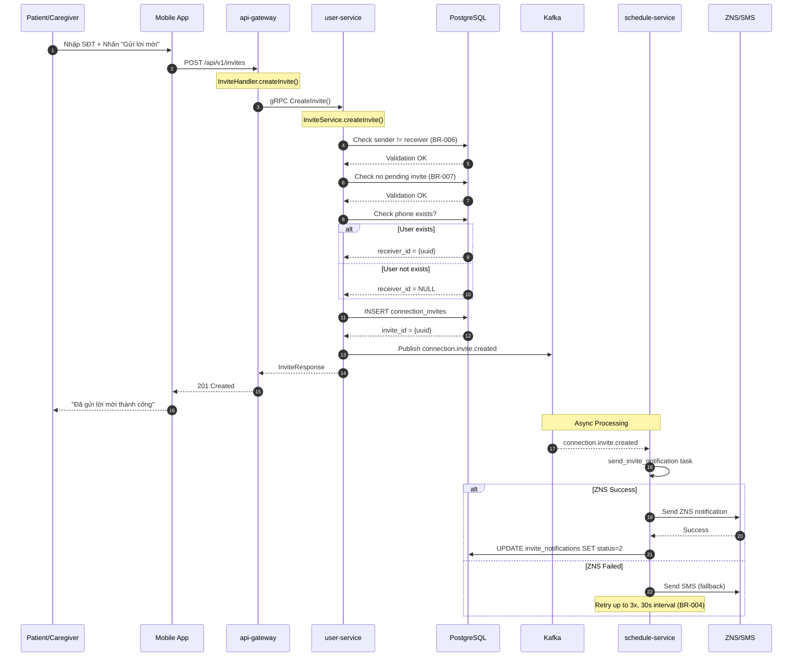
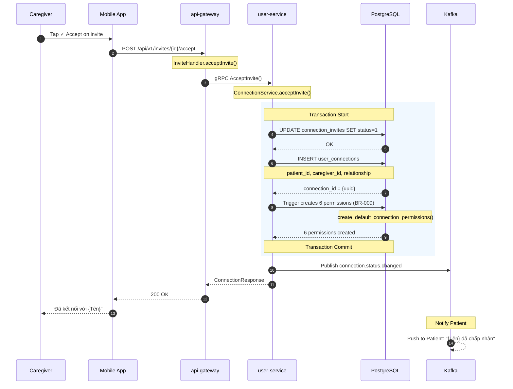
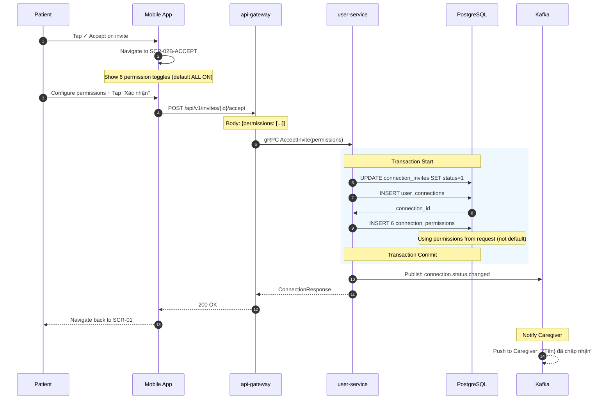
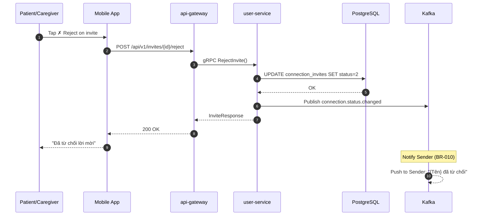
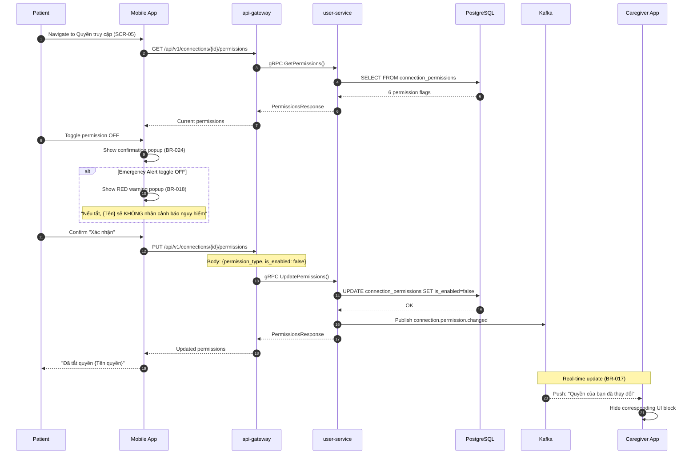
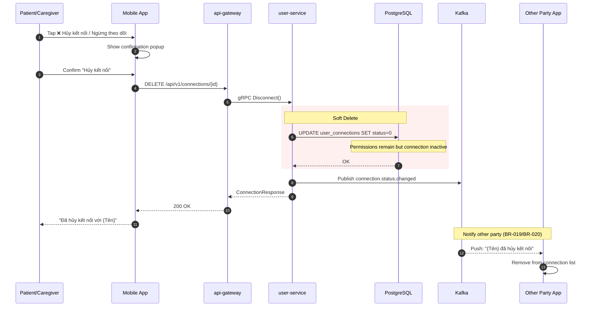
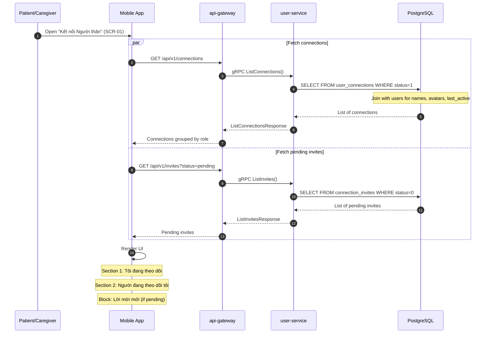
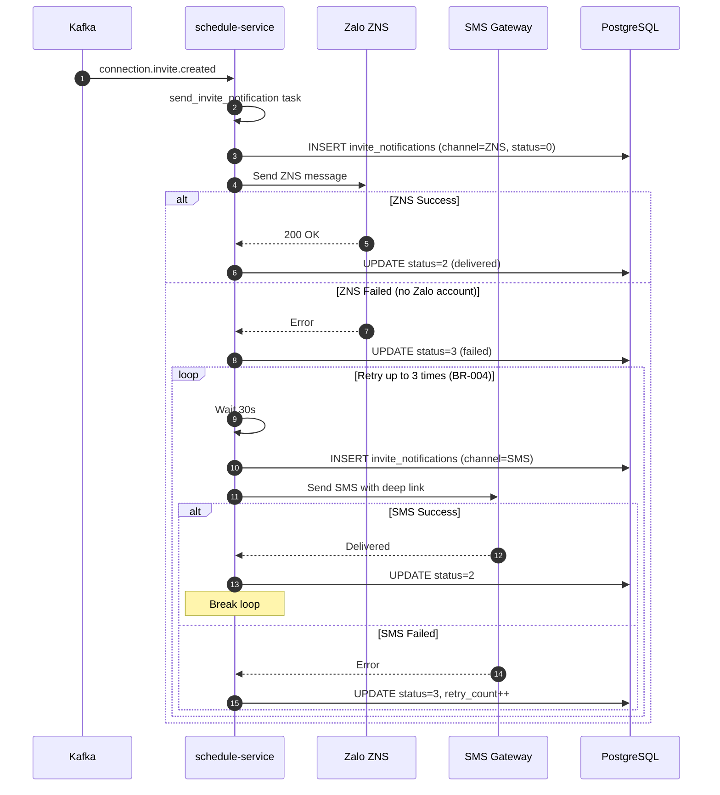
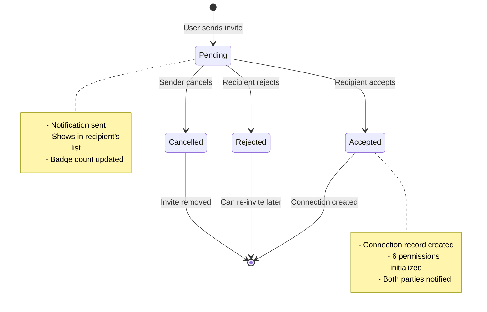
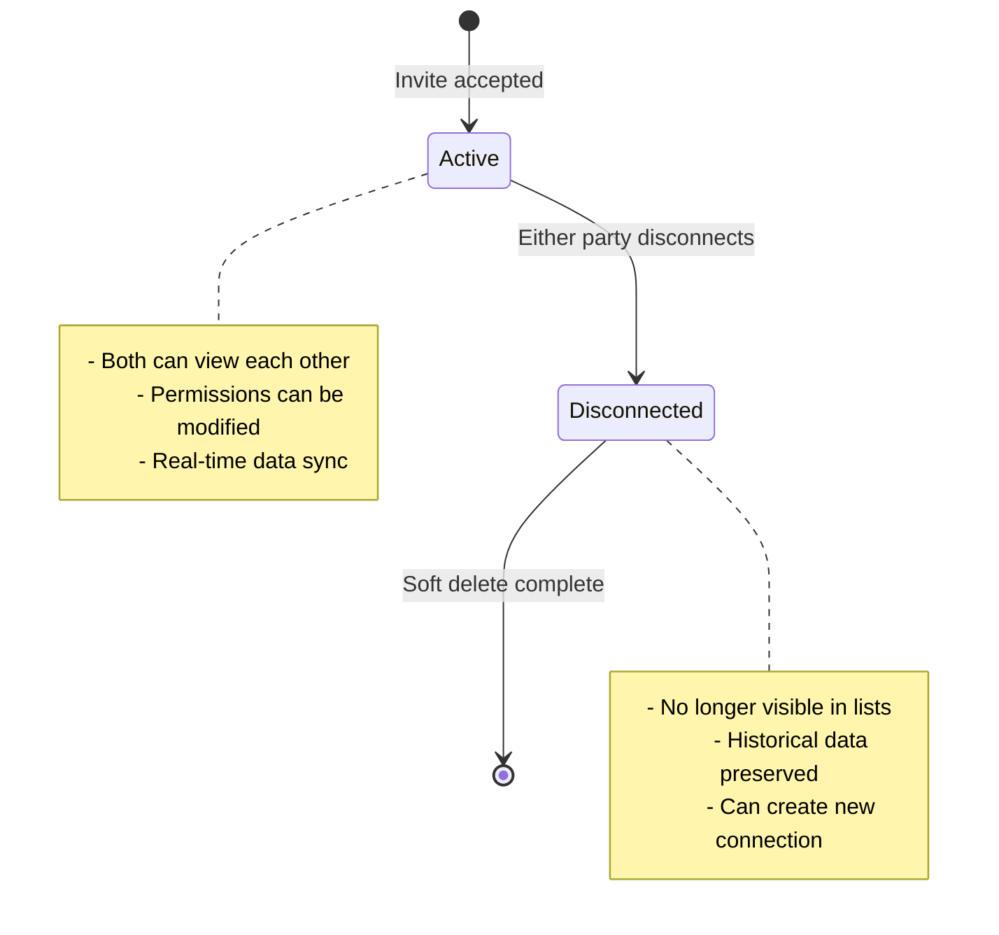

# Sequence Diagrams: KOLIA-1517 - Kết nối Người thân

> **Feature:** Connection Flow (Patient ↔ Caregiver)  
> **Date:** 2026-01-28

---

## 1. Send Invite Flow

---

## 2. Accept Invite Flow (Caregiver accepts Patient invite)

---

## 3. Accept Invite Flow (Patient accepts Caregiver invite - with permission config)

---

## 4. Reject Invite Flow

---

## 5. Update Permission Flow

---

## 6. Disconnect Flow

---

## 7. List Connections Flow

---

## 8. ZNS Fallback Flow (Async)

---

## State Machine: Invite Lifecycle

---

## State Machine: Connection Lifecycle

