# Sequence Diagrams: KOLIA-1517 - Kết nối Người thân

> **Phase:** 2 - Architecture Planning  
> **Date:** 2026-02-13  
> **SRS Version:** v4.0  
> **Revision:** v4.0 - Admin-only flows, auto-connect, soft disconnect, leave group

---

## 1. Send Invite (Admin-Only) — v4.0

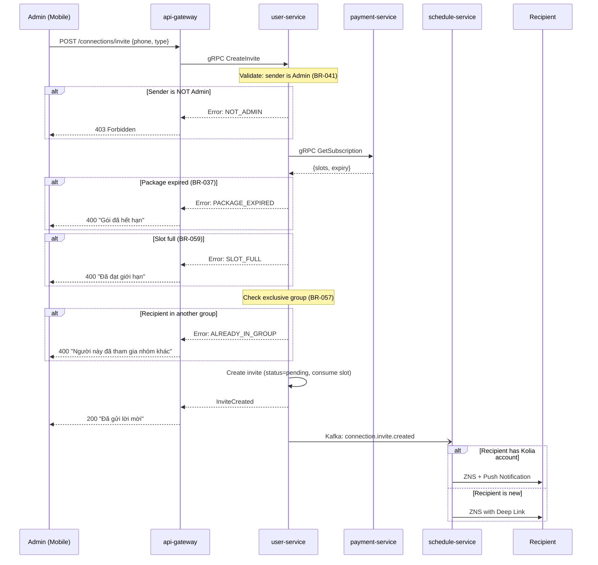

---

## 2. Accept Invite + Auto-Connect — v4.0

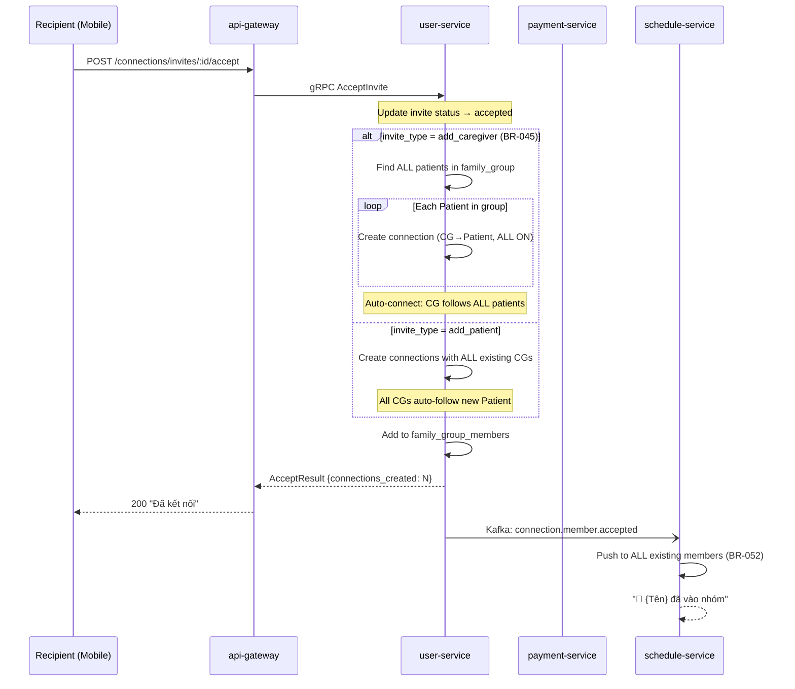

---

## 3. Reject Invite — v4.0

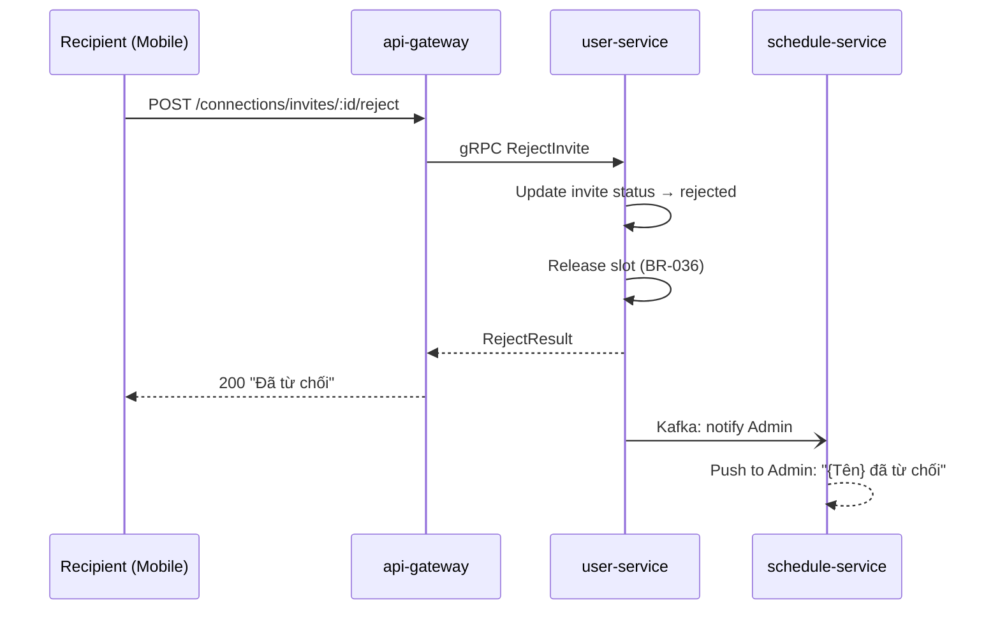

---

## 4. Permission Revoke (Tắt quyền theo dõi) — v4.0

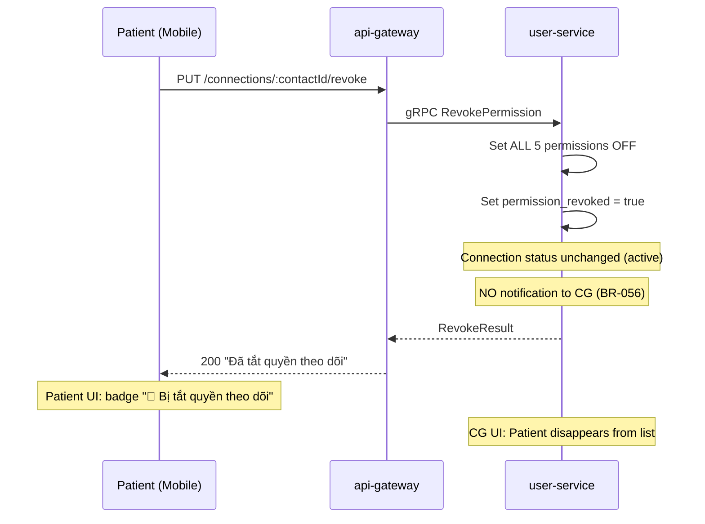

---

## 5. Permission Restore (Mở lại quyền) — v4.0

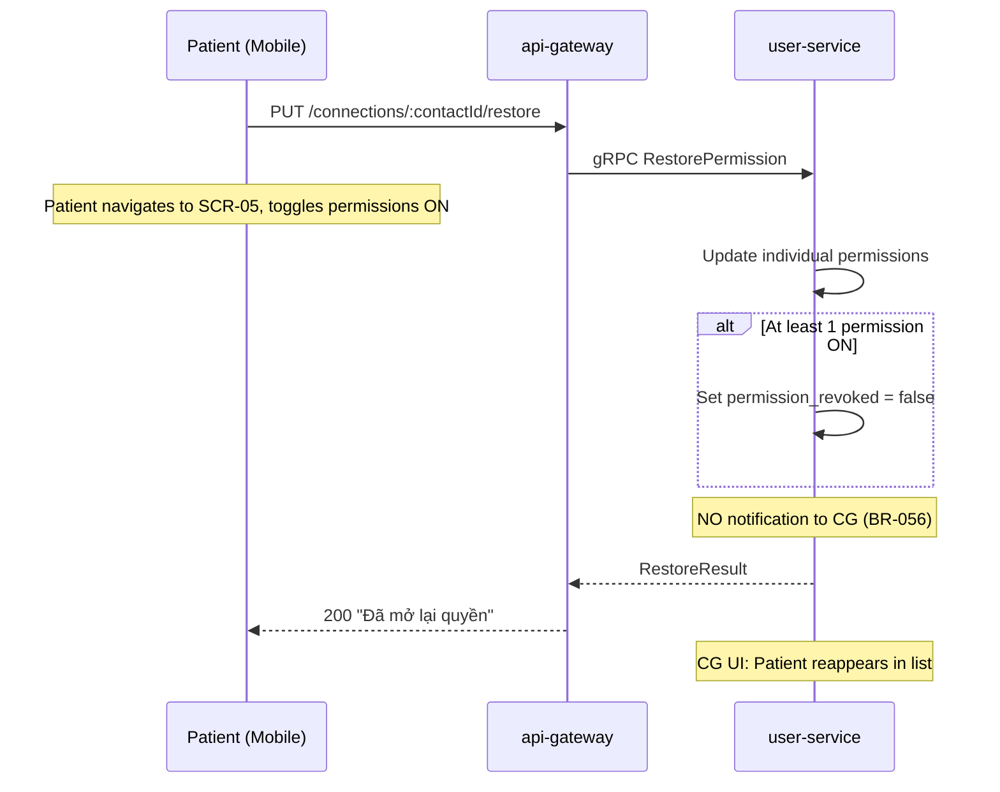

---

## 6. Leave Group (Non-Admin) — v4.0

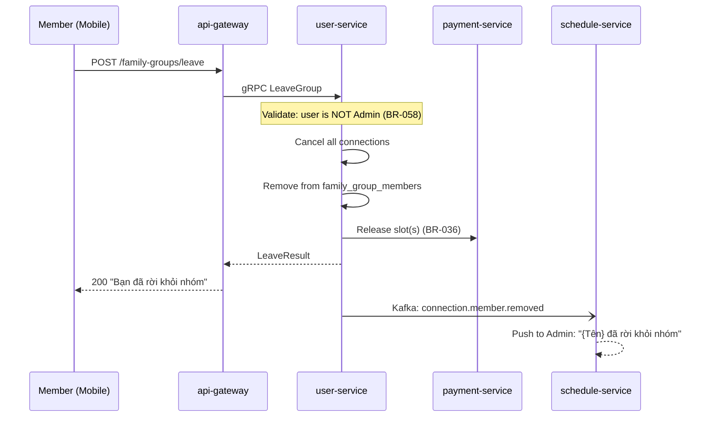

---

## 7. Admin Remove Member — v4.0

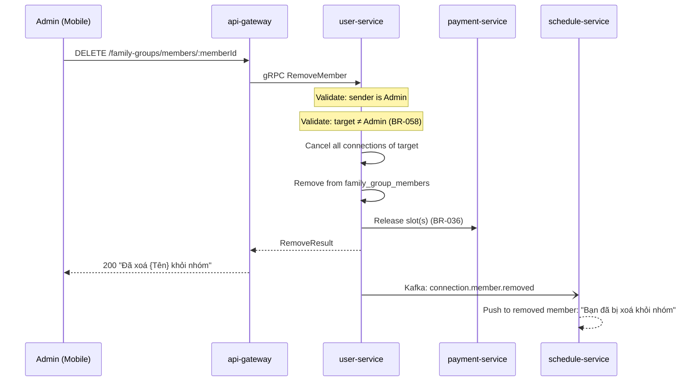

---

## 8. Admin Self-Add — v4.0

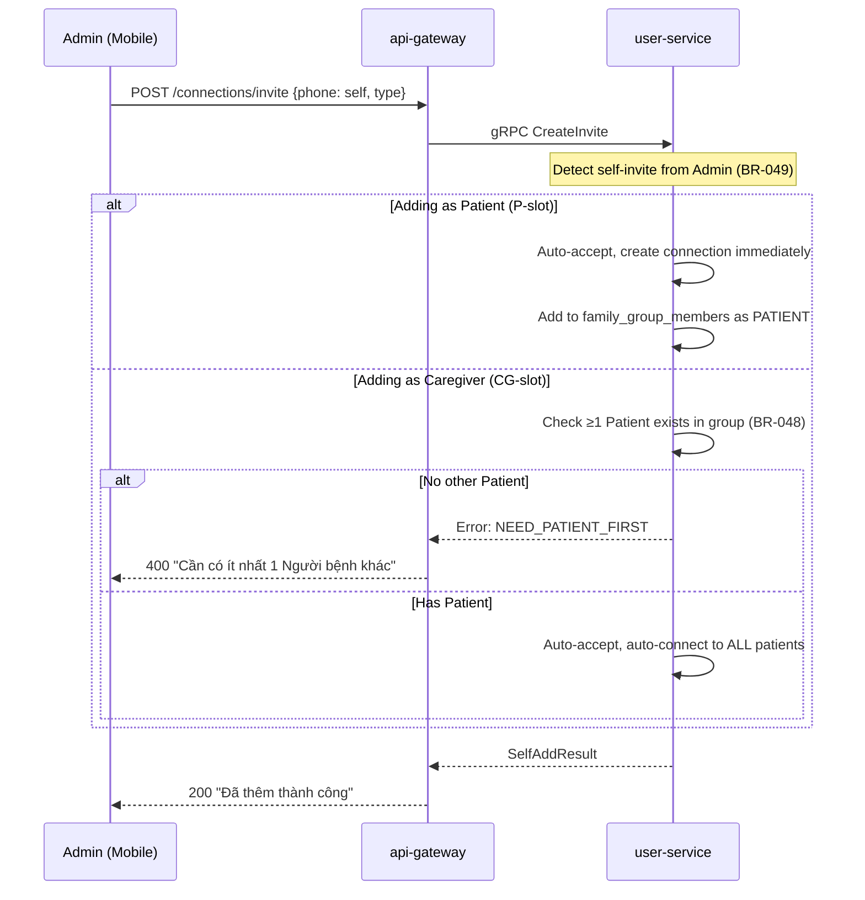

---

## 9. Update Relationship (MQH) — v5.2

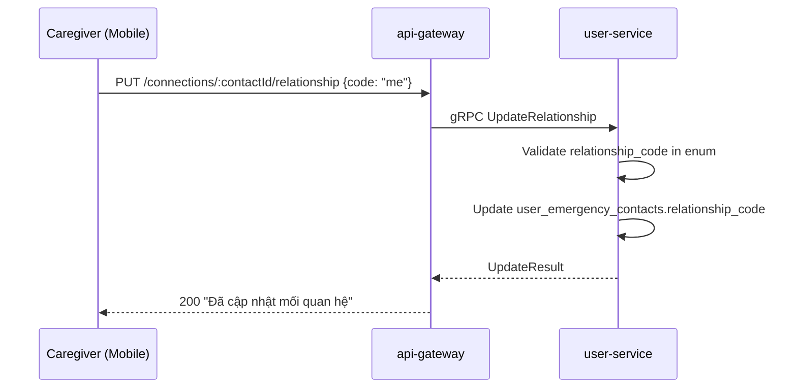

---

## 10. State Machines

### 10.1 Invite Lifecycle

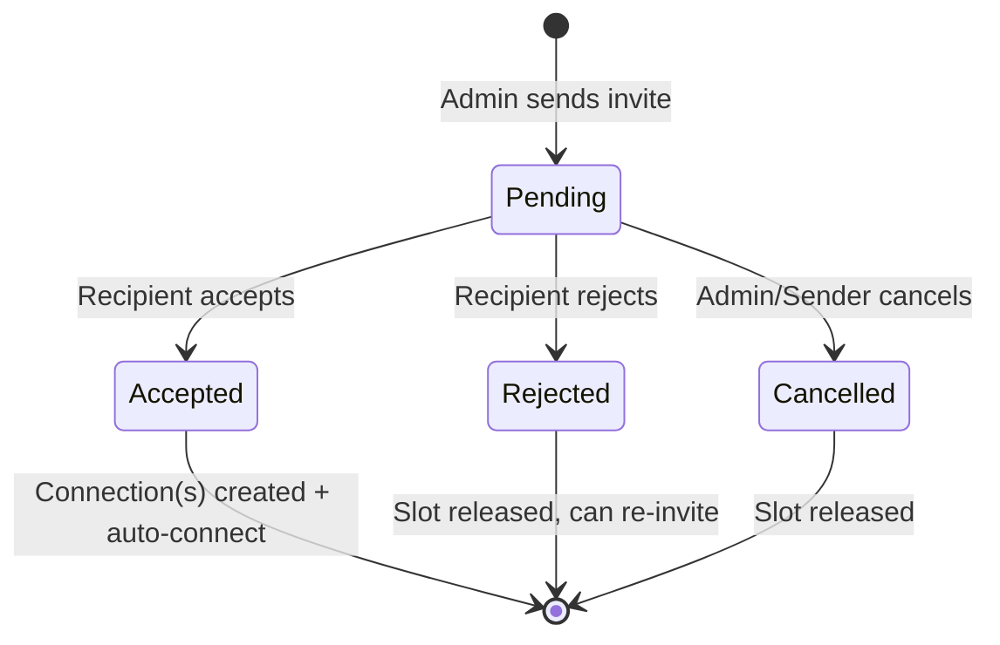

### 10.2 Connection Lifecycle — v4.0

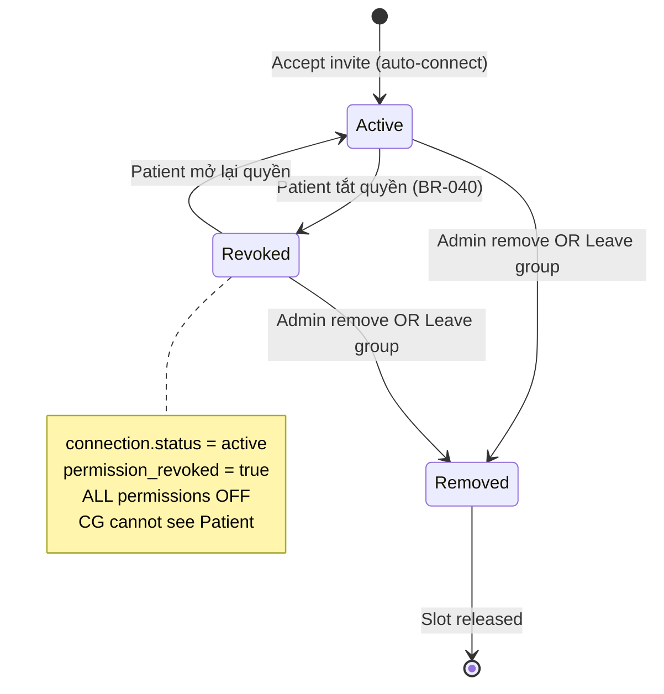

### 10.3 Slot Lifecycle — v4.0

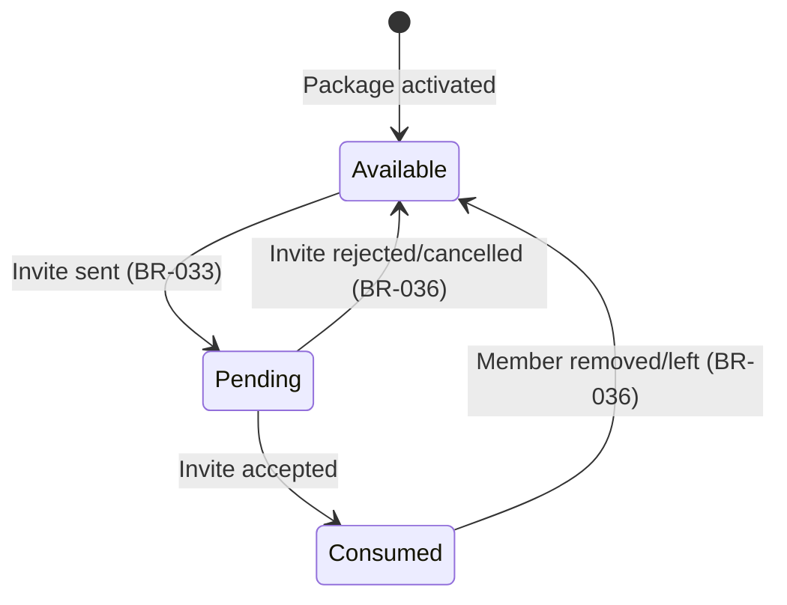

---

## References

- [SRS v4.0 §6](file:///Users/nguyenvanhuy/Desktop/OSP/Kolia/dev/kolia/docs/nguoi_than/srs_input_documents/srs_nguoi_than_nhom_gia_dinh.md) — Flow Diagrams
- [SA Service Mapping v4.0](file:///Users/nguyenvanhuy/Desktop/OSP/Kolia/dev/kolia/docs/nguoi_than/sa-analysis/ket_noi_nguoi_than/04_mapping/service_mapping.md)
