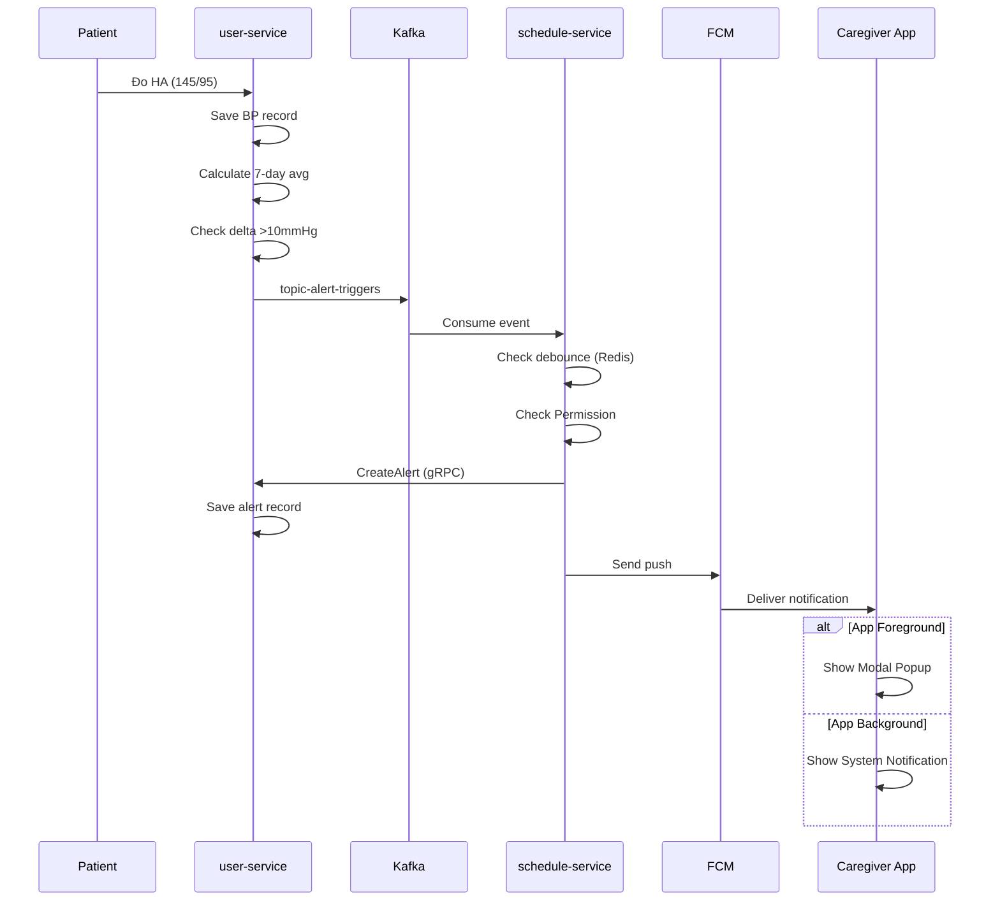
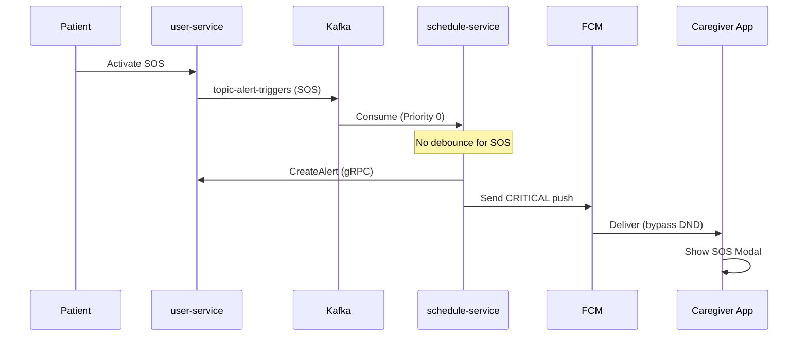
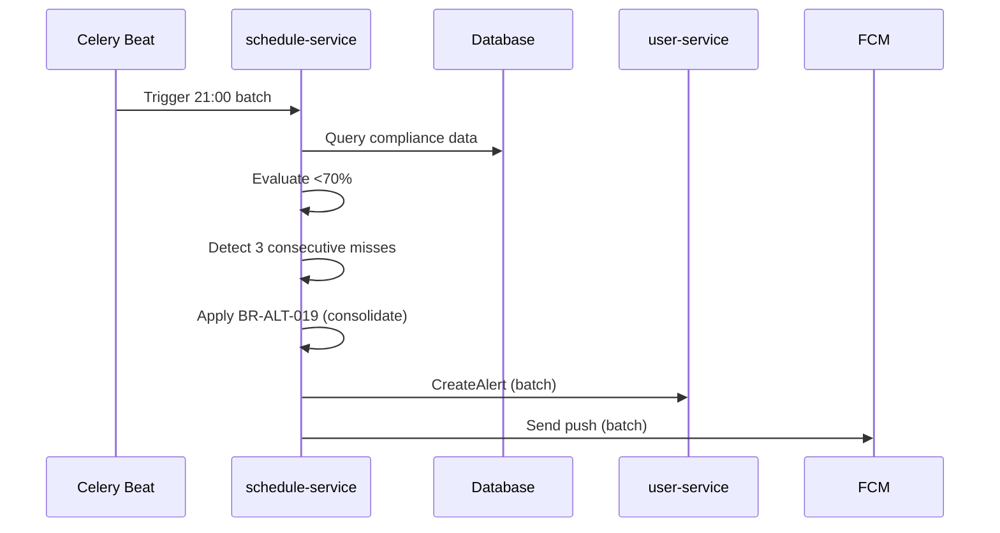

# Sequence Diagram: US 1.2 - Nhận Cảnh Báo Bất Thường

> **Phase:** 6 - Dependency & Sequence Planning  
> **Date:** 2026-02-02

---

## 1. Real-time HA Alert Flow



---

## 2. SOS Alert Flow



---

## 3. Batch 21:00 Flow



---

## 4. Task Dependencies

```
DB-001 ──▶ PROTO-001 ──▶ USR-001 ──▶ USR-003 ──▶ USR-005 ──┐
                                                            │
                   USR-007 ──▶ USR-008 ──▶ SCH-001 ─────────┤
                                                            │
                         PROTO-001 ──▶ GW-002 ──────────────┤
                                                            ▼
                                                     USR-006 ──▶ GW-001
                                                            │
JOB-001 ──▶ SCH-001 ──▶ SCH-002 ──▶ SCH-007 ────────────────┘
                   │
                   └──▶ SCH-005 ──▶ SCH-007
```

---

## 5. Integration Dependencies

| Source | Target | Event/Method |
|--------|--------|--------------|
| user-service | Kafka | `topic-alert-triggers` (producer) |
| schedule-service | Kafka | Consumer |
| schedule-service | user-service | `CreateAlert` gRPC |
| schedule-service | FCM | Push HTTP |
| user-service | schedule-service | `topic-alert-dispatched` |

---

## Next Phase

➡️ [../03_review/review-checklist.md](../03_review/review-checklist.md)
