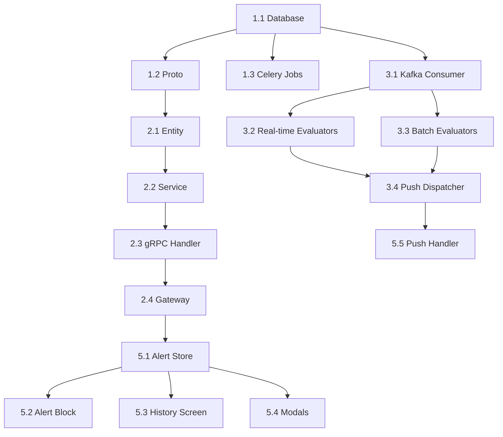

# Implementation Plan: US 1.2 - Nhận Cảnh Báo Bất Thường

> **Version:** v1.5  
> **Date:** 2026-02-02  
> **Total Effort:** 132 hours (~16.5 man-days)  
> **Status:** Ready for Sprint Planning

---

## Executive Summary

| Service | Impact | Effort | Deliverables |
|---------|:------:|:------:|--------------|
| schedule-service | 🔴 HIGH | 40h | Trigger consumer, evaluators, push dispatcher |
| Mobile App | 🔴 HIGH | 48h | 4 screens, push handling |
| user-service | 🟡 MEDIUM | 36h | Entity, gRPC service, BP delta, Kafka producer |
| api-gateway | 🟡 MEDIUM | 12h | REST endpoints, Swagger |

---

## Phase 1: Database & Proto (12h)

### Task 1.1: Database Migration (4h)

**Service:** user-service  
**Priority:** P0 - Blocker

- [ ] Create `caregiver_alert_types` table (lookup, 4 categories)
- [ ] Create `caregiver_alerts` table (14 columns)
- [ ] Create indexes (7 total)
- [ ] Seed alert types data

**Files:**
- `user-service/src/main/resources/db/migration/V2026.02.02.1__create_caregiver_alerts.sql`

---

### Task 1.2: Proto Definitions (4h)

**Service:** user-service  
**Priority:** P0 - Blocker

- [ ] Create `alert_service.proto` with 6 RPC methods
- [ ] Define messages: CreateAlertRequest, AlertInfo, AlertHistoryResponse
- [ ] Sync proto to api-gateway-service

**Files:**
- `user-service/src/main/proto/alert_service.proto`
- `api-gateway-service/src/main/proto/user/alert_service.proto` (sync)

---

### Task 1.3: Register Celery Beat Jobs (4h)

**Service:** schedule-service  
**Priority:** P0 - Blocker

- [ ] Add `caregiver_alerts_batch_21h` job to batch_jobs table
- [ ] Configure timezone: Asia/Ho_Chi_Minh

**SQL:**
```sql
INSERT INTO batch_jobs (job_key, schedule, timezone, task, is_active)
VALUES ('caregiver_alerts_batch_21h', '0 21 * * *', 'Asia/Ho_Chi_Minh', 
        'schedule_service.tasks.alerts.run_batch_alerts', TRUE);
```

---

## Phase 2: Backend Core (40h)

### Task 2.1: Entity & Repository (8h)

**Service:** user-service

- [ ] Create `CaregiverAlert.java` entity
- [ ] Create `AlertType.java` entity  
- [ ] Create `CaregiverAlertRepository.java`
- [ ] Implement pagination + filter queries

**Files:**
```
user-service/src/main/java/com/userservice/
├── entity/
│   ├── CaregiverAlert.java       [NEW]
│   └── AlertType.java            [NEW]
├── repository/
│   └── CaregiverAlertRepository.java [NEW]
```

---

### Task 2.2: Alert Service (12h)

**Service:** user-service

- [ ] Create `AlertService.java` interface
- [ ] Implement `AlertServiceImpl.java`
- [ ] Create `BPDeltaEvaluator.java` - Calculate 7-day avg and delta
- [ ] Methods: createAlert, getHistory, markRead, getUnreadCount, evaluateBPDelta

**Files:**
```
user-service/src/main/java/com/userservice/
├── service/
│   ├── AlertService.java         [NEW]
│   └── impl/
│       ├── AlertServiceImpl.java [NEW]
│       └── BPDeltaEvaluator.java [NEW]
```

---

### Task 2.3: gRPC Handler (8h)

**Service:** user-service

- [ ] Create `AlertServiceGrpcImpl.java`
- [ ] Implement 6 RPC methods
- [ ] Add to gRPC server config

**Files:**
- `user-service/src/main/java/com/userservice/handler/AlertServiceGrpcImpl.java` [NEW]

---

### Task 2.4: Kafka Event Emission (4h)

**Service:** user-service

- [ ] Create `AlertKafkaProducer.java`
- [ ] Emit to `topic-alert-triggers` on BP save with delta >10mmHg
- [ ] Include delta calculation in payload

**Files:**
- `user-service/src/main/java/com/userservice/kafka/AlertKafkaProducer.java` [NEW]

---

### Task 2.5: API Gateway (8h)

**Service:** api-gateway-service

- [ ] Create `AlertHandler.java`
- [ ] Create `AlertServiceClient.java`
- [ ] Add routes to `RouteConfig.java`
- [ ] Create Swagger `alert-management.yaml`

**Files:**
```
api-gateway-service/src/main/java/com/apigateway/
├── handler/
│   └── AlertHandler.java         [NEW]
├── client/
│   └── AlertServiceClient.java   [NEW]
```

**Endpoints:**
| Method | Path |
|:------:|------|
| GET | `/api/v1/connections/alerts` |
| GET | `/api/v1/connections/alerts/{alertId}` |
| POST | `/api/v1/connections/alerts/mark-read` |
| POST | `/api/v1/connections/alerts/mark-all-read` |
| GET | `/api/v1/connections/alerts/unread-count` |
| GET | `/api/v1/connections/alerts/types` |

---

## Phase 3: Schedule Service (40h)

### Task 3.1: Kafka Consumer (8h)

**Service:** schedule-service

- [ ] Create `alert_trigger_consumer.py`
- [ ] Subscribe to `topic-alert-triggers`
- [ ] Route to appropriate evaluators

**Files:**
- `schedule-service/consumers/alert_trigger_consumer.py` [NEW]

---

### Task 3.2: Real-time Evaluators (12h)

**Service:** schedule-service

- [ ] Create `bp_alert_evaluator.py` - HA bất thường (delta >10mmHg)
- [ ] Create `medication_alert_evaluator.py` - Sai liều
- [ ] Implement debounce logic (Redis TTL 5min)

**Files:**
```
schedule-service/tasks/alerts/
├── bp_alert_evaluator.py         [NEW]
├── medication_alert_evaluator.py [NEW]
```

---

### Task 3.3: Batch Evaluators (12h)

**Service:** schedule-service

- [ ] Create `compliance_batch_evaluator.py` - Tuân thủ <70%
- [ ] Create `missed_streak_evaluator.py` - 3 consecutive misses
- [ ] Create `run_batch_alerts.py` - Celery task 21:00

**Files:**
```
schedule-service/tasks/alerts/
├── compliance_batch_evaluator.py [NEW]
├── missed_streak_evaluator.py    [NEW]
├── run_batch_alerts.py           [NEW]
```

---

### Task 3.4: Push Dispatcher (8h)

**Service:** schedule-service

- [ ] Create `alert_dispatcher.py`
- [ ] FCM payload templates (8 types)
- [ ] SOS Critical priority (bypass DND)
- [ ] Badge silent push

**Files:**
- `schedule-service/tasks/alerts/alert_dispatcher.py` [NEW]
- `schedule-service/constants/alert_templates.py` [NEW]

---

## Phase 4: Mobile App (48h)

### Task 4.1: Alert Store & Service (8h)

- [ ] Create `alertStore.ts` (Zustand)
- [ ] Create `alert.service.ts` (API client)
- [ ] Define `AlertInfo` types

**Files:**
```
mobile/src/
├── stores/alertStore.ts        [NEW]
├── services/alert.service.ts   [NEW]
├── types/alert.types.ts        [NEW]
```

---

### Task 4.2: Alert Block Dashboard (12h)

- [ ] Create `AlertBlock.tsx`
- [ ] Create `AlertCard.tsx`
- [ ] Priority sort, 24h window, max 5 items
- [ ] Empty state handling

**Files:**
```
mobile/src/components/alerts/
├── AlertBlock.tsx    [NEW]
├── AlertCard.tsx     [NEW]
```

---

### Task 4.3: Alert History Screen (12h)

- [ ] Create `AlertHistoryScreen.tsx`
- [ ] Filter bar (Loại, Thời gian, Patient)
- [ ] Pagination (lazy load)
- [ ] Mark all as read

**Files:**
- `mobile/src/screens/alerts/AlertHistoryScreen.tsx` [NEW]
- `mobile/src/hooks/useAlertFilters.ts` [NEW]

---

### Task 4.4: Modal Popups (8h)

- [ ] Create `AlertModal.tsx` (generic)
- [ ] Create `SOSModal.tsx` (with Gọi ngay, Vị trí)
- [ ] Foreground detection

**Files:**
```
mobile/src/components/modals/
├── AlertModal.tsx   [NEW]
├── SOSModal.tsx     [NEW]
```

---

### Task 4.5: Push Handling (8h)

- [ ] Modify `PushHandler.ts` for alert payloads
- [ ] Modify `DeepLinkHandler.ts` for alert deeplinks
- [ ] Badge count sync

**Files:**
- `mobile/src/services/PushHandler.ts` [MODIFY]
- `mobile/src/navigation/DeepLinkHandler.ts` [MODIFY]

---

## Task Dependencies



---

## Testing Plan

### Unit Tests

| Service | Coverage Target | Effort |
|---------|:---------------:|:------:|
| user-service | 80% | 8h |
| schedule-service | 80% | 8h |
| api-gateway | 70% | 4h |

### Integration Tests

| Scenario | Priority |
|----------|:--------:|
| E2E: BP → Alert → Push → History | P0 |
| Debounce: Same alert within 5min | P1 |
| Batch: 21:00 compliance check | P1 |
| SOS: Bypass all settings | P0 |

---

## Risks & Mitigations

| Risk | Level | Mitigation |
|------|:-----:|------------|
| Push SLA ≤5s breach | 🔴 | FCM high priority, latency monitoring |
| Debounce state loss | 🔴 | Redis persistence + DB constraint |
| 7-day avg performance | 🟡 | Redis cache, incremental update |

---

## Sign-off

| Role | Name | Date |
|------|------|------|
| Solution Architect | | |
| Tech Lead | | |
| Product Owner | | |
