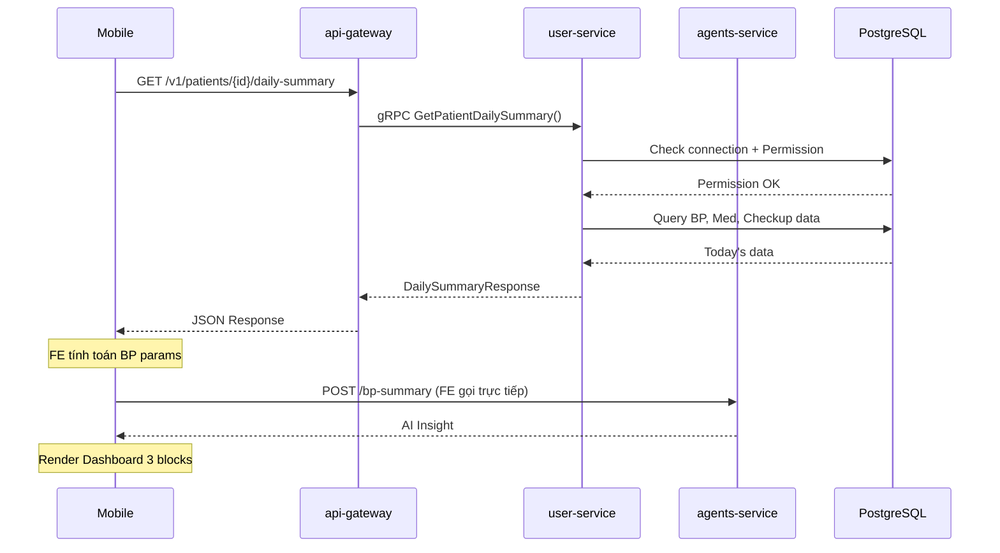
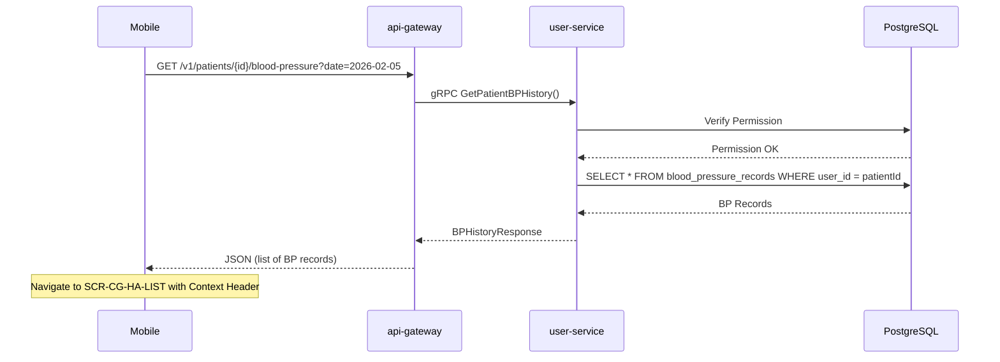

# Context Mapping: US 1.2 - Xem Kết Quả Tuân Thủ

> **Feature Analysis Phase 2: System Context**  
> **Date:** 2026-02-05

---

## System Architecture Context

### Services Involved

```
┌─────────────────────────────────────────────────────────────────────┐
│                       MOBILE (React Native)                          │
│  ┌────────────────────────────────────────────────────────────────┐ │
│  │ features/caregiver_compliance/                         [NEW]   │ │
│  │   ├── CaregiverComplianceDashboardScreen.tsx                   │ │
│  │   ├── CaregiverBPHistoryScreen.tsx                             │ │
│  │   ├── CaregiverMedicationScheduleScreen.tsx                    │ │
│  │   └── CaregiverCheckupListScreen.tsx                           │ │
│  └────────────────────────────────────────────────────────────────┘ │
└───────────────────────────┬───────────────────┬─────────────────────┘
                            │ REST              │ REST (AI Insight)
                            ▼                   ▼
┌───────────────────────────────────┐   ┌──────────────────────────────┐
│       api-gateway-service         │   │      agents-service          │
│  ┌─────────────────────────────┐  │   │  POST /bp-summary (reuse)    │
│  │ CaregiverComplianceHandler  │  │   │  (NO CHANGES NEEDED)         │
│  │ [NEW]                       │  │   └──────────────────────────────┘
│  └─────────────────────────────┘  │
└───────────────────────────┬───────┘
                            │ gRPC
                            ▼
┌───────────────────────────────────────────────────────────────────────┐
│                         user-service                                   │
│  ┌─────────────────────────────────────────────────────────────────┐  │
│  │ CaregiverComplianceServiceImpl [NEW]                            │  │
│  │   ├── getPatientDailySummary()     → Dashboard 3 blocks         │  │
│  │   ├── getPatientBPHistory()        → SCR-CG-HA-LIST             │  │
│  │   ├── getPatientMedications()      → SCR-CG-MED-SCHEDULE        │  │
│  │   └── getPatientCheckups()         → SCR-CG-CHECKUP-LIST        │  │
│  └─────────────────────────────────────────────────────────────────┘  │
│                            │                                           │
│                            ▼ SQL (No schema changes)                   │
│  ┌─────────────────────────────────────────────────────────────────┐  │
│  │ EXISTING TABLES (Query with patientId filter)                   │  │
│  │   ├── blood_pressure_records                                    │  │
│  │   ├── user_medication_feedback                                  │  │
│  │   ├── re_examination_event                                      │  │
│  │   ├── connections                                               │  │
│  │   └── connection_permissions                                    │  │
│  └─────────────────────────────────────────────────────────────────┘  │
└───────────────────────────────────────────────────────────────────────┘
```

---

## Communication Flows

### Flow 1: Dashboard Load



### Flow 2: Drill-down Navigation



---

## Data Context

### Tables Used (No Changes)

| Table | Purpose | Query Filter |
|-------|---------|--------------|
| `connections` | Verify active connection | `caregiver_id = :cg, patient_id = :pt, status = 'active'` |
| `connection_permissions` | Check Permission #4 | `permission_type = 'compliance_tracking'` |
| `blood_pressure_records` | BP data | `user_id = :patientId` |
| `user_medication_feedback` | Medication data | `user_id = :patientId` |
| `re_examination_event` | Checkup data | `user_id = :patientId` |

### Security Context

```sql
-- Pattern: Permission #4 check before data access
SELECT 1 FROM connections c
JOIN connection_permissions cp ON c.id = cp.connection_id
WHERE c.caregiver_id = :caregiverId
  AND c.patient_id = :patientId
  AND c.status = 'active'
  AND cp.permission_type = 'compliance_tracking'
  AND cp.is_enabled = true;
```

---

## Reuse Context

### Clone Sources (Mobile)

| New Screen | Clone From | Delete | Keep | Add |
|------------|------------|--------|------|-----|
| CaregiverComplianceDashboardScreen | HeartbeatBulletinScreen | SmartKolia, TourProvider, Add buttons | 3 Blocks, Loading states | Permission check, patientId param |
| CaregiverBPHistoryScreen | BloodPressureMissionScreen | Add/Edit handlers, Guide modal | DatePicker, FlatList | Context Header |
| CaregiverMedicationScheduleScreen | MedicationMissionScreen | Feedback handlers, Coin modal | Time grouping, Status icons | View-only mode |
| CaregiverCheckupListScreen | ReExamScheduleScreen | Add button, Edit handlers | Tab switcher, Cards | Status tags |

### Reuse Pattern (Backend)

| Component | Clone From | Modifications |
|-----------|------------|---------------|
| CaregiverComplianceHandler | CaregiverAlertHandler | Different endpoints, same auth pattern |
| CaregiverComplianceServiceImpl | CaregiverAlertServiceImpl | Different data queries, same permission check |
| Permission check | PermissionService.hasPermission() | None (reuse as-is) |

---

## Phase 2 Checkpoint

✅ **PHASE 2 COMPLETE** → Proceed to Phase 3 (Impact Analysis)
