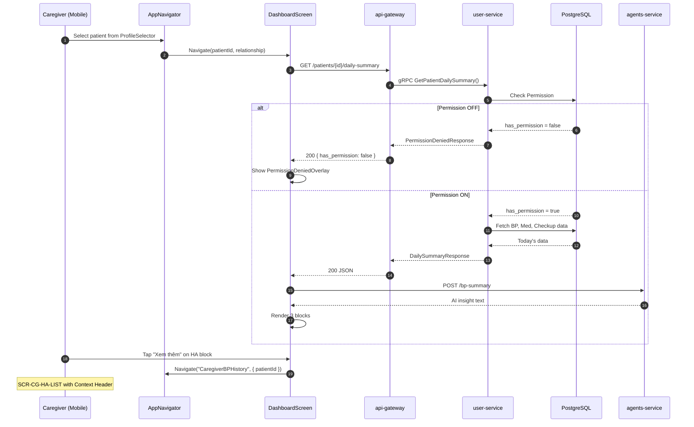

# Sequence Diagram: US 1.2 - Xem Kết Quả Tuân Thủ

> **Feature Analysis Phase 6: Dependency & Sequence Planning (FA-005)**  
> **Date:** 2026-02-05

---

## Task Dependencies Graph

```
┌─────────────────────────────────────────────────────────────────────────────┐
│                         IMPLEMENTATION ORDER                                 │
├─────────────────────────────────────────────────────────────────────────────┤
│                                                                              │
│  WEEK 1: BACKEND (28h)                                                       │
│  ═══════════════════                                                         │
│                                                                              │
│  TASK-US-001 ──► TASK-US-002 ──► TASK-US-003 ──► TASK-US-004                │
│     Proto          Interface       Service        gRPC Handler              │
│     (2h)             (1h)           (8h)            (3h)                    │
│       │                                               │                      │
│       │                                               ▼                      │
│       │                                         TASK-US-005                  │
│       │                                           Register                   │
│       │                                            (0.5h)                    │
│       │                                               │                      │
│       │                                               ▼                      │
│       │                                         TASK-US-006                  │
│       │                                          Unit Tests                  │
│       │                                            (1.5h)                    │
│       │                                                                      │
│       ▼                                                                      │
│  TASK-GW-001 ──────────────► TASK-GW-002 ──► TASK-GW-003 ──► TASK-GW-004   │
│     DTOs                      gRPC Client    Handler        Routes          │
│     (2h)                        (3h)          (5h)           (2h)           │
│                                                                              │
├─────────────────────────────────────────────────────────────────────────────┤
│                                                                              │
│  WEEK 2: FRONTEND (48h)                                                      │
│  ══════════════════════                                                      │
│                                                                              │
│  TASK-FE-001 ──────────────────────────────────────────────────────────┐    │
│    Service       ┌───────────────────────────────────────┐             │    │
│     (3h)         │                                       │             │    │
│       │          ▼                                       ▼             │    │
│       ├────► TASK-FE-003 ──► TASK-FE-004 ──► TASK-FE-005 ──► TASK-FE-006│   │
│       │       Dashboard      BP History     Medication     Checkup     │    │
│       │        (10h)           (8h)          (8h)          (8h)        │    │
│       │                                                                │    │
│       │    TASK-FE-002 ────────────────────────────────────────────────┘    │
│       │    Components                                                        │
│       │      (5h)                                                            │
│       │                                                                      │
│       ▼                                                                      │
│  TASK-FE-007 ──────────────────────────────────────────────────────────┐    │
│   Navigation                                                            │    │
│     (2h)                                                                │    │
│       │                                                                 │    │
│       ▼                                                                 │    │
│  TASK-FE-008 ◄──────────────────────────────────────────────────────────┘    │
│   Integration                                                                │
│     (4h)                                                                     │
│                                                                              │
└─────────────────────────────────────────────────────────────────────────────┘
```

---

## Critical Path

```
TASK-US-001 → TASK-US-002 → TASK-US-003 → TASK-US-004 → TASK-US-005
    ↓
TASK-GW-001 → TASK-GW-002 → TASK-GW-003 → TASK-GW-004
    ↓
TASK-FE-001 → TASK-FE-003 → TASK-FE-004 → TASK-FE-005 → TASK-FE-006
    ↓
TASK-FE-007 → TASK-FE-008
```

**Critical Path Duration:** ~55h (Proto → Integration)

---

## Sprint Schedule

### Sprint 1: Backend Foundation (Week 1)

| Day | Tasks | Hours | Milestone |
|:---:|-------|:-----:|-----------|
| D1 | TASK-US-001, TASK-US-002 | 3h | Proto + Interface done |
| D2-D3 | TASK-US-003 | 8h | Service implementation done |
| D4 | TASK-US-004, TASK-US-005 | 3.5h | gRPC handler done |
| D4 | TASK-US-006 | 1.5h | Unit tests done |
| D5 | TASK-GW-001 | 2h | DTOs done |
| D6 | TASK-GW-002 | 3h | gRPC client done |
| D7-D8 | TASK-GW-003 | 5h | Handler done |
| D8 | TASK-GW-004 | 2h | Routes done |

**Sprint 1 Milestone:** ✅ All 4 APIs working end-to-end

### Sprint 2: Mobile Implementation (Week 2)

| Day | Tasks | Hours | Milestone |
|:---:|-------|:-----:|-----------|
| D1 | TASK-FE-001, TASK-FE-002 | 8h | Service + Components done |
| D2-D3 | TASK-FE-003 | 10h | Dashboard done |
| D4-D5 | TASK-FE-004 | 8h | BP History done |
| D6 | TASK-FE-005 | 8h | Medication done |
| D7 | TASK-FE-006 | 8h | Checkup done |
| D8 | TASK-FE-007, TASK-FE-008 | 6h | Navigation + Testing |

**Sprint 2 Milestone:** ✅ Feature complete, ready for QA

---

## Sequence Diagrams

### Full Flow: Caregiver Views Patient BP History



---

## Phase 6 Checkpoint

✅ **PHASE 6 COMPLETE** → Proceed to Phase 7 (Review)
