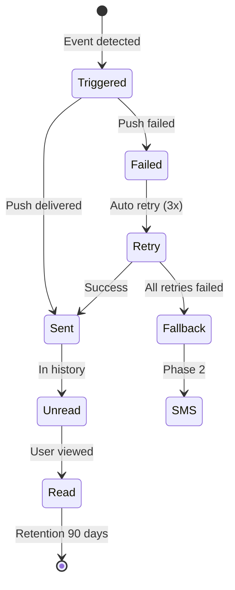

# SRS: US 1.2 - Nhận Cảnh Báo Bất Thường (Caregiver Alerts)

> **Version:** v1.0  
> **Date:** 2026-02-02  
> **Author:** BA Team  
> **Status:** Ready for Dev Review  
> **Parent SRS:** [KOLIA-1517_srs.md](./srs.md)

---

## 1. Giới thiệu

### 1.1 Mục đích

Tài liệu SRS này mô tả các yêu cầu chức năng và phi chức năng cho User Story **US 1.2 - Nhận Cảnh Báo Bất Thường** - cho phép Caregiver nhận thông báo kịp thời khi Patient gặp các tình huống sức khỏe bất thường.

### 1.2 Phạm vi (In/Out)

**TRONG SCOPE:**
- ✅ Nhận cảnh báo khi chỉ số HA khẩn cấp (<90/>180 Tâm thu, <60/>120 Tâm trương)
- ✅ Nhận cảnh báo khi HA thay đổi đột ngột (>10mmHg so với TB 7 ngày)
- ✅ Nhận cảnh báo khi Patient uống thuốc sai liều
- ✅ Nhận cảnh báo khi Patient không tuân thủ điều trị tốt (<70%)
- ✅ Nhận cảnh báo trong trường hợp khẩn cấp (SOS)
- ✅ Nhận cảnh báo khi Patient bỏ lỡ 3 liều thuốc liên tiếp
- ✅ Nhận cảnh báo khi Patient bỏ lỡ 3 lần đo HA liên tiếp
- ✅ Hiển thị lịch sử cảnh báo trên Dashboard Caregiver

**NGOÀI SCOPE:**
- ❌ Tùy chỉnh ngưỡng cảnh báo riêng cho từng Caregiver
- ❌ Tính năng gọi điện tự động khi có cảnh báo
- ❌ Cảnh báo âm thanh đặc biệt (ringtone custom)

### 1.3 Thuật ngữ (Glossary)

| Thuật ngữ | Định nghĩa |
|-----------|------------|
| **Alert** | Cảnh báo gửi đến Caregiver khi có sự kiện sức khỏe bất thường |
| **SOS** | Cảnh báo khẩn cấp Priority 0, bypass mọi cài đặt |
| **Debounce** | Khoảng thời gian tối thiểu giữa 2 cảnh báo cùng loại (5 phút) |
| **Silent Push** | Push notification không hiển thị, dùng để cập nhật badge |
| **Modal Popup** | Popup chặn toàn màn hình, yêu cầu user tương tác |
| **Permission #2** | Quyền "Nhận cảnh báo khẩn cấp" (Default: ON) |

### 1.4 Dependencies & Assumptions

| Dependency | Status | Ghi chú |
|------------|:------:|---------|
| SRS Đo Huyết áp | ✅ Available | Ngưỡng cảnh báo HA, BR-HA-017 |
| SRS Uống thuốc MVP0.3 | ✅ Available | Logic phát hiện sai liều |
| SRS SOS | ✅ Available | Luồng cảnh báo khẩn cấp |
| Push Notification Service | ✅ Available | FCM (iOS/Android) |
| ZNS | ✅ Available | Kênh backup |

**Assumptions:**
1. Permission #2 tại Patient đã cấp cho Caregiver (Default: ON)
2. Caregiver có app đã cài đặt và đăng nhập
3. Patient đã thiết lập thông tin cá nhân (có SĐT)

---

## 2. Yêu cầu chức năng (Gherkin BDD)

### 2.1 Nhận cảnh báo Huyết áp Khẩn cấp

**User Story:** Là một **Caregiver**, tôi muốn **nhận cảnh báo ngay khi Patient có chỉ số HA nguy hiểm**, để **có thể hỗ trợ kịp thời**.

#### Kịch bản 2.1.1: HA Khẩn cấp - Push Notification (Happy Path)

```gherkin
Given Caregiver đã kết nối với Patient
  And Permission #2 = ON
  And Patient vừa đo HA với kết quả: Tâm thu = 185 mmHg, Tâm trương = 125 mmHg
When Hệ thống phát hiện Tâm thu > 180 HOẶC Tâm trương > 120
Then Hệ thống gửi Push Notification đến Caregiver:
  | Field | Value |
  | Title | ⚠️ [Danh xưng Patient] - Huyết áp bất thường! |
  | Body | Chỉ số 185/125 mmHg lúc 16:45. Nhấn để xem chi tiết. |
  | Priority | High |
  | Deeplink | kolia://patient/{patient_id}/health-overview |
  And Badge count tăng 1
  And Alert được lưu vào lịch sử với status = "unread"
  Ref: BR-ALT-002, BR-ALT-001
```

#### Kịch bản 2.1.2: HA Khẩn cấp - In-App Modal (App Foreground)

```gherkin
Given Caregiver đang sử dụng app (foreground)
  And Permission #2 = ON
  And Patient vừa đo HA với kết quả bất thường
When Hệ thống nhận được alert
Then Hiển thị Modal Popup ngay lập tức:
  | Element | Value |
  | Title | ⚠️ CẢNH BÁO |
  | Icon | ⌚ (Heart) |
  | Content | [Danh xưng Patient] có chỉ số HA bất thường: 185/125 mmHg |
  | Button 1 | [Xem chi tiết] → Navigate to health-overview |
  | Button 2 | [Đóng] → Dismiss popup |
  And Modal blocking (phải tương tác)
  Ref: BR-ALT-002, EC-07
```

#### Kịch bản 2.1.3: HA Hạ nguy hiểm (Tâm thu < 90)

```gherkin
Given Patient đo HA với Tâm thu = 85 mmHg
When Hệ thống phát hiện Tâm thu < 90
Then Gửi cảnh báo "Huyết áp thấp nguy hiểm" với Priority = High
  And Icon = ❤️ (màu đỏ)
  Ref: BR-ALT-002
```

---

### 2.2 Nhận cảnh báo HA Thay đổi Đột ngột

**User Story:** Là một **Caregiver**, tôi muốn **được thông báo khi HA của Patient thay đổi bất thường so với baseline**, để **theo dõi xu hướng sức khỏe**.

#### Kịch bản 2.2.1: Chênh lệch >10mmHg so với TB 7 ngày

```gherkin
Given Patient có trung bình HA 7 ngày: Tâm thu = 130 mmHg
  And Patient vừa đo với Tâm thu = 145 mmHg (chênh 15mmHg)
  And Kết quả KHÔNG thuộc vùng khẩn cấp (không trigger BR-ALT-002)
When Hệ thống tính toán chênh lệch > 10mmHg
Then Gửi cảnh báo "Huyết áp bất thường":
  | Field | Value |
  | Title | 💛 [Danh xưng] - Huyết áp bất thường |
  | Body | HA thay đổi đáng kể so với tuần qua. Nhấn để xem chi tiết. |
  | Icon | 💛 (màu vàng) |
  And Alert Card màu vàng trong Lịch sử
  Ref: BR-ALT-002b
```

#### Kịch bản 2.2.2: Cả 2 rule trigger cùng lúc → Ưu tiên Khẩn cấp

```gherkin
Given Patient có TB 7 ngày: Tâm thu = 170 mmHg
  And Patient đo mới: Tâm thu = 185 mmHg 
  And Trigger cả BR-ALT-002 (>180) VÀ BR-ALT-002b (chênh 15mmHg)
When Hệ thống xác định priority
Then CHỈ gửi 1 alert với loại "HA Khẩn cấp" (BR-ALT-002)
  And KHÔNG gửi thêm alert "HA bất thường" (BR-ALT-002b)
  Ref: EC-11
```

---

### 2.3 Nhận cảnh báo SOS

**User Story:** Là một **Caregiver**, tôi muốn **nhận cảnh báo ngay lập tức khi Patient nhấn SOS**, để **có thể liên hệ hoặc hỗ trợ khẩn cấp**.

#### Kịch bản 2.3.1: SOS Alert - Push Notification

```gherkin
Given Patient vừa kích hoạt nút SOS
When Hệ thống detect SOS event
Then Gửi Push Notification đến TẤT CẢ Caregiver có Permission #2:
  | Field | Value |
  | Title | 🆘 KHẨN CẤP - [Danh xưng Patient] |
  | Body | [Danh xưng] vừa kích hoạt SOS lúc 16:45! Nhấn để xem vị trí. |
  | Priority | Critical (bypass DND) |
  | Deeplink | kolia://patient/{patient_id}/sos-alert |
  And KHÔNG áp dụng debounce (gửi ngay)
  And KHÔNG bị ảnh hưởng bởi toggle "Tạm dừng thông báo"
  Ref: BR-ALT-004
```

#### Kịch bản 2.3.2: SOS Alert - In-App Modal với nút Gọi

```gherkin
Given Caregiver đang sử dụng app
  And Patient vừa kích hoạt SOS
When Hệ thống nhận SOS event
Then Hiển thị Modal Popup đặc biệt:
  | Element | Value |
  | Title | 🆘 CẢNH BÁO KHẨN CẤP |
  | Content | [Danh xưng Patient] vừa nhấn SOS! Lúc: 16:45 |
  | Button | [📞 Gọi ngay] → Mở Dialer native với SĐT Patient |
  And Modal blocking (ưu tiên cao nhất)
  And Tap ngoài popup → Đóng popup
  Ref: BR-ALT-004
```

#### Kịch bản 2.3.3: Nhấn "Gọi ngay" trong SOS Modal

```gherkin
Given Caregiver nhấn nút [📞 Gọi ngay] trong SOS popup
When Hệ thống lấy SĐT từ Profile Patient
Then Mở app Điện thoại native
  And Điền sẵn SĐT Patient vào Dialer
  And Caregiver cần nhấn nút gọi để thực hiện cuộc gọi
  Ref: Section 4.2 Raw Request
```


---

### 2.4 Nhận cảnh báo Thuốc

**User Story:** Là một **Caregiver**, tôi muốn **biết khi Patient uống thuốc không đúng cách**, để **nhắc nhở hoặc hỗ trợ**.

#### Kịch bản 2.4.1: Cảnh báo Sai liều

```gherkin
Given Patient đang báo cáo uống thuốc
  And Patient chọn trạng thái "Sai liều" trong popup
When Patient nhấn "Hoàn tất" để xác nhận báo cáo
Then Hệ thống gửi cảnh báo đến Caregiver:
  | Field | Value |
  | Title | 💊 [Danh xưng Patient] - Liều thuốc bất thường |
  | Body | [Danh xưng] vừa báo cáo uống thuốc không đúng liều khuyến cáo. |
  | Icon | 💊 (màu cam) |
  | Deeplink | kolia://patient/{patient_id}/medication-report |
  Ref: BR-ALT-008
```

#### Kịch bản 2.4.2: Cảnh báo bỏ lỡ 3 liều liên tiếp

```gherkin
Given Patient bỏ lỡ liều thuốc lần thứ 3 liên tiếp
When Hệ thống detect pattern 3 consecutive misses
Then Gửi cảnh báo vào batch 21:00:
  | Field | Value |
  | Title | 📋 [Danh xưng] - Bỏ lỡ thuốc |
  | Body | [Danh xưng] đã bỏ lỡ 3 liều thuốc liên tiếp. Hãy liên hệ nhắc nhở. |
  Ref: BR-ALT-007
```

---

### 2.5 Nhận cảnh báo Tuân thủ kém

**User Story:** Là một **Caregiver**, tôi muốn **biết khi Patient có tỷ lệ tuân thủ thấp**, để **động viên và hỗ trợ**.

#### Kịch bản 2.5.1: Tuân thủ < 70%

```gherkin
Given Tỷ lệ tuân thủ 24h của Patient = 60%
  And Thời điểm hiện tại = 21:00
When Hệ thống chạy batch evaluation
Then Gửi 1 cảnh báo (không spam):
  | Field | Value |
  | Title | 📋 [Danh xưng Patient] - Tuân thủ điều trị |
  | Body | Tỷ lệ tuân thủ hôm nay của [Danh xưng] là 60%. Hãy nhắc nhở nhé! |
  | Icon | 📉 (màu xám) |
  | Deeplink | kolia://patient/{patient_id}/compliance |
  And Chỉ gửi 1 lần/ngày lúc 21:00
  Ref: BR-ALT-006, BR-ALT-014
```

#### Kịch bản 2.5.2: Bỏ lỡ 3 lần đo HA liên tiếp

```gherkin
Given Patient có lịch đo HA đã thiết lập
  And Patient bỏ lỡ 3 lần đo liên tiếp
When Hệ thống detect pattern
Then Gửi cảnh báo vào batch 21:00:
  | Field | Value |  
  | Title | 📊 [Danh xưng] - Bỏ lỡ đo huyết áp |
  | Body | [Danh xưng] đã bỏ lỡ 3 lần đo HA liên tiếp. |
  | Icon | 📊 (màu xám) |
  Ref: BR-ALT-015
```

---

### 2.6 Lịch sử Cảnh báo

**User Story:** Là một **Caregiver**, tôi muốn **xem lại các cảnh báo đã nhận**, để **theo dõi tình trạng sức khỏe Patient theo thời gian**.

#### Kịch bản 2.6.1: Mở màn hình Lịch sử (Happy Path)

```gherkin
Given Caregiver đang ở Dashboard
  And Alert Block hiển thị 3 cảnh báo mới nhất
When Caregiver nhấn "Xem tất cả"
Then Navigate đến màn hình "Lịch sử cảnh báo"
  And Header: "Lịch sử cảnh báo" với nút Filter
  And Filter Bar với 3 dropdown: Loại, Thời gian, Patient
  And Danh sách Alert Cards sắp xếp theo Priority → Thời gian
  Ref: LOG-03
```

#### Kịch bản 2.6.2: Filter theo loại cảnh báo

```gherkin
Given Caregiver đang ở màn Lịch sử cảnh báo
When Caregiver chọn Filter "Loại: HA"
Then Danh sách chỉ hiển thị cảnh báo HA (khẩn cấp + bất thường)
  And Filter realtime (không cần nhấn Apply)
```

#### Kịch bản 2.6.3: Mark all as read

```gherkin
Given Caregiver có nhiều cảnh báo chưa đọc
When Caregiver nhấn nút ✓ (Mark all as read) ở header
Then Tất cả cảnh báo chuyển status = "read"
  And Badge count reset về 0
  Ref: EC-18
```

#### Kịch bản 2.6.4: Pull-to-refresh mất mạng

```gherkin
Given Caregiver kéo xuống để refresh
  And Device không có kết nối mạng
When Request timeout
Then Hiển thị Toast: "Không thể làm mới. Kiểm tra kết nối mạng."
  And Giữ nguyên data cũ
  Ref: EC-17
```

#### Kịch bản 2.6.5: Alert của Patient đã Unfollow

```gherkin
Given Caregiver đã unfollow Patient X
  And Có alert cũ từ Patient X trong lịch sử
When Caregiver xem lịch sử
Then Alert vẫn hiển thị với badge "[Đã ngắt kết nối]"
  And Tap vào alert → Không navigate (vì không còn quyền)
  Ref: EC-15
```

#### Kịch bản 2.6.6: Empty State

```gherkin
Given Caregiver không có cảnh báo nào trong 90 ngày
When Caregiver mở màn Lịch sử
Then Hiển thị Empty State:
  | Element | Value |
  | Illustration | Kolia mascot |
  | Text | "Chưa có cảnh báo nào. Kolia sẽ thông báo khi có tình huống cần chú ý" |
```

---

## 3. Business Rules

| BR-ID | Category | Mô tả Rule | Priority |
|-------|----------|------------|:--------:|
| BR-ALT-001 | Authorization | Chỉ gửi cảnh báo khi Permission #2 = ON | P0 |
| BR-ALT-002 | Threshold | Ngưỡng HA khẩn cấp: Tâm thu <90/>180; Tâm trương <60/>120 mmHg | P0 |
| BR-ALT-002b | Threshold | Cảnh báo HA bất thường: Chênh lệch >10mmHg (CAO hoặc THẤP hơn) so với TB 7 ngày | P1 |
| BR-ALT-003 | Threshold | Ngưỡng HR bất thường: <50 bpm hoặc >100 bpm (Phase 2) | P2 |
| BR-ALT-004 | Priority | Cảnh báo SOS = Priority 0, bypass toggle, không debounce | P0 |
| BR-ALT-005 | Rate Limit | Debounce 5 phút cho cùng loại cảnh báo (trừ SOS) | P1 |
| BR-ALT-006 | Notification | Cảnh báo tuân thủ **thuốc** kém: 1 lần/ngày lúc 21:00 nếu <70% | P1 |
| BR-ALT-006b | Notification | Cảnh báo tuân thủ **đo HA** kém: 1 lần/ngày lúc 21:00 nếu <70% | P1 |
| BR-ALT-007 | Notification | Cảnh báo khi Patient bỏ lỡ 3 liều thuốc liên tiếp (gửi alert riêng cho từng thuốc) | P1 |
| BR-ALT-008 | Trigger | Cảnh báo sai liều: Khi Patient nhấn "Hoàn tất" với trạng thái "Sai liều" | P1 |
| BR-ALT-009 | Retention | Lịch sử cảnh báo giữ 90 ngày | P2 |
| BR-ALT-010 | Settings | Toggle "Tạm dừng thông báo", SOS không bị ảnh hưởng | P1 |
| BR-ALT-011 | Timezone | Gửi notification theo timezone của Patient | P1 |
| BR-ALT-013 | Security | PII trên Lock Screen: Ẩn chi tiết, chỉ hiện "Có cảnh báo mới" | P0 |
| BR-ALT-014 | Calculation | Window tính tuân thủ: 24h gần nhất (theo ngày) | P1 |
| BR-ALT-015 | Notification | Cảnh báo khi Patient bỏ lỡ 3 lần đo HA liên tiếp | P1 |
| BR-ALT-016 | Technical | Badge count cập nhật khi app killed: Silent Push | P2 |
| BR-ALT-017 | Prerequisite | CHỈ gửi cảnh báo HA khi Patient đã có dữ liệu từ nhiệm vụ đo HA | P0 |
| BR-ALT-018 | Multiple | Sai liều nhiều thuốc cùng lúc: Gửi N alert riêng cho từng thuốc | P1 |

---

## 4. Validation Rules

| Field | Rule | Hợp lệ | Không hợp lệ |
|-------|------|--------|--------------|
| Tâm thu | 40 ≤ x ≤ 300 mmHg | 120, 185 | 39, 301, "abc" |
| Tâm trương | 20 ≤ x ≤ 200 mmHg | 80, 125 | 19, 201 |
| HR | 30 ≤ x ≤ 250 bpm | 72, 110 | 29, 251 |
| Tuân thủ % | 0 ≤ x ≤ 100 | 60, 100 | -1, 101 |

---

## 5. Yêu cầu phi chức năng (NFR)

### 5.1 Performance

| Metric | Requirement |
|--------|-------------|
| Alert Delivery | Push gửi trong vòng **5 giây** từ khi event xảy ra (trừ batch) |
| Badge Update | Cập nhật trong vòng **10 giây** |
| History Load | Danh sách 20 items load trong **1 giây** |

### 5.2 Security

| SEC-ID | Mô tả | Priority |
|--------|-------|:--------:|
| SEC-01 | PII ẩn trên lock screen | P0 |
| SEC-02 | Deeplink yêu cầu valid session | P0 |
| SEC-03 | Chỉ Caregiver có Permission #2 mới xem được lịch sử | P1 |

### 5.3 Availability

| Metric | Requirement |
|--------|-------------|
| Push Service | 99.9% uptime |
| Fallback | ZNS → SMS nếu Push fail (Phase 2) |

---

## 6. UI Specifications

### 6.1 Screen Inventory

| Screen ID | Screen Name | Entry Points | Exit Points |
|-----------|-------------|--------------|-------------|
| SCR-ALT-01 | Alert Block (Dashboard) | Dashboard load | Tap alert, Tap "Xem tất cả" |
| SCR-ALT-02 | Lịch sử cảnh báo | "Xem tất cả" | Back button |
| SCR-ALT-03 | Modal Popup (Foreground) | Incoming alert | Button tap |
| SCR-ALT-04 | SOS Modal | Incoming SOS | "Gọi ngay", "Xem chi tiết", Dismiss |

### 6.2 Alert Block (SCR-ALT-01) - Dashboard

> **Ngữ cảnh:** Alert Block hiển thị trên màn "Xem tình hình sức khỏe" của Caregiver, theo **Patient đã chọn** từ Profile Selector.

#### 6.2.1 Display Logic

| Rule | Mô tả |
|------|-------|
| **Scope** | CHỈ hiển thị alerts của **Patient đang được chọn** trên Dashboard |
| **Time window** | CHỈ hiển thị alerts trong **24 giờ gần nhất** |
| **Max items** | **5 alert cards** |
| **"Xem tất cả"** | Hiện khi có >5 alerts trong 24h |
| **Empty state** | Hiển thị Empty State tích cực (xem 6.2.3) |
| **Sort order** | Priority DESC → Time DESC (SOS trước, mới nhất trước) |
| **Realtime update** | Khi có alert mới → Hiển thị ngay (nếu app foreground) |
| **Read status** | Hiển thị CẢ đã đọc và chưa đọc (phân biệt bằng bold/normal) |
| **Debounce** | Cùng loại alert trong 5 phút → CHỈ hiển thị 1 card (áp dụng BR-ALT-005) |
| **SOS dismiss** | SOS đã dismiss popup → Vẫn hiển thị trên Alert Block (status: đã đọc) |

#### 6.2.2 Priority Order hiển thị

| Priority | Loại Alert | Hiển thị trên Dashboard | Màu |
|:--------:|------------|:-----------------------:|:---:|
| **P0** | SOS | ✅ Luôn hiển thị đầu tiên | 🔴 Đỏ đậm |
| **P0** | HA Khẩn cấp | ✅ | 🔴 Đỏ |
| **P1** | HA Bất thường | ✅ | 🟡 Vàng |
| **P1** | Sai liều | ✅ | 🟠 Cam |
| **P2** | Tuân thủ thuốc kém | ⚠️ Chỉ khi có slot trống | ⚪ Xám |
| **P2** | Tuân thủ đo HA kém | ⚠️ Chỉ khi có slot trống | ⚪ Xám |
| **P2** | Bỏ lỡ thuốc/đo HA | ⚠️ Chỉ khi có slot trống | ⚪ Xám |

> **Ví dụ:** Nếu có 1 SOS + 3 HA Khẩn cấp + 2 Tuân thủ kém → Dashboard hiển thị: [SOS, HA#1, HA#2, HA#3, Tuân thủ#1]. Tuân thủ#2 chỉ thấy khi nhấn "Xem tất cả".

#### 6.2.3 Empty State

| Trường hợp | Hiển thị |
|------------|----------|
| **Không có alert trong 24h** | `✅ Không có cảnh báo mới` + link "Xem lịch sử" |
| **Patient mới kết nối (chưa có data)** | ẨN toàn bộ Alert Block |

**Layout Empty State:**
```
┌─────────────────────────────────────────────────┐
│  ✅ Không có cảnh báo mới                       │
│                                                 │
│     Xem lịch sử →                               │
└─────────────────────────────────────────────────┘
```


### 6.3 Alert Card - Format 1 dòng

> **Nguyên tắc:** Mỗi Alert Card hiển thị tối đa 1 dòng nội dung (<60 ký tự) để người dùng đọc nhanh thông tin quan trọng nhất.

**Layout:**
```
┌───────────────────────────────────────────────────────┐
│ [Icon] [Tên] - [Nội dung chính]              [HH:mm] │
└───────────────────────────────────────────────────────┘
```

**Visual States:**
| Trạng thái | Thể hiện |
|------------|----------|
| Chưa đọc | Font **bold**, màu nền nhạt |
| Đã đọc | Font thường, màu xám nhạt |

#### 6.3.1 Nội dung từng loại Alert

| Loại | Icon | Màu | Nội dung 1 dòng | Ví dụ |
|------|:----:|:---:|-----------------|-------|
| **SOS** | 🚨 | Đỏ đậm | `[Tên] cần hỗ trợ KHẨN CẤP!` | `🚨 Mẹ cần hỗ trợ KHẨN CẤP!` `16:45` |
| **HA Khẩn cấp** | ⚠️ | Đỏ | `[Tên] - HA {Tâm thu}/{Tâm trương} (THA khẩn cấp)` | `⚠️ Mẹ - HA 185/125 (THA khẩn cấp)` `16:45` |
| **HA Bất thường** | 💛 | Vàng | `[Tên] - HA {Tâm thu}/{Tâm trương} (Cao hơn bình thường)` | `💛 Mẹ - HA 145/95 (Cao hơn bình thường)` `16:45` |
| **Sai liều** | 💊 | Cam | `[Tên] - {Tên thuốc} uống sai liều` | `💊 Mẹ - Amlodipine uống sai liều` `16:45` |
| **Tuân thủ thuốc kém** | 📉 | Xám | `[Tên] - Tuân thủ thuốc {X}%` | `📉 Mẹ - Tuân thủ thuốc 60%` `21:00` |
| **Tuân thủ đo HA kém** | 📊 | Xám | `[Tên] - Tuân thủ đo HA {X}%` | `📊 Mẹ - Tuân thủ đo HA 50%` `21:00` |
| **Bỏ lỡ thuốc** | 💊 | Xám | `[Tên] - Bỏ 3 liều {Tên thuốc} liên tiếp` | `💊 Mẹ - Bỏ 3 liều Amlodipine liên tiếp` `21:00` |
| **Bỏ lỡ đo HA** | 📊 | Xám | `[Tên] - Bỏ 3 lần đo HA liên tiếp` | `📊 Mẹ - Bỏ 3 lần đo HA liên tiếp` `21:00` |

#### 6.3.2 Ghi chú từ Patient (Optional)

> **Điều kiện:** Nếu Patient có nhập triệu chứng/nguyên nhân khi đo HA (từ feature Đo Huyết áp), cảnh báo HA sẽ hiển thị thêm dòng ghi chú.

| Format | Ví dụ |
|--------|-------|
| `📝 Ghi nhận: "[nội dung]"` | `📝 Ghi nhận: "Đau đầu nhẹ, stress"` |

**Layout Alert Card có ghi chú:**
```
┌───────────────────────────────────────────────────────┐
│ 💛 Mẹ - HA 145/95 (Cao hơn bình thường)       10:20  │
│    📝 Ghi nhận: "Đau đầu nhẹ, stress"                │
└───────────────────────────────────────────────────────┘
```

> **Lưu ý:** Nếu Patient không nhập gì → CHỈ hiển thị 1 dòng như bình thường.

#### 6.3.3 Edge Cases xử lý nội dung

| Case | Xử lý |
|------|-------|
| Tên Patient >25 ký tự | Truncate + "..." |
| Tên thuốc >20 ký tự | Truncate + "..." |
| Sai liều nhiều thuốc cùng lúc | Gửi **N alert riêng** cho từng thuốc |
| Bỏ lỡ nhiều thuốc khác nhau | Gửi **N alert riêng** cho từng thuốc |
| Thời gian <24h trước | Format: "X phút/giờ trước" |
| Thời gian hôm qua | Format: "Hôm qua HH:mm" |
| Thời gian >24h | Format: "DD/MM HH:mm" |
| Patient mới, chưa có TB 7 ngày | CHỈ dùng ngưỡng khẩn cấp, KHÔNG dùng chênh lệch |
| Patient chưa có lịch thuốc/đo HA | KHÔNG gửi cảnh báo tuân thủ |


### 6.4 Lịch sử cảnh báo (SCR-ALT-02)

> **Ngữ cảnh:** Màn hình danh sách đầy đủ tất cả cảnh báo, có thể lọc theo Patient.

#### 6.4.1 Display Logic

| Rule | Mô tả |
|------|-------|
| **Scope** | Hiển thị alerts của **Patient đang được chọn từ Dashboard** |
| **Pagination** | Load 20 alerts/lần, scroll bottom → Load more |
| **Sort order** | Priority DESC → Time DESC |
| **Patient đã unfollow** | Alerts vẫn hiển thị + badge "[Đã ngắt kết nối]", không navigate |
| **Permission #2 bị tắt** | Alerts cũ VẪN hiển thị trong lịch sử |

#### 6.4.2 Header

| Component | Spec |
|-----------|------|
| Back button (←) | Quay về Dashboard |
| Title | "Lịch sử cảnh báo" |

#### 6.4.3 Filter Bar

| Filter | Options | Default |
|--------|---------|:-------:|
| Loại | Tất cả/HA/Thuốc/Tuân thủ/SOS | Tất cả |
| Thời gian | 7/30/90 ngày | 7 ngày |
| Patient | Dropdown danh sách Patient | Tất cả |

#### 6.4.4 Behaviors

| Action | Result |
|--------|--------|
| Tap card | Navigate to detail (deeplink) |
| Tap card (Patient đã unfollow) | Không navigate, hiển thị Toast: "Không thể xem chi tiết - Đã ngắt kết nối" |
| Pull-to-refresh | Reload list |
| Scroll bottom | Load 20 more items (lazy load) |
| Filter change | Realtime update (không cần Apply) |
| Mark all as read | Reset badge count về 0 |

### 6.5 Navigation Flow

#### 6.5.1 Navigation Mapping - Deeplink → Màn đích

| Loại Alert | Deeplink | Màn đích | Mô tả màn |
|------------|----------|----------|-----------|
| **HA Khẩn cấp** | `kolia://patient/{id}/health-overview` | **SCR-HEALTH-OVERVIEW** (Dashboard Patient) | Màn xem tổng quan sức khỏe Patient với biểu đồ HA |
| **HA Bất thường** | `kolia://patient/{id}/health-overview` | **SCR-HEALTH-OVERVIEW** (Dashboard Patient) | Màn xem tổng quan sức khỏe Patient với biểu đồ HA |
| **SOS** | `kolia://patient/{id}/sos-alert` | **SCR-SOS-DETAIL** (Chi tiết SOS) | Màn chi tiết SOS với vị trí, thời gian, nút "Đã thấy" |
| **Sai liều** | `kolia://patient/{id}/medication-report` | **SCR-MED-REPORT** (Báo cáo thuốc) | Màn xem chi tiết báo cáo uống thuốc của Patient |
| **Tuân thủ kém** | `kolia://patient/{id}/compliance` | **SCR-COMPLIANCE** (Tuân thủ) | Màn xem thống kê tuân thủ điều trị |
| **Bỏ lỡ thuốc** | `kolia://patient/{id}/medication-report` | **SCR-MED-REPORT** (Báo cáo thuốc) | Màn xem chi tiết báo cáo uống thuốc |
| **Bỏ lỡ đo HA** | `kolia://patient/{id}/health-overview` | **SCR-HEALTH-OVERVIEW** (Dashboard Patient) | Màn xem tổng quan sức khỏe |

#### 6.5.2 Navigation từ các Entry Points

| Entry Point | Hành động | Màn đích |
|-------------|-----------|----------|
| **Dashboard → Alert Block** | Tap card | → Màn đích tương ứng theo bảng trên |
| **Dashboard → Alert Block** | Tap "Xem tất cả" | → **SCR-ALT-02** (Lịch sử cảnh báo) |
| **SCR-ALT-02 → Alert Card** | Tap card | → Màn đích tương ứng theo bảng trên |
| **SCR-ALT-02 → Back** | Tap ← | → **Dashboard** |
| **Push Notification** | Tap notification | → Màn đích tương ứng theo bảng trên |
| **Modal Popup → "Xem chi tiết"** | Tap button | → Màn đích tương ứng theo bảng trên |
| **SOS Modal → "Gọi ngay"** | Tap button | → **Native Dialer** (app Điện thoại) |
| **SOS Modal → "Xem chi tiết"** | Tap button | → **SCR-SOS-DETAIL** |

#### 6.5.3 Flowchart

```mermaid
flowchart TD
    A[Dashboard] --> B{Alert Block có item?}
    B -->|Yes| C[Hiển thị max 5 alerts trong 24h]
    B -->|No| D[Empty State tích cực]
    C --> E[Tap "Xem tất cả"]
    E --> F["SCR-ALT-02: Lịch sử cảnh báo"]
    C --> G[Tap SOS alert card]
    G --> H["SCR-SOS-DETAIL: Chi tiết SOS + Modal Gọi ngay"]
    
    style H fill:#FFEBEE,stroke:#E53935
    
    M[Push Notification] --> N{App state?}
    N -->|Foreground| O[Modal Popup]
    N -->|Background/Killed| P[System notification]
    O --> Q["Xem chi tiết" button]
    Q --> H
    P --> R[Tap notification]
    R --> H
```

---

## 7. Flow Diagrams

### 7.1 Sequence Diagram: HA Alert Flow

```mermaid
sequenceDiagram
    participant P as Patient
    participant S as Server
    participant Push as Push Service
    participant C as Caregiver App

    P->>S: Đo HA (185/125)
    S->>S: Validate (>180 = Khẩn cấp)
    S->>S: Check Permission #2
    S->>Push: Send Push (High Priority)
    Push->>C: Deliver Notification
    
    alt App Foreground
        C->>C: Show Modal Popup
    else App Background/Killed
        C->>C: Show System Notification
        C->>C: Update Badge (Silent Push)
    end
    
    C->>C: Save to Alert History
```



### 7.2 State Diagram: Alert Status



---

## 8. Đặc tả nội dung & UX Writing

### 8.1 Push Notification Templates

#### HA Khẩn cấp:
```
Title: ⚠️ [Danh xưng] - Huyết áp bất thường!
Body: Chỉ số {Tâm thu}/{Tâm trương} mmHg lúc {HH:mm}. Nhấn để xem chi tiết.
```

#### SOS:
```
Title: 🆘 KHẨN CẤP - [Danh xưng]
Body: [Danh xưng] vừa kích hoạt SOS lúc {HH:mm}! Nhấn để xem vị trí.
```

#### Sai liều:
```
Title: 💊 [Danh xưng] - Liều thuốc bất thường
Body: [Danh xưng] vừa báo cáo uống thuốc không đúng liều khuyến cáo.
```

#### Tuân thủ kém:
```
Title: 📋 [Danh xưng] - Tuân thủ điều trị
Body: Tỷ lệ tuân thủ hôm nay của [Danh xưng] là {X}%. Hãy nhắc nhở nhé!
```

### 8.2 Error Messages

| Scenario | Message |
|----------|---------|
| Mất mạng khi refresh | "Không thể làm mới. Kiểm tra kết nối mạng." |
| Session expired | "Phiên đăng nhập hết hạn. Vui lòng đăng nhập lại." |
| Permission denied | "Bạn không có quyền xem thông tin này." |

### 8.3 Formatting Rules

| Element | Rule |
|---------|------|
| Tên Patient | Truncate 25 ký tự + "..." |
| Mô tả alert | Max 2 dòng |
| Thời gian (<24h) | "X phút/giờ trước" |
| Thời gian (>24h) | "DD/MM HH:mm" |

---

## Appendix

### A.1 Revision History

| Version | Date | Author | Changes |
|---------|------|--------|---------|
| v1.0 | 2026-02-02 | BA Team | Initial SRS from Raw Request v1.5 |

### A.2 Edge Cases Summary

| EC-ID | Tình huống | Quyết định |
|-------|------------|------------|
| EC-01 | Timezone khác | Gửi theo timezone Patient |
| EC-02 | Nhiều Caregiver nhận SOS | Alert Acknowledgment |
| EC-07 | Popup khi đang thao tác | Hiển thị ngay (ưu tiên sức khỏe) |
| EC-08 | Nhiều cảnh báo cùng lúc | Priority queue, 1 popup + badge |
| EC-11 | 2 rule HA trigger cùng lúc | Ưu tiên Khẩn cấp |
| EC-12 | Tên Patient dài | Truncate 25 ký tự |
| EC-14 | Format thời gian | Relative/Absolute |
| EC-15 | Alert Patient đã unfollow | Hiển thị + badge "[Đã ngắt kết nối]" |
| EC-17 | Mất mạng khi refresh | Toast thông báo |
| EC-18 | Mark all as read | Có nút ở header |

### A.3 Cross-Feature Dependencies

| Feature bị ảnh hưởng | Loại thay đổi | CR ID | Status |
|----------------------|---------------|-------|:------:|
| SRS Đo Huyết áp | Read-only (ngưỡng) | - | ✅ |
| SRS Uống thuốc | Read-only (trigger) | - | ✅ |
| SRS SOS | Read-only (event) | - | ✅ |
| Push Notification Service | Minor (templates) | CR_002 | ✅ |

### A.4 Open Questions

- [ ] Không còn câu hỏi mở

---

> **Approved By:** _Pending Review_  
> **Dev Lead Sign-off:** _Pending_
