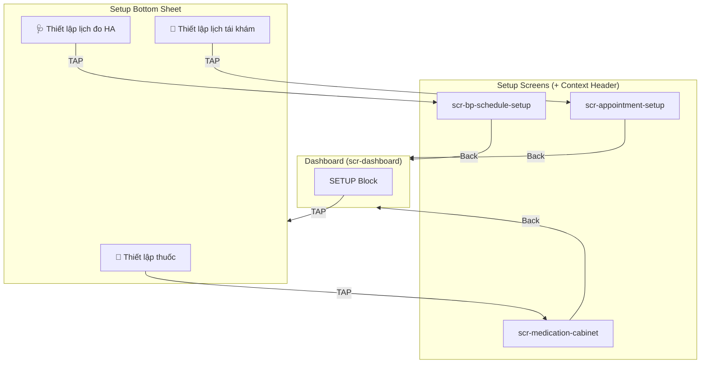
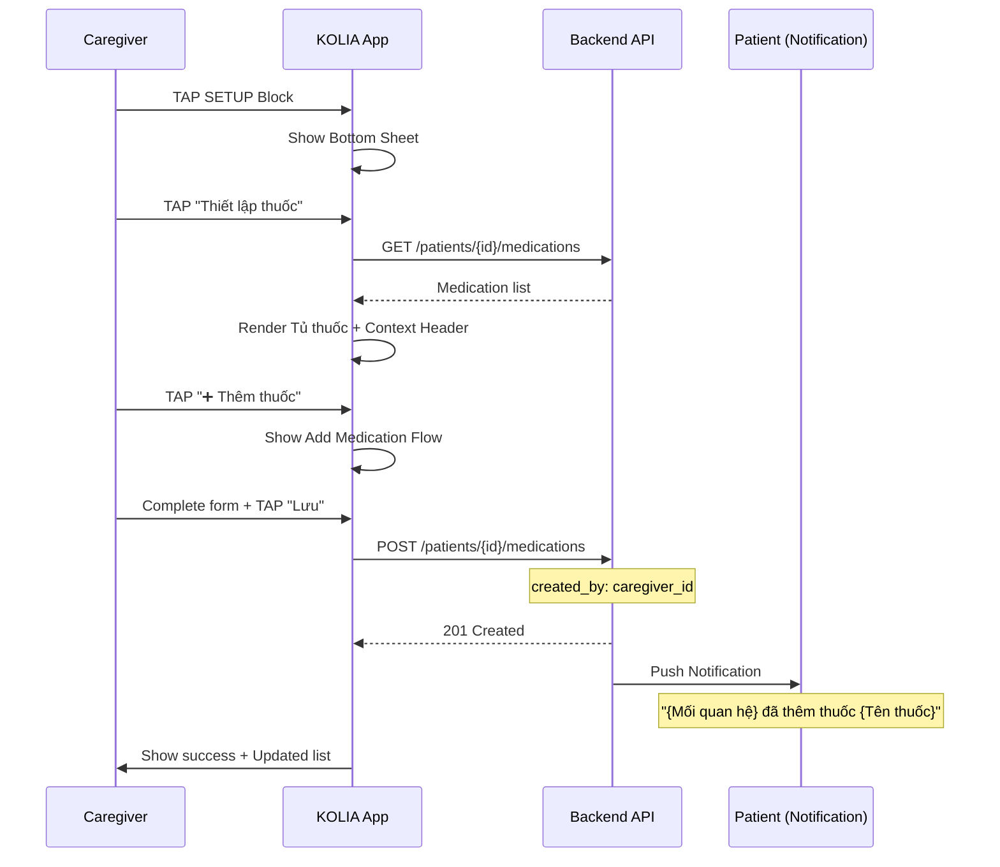
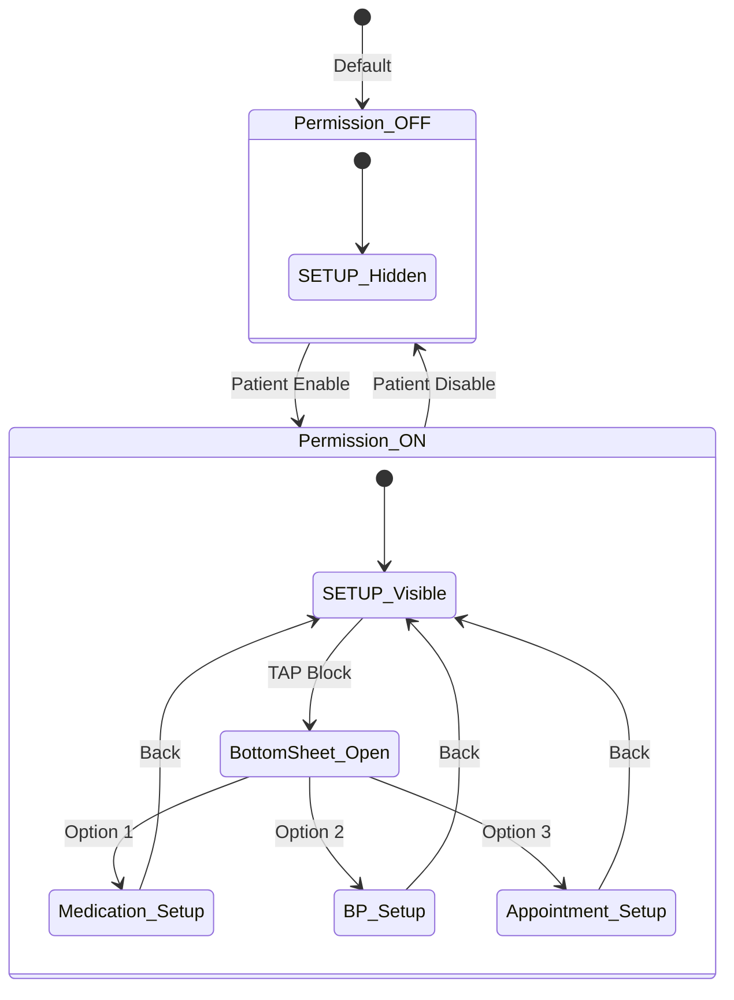

# SRS: US 2.1 - Thiết lập Nhiệm vụ Tuân thủ (Caregiver Task Setup)

> **Version:** v1.4  
> **Date:** 2026-02-05  
> **Author:** BA Team  
> **Status:** Ready for Dev Review  
> **Parent SRS:** [KOLIA-1517_srs.md](./srs.md)

---

## 1. Giới thiệu

### 1.1 Mục đích

Đặc tả chi tiết chức năng cho phép **Caregiver** thiết lập các **nhiệm vụ tuân thủ** cho Patient đang được theo dõi, bao gồm:
- Thiết lập/chỉnh sửa **lịch uống thuốc**
- Thiết lập/chỉnh sửa **lịch đo huyết áp**
- Thiết lập/chỉnh sửa **lịch tái khám**

### 1.2 Phạm vi

**Trong phạm vi (IN):**
- Thiết lập, chỉnh sửa, xóa lịch uống thuốc cho Patient
- Thiết lập, chỉnh sửa, xóa lịch đo huyết áp cho Patient
- Thiết lập, chỉnh sửa, xóa lịch tái khám cho Patient
- Thông báo Patient khi Caregiver thay đổi (one-way inform)

**Ngoài phạm vi (OUT):**
- Dispute flow (Patient phản đối thay đổi của Caregiver) → Phase 2
- Owner tracking (phân biệt ai tạo nhiệm vụ) → Phase 2
- Setup notifications/alerts → Covered by US 1.1 (srs-nhan-canh-bao.md)

### 1.3 Thuật ngữ (Glossary)

| Thuật ngữ | Định nghĩa |
|-----------|------------|
| **Caregiver** | Người thân đang theo dõi Patient, có Permission #3 (Setup Task) |
| **Patient** | Người dùng chính (bệnh nhân) đang được Caregiver theo dõi |
| **Permission #3** | Quyền "Thiết lập nhiệm vụ tuân thủ" trong Family Connection Settings |
| **Context Header** | Component hiển thị "Đang thao tác cho: {Tên Patient}" |
| **Tủ thuốc** | Danh sách thuốc đang active của Patient |
| **TOÀN QUYỀN** | Caregiver có đầy đủ quyền thêm/sửa/xóa như Patient |

### 1.4 Dependencies & Assumptions

| Dependency | Description | Reference |
|------------|-------------|-----------|
| Permission #3 ON | Caregiver đã được Patient cấp quyền Setup Task | Parent SRS Section 6.5 |
| Existing Medication Setup | Reuse logic thiết lập thuốc | [Kolia]_SRS_V1.0_Thiết_Lập_Lịch_Uống_Thuốc.md |
| Existing BP Setup | Reuse logic thiết lập lịch đo HA | [Kolia]_SRS_v1.0_Thiết_lập_lịch_đo_huyết_áp.md |
| Existing Appointment Setup | Reuse logic thiết lập tái khám | [Kolia]_SRS_MVP0.3_Tái_Khám.md |

**Assumptions:**
- Patient đã chấp nhận kết nối với Caregiver
- Caregiver đã được cấp Permission #3 (Setup Task)
- Các chức năng Thiết lập thuốc, HA, Tái khám đã có sẵn cho Patient

---

## 2. Yêu cầu chức năng (Gherkin BDD)

### Tính năng: Thiết lập nhiệm vụ tuân thủ

**User Story:** Là một **Caregiver**, tôi muốn **thiết lập nhiệm vụ tuân thủ** cho người thân, Để **đảm bảo họ có lịch uống thuốc, đo huyết áp, tái khám đầy đủ**.

---

### 2.1 Entry Points vào các màn Thiết lập

> **📋 Quy ước tên màn hình (theo UI gốc):**
> | Screen ID | Tên màn UI | Chức năng |
> |-----------|-----------|----------|
> | scr-medication-schedule | Lịch uống thuốc | Hiển thị lịch uống thuốc theo ngày |
> | scr-medication-cabinet | Tủ thuốc | Danh sách thuốc đang uống/đã dừng |
> | scr-bp-schedule | Đo huyết áp | Hiển thị lịch đo HA theo ngày |
> | scr-bp-setup | Thiết lập lịch | Form thiết lập lịch đo HA |
> | scr-appointment-list | Lịch khám sức khỏe | Danh sách lịch khám (Sắp tới/Đã qua) |

#### Kịch bản 2.1.1 (Happy Path): Truy cập từ SETUP Block trên Dashboard
```gherkin
Given Caregiver đang ở màn hình Dashboard (US 1.2)
  And Patient đã cấp Permission #3 (Setup Task) = ON
When Dashboard render
Then Khối "⚙️ Thiết lập nhiệm vụ" hiển thị 3 rows tương ứng 3 nhiệm vụ:
  | Row | Icon | Label | Navigate to | Tên màn UI |
  | 1 | 💊 | Thiết lập thuốc | scr-medication-cabinet | Tủ thuốc |
  | 2 | 🩺 | Thiết lập lịch đo huyết áp | scr-bp-setup | Thiết lập lịch |
  | 3 | 🏥 | Thiết lập lịch tái khám | scr-appointment-list | Lịch khám sức khỏe |
  And Mỗi row có chevron "〉" bên phải để indicate tappable
  And Mỗi row hiển thị subtitle theo logic:
  | Row | Subtitle (có data) | Subtitle (empty) | Logic |
  | 1 | "{N} thuốc đang uống" | "Chưa thiết lập" | Đếm số thuốc có status = "active" |
  | 2 | "Đo {X} lần/ngày" | "Chưa thiết lập" | Hiển thị tần suất đã thiết lập |
  | 3 | "{N} lịch sắp tới" | "Chưa có lịch" | Đếm số lịch khám có scheduled_date >= today |
When Caregiver TAP vào 1 row bất kỳ
Then Hệ thống điều hướng đến màn tương ứng của Patient
  And Context Header hiển thị: "{Mối quan hệ} ({Tên Patient})"
```
*Ref: BR-CG-020, BR-CG-010*

#### Kịch bản 2.1.2: Permission #3 OFF - SETUP Block hiển thị Inline Permission Denied
```gherkin
Given Caregiver đang ở màn hình Dashboard
  And Patient đã tắt Permission #3 "Thiết lập nhiệm vụ" = OFF
When Dashboard load xong
Then Khối "⚙️ Thiết lập nhiệm vụ" hiển thị trạng thái "Permission Denied":
  | Layer | Chi tiết |
  | Title | Giữ nguyên hiển thị "⚙️ Thiết lập nhiệm vụ" - KHÔNG blur |
  | Background | 3 rows bị blur |
  | Overlay | Centered vertically trong khối |
  | Icon | 🔒 (32px) |
  | Message Line 1 | "{Mối quan hệ} đã tắt quyền thiết lập nhiệm vụ" |
  | Message Line 2 | "Liên hệ {Mối quan hệ} để bật lại quyền này" |
  And Caregiver KHÔNG thể TAP vào các rows
  Ref: BR-CG-021, BR-CG-018
```
*Ref: BR-CG-021, BR-CG-018*

#### Kịch bản 2.1.3: Truy cập từ màn "Lịch uống thuốc" (via US 1.2)
```gherkin
Given Caregiver đang xem kết quả tuân thủ từ Dashboard (US 1.2)
  And Caregiver đã TAP vào khối "💊 Kết quả tuân thủ thuốc"
  And Hệ thống điều hướng đến màn "Lịch uống thuốc" của Patient
  And Permission #3 = ON
When Caregiver TAP vào icon Cài đặt (góc phải trên header)
Then Hệ thống điều hướng đến màn "Tủ thuốc" của Patient
  And Context Header hiển thị: "{Mối quan hệ} ({Tên Patient})"
```
*Ref: BR-CG-010*

#### Kịch bản 2.1.4: Truy cập từ màn "Đo huyết áp" (via US 1.2)
```gherkin
Given Caregiver đang xem kết quả tuân thủ từ Dashboard (US 1.2)
  And Caregiver đã TAP vào khối "🩺 Huyết áp hôm nay"
  And Hệ thống điều hướng đến màn "Đo huyết áp" của Patient
  And Permission #3 = ON
When Caregiver TAP vào icon Cài đặt (góc phải trên header)
Then Hệ thống điều hướng đến màn "Thiết lập lịch" (đo HA) của Patient
  And Context Header hiển thị: "{Mối quan hệ} ({Tên Patient})"
```
*Ref: BR-CG-010*

#### Kịch bản 2.1.5: Truy cập từ màn "Lịch khám sức khỏe" (via US 1.2)
```gherkin
Given Caregiver đang xem kết quả tuân thủ từ Dashboard (US 1.2)
  And Caregiver đã TAP vào khối "🏥 Tái khám"
  And Hệ thống điều hướng đến màn "Lịch khám sức khỏe" của Patient
  And Permission #3 = ON
When Caregiver TAP vào icon Cài đặt (góc phải trên header)
Then Hệ thống điều hướng đến màn "Thêm lịch khám":
  | Option | Label |
  | 📷 | Chụp ảnh |
  | 🖼️ | Tải ảnh |
  | ✏️ | Nhập thủ công |
  And Context Header hiển thị: "{Mối quan hệ} ({Tên Patient})"
```
*Ref: BR-CG-010*

---

### 2.2 Thiết lập Thuốc (Medication Setup)

#### Kịch bản 2.2.1 (Happy Path): Thêm thuốc mới cho Patient
```gherkin
Given Caregiver đã chọn "💊 Thiết lập thuốc" từ SETUP Block
  And Hệ thống điều hướng đến màn "Tủ thuốc" của Patient
  And Context Header hiển thị: "{Mối quan hệ} ({Tên Patient})"
When Caregiver thực hiện flow Thêm thuốc (theo SRS Thiết lập thuốc)
  And Hoàn tất các bước:
    1. Chọn phương thức nhập (AI Scan / Thủ công)
    2. Nhập thông tin thuốc
    3. Thiết lập lịch uống
    4. TAP "Lưu"
Then Thuốc được lưu vào Tủ thuốc của Patient
  And Kết quả lưu với metadata:
    | Field | Value |
    | created_by | {caregiver_id} |
    | created_at | {timestamp} |
  And Patient nhận Push Notification theo BR-CG-022
  And Caregiver quay về màn "Tủ thuốc" với danh sách đã cập nhật
```
*Ref: BR-CG-010, BR-CG-011, BR-CG-022*

#### Kịch bản 2.2.2: Chỉnh sửa thuốc đã có của Patient
```gherkin
Given Caregiver đang ở màn Tủ thuốc của Patient
  And Có thuốc {Tên thuốc} trong danh sách (bất kể ai tạo)
When Caregiver TAP vào thuốc → Chọn "Chỉnh sửa"
  And Thay đổi thông tin (liều, thời gian, tần suất...)
  And TAP "Lưu"
Then Thông tin thuốc được cập nhật
  And Kết quả lưu với metadata:
    | Field | Value |
    | modified_by | {caregiver_id} |
    | modified_at | {timestamp} |
  And Patient nhận Push Notification theo BR-CG-023
```
*Ref: BR-CG-011, BR-CG-023*

#### Kịch bản 2.2.3: Xóa thuốc của Patient
```gherkin
Given Caregiver đang ở màn Tủ thuốc của Patient
  And Có thuốc {Tên thuốc} trong danh sách
When Caregiver TAP vào thuốc → Chọn "Xóa thuốc"
Then Hiển thị Confirmation Popup:
  | Element | Content |
  | Title | "Xóa {Tên thuốc}?" |
  | Message | "Thao tác này sẽ xóa thuốc khỏi lịch uống của {Mối quan hệ}" |
  | Primary Button | "Xóa" (Destructive) |
  | Secondary Button | "Hủy" |
When Caregiver TAP "Xóa"
Then Thuốc bị xóa khỏi Tủ thuốc Patient
  And Patient nhận Push Notification theo BR-CG-024
```
*Ref: BR-CG-024*

#### Kịch bản 2.2.4 (Empty State): Patient chưa có thuốc
```gherkin
Given Caregiver đã chọn "💊 Thiết lập thuốc" từ SETUP Block
  And Patient chưa có thuốc nào trong Tủ thuốc
When Màn hình Tủ thuốc render
Then Hiển thị Empty State:
  | Element | Content |
  | Illustration | empty_medication.svg |
  | Title | "{Mối quan hệ} chưa có thuốc nào" |
  | Description | "Thêm thuốc để thiết lập lịch nhắc uống thuốc" |
  | CTA Button | "➕ Thêm thuốc" |
```
*Ref: BR-CG-025*

#### Kịch bản 2.2.5: Thêm thuốc mới từ màn Tủ thuốc (có data)
```gherkin
Given Caregiver đang ở màn Tủ thuốc của Patient
  And Tủ thuốc đã có ít nhất 1 thuốc
  And Context Header hiển thị "Đang thao tác cho: {Tên Patient}"
When Caregiver TAP vào icon "+" ở header (góc phải trên)
Then Hệ thống điều hướng đến màn "Chọn phương thức thêm thuốc":
  | Option | Label |
  | 📷 | Chụp ảnh |
  | 🖼️ | Tải ảnh |
  | ✏️ | Nhập thủ công |
  And Context Header vẫn hiển thị
  And Caregiver tiếp tục flow Thêm thuốc (theo Kịch bản 2.2.1)
```
*Ref: BR-CG-010, BR-CG-011*

---

### 2.3 Thiết lập Lịch đo Huyết áp (BP Schedule Setup)

#### Kịch bản 2.3.1 (Happy Path): Thiết lập lịch đo mới
```gherkin
Given Caregiver đã chọn "🩺 Thiết lập lịch đo huyết áp" từ SETUP Block
  And Hệ thống điều hướng đến màn "Thiết lập lịch" (đo HA) của Patient
  And Context Header hiển thị: "{Mối quan hệ} ({Tên Patient})"
When Caregiver thực hiện flow Thiết lập lịch đo (theo SRS Thiết lập lịch đo HA)
  And Hoàn tất các bước:
    1. Chọn tần suất đo (Hằng ngày / Tuần X lần / Tùy chỉnh)
    2. Chọn thời điểm đo (Sáng / Chiều / Tối)
    3. Đặt giờ nhắc
    4. TAP "Lưu"
Then Lịch đo được lưu cho Patient
  And Kết quả lưu với metadata:
    | Field | Value |
    | setup_by | {caregiver_id} |
    | setup_at | {timestamp} |
  And Patient nhận Push Notification theo BR-CG-026
  And Caregiver thấy confirmation: "Đã thiết lập lịch đo cho {Mối quan hệ}"
```
*Ref: BR-CG-010, BR-CG-011, BR-CG-026*

#### Kịch bản 2.3.2: Chỉnh sửa lịch đo đã có
```gherkin
Given Caregiver đang ở màn Thiết lập lịch đo HA của Patient
  And Patient đã có lịch đo được thiết lập
When Caregiver thay đổi cài đặt (tần suất, thời gian, giờ nhắc)
  And TAP "Lưu"
Then Lịch đo được cập nhật
  And Patient nhận Push Notification theo BR-CG-027
```
*Ref: BR-CG-027*

#### Kịch bản 2.3.3: Xóa lịch đo HA của Patient
```gherkin
Given Caregiver đang ở màn Thiết lập lịch đo HA của Patient
  And Patient đã có lịch đo được thiết lập
When Caregiver TAP "Xóa lịch đo"
Then Hiển thị Confirmation Popup:
  | Element | Content |
  | Title | "Xóa lịch đo huyết áp?" |
  | Message | "Thao tác này sẽ xóa lịch đo huyết áp của {Mối quan hệ}" |
  | Primary Button | "Xóa" (Destructive) |
  | Secondary Button | "Hủy" |
When Caregiver TAP "Xóa"
Then Lịch đo bị xóa
  And Patient nhận Push Notification theo BR-CG-034
```
*Ref: BR-CG-034*

#### Kịch bản 2.3.4 (Empty State): Patient chưa có lịch đo
```gherkin
Given Caregiver đã chọn "🩺 Thiết lập lịch đo huyết áp"
  And Patient chưa có lịch đo nào
When Màn hình render
Then Hiển thị form Thiết lập lịch đo mới (như bình thường)
  And Context Header: "Đang thao tác cho: {Tên Patient}"
```
*Note: Không cần Empty State riêng vì màn hình này là form thiết lập*

---

### 2.4 Thiết lập Lịch Tái khám (Appointment Setup)

#### Kịch bản 2.4.1 (Happy Path): Thêm lịch tái khám mới
```gherkin
Given Caregiver đã chọn "🏥 Thiết lập lịch tái khám" từ SETUP Block
  And Hệ thống điều hướng đến màn "Lịch khám sức khỏe" của Patient
  And Context Header hiển thị: "{Mối quan hệ} ({Tên Patient})"
When Caregiver thực hiện flow Thêm lịch khám (theo SRS Tái Khám US-001/002/003)
  And Hoàn tất các bước:
    1. Nhập ngày khám
    2. Nhập nơi khám / Bác sĩ
    3. Nhập ghi chú (optional)
    4. TAP "Lưu"
Then Lịch khám được lưu vào danh sách của Patient
  And Kết quả lưu với metadata:
    | Field | Value |
    | created_by | {caregiver_id} |
    | created_at | {timestamp} |
  And Patient nhận Push Notification theo BR-CG-028
  And Caregiver quay về màn "Lịch khám sức khỏe" với danh sách đã cập nhật
```
*Ref: BR-CG-010, BR-CG-011, BR-CG-028*

#### Kịch bản 2.4.2: Chỉnh sửa lịch khám đã có
```gherkin
Given Caregiver đang ở màn Lịch khám của Patient
  And Có lịch khám {Ngày} - {Nơi khám} trong tab "Sắp tới"
When Caregiver TAP vào lịch khám → Chọn "Chỉnh sửa"
  And Thay đổi thông tin (ngày, nơi khám, ghi chú)
  And TAP "Lưu"
Then Thông tin lịch khám được cập nhật
  And Patient nhận Push Notification theo BR-CG-029
```
*Ref: BR-CG-029*

#### Kịch bản 2.4.3: Xóa lịch khám của Patient
```gherkin
Given Caregiver đang ở màn Lịch khám của Patient
  And Có lịch khám trong tab "Sắp tới"
When Caregiver TAP vào lịch khám → Chọn "Xóa lịch"
Then Hiển thị Confirmation Popup:
  | Element | Content |
  | Title | "Xóa lịch khám?" |
  | Message | "Thao tác này sẽ xóa lịch khám ngày {dd/MM/yyyy} của {Mối quan hệ}" |
  | Primary Button | "Xóa" (Destructive) |
  | Secondary Button | "Hủy" |
When Caregiver TAP "Xóa"
Then Lịch khám bị xóa
  And Patient nhận Push Notification theo BR-CG-030
```
*Ref: BR-CG-030*

#### Kịch bản 2.4.4 (Empty State): Patient chưa có lịch khám
```gherkin
Given Caregiver đã chọn "🏥 Thiết lập lịch tái khám"
  And Patient chưa có lịch khám nào
When Màn hình Lịch khám render
Then Hiển thị Empty State:
  | Element | Content |
  | Illustration | empty_appointment.svg |
  | Title | "{Mối quan hệ} chưa có lịch khám nào" |
  | Description | "Thêm lịch khám để nhận nhắc nhở tái khám" |
  | CTA Button | "➕ Thêm lịch khám" |
```
*Ref: BR-CG-031*

#### Kịch bản 2.4.5: Thêm lịch khám từ màn Lịch khám (có data)
```gherkin
Given Caregiver đang ở màn Lịch khám của Patient
  And Đã có ít nhất 1 lịch khám trong danh sách
  And Context Header hiển thị "Đang thao tác cho: {Tên Patient}"
When Caregiver TAP vào icon "+" ở header (góc phải trên)
Then Hệ thống điều hướng đến màn "Thêm lịch khám":
  | Option | Label |
  | 📷 | Chụp ảnh |
  | 🖼️ | Tải ảnh |
  | ✏️ | Nhập thủ công |
  And Context Header vẫn hiển thị
  And Caregiver tiếp tục flow Thêm lịch khám (theo Kịch bản 2.4.1)
```
*Ref: BR-CG-010, BR-CG-011*

---

## 3. Business Rules

### 3.1 Authorization Rules

| BR-ID | Mô tả Rule | Trigger | Exception | Priority |
|-------|-----------|---------|-----------|----------|
| BR-CG-020 | SETUP Block chỉ hiển thị khi Permission #3 = ON | Dashboard render | N/A | HIGH |
| BR-CG-021 | Caregiver có TOÀN QUYỀN thêm/sửa/xóa như Patient | Bất kỳ action nào | Permission #3 = OFF → Block | HIGH |

### 3.2 State Transition Rules

| BR-ID | Mô tả Rule | Trigger | Exception | Priority |
|-------|-----------|---------|-----------|----------|
| BR-CG-010 | Mọi action trong Caregiver mode PHẢI hiển thị Context Header | Navigate to any setup screen | N/A | HIGH |
| BR-CG-011 | Kết quả lưu với metadata `{performed_by: caregiver_id}` | Save action | N/A | HIGH |

### 3.3 Conflict Resolution Rules

| BR-ID | Mô tả Rule | Trigger | Exception | Priority |
|-------|-----------|---------|-----------|----------|
| BR-CG-032 | Last-Write-Wins: Không phân biệt owner khi edit | Concurrent edits | N/A | MEDIUM |
| BR-CG-033 | Không có dispute flow - Patient CHỈ được thông báo | Patient receives notification | Phase 2: Add dispute | LOW |

### 3.4 Notification Rules

| BR-ID | Mô tả Rule | Trigger | Priority |
|-------|-----------|---------|----------|
| BR-CG-022 | Notify Patient khi Caregiver THÊM thuốc mới | Medication created | HIGH |
| BR-CG-023 | Notify Patient khi Caregiver SỬA thuốc | Medication updated | MEDIUM |
| BR-CG-024 | Notify Patient khi Caregiver XÓA thuốc | Medication deleted | HIGH |
| BR-CG-026 | Notify Patient khi Caregiver THIẾT LẬP lịch đo HA | BP schedule created | HIGH |
| BR-CG-027 | Notify Patient khi Caregiver SỬA lịch đo HA | BP schedule updated | MEDIUM |
| BR-CG-028 | Notify Patient khi Caregiver THÊM lịch khám | Appointment created | HIGH |
| BR-CG-029 | Notify Patient khi Caregiver SỬA lịch khám | Appointment updated | MEDIUM |
| BR-CG-030 | Notify Patient khi Caregiver XÓA lịch khám | Appointment deleted | HIGH |
| BR-CG-034 | Notify Patient khi Caregiver XÓA lịch đo HA | BP schedule deleted | HIGH |

### 3.5 Empty State Rules

| BR-ID | Mô tả Rule | Trigger | Priority |
|-------|-----------|---------|----------|
| BR-CG-025 | Hiển thị Empty State khi Patient chưa có thuốc | Medication list empty | MEDIUM |
| BR-CG-031 | Hiển thị Empty State khi Patient chưa có lịch khám | Appointment list empty | MEDIUM |

### 3.6 Identity Display Rules

| BR-ID | Mô tả Rule | Logic | Priority |
|-------|-----------|-------|----------|
| BR-CG-035 | Hiển thị định danh Patient trong mọi messages và UI | `if (relationship != "Khác") { show {Mối quan hệ} } else { show {Tên} }` | HIGH |

> **Ví dụ BR-CG-035:**
> - Relationship = "Mẹ" → Hiển thị: "Mẹ chưa có thuốc nào", "Mẹ đã tắt quyền..."
> - Relationship = "Khác" với Tên = "Nguyễn Văn A" → Hiển thị: "Nguyễn Văn A chưa có thuốc nào"

---

## 4. Validation Rules (Data Fields)

> **Note:** Validation rules cho các fields reuse từ existing features. Xem chi tiết tại:
> - Medication: `[Kolia]_SRS_V1.0_Thiết_Lập_Lịch_Uống_Thuốc.md`
> - BP Schedule: `[Kolia]_SRS_v1.0_Thiết_lập_lịch_đo_huyết_áp.md`
> - Appointment: `[Kolia]_SRS_MVP0.3_Tái_Khám.md`

### 4.1 Context Header Validation

| Field | Rule | Ví dụ hợp lệ | Ví dụ không hợp lệ |
|-------|------|--------------|-------------------|
| Patient Name | Required, từ Patient profile | "Đang thao tác cho: Ông Nguyễn Văn A" | (empty) |
| {Mối quan hệ} | Map từ relationship setting | "Bố", "Mẹ", "Ông", "Bà" | "Patient" |

---

## 5. Yêu cầu phi chức năng (NFR)

### 5.1 Performance
- Thời gian load màn hình Setup: ≤ 2s (4G network)
- Thời gian lưu thay đổi: ≤ 3s

### 5.2 Security
- Xác thực Permission #3 trước khi cho phép truy cập
- Audit log cho mọi thay đổi với `{performed_by, performed_at, action_type}`

### 5.3 Availability
- Offline mode: Hiển thị thông báo "Không có kết nối mạng" khi mất mạng
- Retry mechanism: Tự động retry 3 lần khi save thất bại

---

## 6. UI Specifications

### 6.1 Screen Inventory

| Screen ID | Screen Name | Description | Entry Points | Exit Points |
|-----------|-------------|-------------|--------------|-------------|
| scr-setup-bottom-sheet | SETUP Bottom Sheet | Bottom sheet chọn loại nhiệm vụ | SETUP Block TAP | Close / Navigate to sub-screen |
| scr-medication-cabinet | Tủ thuốc (Caregiver mode) | Danh sách thuốc Patient + Context Header | Bottom Sheet option 1 | Back to Dashboard |
| scr-bp-schedule-setup | Thiết lập lịch đo HA | Form thiết lập + Context Header | Bottom Sheet option 2 | Back to Dashboard |
| scr-appointment-setup | Lịch khám (Caregiver mode) | Danh sách lịch khám + Context Header | Bottom Sheet option 3 | Back to Dashboard |

### 6.2 SETUP Block Component

| Component ID | Component Name | Type | Location | Constraints |
|--------------|----------------|------|----------|-------------|
| setup-block | SETUP Block | Tappable Card | Dashboard Block #4 | Visible only when Permission #3 = ON |
| setup-icon | Setup Icon | Icon | Left side | "⚙️" |
| setup-title | Setup Title | Text | Center | "Thiết lập nhiệm vụ" |
| setup-chevron | Chevron | Icon | Right side | "›" |

### 6.3 Context Header Component

| Element | Specification |
|---------|---------------|
| Position | Fixed, below Navigation Bar |
| Background | `--color-surface-secondary` (#F5F5F5) |
| Height | 48px |
| Content | "**{Mối quan hệ}** ({Tên Patient})" |
| Icon | Patient Avatar (32px, circular) - reuse từ Profile Selector |
| Typography | 14px, Regular |

> **Note:** Format thống nhất với US 1.2 (Xem kết quả tuân thủ). Avatar reuse từ Profile Selector để đảm bảo consistency. Ví dụ: "[Avatar] Mẹ (Bà Nguyễn Thị B)"

**Visual Mockup:**
```
┌─────────────────────────────────────────┐
│ ← Tủ thuốc                             │ ← Navigation Bar
├─────────────────────────────────────────┤
│ 👵 Mẹ (Bà Nguyễn Thị B)                │ ← Context Header
├─────────────────────────────────────────┤
│                                         │
│   [Existing Medication Cabinet UI]      │ ← Reuse existing UI
│                                         │
└─────────────────────────────────────────┘
```

### 6.4 Bottom Sheet - Setup Options

**Visual Mockup:**
```
┌─────────────────────────────────────────┐
│ ━━━━ (Handle)                          │
│                                         │
│ Thiết lập nhiệm vụ                      │ ← Title
│                                         │
│ ┌───────────────────────────────────┐   │
│ │ 💊  Thiết lập thuốc            › │   │ ← Option 1
│ └───────────────────────────────────┘   │
│ ┌───────────────────────────────────┐   │
│ │ 🩺  Thiết lập lịch đo huyết áp › │   │ ← Option 2
│ └───────────────────────────────────┘   │
│ ┌───────────────────────────────────┐   │
│ │ 🏥  Thiết lập lịch tái khám    › │   │ ← Option 3
│ └───────────────────────────────────┘   │
│                                         │
└─────────────────────────────────────────┘
```

### 6.5 Screen States & Behaviors

| Screen/Component | State | Visual | Trigger |
|------------------|-------|--------|---------|
| SETUP Block | Default | Card with icon, title, chevron | Dashboard render |
| SETUP Block | Hidden | Not rendered | Permission #3 = OFF |
| SETUP Block | Pressed | Slight scale down (0.98) | TAP |
| Bottom Sheet | Appearing | Slide up animation (300ms) | SETUP Block TAP |
| Bottom Sheet | Dismissing | Slide down animation (200ms) | Tap outside / Swipe down |
| Context Header | Default | Fixed below NavBar | Any setup screen render |

### 6.6 Navigation Flow



---

## 7. Flow Diagrams

### 7.1 Sequence Diagram - Add Medication for Patient



### 7.2 State Diagram - Permission #3 States



---

## 8. Đặc tả nội dung & UX Writing

### 8.1 Notification Templates (Patient nhận)

| Trigger | Template | Example |
|---------|----------|---------|
| Caregiver thêm thuốc | "{Mối quan hệ} đã thêm thuốc {Tên thuốc} vào lịch uống của bạn" | "Con đã thêm thuốc Lisinopril vào lịch uống của bạn" |
| Caregiver sửa thuốc | "{Mối quan hệ} đã cập nhật thông tin thuốc {Tên thuốc}" | "Con đã cập nhật thông tin thuốc Lisinopril" |
| Caregiver xóa thuốc | "{Mối quan hệ} đã xóa thuốc {Tên thuốc} khỏi lịch uống" | "Con đã xóa thuốc Lisinopril khỏi lịch uống" |
| Caregiver thiết lập lịch đo HA | "{Mối quan hệ} đã thiết lập lịch đo huyết áp cho bạn" | "Con đã thiết lập lịch đo huyết áp cho bạn" |
| Caregiver sửa lịch đo HA | "{Mối quan hệ} đã cập nhật lịch đo huyết áp" | "Con đã cập nhật lịch đo huyết áp" |
| Caregiver xóa lịch đo HA | "{Mối quan hệ} đã xóa lịch đo huyết áp" | "Con đã xóa lịch đo huyết áp" |
| Caregiver thêm lịch khám | "{Mối quan hệ} đã thêm lịch khám ngày {dd/MM/yyyy} cho bạn" | "Con đã thêm lịch khám ngày 15/02/2026 cho bạn" |
| Caregiver sửa lịch khám | "{Mối quan hệ} đã cập nhật lịch khám ngày {dd/MM/yyyy}" | "Con đã cập nhật lịch khám ngày 15/02/2026" |
| Caregiver xóa lịch khám | "{Mối quan hệ} đã xóa lịch khám ngày {dd/MM/yyyy}" | "Con đã xóa lịch khám ngày 15/02/2026" |

### 8.2 Error Messages

| Error Code | Condition | Message | CTA |
|------------|-----------|---------|-----|
| ERR-PERM-OFF | Permission #3 bị tắt khi đang thao tác | "{Mối quan hệ} đã tắt quyền thiết lập nhiệm vụ" | "Đã hiểu" |
| ERR-NETWORK | Mất kết nối | "Không có kết nối mạng. Vui lòng thử lại." | "Thử lại" |
| ERR-CONFLICT | Data conflict (đã bị xóa bởi người khác) | "Dữ liệu đã thay đổi. Vui lòng tải lại." | "Tải lại" |

### 8.3 Empty State Messages

> **Quy tắc hiển thị (BR-CG-035):**
> - `{Danh xưng}` = Danh xưng của Caregiver (Bạn, Con, Anh, Chị...)
> - `{Mối quan hệ}` = Mối quan hệ với Patient. Nếu relationship = "Khác" thì dùng `{Tên Patient}`

| Screen | Title Template | Description Template |
|--------|---------------|---------------------|
| Tủ thuốc Empty | "{Mối quan hệ} chưa có thuốc nào" | "Thêm thuốc để thiết lập lịch nhắc uống thuốc cho {Mối quan hệ}" |
| Thiết lập HA Empty | "Bắt đầu theo dõi huyết áp cho {Mối quan hệ}" | "{Danh xưng} có thể đặt lịch để nhắc {Mối quan hệ} đo hàng ngày hoặc thêm ngay kết quả vừa đo để được phân tích." |
| Lịch khám Empty | "Bắt đầu theo dõi lịch khám sức khỏe cho {Mối quan hệ}" | "{Danh xưng} có thể đặt lịch hẹn để Kolia nhắc nhở {Mối quan hệ} tái khám hoặc thêm kết quả khám đã qua." |

> **Ví dụ với relationship = "Mẹ":**
> - Title: "Mẹ chưa có thuốc nào"
> - Description: "Bạn có thể đặt lịch để nhắc Mẹ đo hàng ngày..."

### 8.4 Formatting Rules

| Element | Format | Example |
|---------|--------|---------|
| {Mối quan hệ} | Title case | "Con", "Cháu", "Em" |
| {Tên Patient} | Full name | "Ông Nguyễn Văn A" |
| {Tên thuốc} | Proper case | "Lisinopril 10mg" |
| Date | dd/MM/yyyy | "15/02/2026" |
| Time | HH:mm | "08:30" |

---

## Appendix

### A.1 Revision History

| Version | Date | Author | Changes |
|---------|------|--------|---------|
| v1.0 | 2026-02-04 | BA Team | Initial version |
| v1.1 | 2026-02-04 | BA Team | Added Kịch bản 2.3.3 (Xóa lịch đo HA), BR-CG-034, BR-CG-025, BR-CG-031 |
| v1.2 | 2026-02-05 | BA Team | Added subtitle display logic for SETUP Block rows |
| v1.3 | 2026-02-05 | BA Team | Added BR-CG-035 (Identity Display Rules) |
| v1.4 | 2026-02-05 | BA Team | Updated messages to use {Mối quan hệ}, added section 8.3 Empty State Messages with {Danh xưng} template |

### A.2 Open Questions

- [ ] **OQ-001:** Có cần hiển thị badge "Bạn đã thiết lập" hoặc "Người thân đã thiết lập" để phân biệt owner? → Phase 2
- [ ] **OQ-002:** Khi Patient tự xóa thuốc mà Caregiver đã thêm, có cần notify Caregiver không? → Phase 2

### A.3 Cross-Feature Dependencies

| Feature bị ảnh hưởng | Loại thay đổi | Priority | Status |
|---------------------|---------------|----------|--------|
| Notification System | Thêm 8 templates mới (BR-CG-022 → 030) | HIGH | Pending |
| Medication Setup | Thêm Context Header component | MEDIUM | Pending |
| BP Schedule Setup | Thêm Context Header component | MEDIUM | Pending |
| Appointment Setup | Thêm Context Header component | MEDIUM | Pending |

### A.4 Blocked By

*Feature này KHÔNG CÓ blocker. Có thể implement độc lập sau khi US 1.2 hoàn thành.*

> ✅ **Dev Team lưu ý:** 
> - Reuse existing setup screens, chỉ thêm Context Header component
> - Ensure metadata `{performed_by}` được lưu cho mọi action

---

## ASCII Prototype Reference

### Dashboard với SETUP Block

```
┌─────────────────────────────────────────┐
│ ←  Kết nối Người thân                   │
├─────────────────────────────────────────┤
│ 👤 Ông Nguyễn Văn A                    │
│ [Đang theo dõi] ▼                       │
├─────────────────────────────────────────┤
│ ❤️ HUYẾT ÁP HÔM NAY                    │ ← VIEW Block 1
│ ┌─────────────────────────────────────┐ │
│ │ [Tag: Kiểm soát tốt]                │ │
│ │ [Insight từ BR-010]                 │ │
│ │ [Xem lịch sử →]                    │ │
├─────────────────────────────────────────┤
│ 💊 TUÂN THỦ THUỐC HÔM NAY             │ ← VIEW Block 2
│ ┌─────────────────────────────────────┐ │
│ │ [Badge: 3/5 đã uống]               │ │
│ │ [Preview pills]                     │ │
│ │ [Xem chi tiết →]                   │ │
├─────────────────────────────────────────┤
│ 🏥 TÁI KHÁM SẮP TỚI                   │ ← VIEW Block 3
│ ┌─────────────────────────────────────┐ │
│ │ [Insight: Còn X ngày]              │ │
│ │ [Xem lịch khám →]                  │ │
├─────────────────────────────────────────┤
│ ⚙️ THIẾT LẬP NHIỆM VỤ                 │ ← SETUP Block (NEW)
│ ┌─────────────────────────────────────┐ │
│ │ Thiết lập thuốc, lịch đo, tái khám  › │ │
└─────────────────────────────────────────┘
```
