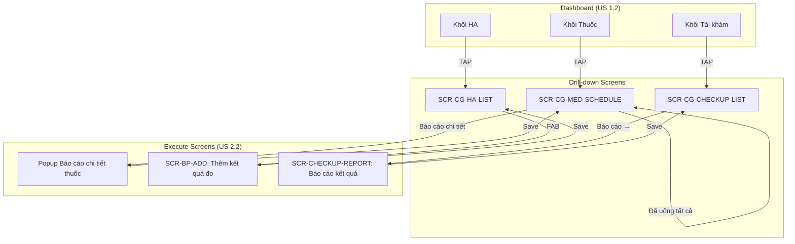
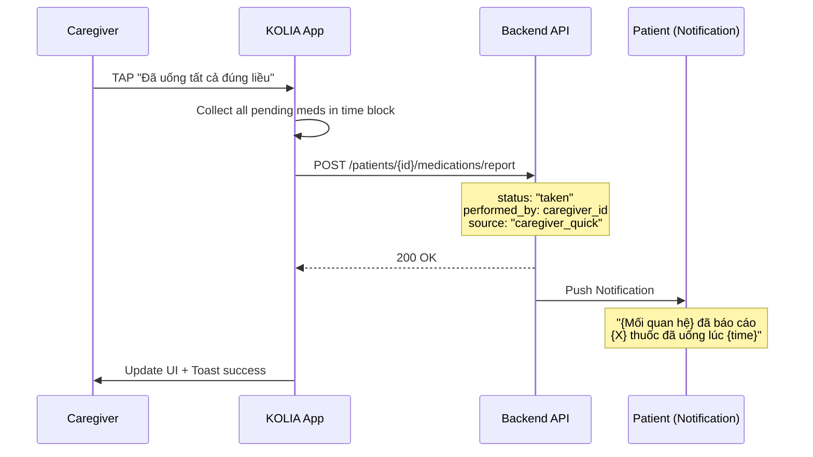
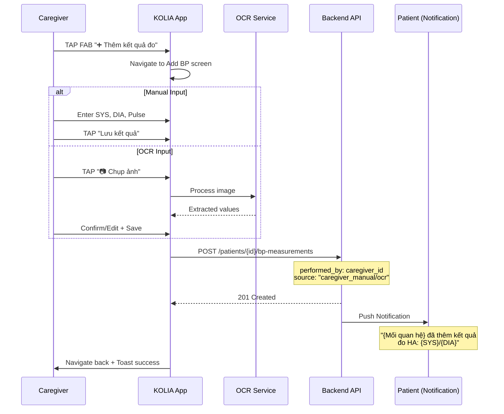

# SRS: US 2.2 - Thực hiện Nhiệm vụ Thay Patient (Caregiver Execute Task)

> **Version:** v1.2  
> **Date:** 2026-02-05  
> **Author:** BA Team  
> **Status:** Ready for Dev Review  
> **Parent SRS:** [KOLIA-1517_srs.md](./srs.md)

---

## 1. Giới thiệu

### 1.1 Mục đích

Đặc tả chi tiết chức năng cho phép **Caregiver** thực hiện các **nhiệm vụ tuân thủ thay** Patient đang được theo dõi, bao gồm:
- Đánh dấu **uống thuốc** hoàn thành thay Patient
- Nhập **kết quả đo huyết áp** thay Patient (thủ công hoặc chụp ảnh)
- Báo cáo **kết quả tái khám** thay Patient

### 1.2 Phạm vi

**Trong phạm vi (IN):**
- Đánh dấu uống thuốc với trạng thái: Đã uống / Quên uống / Sai liều
- Nhập kết quả đo HA thủ công hoặc chụp ảnh máy đo
- Báo cáo kết quả tái khám (chỉ OCR qua chụp/tải ảnh)
- Audit log: `{performed_by: caregiver_id, source: "caregiver"}`
- Thông báo Patient khi Caregiver thực hiện (one-way inform)

**Ngoài phạm vi (OUT):**
- Patient confirmation/rejection → Phase 2
- Hiển thị audit log UI cho Patient (ai đã thực hiện) → **KHÔNG có trong UI** (chỉ lưu backend để tracking)
- Dispute flow → Phase 2

### 1.3 Thuật ngữ (Glossary)

| Thuật ngữ | Định nghĩa |
|-----------|------------|
| **Caregiver** | Người thân đang theo dõi Patient, có Permission #5 (Execute Task) |
| **Patient** | Người dùng chính (bệnh nhân) đang được Caregiver theo dõi |
| **Permission #5** | Quyền "Thực hiện nhiệm vụ thay" trong Family Connection Settings |
| **Execute Mode** | Chế độ Caregiver thực hiện action thay Patient |
| **Audit Metadata** | Dữ liệu tracking: `{performed_by, performed_at, source}` |

### 1.4 Dependencies & Assumptions

| Dependency | Description | Reference |
|------------|-------------|-----------|
| Permission #5 ON | Caregiver đã được Patient cấp quyền Execute Task | Parent SRS Section 6.5 |
| US 1.2 Dashboard | Entry point từ Dashboard drill-down screens | srs-xem-ket-qua-tuan-thu.md |
| Existing Medication Report | Reuse logic báo cáo uống thuốc | [Kolia]_SRS_MVP0.3_Nhiệm_vụ_uống_thuốc.md |
| Existing BP Measurement | Reuse logic nhập kết quả đo HA | [Kolia]_SRS_V1.0_Nhiệm_vụ_đo_huyết_áp.md |
| Existing Checkup Report | Reuse logic báo cáo tái khám | [Kolia]_SRS_MVP0.3_Tái_Khám.md US-005/006 |

**Assumptions:**
- Caregiver đã navigate từ Dashboard (US 1.2) đến các màn hình drill-down
- Permission #5 đã được Patient cấp
- Context Header đang hiển thị (BR-CG-015)

---

## 2. Yêu cầu chức năng (Gherkin BDD)

### Tính năng: Thực hiện nhiệm vụ tuân thủ thay Patient

**User Story:** Là một **Caregiver**, tôi muốn **thực hiện nhiệm vụ tuân thủ thay** người thân, Để **giúp họ ghi nhận kết quả khi họ không tự thao tác được**.

---

### 2.1 Entry Points - Từ Dashboard Drill-down Screens

#### Kịch bản 2.1.1: Entry từ màn Lịch uống thuốc
```gherkin
Given Caregiver đang ở SCR-CG-MED-SCHEDULE (Lịch uống thuốc của Patient)
  And Permission #5 (Execute Task) = ON
  And Context Header: "[Avatar] {Mối quan hệ} ({Tên Patient})"
When Caregiver scroll xuống khối nhiệm vụ có thuốc cần phản hồi
Then Hiển thị 2 Action Buttons:
  | Button | Style | Action |
  | "Đã uống tất cả đúng liều" | Primary (Success) | Quick report all as taken |
  | "Báo cáo chi tiết" | Secondary | Open detailed report popup |
  Ref: BR-CG-040
```

#### Kịch bản 2.1.2: Entry từ màn Danh sách đo HA
```gherkin
Given Caregiver đang ở SCR-CG-HA-LIST (Danh sách kết quả đo HA)
  And Permission #5 (Execute Task) = ON
  And Context Header đang hiển thị
When Màn hình render
Then Hiển thị FAB Button "➕ Thêm kết quả đo"
  Ref: BR-CG-041
```

#### Kịch bản 2.1.3: Entry từ màn Lịch khám
```gherkin
Given Caregiver đang ở SCR-CG-CHECKUP-LIST (Lịch khám sức khỏe)
  And Permission #5 (Execute Task) = ON
  And Có lịch khám với status "🟠 Cần cập nhật kết quả"
When Caregiver tap textlink "Báo cáo →" trên item đó
Then Navigate đến màn Báo cáo kết quả khám
  And Context Header giữ nguyên
  Ref: BR-CG-042
```

#### Kịch bản 2.1.4: Permission #5 OFF - Ẩn Action Buttons
```gherkin
Given Caregiver đang ở các màn hình drill-down (Thuốc/HA/Tái khám)
  And Permission #5 (Execute Task) = OFF
When Màn hình render
Then KHÔNG hiển thị các Action Buttons/FAB
  And Chỉ hiển thị VIEW mode (xem dữ liệu)
  Ref: BR-CG-043
```

---

### 2.2 Báo cáo Uống thuốc Thay Patient

#### Kịch bản 2.2.1 (Happy Path): Quick Report - Đã uống tất cả
```gherkin
Given Caregiver đang ở SCR-CG-MED-SCHEDULE
  And Có khối thời gian (Sáng/Trưa/Tối) với thuốc chưa phản hồi
When Caregiver TAP "Đã uống tất cả đúng liều"
Then Tất cả thuốc trong khối được mark là "Đã uống"
  And Audit metadata được lưu:
    | Field | Value |
    | status | "taken" |
    | performed_by | {caregiver_id} |
    | performed_at | {timestamp} |
    | source | "caregiver" |
  And Patient nhận Push Notification theo BR-CG-050
  And UI update: Badge chuyển sang ✅, màu Success
  And Toast: "Đã cập nhật lịch uống thuốc cho {Mối quan hệ}"
```
*Ref: BR-CG-044, BR-CG-050*

#### Kịch bản 2.2.2: Báo cáo Chi tiết - Quên uống
```gherkin
Given Caregiver TAP "Báo cáo chi tiết"
  And Popup hiển thị danh sách thuốc trong khối
When Caregiver chọn thuốc → Select "Quên uống"
  And Optional: Nhập lý do (free text, max 100 chars)
  And TAP "Lưu"
Then Thuốc được mark là "Quên uống"
  And Audit metadata được lưu với status = "missed"
  And Patient nhận Push Notification
  And Popup đóng, UI update
```
*Ref: BR-CG-045*

#### Kịch bản 2.2.3: Báo cáo Chi tiết - Sai liều
```gherkin
Given Caregiver đang ở Popup Báo cáo chi tiết
When Caregiver chọn thuốc → Select "Sai liều"
  And Nhập liều thực tế (required)
  And TAP "Lưu"
Then Thuốc được mark là "Sai liều" với note về liều thực tế
  And Audit metadata được lưu với status = "wrong_dose"
  And Patient nhận Push Notification
```
*Ref: BR-CG-046*

#### Kịch bản 2.2.4: Chỉnh sửa báo cáo đã gửi
```gherkin
Given Caregiver đang ở SCR-CG-MED-SCHEDULE
  And Có thuốc đã được báo cáo trong ngày (status ≠ "pending")
When Caregiver TAP vào thuốc → TAP icon ✏️ "Chỉnh sửa"
Then Mở Popup chỉnh sửa báo cáo
  And Cho phép thay đổi status (Đã uống ↔ Quên ↔ Sai liều)
When Caregiver thay đổi và TAP "Lưu"
Then Cập nhật status mới
  And Thêm entry mới vào audit log (không ghi đè cũ)
  And Patient nhận notification về thay đổi
```
*Ref: BR-CG-047*

---

### 2.3 Nhập Kết quả Đo HA Thay Patient

#### Kịch bản 2.3.1 (Happy Path): Nhập thủ công
```gherkin
Given Caregiver đang ở SCR-CG-HA-LIST
  And Permission #5 = ON
When Caregiver TAP FAB "➕ Thêm kết quả đo"
Then Navigate đến màn Nhập kết quả đo (Reuse từ SRS Đo HA)
  And Context Header giữ nguyên: "[Avatar] {Mối quan hệ} ({Tên Patient})"
When Caregiver nhập:
  | Field | Value |
  | Tâm thu | {số} mmHg |
  | Tâm trương | {số} mmHg |
  | Nhịp tim | {số} bpm (optional) |
  | Thời điểm | Sáng / Chiều / Tối |
  And TAP "Lưu kết quả"
Then Kết quả được lưu với audit metadata:
  | Field | Value |
  | systolic | {tâm thu} |
  | diastolic | {tâm trương} |
  | pulse | {nhịp tim} |
  | performed_by | {caregiver_id} |
  | performed_at | {timestamp} |
  | source | "caregiver_manual" |
  And Patient nhận Push Notification theo BR-CG-051
  And Navigate back to SCR-CG-HA-LIST với kết quả mới ở đầu
```
*Ref: BR-CG-048, BR-CG-051*

#### Kịch bản 2.3.2: Nhập bằng chụp ảnh máy đo
```gherkin
Given Caregiver đang ở màn Nhập kết quả đo
When Caregiver TAP "📷 Chụp ảnh máy đo"
Then Mở Camera
When Caregiver chụp ảnh màn hình máy đo HA
Then OCR xử lý ảnh → Extract values
  And Hiển thị kết quả OCR để Caregiver xác nhận/chỉnh sửa
When Caregiver xác nhận "Lưu kết quả"
Then Kết quả được lưu với source = "caregiver_ocr"
  And Ảnh gốc được lưu làm evidence
  And Patient nhận notification
```
*Ref: BR-CG-049*

#### Kịch bản 2.3.3: Validation Error
```gherkin
Given Caregiver đang nhập kết quả đo HA
When Caregiver nhập giá trị ngoài range hợp lệ:
  | Field | Valid Range |
  | Tâm thu | 60 - 250 mmHg |
  | Tâm trương | 40 - 150 mmHg |
  | Nhịp tim | 30 - 200 bpm |
Then Hiển thị inline error: "Giá trị không hợp lệ. Vui lòng kiểm tra lại."
  And Button "Lưu kết quả" bị disable
```
*Ref: BR-CG-052*

---

### 2.4 Báo cáo Kết quả Tái khám Thay Patient

#### Kịch bản 2.4.1 (Happy Path): Báo cáo kết quả khám
```gherkin
Given Caregiver đang ở SCR-CG-CHECKUP-LIST
  And Có lịch khám với status "🟠 Cần cập nhật kết quả"
When Caregiver TAP textlink "Báo cáo →"
Then Navigate đến màn Báo cáo kết quả khám (Reuse từ SRS Tái khám US-005/006)
  And Context Header giữ nguyên
When Caregiver chọn phương thức nhập:
  | Phương thức | Mô tả |
  | 📷 Chụp ảnh | Mở camera để chụp phiếu kết quả khám |
  | 🖼️ Tải ảnh | Chọn ảnh từ thư viện (tối đa 15 ảnh theo GR-BIZ-04) |
  | Lịch tái khám tiếp | Optional |
  And TAP "Lưu kết quả"
Then Kết quả được lưu với audit metadata:
  | Field | Value |
  | reported_by | {caregiver_id} |
  | reported_at | {timestamp} |
  | source | "caregiver" |
  And Lịch khám chuyển status → "⚫ Đã qua"
  And Patient nhận Push Notification theo BR-CG-053
  And Navigate back với confirmation toast
```
*Ref: BR-CG-054, BR-CG-053*

#### Kịch bản 2.4.2: Báo cáo bằng OCR
```gherkin
Given Caregiver đang ở màn Báo cáo kết quả khám
When Caregiver TAP "📷 Chụp kết quả khám"
Then Mở Camera
When Caregiver chụp ảnh phiếu kết quả
Then OCR xử lý → Extract thông tin
  And Hiển thị kết quả để Caregiver review/chỉnh sửa
  And Ảnh gốc được lưu làm evidence
```
*Ref: SRS Tái khám US-005*

#### Kịch bản 2.4.3: Thêm lịch tái khám tiếp theo
```gherkin
Given Caregiver đang báo cáo kết quả khám
  And Có thông tin lịch tái khám tiếp từ kết quả khám
When Caregiver nhập lịch tái khám tiếp:
  | Field | Value |
  | Ngày hẹn | {dd/MM/yyyy} |
  | Khoa/Chuyên khoa | Optional |
  | Nơi khám | Optional |
Then Lịch mới được tạo song song với báo cáo kết quả
  And Audit metadata: created_by = {caregiver_id}
```
*Ref: BR-CG-055*

---

## 3. Business Rules

### 3.1 Authorization Rules

| BR-ID | Mô tả Rule | Trigger | Exception | Priority |
|-------|-----------|---------|-----------|----------|
| BR-CG-040 | Action Buttons hiển thị trong màn Lịch uống thuốc khi Permission #5 = ON | Screen render | Permission OFF → Hide | P0 |
| BR-CG-041 | FAB "Thêm kết quả đo" hiển thị trong màn HA List khi Permission #5 = ON | Screen render | Permission OFF → Hide | P0 |
| BR-CG-042 | Textlink "Báo cáo →" hiển thị trên lịch khám cần update khi Permission #5 = ON | Item render | Permission OFF → Hide | P0 |
| BR-CG-043 | Permission #5 = OFF → Chỉ VIEW mode, không có action buttons | Any execute screen | N/A | P0 |

### 3.2 Audit & Tracking Rules

| BR-ID | Mô tả Rule | Trigger | Priority |
|-------|-----------|---------|----------|
| BR-CG-044 | Medication report PHẢI lưu: `{status, performed_by, performed_at, source}` | Report saved | P0 |
| BR-CG-045 | Báo cáo "Quên uống" cho phép nhập lý do (optional, max 100 chars) | Missed report | P1 |
| BR-CG-046 | Báo cáo "Sai liều" PHẢI nhập liều thực tế (required) | Wrong dose report | P0 |
| BR-CG-047 | Edit báo cáo = Thêm entry mới, KHÔNG ghi đè entry cũ | Edit action | P0 |
| BR-CG-048 | BP measurement PHẢI lưu: `{values, performed_by, performed_at, source}` | Measurement saved | P0 |
| BR-CG-049 | OCR từ ảnh máy đo: Lưu ảnh gốc làm evidence, source = "caregiver_ocr" | OCR input | P0 |
| BR-CG-054 | Checkup report PHẢI lưu: `{reported_by, reported_at, source}` | Report saved | P0 |

### 3.3 Source Value Mapping

| BR-ID | Action | Source Value |
|-------|--------|--------------|
| BR-CG-056 | Caregiver nhập thủ công | `"caregiver_manual"` |
| BR-CG-057 | Caregiver chụp ảnh/OCR | `"caregiver_ocr"` |
| BR-CG-058 | Caregiver quick report (đã uống tất cả) | `"caregiver_quick"` |

### 3.4 Notification Rules

| BR-ID | Mô tả Rule | Trigger | Priority |
|-------|-----------|---------|----------|
| BR-CG-050 | Notify Patient khi Caregiver báo cáo uống thuốc | Medication reported | HIGH |
| BR-CG-051 | Notify Patient khi Caregiver thêm kết quả đo HA | BP measurement added | HIGH |
| BR-CG-053 | Notify Patient khi Caregiver báo cáo kết quả khám | Checkup reported | HIGH |
| BR-CG-055 | Notify Patient khi Caregiver thêm lịch tái khám từ báo cáo | Follow-up created | MEDIUM |

### 3.5 Validation Rules

| BR-ID | Field | Rule | Priority |
|-------|-------|------|----------|
| BR-CG-052 | Tâm thu | 60 - 250 mmHg | P0 |
| BR-CG-052 | Tâm trương | 40 - 150 mmHg | P0 |
| BR-CG-052 | Nhịp tim | 30 - 200 bpm | P0 |

---

## 4. Validation Rules (Data Fields)

> **Note:** Validation rules chi tiết cho các fields reuse từ existing features:
> - Medication Report: `[Kolia]_SRS_MVP0.3_Nhiệm_vụ_uống_thuốc.md`
> - BP Measurement: `[Kolia]_SRS_V1.0_Nhiệm_vụ_đo_huyết_áp.md`
> - Checkup Report: `[Kolia]_SRS_MVP0.3_Tái_Khám.md`

---

## 5. Yêu cầu phi chức năng (NFR)

### 5.1 Performance
- Thời gian save báo cáo: ≤ 2s (4G network)
- OCR processing: ≤ 5s

### 5.2 Security
- Xác thực Permission #5 trước khi cho phép execute action
- Audit log immutable (chỉ append, không update/delete)
- Ảnh evidence được encrypt at rest

### 5.3 Availability
- Offline mode: Queue actions, sync khi có mạng
- Retry mechanism: Tự động retry 3 lần khi save thất bại

---

## 6. UI Specifications

### 6.1 Screen Inventory

| Screen ID | Screen Name | Description | Entry Points | Exit Points |
|-----------|-------------|-------------|--------------|-------------|
| scr-med-report-popup | Popup Báo cáo chi tiết thuốc | Popup chọn status cho từng thuốc | "Báo cáo chi tiết" button | Close / Save |
| scr-bp-add | Thêm kết quả đo HA | Form nhập kết quả + Context Header | FAB button | Back / Save |
| scr-checkup-report | Báo cáo kết quả khám | Form báo cáo + Context Header | "Báo cáo →" textlink | Back / Save |

### 6.2 Action Buttons Component (Medication Screen)

| Component | Specification |
|-----------|---------------|
| Position | Fixed bottom, above navigation |
| Layout | 2 buttons, gap 8px |
| Button 1 | "Đã uống tất cả đúng liều" - Success style |
| Button 2 | "Báo cáo chi tiết" - Secondary style |
| Visibility | Only when Permission #5 = ON |

**Visual Mockup:**
```
┌─────────────────────────────────────────┐
│ [Medicine Schedule Content]             │
│                                         │
├─────────────────────────────────────────┤
│ ┌─────────────────┐ ┌─────────────────┐ │
│ │ ✅ Đã uống tất  │ │ 📋 Báo cáo chi │ │
│ │    cả đúng liều │ │    tiết        │ │
│ └─────────────────┘ └─────────────────┘ │
└─────────────────────────────────────────┘
```

### 6.3 FAB Component (HA List Screen)

| Component | Specification |
|-----------|---------------|
| Position | Bottom right, 16px from edges |
| Size | 56 x 56 px |
| Icon | ➕ |
| Background | Primary color |
| Shadow | Elevated (z-index: 100) |
| Visibility | Only when Permission #5 = ON |

### 6.4 Report Textlink (Checkup List)

| Component | Specification |
|-----------|---------------|
| Position | Right side of checkup item |
| Style | Textlink (primary color) |
| Text | "Báo cáo →" |
| Visibility | Only when status = "🟠 Cần cập nhật kết quả" AND Permission #5 = ON |

### 6.5 Navigation Flow



---

## 7. Flow Diagrams

### 7.1 Sequence Diagram - Quick Report Medication



### 7.2 Sequence Diagram - Add BP Measurement



---

## 8. Đặc tả nội dung & UX Writing

### 8.1 Notification Templates (Patient nhận)

| Trigger | Template | Example |
|---------|----------|---------|
| Caregiver báo cáo thuốc (quick) | "{Mối quan hệ} đã báo cáo uống thuốc buổi {Sáng/Trưa/Tối} cho bạn" | "Con đã báo cáo uống thuốc buổi Sáng cho bạn" |
| Caregiver báo cáo thuốc quên | "{Mối quan hệ} đã báo cáo bạn quên uống {Tên thuốc}" | "Con đã báo cáo bạn quên uống Lisinopril" |
| Caregiver thêm kết quả đo HA | "{Mối quan hệ} đã thêm kết quả đo huyết áp {SYS}/{DIA} cho bạn" | "Con đã thêm kết quả đo huyết áp 125/80 cho bạn" |
| Caregiver báo cáo kết quả khám | "{Mối quan hệ} đã cập nhật kết quả khám {Ngày} cho bạn" | "Con đã cập nhật kết quả khám ngày 04/02/2026 cho bạn" |
| Caregiver thêm lịch tái khám | "{Mối quan hệ} đã thêm lịch tái khám ngày {dd/MM/yyyy} cho bạn" | "Con đã thêm lịch tái khám ngày 15/02/2026 cho bạn" |

### 8.2 Toast Messages

| Action | Toast Message |
|--------|---------------|
| Quick report success | "Đã cập nhật lịch uống thuốc của {Mối quan hệ}" |
| Detailed report success | "Đã báo cáo {X} thuốc của {Mối quan hệ}" |
| BP measurement success | "Đã lưu kết quả đo của {Mối quan hệ}" |
| Checkup report success | "Đã cập nhật kết quả khám của {Mối quan hệ}" |

### 8.3 Error Messages

| Error Code | Condition | Message | CTA |
|------------|-----------|---------|-----|
| ERR-PERM-OFF | Permission #5 bị tắt khi đang thao tác | "{Mối quan hệ} đã tắt quyền thực hiện nhiệm vụ thay" | "Đã hiểu" |
| ERR-NETWORK | Mất kết nối | "Không có kết nối mạng. Vui lòng thử lại." | "Thử lại" |
| ERR-OCR-FAIL | OCR không nhận diện được | "Không thể đọc giá trị. Vui lòng chụp lại hoặc tải ảnh khác." | "Thử lại" |
| ERR-VALIDATION | Giá trị không hợp lệ | "Giá trị không hợp lệ. Vui lòng kiểm tra lại." | N/A |

---

## Appendix

### A.1 Revision History

| Version | Date | Author | Changes |
|---------|------|--------|---------|
| v1.0 | 2026-02-04 | BA Team | Initial version |
| v1.1 | 2026-02-05 | BA Team | Aligned with source docs: Checkup report OCR-only, Permission message uses {Mối quan hệ} |
| v1.2 | 2026-02-05 | BA Team | Added missing BR-CG-045/046/049, fixed toast wording, removed OQ-002 (decided: no audit UI for Patient) |

### A.2 Open Questions

- [ ] **OQ-001:** Có cần limit số lần edit báo cáo trong ngày? → Phase 2

### A.3 Cross-Feature Dependencies

| Feature bị ảnh hưởng | Loại thay đổi | Priority | Status |
|---------------------|---------------|----------|--------|
| Medication Report | Thêm audit fields `{performed_by, source}` | HIGH | Pending |
| BP Measurement | Thêm audit fields `{performed_by, source}` | HIGH | Pending |
| Checkup Report | Thêm audit fields `{reported_by, source}` | HIGH | Pending |
| Notification System | Thêm 5 templates mới | HIGH | Pending |

### A.4 Blocked By

*Feature này KHÔNG CÓ blocker. Có thể implement song song với US 2.1 sau khi US 1.2 hoàn thành.*

> ✅ **Dev Team lưu ý:**
> - Reuse existing report screens, thêm Context Header
> - Ensure audit metadata được lưu cho MỌI action
> - Source value phải chính xác theo BR-CG-056/057/058

---

## ASCII Prototype Reference

### Medication Screen với Action Buttons

```
┌─────────────────────────────────────────┐
│ ← Lịch uống thuốc                       │
├─────────────────────────────────────────┤
│ 👵 Mẹ (Bà Nguyễn Thị B)                │ ← Context Header
├─────────────────────────────────────────┤
│ [Week Calendar]                         │
├─────────────────────────────────────────┤
│ ☀️ Sáng  •  Đến giờ uống               │
│ ┌─────────────────────────────────────┐ │
│ │ 💊 Lisinopril 10mg                  │ │
│ │    1 viên • 07:00                   │ │
│ └─────────────────────────────────────┘ │
├─────────────────────────────────────────┤
│ ┌─────────────────┐ ┌─────────────────┐ │
│ │ ✅ Đã uống tất  │ │ 📋 Báo cáo chi │ │ ← ACTION BUTTONS
│ │    cả đúng liều │ │    tiết        │ │
│ └─────────────────┘ └─────────────────┘ │
└─────────────────────────────────────────┘
```

### HA List với FAB

```
┌─────────────────────────────────────────┐
│ ← Đo huyết áp                           │
├─────────────────────────────────────────┤
│ 👵 Mẹ (Bà Nguyễn Thị B)                │ ← Context Header
├─────────────────────────────────────────┤
│ [Week Calendar]                         │
├─────────────────────────────────────────┤
│ ☀️ Sáng 07:00                          │
│ ┌─────────────────────────────────────┐ │
│ │ 120/80 mmHg  •  70 bpm              │ │
│ │ [Kiểm soát tốt]                     │ │
│ └─────────────────────────────────────┘ │
│                                         │
│                              ┌────────┐ │
│                              │   ➕   │ │ ← FAB
│                              └────────┘ │
└─────────────────────────────────────────┘
```
