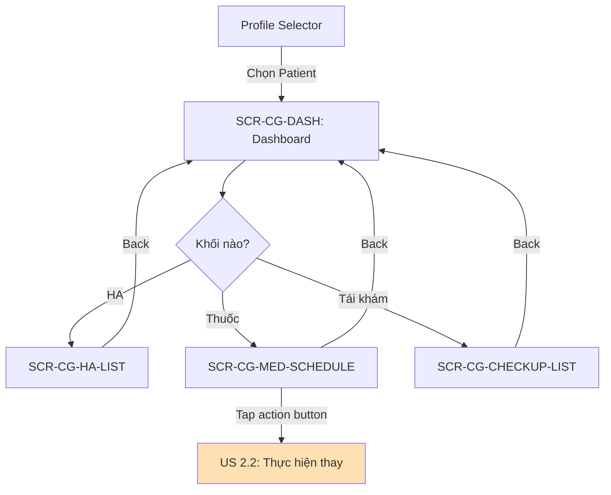
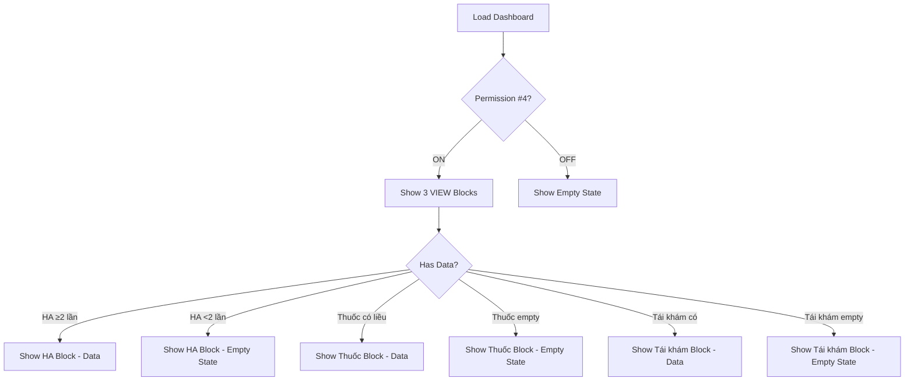

# SRS: US 1.2 - Xem Kết Quả Tuân Thủ (Caregiver Compliance View)

> **Version:** v2.5  
> **Date:** 2026-02-04  
> **Author:** BA Team  
> **Status:** Ready for Dev Review  
> **Parent SRS:** [KOLIA-1517_srs.md](./srs.md)

---

## 1. Giới thiệu

### 1.1 Mục đích

Tài liệu SRS này mô tả các yêu cầu chức năng và phi chức năng cho User Story **US 1.2 - Xem Kết Quả Tuân Thủ** - cho phép Caregiver xem kết quả thực hiện nhiệm vụ tuân thủ của Patient (Uống thuốc, Đo huyết áp, Tái khám).

### 1.2 Phạm vi (In/Out)

**TRONG SCOPE:**
- ✅ Dashboard với **3 khối VIEW** (reuse từ Bản tin 24H)
- ✅ Xem kết quả đo huyết áp hôm nay (reuse BR-010)
- ✅ Xem kết quả tuân thủ uống thuốc (reuse BR-011)
- ✅ Xem kết quả tái khám (reuse BR-012)
- ✅ Drill-down navigation đến màn hình chi tiết
- ✅ Context Header hiển thị thông tin Patient

**NGOÀI SCOPE:**
- ❌ Thiết lập nhiệm vụ (→ US 2.1)
- ❌ Thực hiện nhiệm vụ thay Patient (→ US 2.2)
- ❌ Xem xu hướng huyết áp dài hạn (→ US 1.1 đã có)

### 1.3 Thuật ngữ (Glossary)

| Thuật ngữ | Định nghĩa |
|-----------|------------|
| **Dashboard** | Màn hình chính hiển thị sau khi chọn Patient từ Profile Selector |
| **Compliance Block** | Khối hiển thị kết quả tuân thủ (Thuốc/HA/Tái khám) |
| **Context Header** | Banner hiển thị tên Patient ở các màn hình drill-down (list/detail). Không hiển thị ở Dashboard vì đã có Profile Selector |
| **VIEW Mode** | Chế độ xem kết quả (read-only cho Caregiver) |
| **Permission #4** | Quyền "Theo dõi kết quả tuân thủ" (Default: ON) |
| **{Mối quan hệ}** | Giá trị relationship hiển thị (VD: "Mẹ", "Bố"). Nếu relationship = "Khác" → fallback hiển thị `{Tên}` (BR-CG-014) |

> [!NOTE]
> **Why Permission #4?** US 1.2 sử dụng Permission #4 (không phải #1) vì:
> - Permission #1 = Xu hướng dài hạn + Báo cáo định kỳ
> - Permission #4 = Kết quả tuân thủ hàng ngày (chi tiết cụ thể)
> - Cho phép Patient kiểm soát granular hơn

### 1.4 Dependencies & Assumptions

| Dependency | Status | Ghi chú |
|------------|:------:|---------|
| SRS Bản tin 24H | ✅ Available | Reuse BR-010, BR-011, BR-012 |
| SRS Nhiệm vụ Uống thuốc | ✅ Available | Logic hiển thị liều dùng |
| SRS Nhiệm vụ Đo huyết áp | ✅ Available | Logic hiển thị kết quả đo |
| SRS Tái khám | ✅ Available | Logic lịch khám |
| Parent SRS (srs.md) | ✅ v2.0 | Dashboard structure |

**Assumptions:**
1. Permission #4 tại Patient đã cấp cho Caregiver (Default: ON)
2. Patient đã có ít nhất 1 loại nhiệm vụ được thiết lập
3. Dashboard Context Header đã được implement từ US 1.1

---

## 2. Yêu cầu chức năng (Gherkin BDD)

### 2.1 Dashboard 3 Khối VIEW

**User Story:** Là một **Caregiver**, tôi muốn **xem kết quả tuân thủ của Patient trên Dashboard**, để **nắm bắt nhanh tình trạng thực hiện nhiệm vụ của họ**.

> **📝 Architecture Decision (Approved):**
> Dashboard SRS US 1.2 chỉ bao gồm **3 khối VIEW** (reuse từ Bản tin 24H).
> Khối SETUP sẽ được định nghĩa trong **SRS US 2.1**.

#### Kịch bản 2.1.1: Hiển thị Dashboard với 3 khối VIEW (Happy Path)

```gherkin
Given Caregiver đã chọn Patient từ Profile Selector
  And Permission #4 = ON
  And Patient có ít nhất 1 loại nhiệm vụ được thiết lập
When Dashboard load xong
Then Hệ thống hiển thị 3 khối VIEW theo thứ tự:
  | # | Khối | Icon | Ref |
  | 1 | 🩺 Huyết áp hôm nay | ❤️ | BR-010 |
  | 2 | 💊 Kết quả tuân thủ thuốc | 💊 | BR-011 |
  | 3 | 🏥 Tái khám | 🏥 | BR-012 |
  Ref: BR-CG-001
```

#### Kịch bản 2.1.2: Permission #4 OFF - Hiển thị Inline Permission Denied

```gherkin
Given Caregiver đang ở Dashboard
  And Permission #4 "Theo dõi kết quả tuân thủ" = OFF
When Dashboard load xong
Then 3 khối VIEW hiển thị trạng thái "Permission Denied":
  | Khối | Hiển thị |
  | Huyết áp hôm nay | Permission Denied Overlay |
  | Kết quả tuân thủ thuốc | Permission Denied Overlay |
  | Tái khám | Permission Denied Overlay |
  Ref: BR-CG-003, BR-CG-018, SEC-CG-001
```

> **📋 Permission Denied Overlay (BR-CG-018):**
> | Layer | Chi tiết |
> |-------|----------|
> | Title | Giữ nguyên hiển thị (ví dụ: "🩺 Huyết áp hôm nay") - **KHÔNG blur** |
> | Background | Empty state placeholder (dạng không có dữ liệu) bị **blur** |
> | Overlay | Centered vertically trong khối, chồng lên phần blur |
> | Icon | 🔒 (32px) |
> | Message Line 1 | "{Mối quan hệ} đã tắt quyền {tên quyền}" |
> | Message Line 2 | "Liên hệ {Mối quan hệ} để bật lại quyền này" |
>
> **Messages theo Permission:**
> | Permission | Tên quyền |
> |:----------:|-----------|
> | #1 OFF | xem tổng quan sức khỏe |
> | #2 OFF | nhận cảnh báo |
> | #3 OFF | thiết lập nhiệm vụ |
> | #4 OFF | theo dõi tuân thủ |

#### Kịch bản 2.1.3: Edge Case - Permission thay đổi trong khi đang xem

```gherkin
Given Caregiver đang xem Dashboard
  And Permission #4 = ON, 3 khối VIEW đang hiển thị bình thường
When Patient revoke Permission #4 (OFF) trong khi Caregiver đang xem
Then Dashboard nhận realtime update (WebSocket/Push)
  And 3 khối VIEW chuyển sang trạng thái Permission Denied Overlay
  And Animation: fade-in blur + overlay trong 300ms
  Ref: BR-CG-003, BR-CG-018, SEC-CG-001
```

#### Kịch bản 2.1.4: Edge Case - Patient hủy liên kết trong khi đang xem

```gherkin
Given Caregiver đang xem Dashboard của Patient A
When Patient A thực hiện "Hủy theo dõi" với Caregiver
Then Dashboard nhận realtime update
  And Navigate về Profile Selector
  And Patient A bị xóa khỏi danh sách Patients
  And Hiển thị toast: "{Mối quan hệ} đã hủy liên kết với bạn"
  Ref: Parent SRS Section B.4.3
```

#### Kịch bản 2.1.5: Error Case - Network error khi load Dashboard

```gherkin
Given Caregiver đã chọn Patient từ Profile Selector
When Dashboard load nhưng gặp network error
Then Hiển thị Error State:
  | Icon | Wifi off icon |
  | Title | "Không thể tải dữ liệu" |
  | Subtitle | "Kiểm tra kết nối mạng và thử lại" |
  | CTA | [Thử lại] → Reload Dashboard |
  Ref: Global Error Handling Pattern
```

---

### 2.2 Khối Huyết áp hôm nay (VIEW)

**User Story:** Là một **Caregiver**, tôi muốn **xem kết quả đo huyết áp hôm nay của Patient**, để **theo dõi tình trạng sức khỏe tim mạch**.

> **📝 Reuse Logic (Ref: SRS Bản tin 24H - BR-010):**
> Tính toán chỉ số HA theo nhóm bệnh lý (A/B/C) và gán nhãn trạng thái.
> 
> ⚠️ **Override:** Nội dung gốc chứa `{Danh xưng}` → OVERRIDE thành `{Mối quan hệ}` theo BR-CG-014

#### Kịch bản 2.2.1: Hiển thị khối Huyết áp hôm nay (Happy Path)

```gherkin
Given Caregiver đang ở Dashboard
  And Patient có ít nhất 2 lần đo HA hôm nay
  And Permission #4 = ON
When Dashboard load xong
Then Khối "🩺 Huyết áp hôm nay" hiển thị:
  | Element | Chi tiết |
  | Icon | ❤️ (màu xanh/cam/đỏ theo trạng thái) |
  | Title | "Huyết áp hôm nay" |
  | Status Tag | Nhãn trạng thái theo BR-010 (VD: "Kiểm soát tốt") |
  | Insight | Nội dung nhận xét theo BR-010 |
  | Textlink | "Xem lịch sử →" |
  Ref: BR-010, BR-CG-004
  Note: Nội dung reuse từ BR-010 chứa {Danh xưng} → OVERRIDE thành {Mối quan hệ} theo BR-CG-014
```

#### Kịch bản 2.2.2: Tap khối Huyết áp → Navigate chi tiết

```gherkin
Given Caregiver đang ở Dashboard
  And Khối "Huyết áp hôm nay" đang hiển thị
When Caregiver tap vào khối HOẶC tap textlink "Xem lịch sử →"
Then Navigate đến SCR-CG-HA-LIST: Danh sách kết quả đo HA
  And Context Header: "[Avatar] {Mối quan hệ} ({Tên Patient})"
  And Hiển thị list kết quả đo HA (mới nhất trước, bao gồm lịch sử các ngày trước)
  Ref: BR-CG-005
```

#### Kịch bản 2.2.3: Edge Case - Chưa đủ dữ liệu phân tích HA (<2 lần đo)

```gherkin
Given Caregiver đang ở Dashboard
  And Patient có ít hơn 2 lần đo HA hôm nay (0 hoặc 1 lần)
  And Permission #4 = ON
When Dashboard load xong
Then Khối "Huyết áp hôm nay" hiển thị Insufficient Data State:
  | Element | Chi tiết |
  | Icon | ❤️ (màu xám) |
  | Status Tag | "--" |
  | Message | "Cần tối thiểu 2 lần đo để phân tích huyết áp của {Mối quan hệ}. Nhờ {Mối quan hệ} đo thêm nhé." |
  | Textlink | "Xem lịch sử →" (LUÔN hiển thị để xem kết quả quá khứ) |
  And Tap khối HOẶC tap textlink → Navigate SCR-CG-HA-LIST (màn lịch sử đo HA)
  Ref: BR-010, BR-CG-006, BR-CG-015
```

#### Kịch bản 2.2.4: Tap kết quả trong list HA → Xem chi tiết 1 lần đo

```gherkin
Given Caregiver đang ở SCR-CG-HA-LIST (Danh sách kết quả đo HA)
When Caregiver tap vào 1 kết quả đo cụ thể
Then Navigate đến màn chi tiết kết quả đo (Reuse từ SRS Đo HA)
  And Context Header: "[Avatar] {Mối quan hệ} ({Tên Patient})" (GIỮ NGUYÊN từ list)
  And Nội dung màn detail: {Danh xưng} → OVERRIDE thành {Mối quan hệ}
  Ref: BR-CG-014, BR-CG-015, SRS Đo HA
```

---

### 2.3 Khối Kết quả Tuân thủ Thuốc (VIEW)

**User Story:** Là một **Caregiver**, tôi muốn **xem kết quả tuân thủ uống thuốc của Patient**, để **đảm bảo họ uống thuốc đúng cách**.

> **📝 Reuse Logic (Ref: SRS Bản tin 24H - BR-011):**
> Đơn vị tính: Liều dùng. 4 trạng thái: Đã uống, Quên uống, Sai liều, Chưa phản hồi.
>
> ⚠️ **Override:** Nội dung gốc chứa `{Danh xưng}` → OVERRIDE thành `{Mối quan hệ}` theo BR-CG-014

#### Kịch bản 2.3.1: Hiển thị khối Tuân thủ thuốc (Happy Path)

```gherkin
Given Caregiver đang ở Dashboard
  And Patient có ít nhất 1 liều thuốc cần uống hôm nay (Tổng liều > 0)
  And Permission #4 = ON
When Dashboard load xong
Then Khối "💊 Kết quả tuân thủ thuốc" hiển thị:
  | Element | Chi tiết |
  | Icon | 💊 |
  | Title | "Kết quả tuân thủ thuốc" |
  | Content | Reuse từ BR-011 (Bản tin 24H) |
  | Textlink | "Xem lịch sử →" |
  Ref: BR-011, BR-CG-007
  Note: Content reuse từ BR-011 chứa {Danh xưng} → OVERRIDE thành {Mối quan hệ} theo BR-CG-014
```

#### Kịch bản 2.3.2: Tap khối Thuốc → Navigate Lịch uống thuốc

```gherkin
Given Caregiver đang ở Dashboard
  And Khối "Kết quả tuân thủ thuốc" đang hiển thị
When Caregiver tap vào khối HOẶC tap textlink "Xem lịch sử →"
Then Navigate đến SCR-CG-MED-SCHEDULE: Lịch uống thuốc
  And Context Header: "[Avatar] {Mối quan hệ} ({Tên Patient})"
  And Reuse UI từ SRS Nhiệm vụ Uống thuốc (bao gồm lịch sử các ngày trước)
  Ref: BR-CG-008, SRS Nhiệm vụ Uống thuốc
  Note: UI reuse chứa {Danh xưng} → OVERRIDE thành {Mối quan hệ} theo BR-CG-014
  Note: Action buttons cho US 2.2 (thực hiện thay) sẽ được thêm khi implement US 2.2
```

#### Kịch bản 2.3.3: Edge Case - Không có liều thuốc hôm nay

```gherkin
Given Patient KHÔNG có thuốc nào trong tủ thuốc
When Dashboard load xong
Then Khối "💊 Kết quả tuân thủ thuốc" hiển thị Empty State:
  | Element | Chi tiết |
  | Icon | 💊 (màu xám) |
  | Title | "Tuân thủ thuốc" |
  | Message | "Chưa có thuốc trong tủ thuốc. Thêm thuốc tại khối Thiết lập bên dưới." |
  Ref: BR-011, BR-CG-009
```

---

### 2.4 Khối Tái khám (VIEW)

**User Story:** Là một **Caregiver**, tôi muốn **xem lịch và kết quả tái khám của Patient**, để **theo dõi quá trình điều trị**.

> **📝 Reuse Logic (Ref: SRS Bản tin 24H - BR-012):**
> Hiển thị khi có hành động "Cập nhật kết quả tái khám" theo BR-004.
>
> ⚠️ **Override:** Nội dung gốc chứa `{Danh xưng}` → OVERRIDE thành `{Mối quan hệ}` theo BR-CG-014

#### Kịch bản 2.4.1: Hiển thị khối Tái khám (Happy Path)

```gherkin
Given Caregiver đang ở Dashboard
  And Patient có lịch khám hiển thị theo BR-CG-016, BR-CG-017
  And Permission #4 = ON
When Dashboard load xong
Then Khối "🏥 Tái khám" hiển thị:
  | Element | Chi tiết |
  | Icon | 🏥 |
  | Title | "Lịch tái khám" |
  | Upcoming | "Ngày {dd/MM}: {Khoa khám} - {Tên bệnh viện}" |
  | Status | Theo bảng BR-CG-016 |
  | Textlink | "Xem kết quả →" |
  Ref: BR-012, BR-CG-010, BR-CG-016, BR-CG-017, BR-CG-019
```

> **📋 Status Display Rules (BR-CG-016):**
> | Status | Điều kiện | Dựa trên | Hiển thị | Action Textlink |
> |--------|-----------|----------|----------|-----------------|
> | 🟢 **Sắp tới** | `Ngày hẹn > Hôm nay` VÀ `Chưa báo cáo` | Ngày hẹn | ✅ | "Xem chi tiết →" |
> | 🟠 **Cần cập nhật** | `Ngày hẹn ≤ Hôm nay ≤ Ngày hẹn + 5` VÀ `Chưa báo cáo` | Ngày hẹn | ✅ | "Báo cáo →" |
> | ⚫ **Đã qua** | `Đã báo cáo` VÀ `Hôm nay ≤ Ngày khám + 5` | Ngày khám | ✅ | "Xem kết quả →" |
> | 🔴 **Bỏ lỡ** | `Hôm nay > Ngày hẹn + 5` VÀ `Chưa báo cáo` | Ngày hẹn | ❌ ẨN | - |
> | ⏹️ **Hết hạn** | `Hôm nay > Ngày khám + 5` VÀ `Đã báo cáo` | Ngày khám | ❌ ẨN | - |
>
> **Ghi chú:**
> - **Ngày hẹn:** Ngày dự kiến đi khám (user nhập khi tạo lịch)
> - **Ngày khám:** Ngày thực tế khám (OCR từ kết quả, fallback = ngày báo cáo). Ref: SRS Tái khám BR-012
> - **Action Textlink:** Hiển thị bên phải status badge, cho phép user thực hiện hành động phù hợp với trạng thái

#### Kịch bản 2.4.2: Tap khối Tái khám → Navigate Lịch khám

```gherkin
Given Caregiver đang ở Dashboard
  And Khối "Tái khám" đang hiển thị
When Caregiver tap vào khối HOẶC tap textlink "Xem kết quả →"
Then Navigate đến SCR-CG-CHECKUP-LIST: Lịch khám sức khỏe
  And Context Header: "[Avatar] {Mối quan hệ} ({Tên Patient})"
  And Default tab: "Sắp tới" hoặc "Đã qua" (tùy context, bao gồm lịch sử)
  And Reuse UI từ SRS Tái khám (US-007)
  Ref: BR-CG-011, SRS Tái khám
  Note: UI reuse chứa {Danh xưng} → OVERRIDE thành {Mối quan hệ} theo BR-CG-014
```

#### Kịch bản 2.4.3: Tap lịch khám trong list → Xem chi tiết 1 lần khám

```gherkin
Given Caregiver đang ở SCR-CG-CHECKUP-LIST (Lịch khám sức khỏe)
When Caregiver tap vào 1 lịch khám cụ thể
Then Navigate đến màn chi tiết lịch khám (Reuse từ SRS Tái khám)
  And Context Header: "[Avatar] {Mối quan hệ} ({Tên Patient})" (GIỮ NGUYÊN từ list)
  And Nội dung màn detail: {Danh xưng} → OVERRIDE thành {Mối quan hệ}
  Ref: BR-CG-014, BR-CG-015, SRS Tái khám
```

#### Kịch bản 2.4.4: Edge Case - Không có lịch khám

```gherkin
Given Patient KHÔNG có lịch khám nào
When Dashboard load xong
Then Khối "🏥 Tái khám" hiển thị Empty State:
  | Element | Chi tiết |
  | Icon | 🏥 (màu xám) |
  | Title | "Tái khám" |
  | Message | "Chưa có lịch khám. Thêm lịch tại khối Thiết lập bên dưới." |
  Ref: BR-012, BR-CG-012
```

---

## 3. Business Rules

| BR-ID | Category | Mô tả Rule | Priority |
|-------|----------|------------|:--------:|
| **BR-CG-001** | Display | Dashboard hiển thị **3 khối VIEW** theo thứ tự cố định: HA → Thuốc → Tái khám | P0 |
| **BR-CG-002** | Display | Context Header PHẢI hiển thị ở màn hình drill-down (list/detail), KHÔNG ở Dashboard (đã có Profile Selector) | P0 |
| **BR-CG-003** | Authorization | Permission #4 = OFF → 3 khối VIEW hiển thị inline Permission Denied Overlay (không ẩn) | P0 |
| **BR-CG-004** | Reuse | Khối HA reuse logic tính toán từ BR-010 (Bản tin 24H) | P0 |
| **BR-CG-005** | Navigation | Tap khối HA → Navigate SCR-CG-HA-LIST với Context Header | P1 |
| **BR-CG-006** | Empty State | Chưa đủ dữ liệu HA (<2 lần đo) → Hiển thị khối với "--", guiding message + textlink "Xem lịch sử" | P1 |
| **BR-CG-007** | Reuse | Khối Thuốc reuse logic hiển thị từ BR-011 (Liều dùng: đã uống/quên/sai liều) | P0 |
| **BR-CG-008** | Navigation | Tap khối Thuốc → Navigate SCR-CG-MED-SCHEDULE với Context Header | P1 |
| **BR-CG-009** | Empty State | Không có thuốc → Hiển thị Empty State với guiding message | P1 |
| **BR-CG-010** | Reuse | Khối Tái khám reuse logic từ BR-012 | P0 |
| **BR-CG-011** | Navigation | Tap khối Tái khám → Navigate SCR-CG-CHECKUP-LIST | P1 |
| **BR-CG-012** | Empty State | Không có lịch khám → Hiển thị Empty State với guiding message | P1 |
| **BR-CG-013** | Audit | Mọi navigation trong Caregiver mode PHẢI log `{viewer: caregiver_id}` | P2 |
| **BR-CG-014** | Display | **Display Logic:** Hiển thị `{Mối quan hệ}` trong messages. Nếu relationship = "Khác" → fallback hiển thị `{Tên người bệnh}`. Ref: Parent SRS BR-029 | P0 |
| **BR-CG-015** | Display | **Context Header Persistence:** Context Header PHẢI hiển thị ở MỌI màn hình drill-down (list và detail) trong Caregiver flow | P0 |
| **BR-CG-016** | Display | **Checkup Status Logic:** Status hiển thị theo bảng: (1) 🟢Sắp tới: Ngày hẹn > Hôm nay + Chưa báo cáo; (2) 🟠Cần cập nhật: Ngày hẹn ≤ Hôm nay ≤ Ngày hẹn+5 + Chưa báo cáo; (3) ⚫Đã qua: Đã báo cáo + Trong 5 ngày từ Ngày khám. Ref: SRS Tái khám BR-012 | P0 |
| **BR-CG-017** | Display | **Checkup Retention:** (1) Bỏ lỡ: Hôm nay > Ngày hẹn+5 + Chưa báo cáo → ẨN; (2) Hết hạn: Hôm nay > Ngày khám+5 + Đã báo cáo → ẨN. Lịch khám chỉ hiển thị trong 5 ngày kể từ ngày khám/ngày hẹn | P0 |
| **BR-CG-018** | Display | **Permission Denied Overlay:** Khi Permission OFF → Khối hiển thị blur background + overlay có: 🔒 Icon, Message "{Tên Patient} đã tắt quyền {tên quyền}", Guidance "Liên hệ {Mối quan hệ} để bật lại quyền này" | P0 |
| **BR-CG-019** | Display | **Checkup Card Actions:** Mỗi thẻ lịch khám hiển thị action textlink thay vì status badge (theo UI gốc): (1) Tab "Lịch sắp tới": thẻ chỉ có thông tin lịch + chevron, KHÔNG có status badge, button "Báo cáo kết quả" ẨN trong CG VIEW; (2) Tab "Lịch đã qua": thẻ có "Xem kết quả" textlink (ref US-007). **Note:** UI gốc không có status badges trên cards, chỉ có action buttons/textlinks | P1 |
| **BR-CG-020** | Display | **CG VIEW Header Icons:** Các màn hình drill-down (SCR-CG-HA-LIST, SCR-CG-MED-SCHEDULE, SCR-CG-CHECKUP-LIST) KHÔNG hiển thị icons trong header (📅, 📊, +). Chỉ có: ← Back arrow + Title. Lý do: Các icons này liên kết đến actions ngoài scope của CG VIEW mode | P1 |

---

## 4. Validation Rules

> **📝 Reuse từ SRS gốc:**
> Validation rules cho các giá trị sức khỏe được reuse từ SRS dependencies. Không define lại.

| Field | Source SRS | Rule |
|-------|------------|------|
| Tâm thu | SRS Đo HA | 40 ≤ x ≤ 300 mmHg |
| Tâm trương | SRS Đo HA | 20 ≤ x ≤ 200 mmHg |
| Số liều | SRS Uống thuốc | Integer ≥ 0 |

---

## 5. Yêu cầu phi chức năng (NFR)

### 5.1 Performance

| Metric | Requirement |
|--------|-------------|
| Dashboard Load | < 1 giây (có cache) |
| Block Data | < 2 giây mỗi khối |
| Navigation | < 0.5 giây |

### 5.2 Security

| SEC-ID | Mô tả | Priority |
|--------|-------|:--------:|
| SEC-CG-001 | API Authorization: Endpoint `/patients/{id}/compliance` PHẢI check Permission #4 ở server | P0 |
| SEC-CG-002 | API Authorization: Endpoint `/patients/{id}/setup` PHẢI check Permission #3 ở server | P0 |
| SEC-CG-003 | Context Isolation: Không leak data giữa các Patients | P0 |

---

## 5. UI Specifications

### 5.1 Screen Inventory

| Screen ID | Screen Name | Entry Points | Exit Points |
|-----------|-------------|--------------|-------------|
| SCR-CG-DASH | Dashboard Tuân thủ | Chọn Patient từ Profile Selector | Tap any block |
| SCR-CG-HA-LIST | Danh sách kết quả đo HA | Tap khối HA / textlink | Tap item, Back |
| SCR-CG-HA-DETAIL | Phân tích kết quả | Tap item trong list | Back (Reuse SRS Đo HA) |
| SCR-CG-MED-SCHEDULE | Lịch uống thuốc | Tap khối Thuốc / textlink | Back |
| SCR-CG-CHECKUP-LIST | Lịch khám sức khỏe | Tap khối Tái khám / textlink | Tap item, Back |
| SCR-CG-CHECKUP-DETAIL | Chi tiết lịch khám | Tap item trong list | Back (Reuse SRS Tái khám) |

> **Note:** Tất cả màn hình drill-down PHẢI giữ Context Header và override {Danh xưng} → {Mối quan hệ} (BR-CG-014, BR-CG-015)

### 5.2 Dashboard Layout (SCR-CG-DASH)

```
┌─────────────────────────────────────┐
│ 👵 {Mối quan hệ} ▼                    │ ← Profile Switcher (selected)
├─────────────────────────────────────┤
│ ❤️ HUYẾT ÁP HÔM NAY                │ ← VIEW Block 1 (BR-010)
│ ┌─────────────────────────────────┐ │
│ │ [Tag: Kiểm soát tốt]            │ │ ← Status Tag theo nhóm A/B/C
│ │ Huyết áp của Mẹ hôm nay đang... │ │ ← Insight AI theo BR-010
│ │ [Xem lịch sử →]                │ │ ← Textlink
├─────────────────────────────────────┤
│ 💊 KẾT QUẢ TUÂN THỦ THUỐC        │ ← VIEW Block 2 (BR-011)
│ ┌─────────────────────────────────┐ │
│ │ Tổng số: 11 liều dùng           │ │
│ │ ● Đã uống: 5                   │ │ ← 4 trạng thái theo BR-011
│ │ ● Quên uống: 2                 │ │
│ │ ● Sai liều: 1                  │ │
│ │ ● Chưa phản hồi: 3             │ │
│ │ [Xem lịch sử →]                │ │ ← Textlink
├─────────────────────────────────────┤
│ 🏥 KẾT QUẢ TÁI KHÁM              │ ← VIEW Block 3 (BR-012)
│ ┌─────────────────────────────────┐ │
│ │ Khoa Tim mạch                   │ │ ← Khoa khám bệnh
│ │ 📅 15/02/2026                    │ │ ← Ngày tái khám
│ │ 📍 BV Bạch Mai                   │ │ ← Địa chỉ tái khám
│ │ [Xem lịch sử →]                │ │ ← Textlink
└─────────────────────────────────────┘
```

> **Note:** Khối SETUP "⚙️ Thiết lập nhiệm vụ" sẽ được định nghĩa trong **SRS US 2.1**

### 5.3 Block Card Component

| Element | Spec |
|---------|------|
| Container | Card với border-radius 12px, shadow nhẹ |
| Icon | 24x24px, aligned left |
| Title | Font 16px, Bold |
| Arrow | Chevron right icon, 20x20px |
| Tap target | Toàn bộ card (min 48px height) |
| Spacing | 16px padding nội bộ, 12px gap giữa cards |

### 5.4 Context Header Component (Drill-down screens only)

| Element | Spec |
|---------|------|
| Container | Full-width, background màu nhẹ |
| Text | "Kết quả đo HA của {Mối quan hệ}" / "Lịch khám của {Mối quan hệ}" |
| Font | 14px, Regular, màu text-secondary |
| Position | Fixed ở top của màn hình drill-down |

> **Note:** Context Header chỉ hiển thị ở màn hình drill-down (list/detail). Dashboard không có Context Header vì đã có Profile Selector.

---

## 7. Flow Diagrams

### 7.1 Navigation Flowchart



### 7.2 Permission Check Flowchart



---

## Appendix

### A.1 Revision History

| Version | Date | Author | Changes |
|---------|------|--------|---------|
| v1.0 | 2026-02-03 | BA Team | Initial SRS từ Implementation Plan v1.3 |
| v1.1 | 2026-02-03 | BA Team | QA Review: Clarify Permission #4, add Validation Rules section, fix edge case notes |
| v1.2 | 2026-02-04 | BA Team | **Scope Fix:** (1) Remove SETUP block - tách sang US 2.1, (2) Remove % tuân thủ logic, (3) Dashboard giờ chỉ còn 3 khối VIEW |
| v1.3 | 2026-02-04 | BA Team | **Consistency Fix:** Cleanup Section 1 (Scope, Glossary, Dependencies) để align với 3-block architecture |
| v1.4 | 2026-02-04 | BA Team | **Adversarial Review:** (1) Fix section/scenario numbering, (2) Remove SETUP refs, (3) Add 3 edge cases (realtime permission, unfollow, network error) |
| v1.5 | 2026-02-04 | BA Team | **Display Logic:** (1) {Danh xưng}→{Mối quan hệ} + fallback {Tên} nếu "Khác", (2) Add BR-CG-016, (3) 2.2.3: gộp message + textlink, (4) Add Override notes cho reused content từ BR-010/011/012 |
| v1.6 | 2026-02-04 | BA Team | **Block Visibility:** (1) Remove 2.2.4 (ẨN HA), (2) Empty State thay ẨN cho Thuốc/Tái khám, (3) Textlink "Xem lịch sử" ở mỗi block, (4) Add BR-CG-016 Context Header Persistence |
| v1.7 | 2026-02-04 | BA Team | **Final QA:** Fix 8 BR reference mismatches, update Mermaid flowchart 7.2 (Hide → Empty State) |
| v1.8 | 2026-02-04 | BA Team | **Empty State UX:** Bỏ textlink “Thêm thuốc/lịch khám”, thay bằng guiding message (vì SETUP block đã ở cùng Dashboard) |
| v1.9 | 2026-02-04 | BA Team | **Textlink Consistency:** (1) Đổi "Xem chi tiết"→"Xem lịch sử" ở 2.2.3, (2) Clarify tap behavior: khối HOẶC textlink → navigate lịch sử |
| v2.0 | 2026-02-04 | BA Team | **Detail Drill-down:** (1) Add 2.2.4 HA detail, 2.4.3 Tái khám detail, (2) Enforce Context Header + {Mối quan hệ} override ở màn detail, (3) Update Screen Inventory |
| v2.1 | 2026-02-04 | BA Team | **Scope Cleanup:** Remove Section 2.5 (Dashboard Empty State) - 3 khối đã có Empty State riêng, TH không có nhiệm vụ nào sẽ ở US 2.1 (SETUP block) |
| v2.2 | 2026-02-04 | BA Team | **UX Simplify:** Bỏ Context Header ở Dashboard (Profile Selector đã đủ), giữ Context Header chỉ ở màn hình drill-down (list/detail) |

### A.2 Cross-Reference

| Reference | Usage |
|-----------|-------|
| [SRS Bản tin 24H](../../00_context/SRS%20existing%20features/[Kolia]_SRS_MVP_v1.0_Bản%20tin%20nhịp%20đập%2024H.md) | BR-010, BR-011, BR-012 |
| [SRS Nhiệm vụ Uống thuốc](../../00_context/SRS%20existing%20features/[Kolia]_SRS_MVP0.3_Nhiệm_vụ_uống_thuốc.md) | UI reuse cho SCR-CG-MED-SCHEDULE |
| [SRS Nhiệm vụ Đo HA](../../00_context/SRS%20existing%20features/[Kolia]_SRS_V1.0_Nhiệm_vụ_đo_huyết_áp.md) | UI reuse cho SCR-CG-HA-LIST |
| [SRS Tái khám](../../00_context/SRS%20existing%20features/[Kolia]_SRS_MVP0.3_Tái_Khám.md) | UI reuse cho SCR-CG-CHECKUP-LIST |
| [Implementation Plan](file:///c:/Users/admin/.gemini/antigravity/brain/a8de77c8-efe6-4f5f-813e-4557f5e7974b/implementation_plan.md) | Design Decisions |

### A.3 Open Questions

- [ ] Không có câu hỏi mở

---

> **Approved By:** _Pending Review_  
> **Dev Lead Sign-off:** _Pending_
