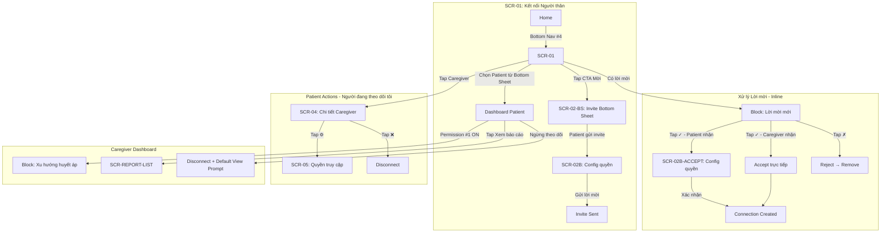
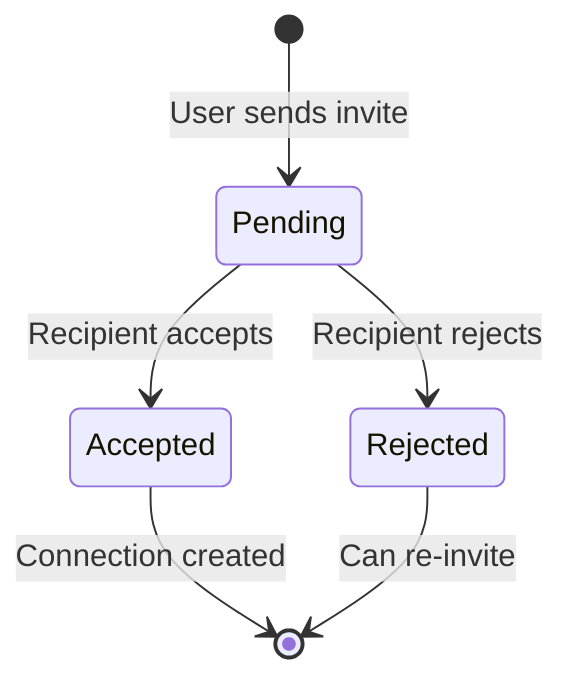
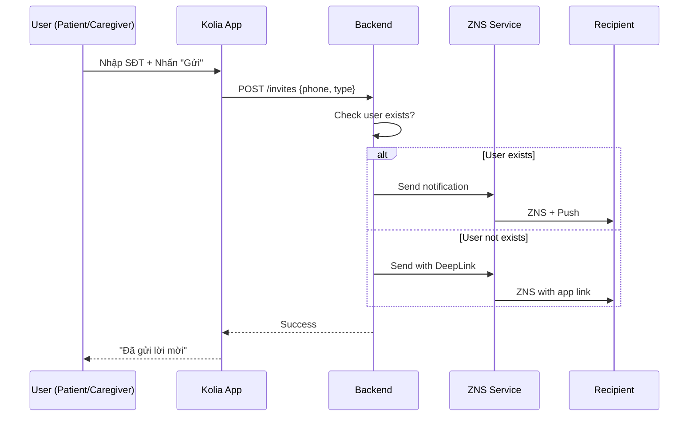

# SRS: KOLIA-1517 - Kết nối Người thân (Connection Flow)

> **Version:** v4.0  
> **Date:** 2026-02-12  
> **Author:** BA Team  
> **Status:** Ready for Dev Review

---

## 1. Giới thiệu

### 1.1 Mục đích

Tài liệu SRS này mô tả các yêu cầu chức năng và phi chức năng cho tính năng **Kết nối Người thân** trong ứng dụng Kolia - cho phép Người bệnh (Patient) và Người thân (Caregiver) kết nối với nhau để giám sát sức khỏe từ xa.

**Cấu trúc SRS:** Được tổ chức theo **3 phần**:
- **PHẦN A:** Role Người bệnh (Patient)
- **PHẦN B:** Role Người thân (Caregiver)
- **PHẦN C:** Yêu cầu chung (Shared)

### 1.2 Phạm vi (In/Out)

**TRONG SCOPE:**
- ✅ Gửi lời mời kết nối (**Chỉ Admin** mới có quyền mời thành viên)
- ✅ Nhận/Chấp nhận/Từ chối lời mời
- ✅ Quản lý danh sách người thân đã kết nối
- ✅ Phân quyền chi tiết (6 categories)
- ✅ Tắt quyền theo dõi (Patient tắt tất cả permissions của Caregiver)
- ✅ Quản lý thành viên (Admin: thêm/xoá thành viên trong gói)
- ✅ Xem chi tiết Patient (Caregiver view)

**NGOÀI SCOPE (SRS #2):**
- ❌ Dashboard nâng cao cho Caregiver
- ❌ Thực hiện nhiệm vụ thay Patient
- ❌ Gửi tin nhắn động viên (chỉ define permission)

### 1.3 Thuật ngữ (Glossary)

| Thuật ngữ | Định nghĩa |
|-----------|------------|
| **Patient** | Người bệnh - người cao tuổi sử dụng Kolia để quản lý sức khỏe |
| **Caregiver** | Người thân - con cháu theo dõi sức khỏe Patient từ xa |
| **Quản trị viên (Admin)** | Người kích hoạt gói dịch vụ. Có quyền thêm/xoá thành viên trong gói. Cross-ref: [Payment SRS](../payment/srs-quan-ly-goi-dich-vu.md) §2.8 |
| **Thành viên (Member)** | Người được thêm vào gói bởi Admin. Chỉ có quyền xác nhận/từ chối lời mời, KHÔNG được thêm/xoá thành viên |
| **Connection** | Mối quan hệ đã được thiết lập giữa Patient và Caregiver |
| **Tắt quyền theo dõi** | Hành động Patient tắt TẤT CẢ permissions của Caregiver. Connection vẫn giữ nguyên, có thể mở lại |
| **Invite** | Lời mời kết nối, **KHÔNG CÓ thời hạn**. Chỉ Admin mới có quyền gửi lời mời (BR-041) |
| **Permission** | Quyền truy cập cụ thể mà Patient cấp cho Caregiver |
| **ZNS** | Zalo Notification Service - kênh gửi thông báo chính |
| **Deep Link** | Liên kết `kolia://...` để mở/tải app |
| **Badge** | Icon số trên menu hiển thị pending items |
| **{Danh xưng}** | Cách app xưng hô với user dựa trên tuổi/giới tính: "Bạn" (<20), "Anh/Chị" (20-60), "Bác" (60+). Ref: GR-BIZ-01 |

### 1.4 Dependencies & Assumptions

| Dependency | Status | Ghi chú |
|------------|:------:|---------|
| ZNS (Zalo Notification Service) | 🟡 Cần setup | Kênh chính gửi lời mời |
| Deep Link Infrastructure | 🟡 Cần setup | `kolia://invite?id={xxx}` |
| Push Notification Service | ✅ Available | Đã có từ features khác |
| SMS Gateway | ✅ Available | Fallback khi ZNS fail |

**Assumptions:**
1. User đã hoàn thành onboarding trước khi sử dụng tính năng
2. Mỗi user chỉ đăng nhập 1 thiết bị tại 1 thời điểm
3. **Giới hạn gửi lời mời theo gói:** Số lượng kết nối gửi đi bị giới hạn bởi slot của gói hiện tại. Formula: `slot_trống = tổng_slot - đã_gán - pending`. Nút "+ Mời" **luôn hiển thị**; khi slot_trống = 0, hiện popup thông báo (BR-047, BR-059). Cross-ref: [Payment SRS](../payment/srs-quan-ly-goi-dich-vu.md) BR-016, BR-017. **Nhận lời mời không giới hạn**
4. **1 user có thể vừa là Patient vừa là Caregiver** (xem cả 2 phần A & B)
5. **Admin-only invites:** Chỉ Admin (Quản trị viên) mới có quyền gửi lời mời. Member (Patient/Caregiver) chỉ có quyền xác nhận/từ chối lời mời nhận được (BR-041)
6. **Connection = Slot:** Kết nối thành công = member có Premium access (slot consumed từ gói người gửi)
7. **Admin role từ Payment:** Người kích hoạt gói = Quản trị viên (Admin). Chỉ Admin mới có quyền thêm/xoá thành viên. Người không phải Admin chỉ xác nhận/từ chối lời mời (cross-ref: [Payment SRS](../payment/srs-quan-ly-goi-dich-vu.md) §2.8)
8. **Auto-connect (v4.1):** Khi Admin thêm Caregiver vào nhóm → CG **tự động theo dõi TẤT CẢ Patient** trong nhóm, permissions **ALL ON**. Không cần invite/ accept từng Patient riêng
9. **Patient dual-control (v4.1):** Patient có **2 tầng quyền:** (1) Cho phép/chặn từng CG follow mình ("Tắt quyền theo dõi"), (2) Config chi tiết từng permission cho CG được phép
10. **Exclusive Group (v5.1):** 1 người dùng tại 1 thời điểm chỉ thuộc **1 nhóm gia đình** duy nhất. Admin không thể mời người đã tham gia nhóm khác (BR-057)

---

# US-1: KẾT NỐI TÀI KHOẢN

---

# PHẦN A: ROLE NGƯỜI BỆNH (PATIENT)

> **Mô tả:** Các chức năng dành cho người bệnh - người quản lý ai được theo dõi mình.

---

## A.1 Gửi lời mời kết nối

**User Story:** Là một **Admin (Quản trị viên)**, tôi muốn **mời người thân vào nhóm gia đình**, để **họ có thể theo dõi sức khỏe của Người bệnh trong nhóm**.

> **v4.1:** Chỉ Admin mới có thể gửi lời mời. Entry từ nút 👥 trên header SCR-01 → BS-QLTV → nhấn "+ Mời" tại slot trống.
> **v5.0:** Form invite đơn giản hóa — chỉ SĐT. Bỏ MQH và config quyền. MQH do người nhận chọn khi accept (POP-MQH) hoặc thành viên cũ chọn qua POP-NEW-MEMBER. Permissions ALL ON mặc định.

### Kịch bản A1.1: Gửi lời mời cho người ĐÃ CÓ tài khoản Kolia (Happy Path)
> **v5.0:** Form chỉ cần SĐT. Bỏ trường MQH và bước config quyền.
> **Phân biệt form:** Tùy loại slot Admin nhấn "+ Mời" → hiển thị form variant khác nhau (title, icon, mô tả).

```gherkin
Given Admin đang ở màn hình "Quản lý nhóm" (BS-QLTV)
  And Admin nhấn "+ Mời" tại slot trống (Người thân hoặc Người bệnh)
Then Hệ thống pre-check (theo thứ tự):
  | 1. Gói hiện tại có hết hạn (expired)? |
  | → CÓ: Hiển thị "Gói đã hết hạn. Vui lòng gia hạn để mời thành viên." |
  |   [Gia hạn gói] → PKG-01  |  [Đóng] |
  | 2. Check gói hiện tại có slot trống cho role tương ứng? |
  | → CÓ: Tiếp tục flow |
  | → KHÔNG: Hiển thị "Gói hiện tại không còn chỗ cho {Role}." |
  |   [Xem gói nâng cấp] → PKG-01  |  [Hủy] |
  And Ref: Payment SRS §5.6 (Cross-Feature Dependencies), BR-037
Then Hệ thống mở **Invite Bottom Sheet** (SCR-02-BS) với variant theo loại slot:
  | Slot Type | Title | Icon | Mô tả |
  | Người bệnh | "Mời Người bệnh" | 🩺 | "Mời người bệnh vào nhóm để được theo dõi sức khỏe bởi người thân" |
  | Người thân | "Mời Người thân" | 👥 | "Mời người thân vào nhóm để theo dõi sức khỏe các người bệnh" |
  And Form chỉ có 1 trường:
    | Field | Placeholder | Giải thích |
    | Số điện thoại | "Ví dụ: 0912 345 678" | SĐT người được mời |
When Admin nhập SĐT và nhấn "Gửi lời mời"
  And Server kiểm tra SĐT và thực hiện validation (theo thứ tự):
  | 3. Người nhận đã thuộc nhóm gia đình khác? |
  | → CÓ: Hiển thị "Người này đã tham gia nhóm gia đình khác. Vui lòng kiểm tra lại." |
  |   [Đóng] → quay về SCR-02-BS |
  | → KHÔNG: Tiếp tục |
  | 4. Đã kết nối / đang pending? → BR-007 |
  And Server phát hiện ĐÃ CÓ tài khoản
Then Hệ thống tạo invite record:
  | status = "pending" |
  | type = "add_patient" hoặc "add_caregiver" (theo loại slot) |
  | relationship = null (chưa gán — sẽ gán khi accept via POP-MQH) |
  | permissions = ALL ON (mặc định) |
  And Hệ thống gửi ZNS + Push Notification đến người được mời
  And Admin thấy message "Đã gửi lời mời thành công"
  And Ref: BR-001, BR-002, BR-050 (updated v5.0), BR-055, BR-057
```

### Kịch bản A1.2: Gửi lời mời cho người CHƯA CÓ tài khoản Kolia

> **Lưu ý:** Flow giống A1.1 (chỉ SĐT). Khác ở bước server response.

```gherkin
Given Admin đang ở SCR-02-BS với form invite (chỉ SĐT)
When Admin nhập SĐT và nhấn "Gửi lời mời"
  And Server kiểm tra SĐT và phát hiện CHƯA CÓ tài khoản
Then Hệ thống tạo invite record với status = "pending"
  And relationship = null (chưa gán)
  And Hệ thống gửi ZNS với Deep Link đến SĐT
  And Admin thấy message "Đã gửi lời mời. Người thân cần tải app để kết nối."
  And Ref: BR-001, BR-003, BR-055
```

### Kịch bản A1.3: Admin thêm chính mình vào nhóm (Dual Role)

> **v4.1:** Admin có thể thêm bản thân vào cả slot Người bệnh và Người thân (BR-048, BR-049).
> **Lưu ý:** Chỉ Admin mới có quyền này. Member (Patient/Caregiver) nhập SĐT chính mình → bị chặn (BR-006).

```gherkin
Given Admin đang ở BS-QLTV
When Admin nhấn "+ Mời" tại slot trống và nhập chính SĐT của mình
Then Hệ thống kiểm tra theo loại slot:
  | TRƯỜNG HỢP 1: Thêm vào slot Người bệnh (P-slot) |
  | → Auto-accept: Admin trở thành Người bệnh trong nhóm |
  | → KHÔNG gửi lời mời, kết nối tạo ngay (BR-049) |
  | → Admin KHÔNG nhận thông báo lời mời (tự thêm mình) |
  | TRƯỜNG HỢP 2: Thêm vào slot Người thân (CG-slot) |
  | → Check: Nhóm có ≥1 Người bệnh KHÁC Admin không? |
  |   → CÓ: Auto-accept, Admin trở thành Người thân, tự động theo dõi tất cả Patient |
  |   → KHÔNG: Hiển thị "Cần có ít nhất 1 Người bệnh khác trong nhóm trước khi thêm Người thân" |
  |     [Mời Người bệnh trước] → SCR-02-BS (Patient invite)  |  [Đóng] |
  And Ref: BR-006, BR-048, BR-049
```

### Kịch bản A1.3b: Non-Admin nhập SĐT chính mình (Edge Case)

```gherkin
Given Member (không phải Admin) đang ở màn hình nhận lời mời
When Member cố gắng gửi lời mời cho chính SĐT của mình
Then Hệ thống hiển thị error: "Bạn không thể mời chính mình"
  And Lời mời KHÔNG được gửi
  And Ref: BR-006
```

### Kịch bản A1.4: Gửi lời mời cho người đã kết nối (Edge Case)

```gherkin
Given Patient đã kết nối với Caregiver có SĐT "0912345678"
When Patient cố gắng gửi lời mời đến cùng SĐT
Then Hệ thống hiển thị error: "Bạn đã kết nối với người này"
  And Lời mời KHÔNG được gửi
  And Ref: BR-007
```

### Kịch bản A1.5: Gửi lời mời cho người có pending invite (Edge Case)

```gherkin
Given Patient đã gửi lời mời cho SĐT "0912345678" (status = pending)
When Patient cố gắng gửi lại lời mời đến cùng SĐT
Then Hệ thống hiển thị: "Bạn đã gửi lời mời. Đang chờ phản hồi."
  And Lời mời mới KHÔNG được tạo
  And Ref: BR-007
```

### Kịch bản A1.6: Gửi lời mời cho người đã thuộc nhóm gia đình khác (Edge Case)

> **v5.1:** Mỗi user chỉ thuộc 1 nhóm gia đình tại 1 thời điểm (BR-057).

```gherkin
Given Admin đang ở SCR-02-BS (Invite form)
When Admin nhập SĐT và nhấn "Gửi lời mời"
  And Server kiểm tra người nhận ĐÃ THUỘC nhóm gia đình khác
Then Hiển thị lỗi: "Người này đã tham gia nhóm gia đình khác. Vui lòng kiểm tra lại."
  And KHÔNG tạo invite record, KHÔNG consume slot
  And Button: [Đóng] → quay về SCR-02-BS
  And Ref: BR-057
```

---

## A.2 Nhận lời mời từ Admin

> **v5.3:** Các kịch bản chấp nhận/từ chối đã được gộp chung tại **PHẦN C §2.2** (Shared: Chấp nhận/Từ chối lời mời). Áp dụng cho cả Người bệnh và Người thân.

---

## A.3 Quản lý danh sách "Người thân của tôi"

**User Story:** Là một **Patient**, tôi muốn **xem danh sách người thân đang theo dõi tôi**, để **kiểm soát ai có quyền truy cập**.

### Kịch bản A3.1: Xem danh sách Caregivers

```gherkin
Given Patient đang ở màn hình "Kết nối người thân"
When Patient scroll section "Người đang theo dõi tôi"
Then Hiển thị list Caregivers đã kết nối
  And Mỗi item hiển thị: Avatar, Tên (KHÔNG có nút action)
  And Nếu Caregiver bị tắt quyền theo dõi → hiển thị badge "🚫 Bị tắt quyền theo dõi" (màu đỏ nhạt)
  And Tap vào item → Navigate đến SCR-04 (Chi tiết Caregiver) — có thể mở lại quyền
  And Tại SCR-04 hiển thị các hành động: Cấu hình quyền, Tắt quyền theo dõi (hoặc Mở lại quyền nếu đang bị tắt)
  And Ref: BR-014, BR-040
```

### Kịch bản A3.2: Xem danh sách lời mời đang chờ

```gherkin
Given Patient có lời mời pending (từ Caregiver hoặc gửi đi)
When Patient tap vào Badge số trên menu "Kết nối NT"
Then Điều hướng đến màn hình "Kết nối người thân"
  And Section "Lời mời đang chờ" hiển thị đầu tiên
  And Ref: BR-023
```

### Kịch bản A3.2b: Hiển thị lời mời đã gửi (Sender View - "Người đang theo dõi tôi")

```gherkin
Given Patient đã gửi lời mời cho người khác theo dõi mình (chưa được phản hồi)
When Patient mở Dropdown "Danh sách kết nối"
Then Section "Người đang theo dõi tôi" hiển thị pending item với:
  | Element | Chi tiết |
  | Avatar | Avatar mặc định |
  | Tên | "{Tên người nhận}". Nếu người nhận chưa có TK Kolia → hiển thị SĐT mask (VD: "0912***678") |
  | Badge | "⏳ Chờ phản hồi" (màu cam, style warning-light) |
  | Meta | "Đã gửi lời mời X thời gian trước" |
  | Section count | "(N + M chờ)" ví dụ "(2 + 1 chờ)" |
  | Button ❌ | Hủy lời mời (có confirm popup) |
  | Tap item | → Navigate đến SCR-04B (Chi tiết pending) có button "Hủy lời mời" |
  
  And Ref: BR-028, BR-029

When Patient nhấn ❌ (Hủy lời mời)
Then Hiển thị popup xác nhận:
  | Title: "Hủy lời mời" |
  | Content: "Hủy lời mời đến {Tên}?" |
  | Buttons: [Xác nhận] [Quay lại] |
When Patient nhấn "Xác nhận"
Then Invite record bị xóa
  And Item biến mất khỏi danh sách
```

### Kịch bản A3.3: Empty State - Chưa có kết nối nào

> **v4.1:** Empty state phân biệt theo role Admin/Non-Admin. Profile Selector **ẨN** khi chưa có kết nối.

#### A3.3a: Admin (Quản trị viên) — Chưa mời ai

```gherkin
Given User là Admin (đã kích hoạt gói) nhưng chưa thêm thành viên nào
When User mở màn hình "Kết nối Người thân" (SCR-01)
Then Profile Selector **ẨN** (không hiển thị)
  And Hiển thị empty illustration:
  | Icon: 👨‍👩‍👧 (56px) |
  | Title: "Chưa có thành viên nào trong nhóm" |
  | Subtitle: "Mời người thân vào nhóm để chia sẻ quyền lợi gói {Tên gói}" |
  | CTA primary: "Mời thành viên ngay" → mở BS-QLTV |
  And Header vẫn có nút 👥 (Admin only, BR-043)
  And Ref: BR-015, BR-043, BR-051
```

#### A3.3b: Non-Admin (Free) — Paywall

> **Không hiển thị màn này.** User ở gói miễn phí → **Paywall popup** (xem [Payment SRS](../payment/srs-quan-ly-goi-dich-vu.md)).

---

## A.4 Quyền truy cập Caregiver

**User Story:** Là một **Patient**, tôi muốn **kiểm soát từng quyền của Caregiver**, để **bảo vệ quyền riêng tư**.

### Bảng 6 Permissions

| # | Quyền | Mô tả | UI Block | Default |
|---|-------|-------|----------|:-------:|
| 1 | Xem tổng quan sức khỏe | Chỉ số HA, báo cáo | Block "Xu hướng huyết áp" | ✅ ON |
| 2 | Nhận cảnh báo khẩn cấp | Alert khi HA bất thường, SOS | Block "Cảnh báo" | ✅ ON |
| 3 | Thiết lập nhiệm vụ tuân thủ | Tạo/sửa nhiệm vụ | Block "Thiết lập" | ✅ ON |
| 4 | Theo dõi & thực hiện nhiệm vụ tuân thủ | Xem kết quả & thực hiện thay nhiệm vụ | Block "Kết quả" + "Thực hiện" | ✅ ON |
| 5 | Gửi lời động viên | Gửi tin nhắn | Block "Nhắn tin" | ✅ ON |

### Kịch bản A4.1: Chỉnh sửa permission

```gherkin
Given Patient đang xem màn hình "Quyền truy cập" của Caregiver X

# --- BẬT quyền: không có popup ---
When Patient toggle ON bất kỳ permission nào
Then Permission được cập nhật ngay lập tức (không hiển popup)
  And Caregiver X KHÔNG nhận thông báo (silent permission change, BR-056)
  And Block tương ứng HIỂN trên màn hình Caregiver

# --- TẮT quyền: có popup xác nhận ---
When Patient cố gắng toggle OFF bất kỳ permission nào
Then Hệ thống hiển thị confirmation popup:
  | Title: "Xác nhận thay đổi quyền" |
  | Content: "Bạn có chắc muốn TẮT quyền '{Tên quyền}' cho {Tên Caregiver}?" |
  | Buttons: [Xác nhận] [Hủy] |
When Patient nhấn "Xác nhận"
Then Permission được cập nhật ngay lập tức
  And Caregiver X KHÔNG nhận thông báo (silent permission change, BR-056)
  And Block tương ứng bị ẨN trên màn hình Caregiver
  And Ref: BR-016, BR-017, BR-024, BR-039
```

### Kịch bản A4.2: Warning đặc biệt khi TẮT cảnh báo khẩn cấp

```gherkin
Given Patient đang chỉnh permission cho Caregiver X
When Patient cố gắng toggle OFF "Nhận cảnh báo khẩn cấp"
Then Hệ thống hiển thị warning popup (màu đỏ):
  | Title: "⚠️ Cảnh báo quan trọng" |
  | Content: "Nếu tắt, {Tên} sẽ KHÔNG nhận được thông báo khi bạn gặp nguy hiểm. Điều này có thể ảnh hưởng đến sự an toàn của bạn." |
  | Buttons: [Vẫn tắt] [Giữ nguyên] |
  And Ref: BR-018
```

### Kịch bản A4.3: Không được tắt hết quyền (Minimum 1 ON)

```gherkin
Given Patient đang ở màn hình "Quyền truy cập" của Caregiver X
  And Chỉ còn 1 quyền đang ON (các quyền khác đều OFF)
When Patient tap vào toggle của quyền cuối cùng đang ON
Then Toggle KHÔNG chuyển sang OFF
  And Hiển thị toast: "⚠️ Cần có ít nhất 1 quyền được bật"
  Ref: BR-039
```

---

## A.5 Tắt quyền theo dõi của Caregiver

**User Story:** Là một **Patient**, tôi muốn **tắt quyền theo dõi của Caregiver**, để **họ không còn xem thông tin sức khỏe của tôi nữa, nhưng vẫn giữ kết nối để mở lại sau**.

### Kịch bản A5.1: Patient tắt quyền theo dõi của Caregiver

```gherkin
Given Patient A đang xem chi tiết Caregiver B (SCR-04)
When Patient A nhấn "🚫 Tắt quyền theo dõi"
Then Hiển thị popup xác nhận:
  | Title: "Tắt quyền theo dõi?" |
  | Content: "Đã tắt quyền theo dõi của {Tên B}. Họ sẽ không thể xem thông tin sức khỏe của bạn. Bạn có thể bật lại bất cứ lúc nào." |
  | Buttons: [Quay lại] [Xác nhận] |
When Patient A nhấn "Xác nhận"
Then TẤT CẢ 5 permissions chuyển sang OFF (bypass BR-039)
  And Connection vẫn giữ status = "active", thêm flag: permission_revoked = true

  # === Ảnh hưởng phía Patient A (người tắt) ===
  And Tại tài khoản Patient A:
    | Danh sách "Người đang theo dõi tôi": nick B hiển thị badge "🚫 Bị tắt quyền theo dõi" (đỏ nhạt) |
    | Button "Quyền truy cập" bị ẨN tại SCR-04 (chỉ hiện lại khi mở quyền) |
    | Tap vào item B → vẫn vào SCR-04, hiển thị "✅ Mở lại quyền theo dõi" thay vì "Quyền truy cập" |

  # === Ảnh hưởng phía Caregiver B (người bị tắt) ===
  And Tại tài khoản Caregiver B:
    | Danh sách "Tôi đang theo dõi": Patient A KHÔNG hiển thị |
    | Profile Switcher: Patient A KHÔNG hiển thị |
    | Dashboard Patient A: KHÔNG truy cập được |

  # === Notification ===
  And Caregiver B KHÔNG nhận thông báo về việc bị tắt quyền (silent revoke)
  And Ref: BR-040, BR-041, BR-056
```

### Kịch bản A5.1b: Mở lại quyền theo dõi

```gherkin
Given Connection giữa Patient A và Caregiver B có trạng thái permission_revoked = true
When Patient A tap vào Caregiver B trong Bottom Sheet (badge "🚫 Bị tắt quyền")
Then Navigate đến SCR-04 chi tiết
  And Button "🚫 Tắt quyền theo dõi" → đổi thành "✅ Mở lại quyền theo dõi"
When Patient A nhấn "✅ Mở lại quyền theo dõi"
Then Navigate đến SCR-05 (Quyền truy cập) để toggle từng permission ON
  And Khi ít nhất 1 permission ON → permission_revoked = false

  # === Ảnh hưởng khi mở lại ===
  And Tại tài khoản Patient A:
    | Badge "🚫 Bị tắt quyền" biến mất khỏi danh sách + Bottom Sheet |
    | Button "Quyền truy cập" hiện lại tại SCR-04 |
  And Tại tài khoản Caregiver B:
    | Patient A xuất hiện lại trong danh sách "Tôi đang theo dõi" |
    | Profile Switcher: Patient A xuất hiện lại |
    | Dashboard Patient A: truy cập được (theo permissions đang ON) |
  And Caregiver B KHÔNG nhận thông báo về việc được mở lại quyền (silent restore)
  And Ref: BR-040, BR-056
```

---

# PHẦN B: ROLE NGƯỜI THÂN (CAREGIVER)

> **Mô tả:** Các chức năng dành cho người thân - người theo dõi sức khỏe Patient.

---

## B.1 Nhận và xử lý lời mời từ Admin

**User Story:** Là một **Caregiver**, tôi muốn **xem và chấp nhận lời mời**, để **tôi có thể theo dõi sức khỏe người thân**.

### Kịch bản B2.1: Chấp nhận lời mời

> **v5.3:** Xem kịch bản tổng quát tại PHẦN C §2.2

### Kịch bản B2.2: Từ chối lời mời

> **v5.3:** Xem kịch bản tổng quát tại PHẦN C §2.2

### Kịch bản B2.3: Lời mời trong Bản tin Hành động

```gherkin
Given User nhận lời mời mới
Then Lời mời xuất hiện ở 2 nơi:
  | Vị trí 1: Block "Lời mời mới" trong SCR-01 |
  | Vị trí 2: Action item trong "Bản tin Hành động" |
When User tap vào action item trong Bản tin
Then Điều hướng đến SCR-01 để xử lý
  And Ref: BR-012
```

### Kịch bản B2.4: Xử lý nhiều lời mời pending

```gherkin
Given User có 3 lời mời pending từ A, B, C
When User mở màn hình "Kết nối người thân"
Then Block "Lời mời mới (3)" hiển thị với list tất cả invites
  And Badge menu hiển thị số "3"
  And User có thể Accept/Reject từng lời mời riêng lẻ
  And Ref: BR-013
```

---

## B.2 Xem danh sách "Tôi đang theo dõi"

**User Story:** Là một **Caregiver**, tôi muốn **xem danh sách Patients tôi đang theo dõi**, để **dễ dàng truy cập thông tin sức khỏe của họ**.

### Kịch bản B2.1: Xem danh sách Patients

```gherkin
Given Caregiver đang ở màn hình "Kết nối người thân"
When Caregiver scroll section "Tôi đang theo dõi"
Then Hiển thị list Patients đã kết nối
  And Mỗi item hiển thị: Avatar, {Mối quan hệ} ({Tên}), Last active (KHÔNG có nút action)
  And Nếu Mối quan hệ = "Khác" → chỉ hiển thị {Tên}
  And Tap vào item → Quay về màn hình chính SCR-01 và hiển thị các khối thông tin sức khỏe của Patient bên dưới Block Người theo dõi
  And Các UI Blocks chi tiết sẽ được bổ sung ở user stories tiếp theo
```

### Kịch bản B2.2: Tap Badge → Xem lời mời đang chờ

```gherkin
Given Caregiver có lời mời pending
When Caregiver tap vào Badge số trên menu "Kết nối NT"
Then Điều hướng đến màn hình "Kết nối người thân"
  And Section "Lời mời đang chờ" hiển thị đầu tiên
  And Ref: BR-023
```


### Kịch bản B2.3: Empty State - Chưa theo dõi ai

> **v4.1:** Giống A3.3 — phân biệt Admin/Non-Admin. Xem chi tiết tại [A3.3](#kịch-bản-a33-empty-state---chưa-có-kết-nối-nào).

---

## B.3 Trạng thái màn hình & Empty States

> **Mô tả:** Các trạng thái hiển thị của SCR-01 khi CG chưa chọn Patient, chưa có kết nối, hoặc chưa có Patient trong nhóm.


#### Kịch bản B3.3b: Default View State - Khi chưa chọn Patient (Option E)

> **Context:** Áp dụng khi `selectedPatient = null` nhưng `followingCount > 0`

```gherkin
Given Caregiver đang ở SCR-01
  And selectedPatient = null
  And Caregiver đang theo dõi ít nhất 1 Patient
When Màn hình load xong
Then Profile Selector hiển thị "Chọn người thân ▼" (chưa chọn ai)
  And Status text: "Đang theo dõi {n} người"
  And Hiển thị prompt area gồm:
    | Element | Chi tiết |
    | Icon | 👋 (48px) |
    | Title | "Chọn người thân ở phía trên để xem sức khỏe của họ" |
  And KHÔNG có CTA button — user tap Profile Selector để mở Bottom Sheet

When Caregiver nhấn Profile Selector
Then toggleBottomSheet() → Mở Bottom Sheet "Danh sách kết nối"
  And Caregiver có thể chọn Patient từ list "Tôi đang theo dõi"
  Ref: UX-DVS-001, UX-DVS-002
```

#### Kịch bản B3.3c: Đóng Bottom Sheet mà không chọn Patient

```gherkin
Given Caregiver đã mở Bottom Sheet "Danh sách kết nối"
  And selectedPatient = null
When Caregiver đóng Bottom Sheet (tap overlay hoặc button X)
Then hideBottomSheet()
  And Call updateStopFollowUI(selectedPatient) để refresh UI
  And "Default View Prompt" vẫn hiển thị
  And Link "Ngừng theo dõi" ẨN (vì chưa chọn Patient)
  Ref: UX-DVS-003
```

#### Kịch bản B3.3d: Visibility của Link "Ngừng theo dõi"

> **Updated v4.0:** Link "Ngừng theo dõi" đã được ẨN hoàn toàn khỏi dashboard. Caregiver không tự ngừng theo dõi được nữa — chỉ Admin mới có quyền xoá thành viên.

```gherkin
Given Caregiver đang ở SCR-01
Then Link "Ngừng theo dõi" ẨN trong MỌcI trường hợp:
  | Điều kiện | Hiển thị Link |
  | selectedPatient = null | ❌ ẨN |
  | selectedPatient != null AND emptyState = visible | ❌ ẨN |
  | selectedPatient != null AND emptyState = hidden | ❌ ẨN |
  Ref: UX-DVS-004 (v4.0)
```

#### Kịch bản B3.3e: Empty Following List (followingCount = 0)

```gherkin
Given Caregiver đang ở SCR-01
  And List "Tôi đang theo dõi" rỗng (followingCount = 0)
  And Caregiver có thể có hoặc không có người đang theo dõi mình
When Màn hình load xong
Then Profile Selector hiển thị State B (có người theo dõi mình)
  And Phần dưới Profile Selector hiển thị empty state:
    | Icon | 👋 (48px) |
    | Title | "Chưa theo dõi ai" |
    | Message | "Hãy kết nối với người thân để bắt đầu theo dõi sức khỏe của họ" |
    | CTA Button | "+ Mời người {Danh xưng} muốn theo dõi" → mở SCR-02-BS |
  And Link "Ngừng theo dõi" ẨN
  Ref: BR-015, BR-026
```

#### Kịch bản B3.3f: CG đã thuộc nhóm nhưng chưa có Patient (v5.3)

```gherkin
Given Caregiver đã accept lời mời vào nhóm
  And Nhóm chưa có Patient nào (active hoặc tất cả Patient chưa accept)
When Caregiver mở màn hình "Kết nối người thân" (SCR-01)
Then Profile Selector ẨN
  And Hiển thị empty state:
    | Icon | 👋 (48px) |
    | Title | "Chưa có người bệnh nào trong nhóm" |
    | Message | "Khi có người bệnh tham gia, bạn sẽ thấy thông tin sức khỏe của họ tại đây." |
    | Guidance | 💡 "Liên hệ quản trị viên nhóm để thêm người bệnh" (muted) |
  And KHÔNG có CTA button
  Ref: BR-051
```

#### UX Rules (Default View State)

| Rule-ID | Category | Mô tả | Priority |
|---------|----------|-------|:--------:|
| UX-DVS-001 | First Load | Khi page load lần đầu (không có localStorage), hiển thị Default View Prompt thay vì auto-select Patient | P0 |
| UX-DVS-002 | CTA Action | CTA "Xem danh sách người thân" gọi toggleBottomSheet() để mở profile list | P0 |
| UX-DVS-003 | Close Sheet | Khi đóng Bottom Sheet, call updateStopFollowUI(selectedPatient) để refresh UI state | P0 |
| UX-DVS-004 | Stop Follow Link | **v4.0: ĐÃ ẨN.** Link "Ngừng theo dõi" ẨN trong mọi trường hợp. Caregiver không tự ngừng theo dõi được — chỉ Admin xoá thành viên | P0 |
| UX-DVS-005 | Modal Validation | showStopFollowModal() kiểm tra selectedPatient trước khi hiện modal, toast nếu null | P1 |


---

# US-2: XEM TỔNG QUAN SỨC KHỎE NGƯỜI BỆNH

---

## D.1 Dashboard Patient

**User Story:** Là một **Caregiver**, tôi muốn **xem thông tin sức khỏe của Patient**, để **theo dõi tình trạng của họ**.

> **Scope:** Dashboard hiển thị sau khi chọn Patient từ Profile Switcher  
> **Dependency:** Các UI Blocks phụ thuộc vào Permissions được Patient cấp

> **UI Layout:** Xem [Section 5.2 - Dashboard View](#52-screen-layout-scr-01-bottom-sheet-based)

### Kịch bản D1.1: Xem Dashboard Patient (Happy Path)

```gherkin
Given Caregiver đang ở màn "Kết nối người thân"
When Caregiver tap vào Patient X trong list "Tôi đang theo dõi"
Then SCR-01 reload với Profile Switcher = Patient X
  And Hiển thị các UI Blocks theo permissions đang ON
  And Blocks của permissions OFF sẽ bị ẨN
  And Ref: BR-017, BR-DB-011
```

---

### D.1.2 US 1.1: Xem tổng quan sức khỏe người bệnh

> **Permission Required:** Quyền #1 - "Xem tổng quan sức khỏe" (Default: ON)  
> **Status:** ✅ Ready for Dev  
> **Wireframe:** [us_1_1_wireframe_health_overview.png](../../01_input/ket_noi_nguoi_than/reference/us_1_1_wireframe_health_overview.png)

**User Story:** Là một **Caregiver**, tôi muốn **xem tổng quan sức khỏe của Patient**, để **nắm bắt tình trạng sức khỏe của họ một cách nhanh chóng**.

#### Kịch bản D1.2.1: Xem biểu đồ xu hướng huyết áp

```gherkin
Given Caregiver đang ở SCR-01 Dashboard
  And Caregiver đã chọn Patient từ Profile Switcher
  And Patient có data huyết áp trong tháng hiện tại
  And Permission #1 = ON
When Màn hình load xong
Then Hệ thống hiển thị block "Xu hướng huyết áp"
  And Hiển thị Line Chart với 2 đường:
    | Đường | Màu | Ý nghĩa |
    | Tâm thu | Xanh lá | Systolic BP |
    | Tâm trương | Xanh dương | Diastolic BP |
  And Toggle filter theo logic auto-select (xem BR-DB-002)
  And Chip filter mặc định = "Tất cả"
  And Trục X = ngày trong tháng (dd/MM)
  And Trục Y = mmHg (dynamic range theo data)
  Ref: BR-DB-001, BR-DB-004
```

#### Kịch bản D1.2.2: Chọn xem chi tiết ngày cụ thể

```gherkin
Given Caregiver đang xem biểu đồ HA tháng
  And Chip filter "Tất cả" đang được chọn
When Caregiver tap chip "Ngày 15/1"
Then Biểu đồ chuyển sang view CHI TIẾT NGÀY
  And Trục X = Giờ trong ngày (HH:00)
  And Hiển thị tất cả lần đo trong ngày 15/1
  Ref: BR-DB-006, SRS Báo cáo BR-006
```

#### Kịch bản D1.2.3: Quay lại từ chi tiết ngày

```gherkin
Given Caregiver đang xem biểu đồ chi tiết ngày 15/1
When Caregiver tap chip "Tất cả"
Then Biểu đồ quay lại view TỔNG QUAN
  And Trục X = ngày trong khoảng thời gian
```

#### Kịch bản D1.2.4: Đổi filter Tuần/Tháng

```gherkin
Given Caregiver đang xem biểu đồ HA với filter "Tháng"
When Caregiver tap toggle "Tuần"
Then Biểu đồ reload với data 7 ngày gần nhất
  And Chip filter reset về "Tất cả"
  Ref: BR-DB-002
```

#### Kịch bản D1.2.5: Auto-select tab khi Tuần empty

```gherkin
Given Caregiver vừa chọn Patient từ Profile Switcher
  And Patient KHÔNG có data HA trong 7 ngày gần nhất (Tuần)
  And Patient CÓ data HA trong tháng hiện tại
When Dashboard load xong
Then Toggle filter tự động chọn "Tháng" (fallback)
  And Hiển thị data tháng thay vì empty state
  Ref: BR-DB-002
```

#### Kịch bản D1.2.6: Tap điểm dữ liệu xem tooltip

```gherkin
Given Caregiver đang xem biểu đồ HA
When Caregiver tap vào 1 điểm dữ liệu trên chart
Then Hiển thị tooltip với:
  | Field | Ví dụ |
  | Ngày | 15/01/2026 |
  | Tâm thu | 125 mmHg |
  | Tâm trương | 78 mmHg |
  Ref: BR-DB-005
```

#### Kịch bản D1.2.7: Xem danh sách báo cáo sức khỏe

```gherkin
Given Caregiver đang ở SCR-01 Dashboard
  And Patient có ít nhất 1 báo cáo định kỳ
When Caregiver tap button "Xem thêm" trong Block Báo cáo sức khỏe
Then Navigate đến màn hình danh sách báo cáo (SCR-REPORT-LIST)
  And Header title = "Báo cáo sức khỏe của {Mối quan hệ}" (VD: "Báo cáo sức khỏe của Mẹ"). Nếu MQH = "Khác" → "Báo cáo sức khỏe của {Tên}"
  And Toggle filter: Ngày | Tuần | Tháng (default = Tuần)
  And Báo cáo chưa đọc có chấm đỏ (●) trên icon và viền trái xanh
  And Không hiển thị toast khi chuyển tab filter
  Ref: BR-DB-007, BR-RPT-001, BR-RPT-002
  Impact: CR_003 Scenario #1 (Notification gửi cho Caregiver khi có báo cáo mới)
```

#### Kịch bản D1.2.8: Xem chi tiết báo cáo

```gherkin
Given Caregiver đang ở màn hình danh sách báo cáo
When Caregiver tap vào "Báo cáo Tuần 3 - Tháng 12"
Then Navigate đến màn chi tiết báo cáo (reuse Patient UI)
  And Hiển thị TẤT CẢ sections trong báo cáo
  Ref: BR-DB-008, SRS Báo cáo BR-005
```

#### Kịch bản D1.2.9: Empty State - Không có data HA

```gherkin
Given Caregiver đang ở SCR-01 Dashboard
  And Patient KHÔNG có data huyết áp trong CẢ Tuần VÀ Tháng
When Màn hình load xong
Then Block "Xu hướng huyết áp" hiển thị empty state
  And Message: "[Mối quan hệ của Patient] chưa có lần đo nào trong khoảng thời gian này."
  Ref: BR-DB-009
```

#### Kịch bản D1.2.10: Empty State - Không có báo cáo (User mới)

> **Lưu ý:** Báo cáo định kỳ (ngày/tuần/tháng) **LUÔN được tạo theo lịch**, kể cả khi Patient không có dữ liệu hoạt động. Kịch bản này chỉ xảy ra với **user mới** chưa đủ thời gian để hệ thống tạo báo cáo đầu tiên.

```gherkin
Given Caregiver đang ở màn hình danh sách báo cáo
  And Patient là user mới, chưa có báo cáo nào được tạo
When Màn hình load xong
Then Hiển thị empty state
  And Message: "Chưa có báo cáo nào. Báo cáo sẽ được tạo tự động theo lịch định kỳ."
  Ref: BR-DB-010
```

#### Kịch bản D1.2.11: Permission OFF - Block bị ẩn

```gherkin
Given Caregiver đang ở SCR-01 Dashboard
  And Permission #1 "Xem tổng quan sức khỏe" = OFF
When Màn hình load xong
Then Block "Xu hướng huyết áp" KHÔNG hiển thị
  Ref: BR-DB-011, SEC-DB-001
```

#### Business Rules (US 1.1)

| BR-ID | Category | Mô tả Rule | Priority |
|-------|----------|------------|:--------:|
| BR-DB-001 | Display | Line Chart với 2 đường: Tâm thu (xanh lá), Tâm trương (xanh dương) | P0 |
| BR-DB-002 | Filter | Toggle Tuần/Tháng: **Ưu tiên Tuần** nếu có data. Nếu Tuần empty → Auto-select Tháng. Manual switch vẫn hoạt động bình thường | P0 |
| BR-DB-003 | Filter | Chip ngày: Swipe ngang, thứ tự từ cũ → mới | P1 |
| BR-DB-004 | Aggregation | Nếu 1 ngày có nhiều lần đo → Hiển thị giá trị TRUNG BÌNH | P1 |
| BR-DB-005 | Interaction | Tap điểm dữ liệu → Hiển thị tooltip | P1 |
| BR-DB-006 | Drill-down | Tap chip ngày cụ thể → Chuyển biểu đồ sang view theo GIỜ | P1 |
| BR-DB-007 | Navigation | "Xem báo cáo sức khỏe" → Navigate đến danh sách báo cáo với phân trang | P1 |
| BR-DB-008 | Scope | Permission #1 = ON → Xem TOÀN BỘ sections trong báo cáo | P0 |
| BR-DB-009 | Empty State | Không có data HA → Message custom cho Caregiver | P1 |
| BR-DB-010 | Empty State | Không có báo cáo → Message custom cho Caregiver | P1 |
| BR-DB-011 | Authorization | Permission #1 = OFF → Ẩn block HA và button Báo cáo | P0 |
| **BR-RPT-001** | Display | Block "Báo cáo sức khỏe" trên Dashboard: **Tối đa 3 báo cáo chưa đọc mới nhất** của mỗi loại (Ngày/Tuần/Tháng). Badge đỏ = tổng số chưa đọc. Nếu còn nhiều hơn → Hiển thị text "Còn X báo cáo [loại] khác chưa đọc" (optional) | P0 |
| **BR-RPT-002** | Display | Màn danh sách báo cáo (SCR-REPORT-LIST): Header title = **"Báo cáo sức khỏe của {Mối quan hệ}"** (nếu MQH = "Khác" → dùng {Tên}) để phân biệt với báo cáo cá nhân. Báo cáo chưa đọc có chấm đỏ (●) trên icon. Không toast khi chuyển tab | P1 |

#### Security Requirements (US 1.1)

| SEC-ID | Mô tả | Priority |
|--------|-------|:--------:|
| SEC-DB-001 | **API Authorization:** Endpoint `/patients/{id}/health-overview` PHẢI check permission #1 ở server | P0 |
| SEC-DB-002 | **Permission Revoke:** API check mỗi lần gọi. Permission OFF → Return 403 | P0 |
| SEC-DB-003 | **Deep Link Protection:** Validate quyền trước khi render chi tiết báo cáo | P1 |

#### Empty State Messages

> **Reference:** Tương tự [Kolia]_SRS_MVP_v1.0_Báo cáo.md BR-006, BR-007 nhưng adapt cho Caregiver context

| Trường hợp | Component | Message/Logic |
|------------|-----------|---------------|
| Biểu đồ trống (không có data HA trong khoảng thời gian) | Block "Xu hướng huyết áp" | **Title:** "Biểu đồ biểu diễn huyết áp" <br>**Illustration:** Kolia mascot <br>**Message:** "[Mối quan hệ của Patient] chưa có lần đo nào trong khoảng thời gian này." |
| Danh sách báo cáo trống (user mới) | SCR-REPORT-LIST | "Chưa có báo cáo nào. Báo cáo sẽ được tạo tự động theo lịch định kỳ." |
| Chi tiết báo cáo không có dữ liệu cho 1 phần | Chi tiết báo cáo | Hiển thị "--" cho các chỉ số. Nhận xét vẫn hiển thị với nội dung: (1) Nêu thực trạng, (2) Lợi ích theo dõi, (3) Nhắc nhở |

> **Lưu ý:** Không dùng message Patient ("Bạn chưa đo...") vì Caregiver không thể đo thay.

#### Impact Analysis: Push Notification Service

> **Reference:** [CR_003_notification_health_report.md](../../../04_impact/ket_noi_nguoi_than/change_requests/CR_003_notification_health_report.md)

| # | Scenario | Trigger | Recipients | Content |
|:-:|:---------|:--------|:-----------|:--------|
| 1 | Báo cáo định kỳ mới | Hệ thống auto-generate báo cáo | Caregivers có Permission #1 = ON | "[Danh xưng Patient] có báo cáo [loại] mới" |
| 2 | Caregiver ngừng theo dõi | Caregiver confirm "Ngừng theo dõi" | Patient | "[Tên Caregiver] đã ngừng theo dõi sức khỏe của bạn" |

| Aspect | Detail |
|--------|--------|
| **Dependency** | Push Notification Service (✅ đã có) |
| **Priority** | P1 |


---

## D.2 Placeholder Components (Pending User Stories)

> **Prototype Reference:** [prototype_us1.1_health_overview.html](prototype/prototype_us1.1_health_overview.html)

#### Block Cảnh báo bất thường
- **US ID:** US 1.x (TBD) | **Permission:** #1
- **Loại:** HA bất thường, Uống thuốc sai liều, Không tuân thủ, SOS
- **Components:** Alert card với icon + message + timestamp

#### Block Kết quả tuân thủ
- **US ID:** US 1.2 | **Permission:** #1
- **Components:** Stat cards hiển thị:
  - Tuân thủ thuốc (%)
  - Số ngày đo HA (n/7)
- **Behavior:** Tap → Navigate đến chi tiết tuân thủ (TBD)

#### Block Nhiệm vụ hôm nay
- **US ID:** US 2.x | **Permission:** #2
- **Components:** Task list với:
  - Task items (done/pending/upcoming states)
  - Icon + text + time
- **Behavior:** Tap task → Toggle status

#### Block Gửi lời nhắn nhủ
- **US ID:** US 3.x | **Permission:** #3
- **Components:**
  - Quick reply chips (e.g., "Uống thuốc đi mẹ nhé 💊", "Con yêu mẹ ❤️", "+ Thêm")
  - Text input field ("Nhập lời nhắn...")
  - Gửi button
- **Behavior:** Tap chip hoặc nhập text → Gửi notification đến Patient


---

# PHẦN C: YÊU CẦU CHUNG (SHARED)

---

## 2.1 Accept Flow Comparison

> **Lưu ý cho Dev:** Flow chấp nhận lời mời **giống nhau** cho cả 2 vai trò (v5.3). Accept trực tiếp → Vào nhóm, ALL ON.

| invite_type | Ai nhận? | Accept Flow | Lý do |
|---|---|---|---|
| `add_patient` | Người được mời làm Người bệnh | Accept trực tiếp → Vào nhóm, ALL ON | Admin đã mời |
| `add_caregiver` | Người được mời làm Người thân | Accept trực tiếp → Vào nhóm, ALL ON | Admin đã mời |

---

## 2.2 Chấp nhận / Từ chối lời mời (Shared)

> **v5.3:** Kịch bản tổng quát áp dụng cho **tất cả role** (Người bệnh và Người thân). `{Vai trò}` = "Người bệnh" hoặc "Người thân" tuỳ invite_type.

### Kịch bản C2.1: Chấp nhận lời mời vào nhóm

```gherkin
Given User mở màn hình "Kết nối người thân" (SCR-01)
  And Block "Lời mời mới" hiển thị: "{Tên Admin} mời [danh xưng] vào nhóm gia đình với vai trò {Vai trò}"
When User nhấn nút ✓ (Accept)
Then Hiển thị popup xác nhận:
  | Title: "Chấp nhận lời mời" |
  | Content: "Chấp nhận trở thành {Vai trò} trong nhóm của {Tên Admin}?" |
  | Buttons: [Xác nhận] [Quay lại] |
When User nhấn "Xác nhận"
Then Connection được tạo với status = "active"
  And 6 default permissions = ALL ON
  And Admin nhận notification: "{Tên} đã chấp nhận lời mời"
  And Lời mời biến mất khỏi Block "Lời mời mới"
  And Người được thêm vào Profile Switcher dropdown
  And Ref: BR-008, BR-009, BR-010
```

### Kịch bản C2.2: Từ chối lời mời vào nhóm

```gherkin
Given User thấy lời mời trong Block "Lời mời mới" (SCR-01)
When User nhấn nút ✗ (Reject)
Then Hiển thị popup xác nhận:
  | Title: "Từ chối lời mời" |
  | Content: "Từ chối trở thành {Vai trò} trong nhóm của {Tên Admin}?" |
  | Buttons: [Xác nhận] [Quay lại] |
When User nhấn "Xác nhận"
Then Invite record cập nhật status = "rejected"
  And Admin nhận notification: "{Tên} đã từ chối lời mời"
  And Lời mời biến mất khỏi Block
  And Ref: BR-011
```

### Kịch bản C2.3: Rời nhóm (Non-Admin) — v5.3

> **Áp dụng:** Patient hoặc Caregiver (Non-Admin). Admin **KHÔNG** có chức năng này (BR-058).

```gherkin
Given User (Non-Admin) mở Bottom Sheet "Danh sách kết nối" (SCR-01)
  And User thấy text link "Rời nhóm" ở cuối Bottom Sheet
When User nhấn "Rời nhóm"
Then Hiển thị popup POP-LEAVE:
  | Title: "Rời nhóm?" |
  | Content: "Bạn sẽ rời khỏi nhóm của {Tên Admin}. Các quyền lợi từ gói sẽ bị gỡ bỏ và bạn sẽ quay về bản miễn phí." |
  | Buttons: [Rời nhóm] (destructive) · [Quay lại] (secondary) |
When User nhấn "Rời nhóm"
Then Connection bị huỷ, slot giải phóng (BR-036)
  And User mất quyền truy cập nhóm
  And User quay về bản miễn phí
  And Admin nhận push notification: "{Tên} đã rời khỏi nhóm"
  And Toast hiển thị: "Bạn đã rời khỏi nhóm"
  And Navigate về SCR-01 → hiển thị Empty State Non-Admin (A3.3b)
  And Ref: BR-061
```

```gherkin
Given User đang xem popup POP-LEAVE
When User nhấn "Quay lại"
Then Popup đóng
  And Không có thay đổi nào xảy ra
```

---

## 3. Business Rules

| BR-ID | Category | Mô tả Rule | Priority |
|-------|----------|------------|:--------:|
| **BR-001** | Authorization | **Chỉ Admin (Quản trị viên)** mới có quyền gửi lời mời thành viên. Member (Patient/Caregiver) không có quyền mời (BR-041) | P0 |
| **BR-002** | Notification | Gửi ZNS + Push cho user ĐÃ CÓ tài khoản | P0 |
| **BR-003** | Notification | Gửi ZNS với Deep Link cho user MỚI | P0 |
| **BR-004** | Fallback | ZNS fail → SMS fallback, retry 3x (30s interval mỗi lần) | P0 |
| **BR-006** | Constraint | **Không thể mời chính mình (Member).** Non-Admin nhập SĐT chính mình → block. **Admin exception:** Admin có thể thêm bản thân vào slot (auto-accept, BR-049). Khi thêm mình làm CG → phải có ≥1 Patient khác trong nhóm (BR-048) | P0 |
| **BR-007** | Constraint | Không thể mời người đã kết nối hoặc có pending invite | P0 |
| **BR-008** | State | Accept → Create connection + Apply 6 permissions | P0 |
| **BR-009** | Authorization | 6 permissions default = ALL ON | P0 |
| **BR-010** | Notification | Notify người gửi khi recipient accept/reject | P1 |
| **BR-011** | State | Reject → Update status, allow re-invite | P1 |
| **BR-012** | State | Pending invite → LUÔN hiển thị Action item trong Bản tin Hành động | P1 |
| **BR-013** | State | Multiple invites → FIFO order | P1 |
| **BR-014** | Display | List: Avatar, Tên. **KHÔNG có** Last active (không khả dụng). Nếu bị tắt quyền → hiển thị badge "🚫 Bị tắt quyền theo dõi" | P1 |
| **BR-015** | Display | Empty state với CTA phù hợp từng role (Admin vs Member có CTA khác nhau) | P2 |
| **BR-016** | State | Permission change → **KHÔNG** gửi notification cho Caregiver (silent change, xem BR-056). Block UI tương ứng bị ẨN ngay lập tức trên màn hình Caregiver | P1 |
| **BR-017** | Display | Permission OFF → Hide UI block on Caregiver view | P0 |
| **BR-018** | Authorization | Warning popup **ĐỎ** khi TẮT "Cảnh báo khẩn cấp" | P0 |
| **BR-019** | State | Patient tắt quyền theo dõi → **KHÔNG** gửi notification cho Caregiver (silent revoke, xem BR-056). Connection vẫn giữ (active), có thể mở lại. Cross-account effects: xem A5.1 | P0 |
| **BR-020** | State | Caregiver exit → Notify Patient | P1 |
| **BR-021** | Limit | Giới hạn gửi lời mời theo slot gói hiện tại (cross-ref Payment SRS). Nhận lời mời không giới hạn | P0 |
| **BR-022** | State | Account deleted → Cascade delete + Notify | P0 |
| **BR-023** | Navigation | Badge tap → Navigate to "Kết nối NT" screen, show pending section | P1 |
| **BR-024** | Authorization | **Confirmation popup chỉ khi TẮT permission.** BẬT permission áp dụng ngay, không cần popup | P0 |
| **BR-025** | Display | **Message phải phân biệt rõ invite type** (xem 3.2) | P0 |
| **BR-026** | UX | **Profile Selection Logic:** Auto-select rules, 4 states (A/B/C/E), Default View Prompt behavior (xem 5.2.1) | P0 |
| **BR-027** | Flow | **Invite flow (v5.0):** Admin nhấn "+ Mời" tại BS-QLTV → SCR-02-BS (chỉ SĐT, 2 variant). User ĐÃ CÓ TK → ZNS + Push. User CHƯA CÓ TK → ZNS với Deep Link | P0 |
| **BR-028** | Data | **Relationship type phải được lưu khi tạo connection và hiển thị trong UI** | P0 |
| **BR-029** | Display | **Card Display Rule:** (1) Section "Tôi đang theo dõi" hiển thị **{Mối quan hệ} ({Tên})**, nếu MQH = "Khác" → chỉ hiển thị **{Tên}**. (2) Section "Người đang theo dõi tôi" hiển thị **{Tên}** (không hiển thị mối quan hệ) | P0 |
| **BR-030** | Data | **Relationship Direction (ONE-WAY):** Thu thập mối quan hệ theo hướng **"Bạn là gì đối với người này?"** → Lưu relationship của người gửi đối với người nhận. Ví dụ: Patient mời Caregiver, chọn "Mẹ" → relationship = "me" (Patient là Mẹ của Caregiver) | P0 |
| **BR-031** | Notification | **ZNS cho add_caregiver:** Nội dung ZNS dùng tên Admin ({Tên Admin} từ profile onboarding) để xưng danh người mời. Ref: §7.1 | P0 |
| **BR-032** | Data | **No Name Collection:** Không thu thập tên khi gửi lời mời vì tên đã được thu thập từ profile onboarding của người nhận | P0 |
| **BR-033** | Slot | **Slot Pre-check:** Hệ thống phải kiểm tra slot availability TRƯỚC khi cho gửi invite. Gửi invite = consume 1 slot (pending) | P0 |
| **BR-034** | Slot | **Auto-assign Sender Role:** Khi CG gửi invite "theo dõi người khác" mà chưa có CG-slot → auto-gán CG-slot cho sender | P0 |
| **BR-035** | Slot | **Connection = Premium:** Accept invite ở KCNT = member có Premium access (slot consumed từ gói người gửi) | P0 |
| **BR-036** | Slot | **Hủy kết nối = Giải phóng slot:** Hủy connection hoặc hủy invite pending → slot trở về trống | P0 |
| **BR-037** | Constraint | **Expired = Block invite:** Khi gói hết hạn, KHÔNG cho phép gửi lời mời (cả Patient lẫn Caregiver). Hiển thị prompt gia hạn → PKG-01 | P0 |
| **BR-038** | Constraint | **EC-43 CG self-monitoring:** CG không thể theo dõi chính mình. Nếu gói chỉ có 1 P-slot và Owner là Patient duy nhất → block invite CG→Patient cho đến khi có ≥1 Patient khác. Cross-ref: Payment SRS §2.19 (EC-43, EC-45) | P0 |
| **BR-039** | Validation | **Minimum Permission:** Ít nhất 1 permission phải ON. Khi chỉ còn 1 quyền ON và Patient tap toggle đó → hiển thị toast "⚠️ Cần có ít nhất 1 quyền được bật" và toggle không chuyển sang OFF. **Exception:** Action "Tắt quyền theo dõi" (A.5) bypass rule này | P0 |
| **BR-040** | Authorization | **Tắt quyền theo dõi:** Patient có thể tắt TẤT CẢ permissions của Caregiver. Connection vẫn giữ (status = active, permission_revoked = true). Có thể mở lại bất cứ lúc nào qua SCR-05. Khi mở lại ≥ 1 permission → permission_revoked = false | P0 |
| **BR-041** | Authorization | **Ma trận quyền theo Role:** (1) **Quản trị viên (Admin):** Có quyền mời + xoá thành viên trong nhóm. Admin tự thêm mình → auto-accept, không nhận lời mời (BR-049). (2) **Patient / Caregiver (Member):** Chỉ có quyền xác nhận/từ chối lời mời nhận được, **KHÔNG có quyền mời** người khác. Cross-ref: [Payment SRS](../payment/srs-quan-ly-goi-dich-vu.md) §2.8 | P0 |
| **BR-042** | Authorization | **Bottom Sheet Icons (v5.2):** Bottom Sheet hiển thị danh sách với icon hành động per item: **Section "Tôi đang theo dõi":** [✏️] cho Patient (navigate → SCR-06 Chi tiết người thân). **Section "Người đang theo dõi tôi":** [⚙️] cho Caregiver (navigate → SCR-04). KHÔNG có CTA thêm/mời | P0 |
| **BR-043** | Navigation | **Quản lý thành viên Entry (v4.1):** Admin có nút **👥** trên **header SCR-01** → mở BS-QLTV. Member không thấy nút này. Entry bổ sung từ Payment ACT-04/2.10a | P0 |
| **BR-044** | Display | **Bottom Sheet Quản lý thành viên:** Hiển thị danh sách theo cấu trúc gói: slot Người bệnh + slot Người thân. Mỗi slot: Trạng thái (Đã gán/Pending) + Thông tin người dùng (nếu có). **Không hiển thị slot count** (v5.1) | P1 |
| **BR-045** | Authorization | **Auto-connect (v4.1):** Khi Admin thêm CG vào nhóm và CG accept → CG tự động follow TẤT CẢ Patient trong nhóm, permissions ALL ON. Không cần Patient accept từng người | P0 |
| **BR-046** | Authorization | **Patient Dual-Control (v4.1):** Patient có 2 tầng control: (1) Tầng 1 — cho phép/chặn từng CG follow mình ("Tắt quyền theo dõi" A.5, SCR-04), (2) Tầng 2 — config chi tiết permissions cho CG được phép (SCR-05) | P0 |
| **BR-047** | Constraint | **Slot Check per Package (v5.1):** Khi Admin nhấn "+ Mời" mà slot đã đầy → hiển thị popup giới hạn: 🔒 Icon khoá · **Title:** "Đã đạt giới hạn" · **Content:** "Bạn đã sử dụng tối đa **{N} thành viên** trong gói {tên gói}. Nâng cấp để sử dụng không giới hạn." · **Buttons:** [Nhập mã kích hoạt] (primary) · [Đóng] (secondary). Cross-ref: Payment SRS, BR-059 | P0 |
| **BR-048** | Constraint | **Dual-Role Allowed (v4.1):** 1 người có thể NẰM Ở 2 ROLE (vừa là Người bệnh vừa là Người thân) trong cùng 1 nhóm. Tuy nhiên CÙNG 1 ROLE không thể thêm 2 lần (unique per role) | P0 |
| **BR-049** | Authorization | **Admin Self-Add (v4.1):** Khi Admin thêm chính mình vào slot → auto-accept (không cần gửi/xác nhận lời mời). Khi thêm người khác → gửi lời mời, người đó phải xác nhận | P0 |
| **BR-050** | Authorization | **MQH Optional (v5.2):** Khi CG accept lời mời → vào nhóm ngay, permissions ALL ON, MQH = null (fallback {Tên}). CG chọn MQH tại SCR-06 (Chi tiết người thân) bất cứ lúc nào. **Bỏ POP-MQH + persistent trigger** (v5.2) | P0 |
| **BR-051** | Display | **Empty State theo Role (v4.1, updated v5.3):** Khi chưa có kết nối: (1) Profile Selector **ẨN** hoàn toàn, (2) Admin → hiển thị CTA "Mời thành viên ngay" → mở BS-QLTV, (3) Non-Admin chưa thuộc nhóm → hiển thị guidance "Liên hệ quản trị viên nhóm gia đình để được thêm vào", KHÔNG có CTA, (4) Non-Admin ĐÃ thuộc nhóm nhưng chưa có Patient → hiển thị "Chưa có người bệnh nào trong nhóm" + guidance "Liên hệ quản trị viên nhóm để thêm người bệnh" (B3.3f) | P0 |
| **BR-052** | Notification | **New Member Push Noti (v5.2):** Khi người mới accept → push noti đến TẤT CẢ thành viên hiện tại (trừ người mới + Admin mời). Nội dung: "👋 {Tên} đã vào nhóm của {Danh xưng}". Tap → Navigate KCNT (SCR-01). Ref: GR-BIZ-01 cho {Danh xưng} | P0 |

| **BR-054** | Data | **MQH Fallback + Substitution (v5.2):** (1) Nếu CG chưa chọn MQH → fallback dùng {Tên}. (2) **Khi đã chọn MQH** → thay {Tên} bằng {MQH} trong messages, toasts, notifications. (3) CG chọn/sửa MQH qua **SCR-06** (Chi tiết người thân) — dropdown với các option: Mẹ, Bố, Bà, Ông, Chú, Dì... | P0 |
| **BR-055** | Flow | **Simplified Invite Form (v5.0):** Admin mời thành viên chỉ cần nhập SĐT. Bỏ trường MQH và bước config quyền khỏi form invite. Form phân biệt 2 variant: Mời Người bệnh (🩺) vs Mời Người thân (👥). MQH do CG chọn tại SCR-06 sau khi kết nối. Permissions ALL ON mặc định | P0 |
| **BR-056** | Authorization | **Permission-OFF Cross-Account Effects:** Khi Patient A tắt quyền theo dõi Caregiver B: (1) **Phía A:** nick B có badge "🚫 Bị tắt quyền", button "Quyền truy cập" bị ẨN tại SCR-04 (2) **Phía B:** Patient A biến mất khỏi danh sách "Tôi đang theo dõi" + Profile Switcher, KHÔNG truy cập được Dashboard A (3) **Notification:** KHÔNG gửi thông báo cho người bị on/off quyền (silent revoke/restore). Áp dụng cho cả tắt (A5.1) và mở lại (A5.1b) | P0 |
| **BR-057** | Constraint | **Exclusive Group (v5.1):** 1 user tại 1 thời điểm chỉ thuộc **1 nhóm gia đình**. Khi Admin gửi invite, server check người nhận chưa thuộc nhóm nào. Nếu đã thuộc nhóm khác → chặn invite, hiển thị "Người này đã tham gia nhóm gia đình khác. Vui lòng kiểm tra lại." [Đóng]. Cross-ref: A1.6 | P0 |
| **BR-058** | Authorization | **Admin Cannot Self-Remove (v5.1):** Admin **KHÔNG thể xoá chính mình** khỏi nhóm. Nút 🗑️ tại BS-QLTV **ẨN** cho slot của Admin. Nếu muốn rời nhóm → cần chuyển quyền Admin hoặc xoá gói | P0 |
| **BR-059** | Slot | **Slot Limit Formula (v5.1):** Số lời mời có thể gửi = `slot_trống = tổng_slot - đã_gán - pending`. Nút "+ Mời" **LUÔN hiển thị** tại BS-QLTV. Khi slot_trống = 0 và Admin nhấn "+ Mời" → hiển thị popup giới hạn (BR-047): 🔒 "Đã đạt giới hạn" + [Nhập mã kích hoạt] · [Đóng]. Cross-ref: Payment SRS BR-016, BR-017. Ref: Assumption #3 | P0 |
| **BR-061** | Flow | **Leave Group (v5.3):** Non-Admin (Patient/CG) có thể tự rời nhóm. Entry: text link "Rời nhóm" ở cuối Bottom Sheet "Danh sách kết nối". Nhấn → popup POP-LEAVE xác nhận → huỷ connection, giải phóng slot (BR-036), user quay về bản miễn phí. Admin **KHÔNG có** chức năng này (BR-058). Admin nhận push noti khi thành viên rời nhóm. Cross-ref: C2.3 | P0 |


### 3.3 Cross-Feature Dependencies (Payment Integration)

> **KCNT là single entry point cho tất cả invite thành viên.** Payment SRS redirect đến KCNT khi cần mời.

| Dependency | Mô tả | Hướng |
|------------|-------|:-----:|
| **Slot check** | Trước khi gửi invite, KCNT gọi Payment API kiểm tra: (1) gói chưa expired, (2) slot trống | KCNT → Payment |
| **Slot consume** | Gửi invite thành công = slot pending. Accept = slot active. Reject/cancel = slot free | KCNT → Payment |
| **Auto-assign** | Nếu CG gửi invite mà chưa có CG-slot → auto-gán | KCNT → Payment |
| **EC-43 Guard** | CG gửi invite → check CG không tự theo dõi chính mình (≥1 Patient khác) | KCNT → Payment |
| **Redirect** | PKG-01→SUB-01("Mời thành viên") / ACT-04("Mời ngay") / ROLE-01 redirect về KCNT (SCR-01) | Payment → KCNT |
| **Expiry** | Gói hết hạn → connections giữ nguyên, Premium access mất, **block gửi invite mới** | Payment → KCNT |
| **Paywall** | Hết slot → KCNT hiển prompt nâng cấp gói, navigate đến PKG-01 | KCNT → Payment |

**Cross-ref:** [Payment SRS](../payment/srs.md) §5.6

### 3.2 Message Catalog

**Lời mời hiển thị trong Block "Lời mời mới":**

> **v5.0:** Chỉ Admin mời thành viên vào nhóm. invite_type phân biệt theo vai trò được mời.

| invite_type | Ai nhận? | Display Message | Giải thích |
|------------|----------|-----------------|------------|
| `add_patient` | Người được mời làm Người bệnh | "{Tên Admin} mời [danh xưng] vào nhóm gia đình với vai trò **Người bệnh**" | Admin mời người vào nhóm làm Patient |
| `add_caregiver` | Người được mời làm Người thân | "{Tên Admin} mời [danh xưng] vào nhóm gia đình với vai trò **Người thân**" | Admin mời người vào nhóm làm Caregiver |

**Toast Messages (sau actions):**

| Action | Current | Recommended |
|--------|---------|-------------|
| Accept invite | "Đã chấp nhận lời mời!" | "Đã kết nối với **{Tên}**!" |
| Reject invite | "Đã từ chối lời mời" | "Đã từ chối lời mời từ **{Tên}**" |
| Disconnect | "Đã hủy kết nối" | "Đã hủy kết nối với **{Tên}**" |
| Permission ON | "Đã bật quyền" | "Đã bật quyền **{Tên quyền}**" |
| Permission OFF | "Đã tắt quyền" | "Đã tắt quyền **{Tên quyền}**" |


---

## 3.1 System Behaviors

### Kịch bản SYS.1: ZNS fail → SMS fallback

```gherkin
Given User đã gửi lời mời
  And ZNS gửi thất bại (recipient không có Zalo)
When System phát hiện ZNS fail
Then Hệ thống tự động gửi SMS fallback
  And Retry tối đa 3 lần nếu SMS cũng fail (interval 30s)
  And Ref: BR-004
```

---

## 4. Validation Rules

| Field | Business Rule | Placeholder | Ví dụ hợp lệ | Ví dụ không hợp lệ |
|-------|---------------|-------------|--------------|-------------------|
| **Số điện thoại** | 10 digits, bắt đầu bằng 0 | `Ví dụ: 0912 345 678` | 0912345678 | 912345678 |
| **{Danh xưng} là gì với người này?** (A1.1) / **Người này là gì của {Danh xưng}?** (B1.1) | Required, enum (14 values) | `Ví dụ: Mẹ, Bố, Con trai...` | "con_trai", "me" | Empty, invalid |
| **Tên hiển thị** | From profile, fallback masked SĐT (090***567) | - | "Nguyễn Văn A" | Empty |
| **Permission** | Boolean ON/OFF | - | true, false | - |

---

## 5. UI Specifications

### 5.1 Screen Inventory

| Screen ID | Screen Name | Role | Description |
|-----------|-------------|:----:|-------------|
| **SCR-01** | Kết nối Người thân | Both | Profile Selector + Lời mời mới (inline) |
| **SCR-02-BS** | Invite Bottom Sheet | Admin | Form nhập SĐT (chỉ SĐT, v5.0). 2 variant: Mời Người bệnh (🩺) / Mời Người thân (👥) |
| **SCR-02** | Mời Người thân | Both | Form nhập SĐT (legacy, deprecated) |
| **SCR-02B** | Cấu hình quyền (Invite) | Patient | Toggle 6 quyền trước khi gửi invite (deprecated v5.0 — không dùng trong Admin flow) |
| **SCR-02B-ACCEPT** | Cấu hình quyền (Accept) | Patient | Toggle 6 quyền sau khi nhận invite từ Caregiver (deprecated v5.0) |
| **SCR-04** | Chi tiết Caregiver | Patient | Xem info + permissions (connected). Button: ⚙️ Quyền truy cập + 🚫 Tắt quyền theo dõi / ✅ Mở lại quyền |
| **SCR-04B** | Chi tiết Pending Invite | Patient | Xem info pending + Hủy lời mời |
| **SCR-05** | Quyền truy cập | Patient | Toggle 6 quyền (sau khi đã kết nối) |
| **SCR-06** | Chi tiết người thân | Caregiver | Xem info Patient + dropdown **Chọn mối quan hệ** (Mẹ, Bố, Bà...). Entry: [✏️] từ Bottom Sheet Section "Tôi đang theo dõi". Ref: BR-054 (v5.2) |
| **BS-QLTV** | Bottom Sheet Quản lý nhóm | Admin | Danh sách slots theo gói (N P + M C). Renamed từ "Quản lý thành viên" (v5.0). Ref: BR-043 |

| **SCR-REPORT-LIST** | Danh sách Báo cáo | Caregiver | Danh sách báo cáo định kỳ của Patient (reuse Patient UI) |

> ¹ **SCR-06 Scope Note:** SCR-06 thực chất là SCR-01 khi Caregiver đã chọn 1 profile Patient từ danh sách "Tôi đang theo dõi". Các UI Blocks chi tiết (Dashboard sức khỏe) sẽ implement trong SRS #2 - user stories tiếp theo.

### 5.2 Screen Layout: SCR-01 (Bottom Sheet-based)

**Main View:**
```
┌─────────────────────────────────────┐
│ Kết nối Người thân       [👥]      │ ← Header + nút QLTV (Admin only, v4.1)
├─────────────────────────────────────┤
│ 👤 Tài khoản của bạn ▼             │ ← Profile Selector
│    2 người đang theo dõi           │   Tap → Show Bottom Sheet
├─────────────────────────────────────┤
│ 📬 LỜI MỜI MỚI (1)                 │ ← Block (chỉ hiện khi có)
│ ┌─────────────────────────────────┐ │
│ │ Chú Út (Lê Văn..)       [✓][✗] │ │
│ │ Mời bạn theo dõi sức khỏe họ    │ │
│ └─────────────────────────────────┘ │
├─────────────────────────────────────┤
│  🏠    🌳  👥  ⚙️                │
└─────────────────────────────────────┘
```

**Bottom Sheet (tap vào Profile Selector):**

> **v5.2:** Bottom Sheet hiển thị danh sách với **icon hành động per item**: [✏️] xem Chi tiết người thân (SCR-06), [⚙️] cài đặt. KHÔNG có CTA thêm/mời. Ref: BR-042.

```
┌─────────────────────────────────────┐
│ ━━━━━━━━━━━━━━━━━━━━━━━━━━         │ ← Handle bar (kéo để đóng)
├─────────────────────────────────────┤
│ Danh sách kết nối              [✕] │ ← Header + Close button
├─────────────────────────────────────┤
│ 📋 TÔI ĐANG THEO DÕI (2)           │ ← Chỉ đếm connected
│ ┌─────────────────────────────────┐ │
│ │ ● Mẹ (Nguyễn A)          [✏️] │ │ ← {MQH} ({Tên}) + edit
│ │ ● Nguyễn Văn B         [✏️] │ │ ← Chưa chọn MQH → chỉ {Tên}
│ └─────────────────────────────────┘ │
├─────────────────────────────────────┤
│ 📋 NGƯỜI ĐANG THEO DÕI TÔI (2)     │ ← Chỉ đếm connected
│ ┌─────────────────────────────────┐ │
│ │ ● Lê Văn B               [⚙️] │ │ ← Tap [⚙️] → SCR-04
│ │ 🚫 Trần Văn D [Bị tắt]  [⚙️] │ │ ← Revoked + cài đặt
│ └─────────────────────────────────┘ │
└─────────────────────────────────────┘
```

> **v4.1:** Bottom Sheet **KHÔNG hiển thị pending items**. Pending chỉ hiển trong BS-QLTV cho Admin. Số đếm = chỉ người đã kết nối.

**UI Elements:**
| Element | Mô tả |
|---------|----- -|
| **Header button 👥** | Nút "Quản lý nhóm" trên header SCR-01 (Admin only, v4.1) → mở BS-QLTV |
| **Profile Selector** | Tap → Show Bottom Sheet slide-up |
| **Bottom Sheet Handle** | 40x4px bar, kéo xuống để đóng |
| **Block Lời mời** | Always visible on main (if pending) |
| **Section 1** | Tôi đang theo dõi (ưu tiên - chọn để xem sức khỏe) |
| **Section 2** | Người đang theo dõi tôi |
| **[📊] Icon** | Xem Dashboard sức khỏe của Patient (v5.0) |
| **[✏️] Icon** | Chi tiết người thân — Tap → SCR-06. Chỉ hiện ở Section 1 ("Tôi đang theo dõi") (v5.2). Ref: BR-042, BR-054 |
| **[⚙️] Icon** | Cài đặt CG → SCR-04 (toggle + quyền truy cập). Chỉ hiện ở Section 2 ("Người đang theo dõi tôi") |
| **Revoked badge** | "🚫 Bị tắt quyền theo dõi" — màu đỏ nhạt, vẫn có [⚙️] (v4.0) |
| **Text link "Rời nhóm"** | Cuối Bottom Sheet, **chỉ hiển thị cho Non-Admin**. Text màu đỏ (destructive). Tap → popup POP-LEAVE. Admin **KHÔNG thấy** link này (BR-058, BR-061). (v5.3) |

**Empty State: Admin (A3.3a):**
```
┌─────────────────────────────────────┐
│ Kết nối Người thân       [👥]      │ ← Header + nút QLTV (Admin)
├─────────────────────────────────────┤
│                                     │ ← Profile Selector ẨN
│         👨‍👩‍👧                        │ ← Icon 56px
│   Chưa có thành viên nào            │
│       trong nhóm                    │
│                                     │
│  Mời người thân vào nhóm để         │
│  chia sẻ quyền lợi gói {Tên gói}   │
│                                     │
│  ┌─────────────────────────────────┐│
│  │   👥 Mời thành viên ngay       ││ ← CTA → mở BS-QLTV
│  └─────────────────────────────────┘│
├─────────────────────────────────────┤
│  🏠    💊   🌳  👥  ⚙️            │
└─────────────────────────────────────┘
```


> **A3.3b — Non-Admin chưa thuộc nhóm:** Không hiển thị màn này. User ở gói miễn phí → **Paywall popup** (xem [Payment SRS](../payment/srs-quan-ly-goi-dich-vu.md)).

**Empty State: Non-Admin — Đã thuộc nhóm, chưa có Patient (B3.3f) — v5.3:**
```
┌─────────────────────────────────────┐
│ Kết nối Người thân                  │ ← Header, KHÔNG có nút 👥
├─────────────────────────────────────┤
│                                     │ ← Profile Selector ẨN
│         👋                          │ ← Icon 48px
│   Chưa có người bệnh nào            │
│       trong nhóm                    │
│                                     │
│  Khi có người bệnh tham gia,       │
│  bạn sẽ thấy thông tin sức khỏe    │
│  của họ tại đây.                    │
│                                     │
│  (KHÔNG CÓ CTA)                    │
├─────────────────────────────────────┤
│  🏠    💊   🌳  👥  ⚙️            │
└─────────────────────────────────────┘
```

**Default View State: CG có Patient nhưng chưa chọn (B3.3b):**
```
┌─────────────────────────────────────┐
│ Kết nối Người thân                  │ ← Header
├─────────────────────────────────────┤
│ 👤 Chọn người thân ▼               │ ← Profile Selector (chưa chọn)
│    Đang theo dõi {n} người         │    Tap vào đây để chọn
├─────────────────────────────────────┤
│                                     │
│         👋 (48px)                   │
│                                     │
│   "Chọn người thân ở phía trên     │ ← Title
│    để xem sức khỏe của họ"         │
│                                     │
├─────────────────────────────────────┤
│  🏠    💊   🌳  👥  ⚙️            │
└─────────────────────────────────────┘
```

---

**Bottom Sheet: Quản lý nhóm (BS-QLTV) — Chỉ Admin:**

> **Ref:** BR-043, BR-044. Entry từ **nút 👥 trên header SCR-01** (Admin only, v4.1), hoặc từ Payment ACT-04/2.10a.  
> **Thiết kế khác biệt với "Danh sách kết nối":** Header nền xanh (primary) + badge slot, có action buttons (Thêm/Xoá).
> **v5.0:** Rename từ "Quản lý thành viên" → **"Quản lý nhóm"**.

```
┌─────────────────────────────────────┐
│ ━━━━━━━━━━━━━━━━━━━━━━━━━━         │
┞═════════════════════════════════════╦
│ 👥 Quản lý nhóm              [✕] │ ← Header nền primary
│ Kolia Care · Còn 30 ngày        │ ← Tên gói + thời hạn
├─────────────────────────────────────┤
│ 👤 NGƯỜI BỆNH                       │ ← Không hiển slot count
│ ┌─────────────────────────────────┐ │
│ │ ✅ Nguyễn Thị A            [🗑️] │ │ ← Thành viên + nút Xoá
│ └─────────────────────────────────┘ │
│ ┌─────────────────────────────────┐ │
│ │ ➕ Mời thành viên             [+] │ │ ← LUÔN hiển thị (BR-059)
│ └─────────────────────────────────┘ │
├─────────────────────────────────────┤
│ 👥 NGƯỜI THÂN                       │ ← Không hiển slot count
│ ┌─────────────────────────────────┐ │
│ │ ✅ Lê Văn B (Bạn)               │ │ ← Admin (KHÔNG có nút Xoá — BR-058)
│ │ ⏳ Trần Thị E     [Chờ phản hồi] │ │ ← Pending invite
│ └─────────────────────────────────┘ │
│ ┌─────────────────────────────────┐ │
│ │ ➕ Mời thành viên             [+] │ │ ← LUÔN hiển thị (BR-059)
│ └─────────────────────────────────┘ │
└─────────────────────────────────────┘
```

**BS-QLTV UI Elements:**
| Element | Mô tả |
|---------|----- -|
| **Header nền primary** | Nền xanh (--primary) để phân biệt với "Danh sách kết nối" (nền trắng) |
| **Package info** | Tên gói + số ngày còn lại (sub-header) |
| **🗑️ Nút Xoá** | Admin xoá thành viên khỏi nhóm. Hiển thị **POP-REMOVE** trước khi xoá. **ẨN cho chính Admin** (BR-058) |
| **⏳ Pending** | Thành viên đã mời nhưng chưa accept. Tap để xem chi tiết/huỷ lời mời |
| **+ Mời** | Mở invite flow (SCR-02-BS chỉ SĐT, phân biệt variant theo loại slot). **LUÔN hiển thị** — nếu slot đầy, hiện popup thông báo (BR-047, BR-059). Ref: BR-055 |

**Popup xác nhận xoá thành viên (POP-REMOVE):**

> **Ref:** BR-036 (slot giải phóng), BR-045 (auto-connect reverse), BR-058 (Admin không tự xoá).

| Field | Xoá **Người thân** (Caregiver) | Xoá **Người bệnh** (Patient) |
|-------|--------------------------------|-------------------------------|
| **Title** | Xoá thành viên | Xoá thành viên |
| **Content** | Xoá **{Tên}** khỏi nhóm?<br>Sau khi xoá, {Tên} sẽ **không thể theo dõi** sức khỏe các thành viên trong nhóm. | Xoá **{Tên}** khỏi nhóm?<br>Sau khi xoá, các người thân sẽ **không thể theo dõi** sức khỏe của {Tên}. |
| **Buttons** | [Xoá] (destructive) · [Quay lại] (secondary) | [Xoá] (destructive) · [Quay lại] (secondary) |

### Kịch bản: Admin xoá thành viên khỏi nhóm

```gherkin
Given Admin đang mở BS-QLTV (Quản lý nhóm)
  And Danh sách hiển thị thành viên {Tên} với nút 🗑️
When Admin nhấn nút 🗑️ bên cạnh {Tên}
Then Hiển thị popup POP-REMOVE với nội dung tương ứng role (Người bệnh/Người thân)
When Admin nhấn "Xoá"
Then Connection bị huỷ
  And Slot được giải phóng (BR-036)
  And {Tên} mất quyền truy cập nhóm
  And {Tên} nhận push notification: "Bạn đã bị xoá khỏi nhóm của {Tên Admin}"
  And Toast hiển thị: "Đã xoá {Tên} khỏi nhóm"
  And BS-QLTV refresh danh sách
```

```gherkin
Given Admin đang xem popup POP-REMOVE
When Admin nhấn "Quay lại"
Then Popup đóng
  And Không có thay đổi nào xảy ra
```


**Màn Chi tiết người thân (SCR-06) — v5.2:**

> **Ref:** BR-054. Entry: CG tap [✏️] trên item Patient trong Bottom Sheet (Section "Tôi đang theo dõi").

```
┌─────────────────────────────────────┐
│ ←    Chi tiết người thân            │ ← Header + Back
├─────────────────────────────────────┤
│  ┌────────────────────────────────┐ │
│  │         👤 Avatar                │ │
│  │     Nguyễn Văn B                │ │
│  │     0598 585 858                │ │
│  └────────────────────────────────┘ │
│                                     │
│  ┌────────────────────────────────┐ │
│  │ Chọn mối quan hệ              │ │
│  │ [▼ VD: Cha, Mẹ, ...]          │ │ ← Dropdown
│  └────────────────────────────────┘ │
│                                     │
│  💡 Mối quan hệ sẽ được dùng để     │
│     xưng hô trong thông báo.        │ ← Message guidance
│                                     │
│  ┌────────────────────────────────┐ │
│  │         [ Cập nhật ]           │ │ ← Primary button
│  └────────────────────────────────┘ │
└─────────────────────────────────────┘
```

**SCR-06 UI Elements:**
| Element | Mô tả |
|---------|-------|
| **Back button** | ← Quay lại Bottom Sheet |
| **Patient info card** | Avatar + Tên + SĐT |
| **Dropdown MQH** | Chọn mối quan hệ: Mẹ, Bố, Bà, Ông, Chú, Dì, Anh, Chị, Em... Placeholder: "VD: Cha, Mẹ,..." |
| **Message guidance** | "💡 Mối quan hệ sẽ được dùng để xưng hô" |
| **Button [Cập nhật]** | Primary button. **Disabled** khi chưa chọn/thay đổi giá trị dropdown. Khi nhấn → lưu MQH → toast "✅ Đã cập nhật mối quan hệ" → quay lại Bottom Sheet. Ref: BR-054 |

---

**Dashboard View (sau khi chọn Patient từ "Tôi đang theo dõi"):**

> **Scope:** Layout này hiển thị cho Caregiver sau khi chọn 1 Patient profile  
> **Ref:** US 1.1, B.4.3

```
┌─────────────────────────────────────┐
│ 👵 Mẹ ▼                            │ ← Profile Switcher (đã chọn)
│    0912 345 678                    │ ← SĐT (v5.3)
├─────────────────────────────────────┤
│ 📋 Lời mời mới (nếu có)            │ ← Block từ B.2
├─────────────────────────────────────┤
│ ⚠️ CẢNH BÁO (n)                    │ ← Placeholder: US 1.x
│ ┌────────────────────────────────┐ │
│ │ 🔴 HA bất thường: 180/110      │ │
│ │ 🟠 Quên uống thuốc 2 ngày      │ │
│ └────────────────────────────────┘ │
├─────────────────────────────────────┤
│ 📈 XU HƯỚNG HUYẾT ÁP               │ ← US 1.1 ✅
│ ┌────────────────────────────────┐ │
│ │  [Tuần]  [Tháng ✓]             │ │
│ │  (Line chart 2 đường)          │ │
│ └────────────────────────────────┘ │
│  [Tất cả] [Ngày 1/1] [Ngày 2/1]    │ ← Chip filters (scroll)
├─────────────────────────────────────┤
│  [📊 Xem kết quả tuân thủ]         │ ← Placeholder: US 1.2
├─────────────────────────────────────┤
│  [⚙️ Thiết lập nhiệm vụ tuân thủ]  │ ← Placeholder: US 2.x
├─────────────────────────────────────┤
│  [📋 Xem báo cáo sức khỏe]         │ ← US 1.1 ✅
├─────────────────────────────────────┤
│ 💬 GỬI LỜI NHẮN NHỦ                │ ← Placeholder: US 3.x
│ ┌────────────────────────────────┐ │
│ │  [Quick chips] [Nhập...]       │ │
│ └────────────────────────────────┘ │
└─────────────────────────────────────┘
```

**Dashboard Components:**

| # | Component | US ID | Status | Permission |
|---|-----------|-------|--------|------------|
| 1 | Profile Switcher | B.3 | ✅ | N/A |
| 2 | Lời mời mới | B.2 | ✅ | N/A |
| 3 | Cảnh báo bất thường | US 1.x | 📝 Pending | #1 |
| 4 | Xu hướng Huyết áp | US 1.1 | ✅ | #1 |
| 5 | Xem kết quả tuân thủ | US 1.2 | 📝 Pending | #4 |
| 6 | Thiết lập nhiệm vụ | US 2.x | 📝 Pending | #3 |
| 7 | Xem báo cáo SK | US 1.1 | ✅ | #1 |
| 8 | Gửi lời nhắn nhủ | US 3.x | 📝 Pending | #3 |

### 5.2.1 Profile Selection Logic (BR-026)

**Mục đích:** Phần trống bên dưới SCR-01 sẽ hiển thị các khối thông tin sức khỏe của Patient được chọn (future US). Do đó cần định nghĩa logic chọn profile.

#### A. Profile Selector States (4 states, thống nhất cho tất cả role):

> **Updated v5.3:** Đơn giản hóa từ 8 states → 4 states. Không phân biệt Admin/Member. Status Text của State E hiển thị SĐT.

**Khi chưa chọn ai (áp dụng cho tất cả role: Admin, Patient, Caregiver):**

| State | Điều kiện | Avatar | Name | Status Text |
|:-----:|-----------|:------:|------|-------------|
| **A** | Có cả người theo dõi mình + đang theo dõi người khác | 👤 | Tài khoản của [DX] ▼ | "{n} người theo dõi, đang theo dõi {m} người" |
| **B** | Chỉ có người theo dõi mình | 👤 | Tài khoản của [DX] ▼ | "{n} người theo dõi" |
| **C** | Chỉ có đang theo dõi người khác | 👤 | Tài khoản của [DX] ▼ | "Đang theo dõi {n} người" |

**Khi đã chọn Patient (áp dụng cho tất cả role):**

| State | Điều kiện | Avatar | Name | Status Text |
|:-----:|-----------|:------:|------|-------------|
| **E** | Đã chọn Patient X | 👵 Avatar X | {MQH} ({Tên}) ▼ | "{SĐT}" |

> **Lưu ý:** Khi chưa có kết nối nào → Profile Selector **ẨN** hoàn toàn (BR-051). Empty state phân biệt Admin/Non-Admin.

#### B. Auto-Select Rules:

| # | Điều kiện | Hành vi |
|:-:|-----------|----------|
| 1 | Lần đầu vào (không có localStorage) | **KHÔNG auto-select.** Hiển thị Default View Prompt (Ref: UX-DVS-001, B3.3b). Profile Selector ở State A/B/C tùy loại kết nối |
| 2 | User đã chọn profile trước đó | **Load profile đã lưu** (localStorage/API) → State E |
| 3 | Profile đã lưu không còn tồn tại (bị hủy kết nối/xóa account) | Clear localStorage → hiển thị Default View Prompt. Profile Selector ở state tương ứng kết nối còn lại |
| 4 | List "Tôi đang theo dõi" rỗng | Profile Selector ở State B (nếu có followers) hoặc **ẨN** (nếu không có kết nối nào, BR-051) |

> **Cross-ref:** UX-DVS-001 (Section B3.3) quy định first-load behavior. Rule #1 và UX-DVS-001 phải luôn đồng bộ.

#### C. Selection Behavior:

```gherkin
Given User đang ở SCR-01 và Bottom Sheet đang mở
When User tap vào 1 người trong section "Tôi đang theo dõi"
Then Bottom Sheet đóng với animation slide-down
  And Profile Selector cập nhật sang State E:
  | Avatar: Avatar của người được chọn |
  | Name: {MQH} ({Tên}) ▼ |
  | Status: "{SĐT}" |
  And profile_id được lưu vào local storage
  And Các khối thông tin sức khỏe bên dưới update theo Patient được chọn (future US)
```


### 5.3 Navigation Flow



---

## 6. Flow Diagrams

### 6.1 State Diagram: Invite Lifecycle



### 6.2 Sequence Diagram: Send Invite (Admin-only)



---

## 7. UX Writing & Templates

### 7.1 ZNS Templates

> **v5.0:** Chỉ Admin mời thành viên vào nhóm. ZNS phân biệt theo vai trò được mời.

**Mời làm Người bệnh (`add_patient`):**
```
🔔 Kolia - Lời mời vào nhóm gia đình

{Tên Admin} mời bạn vào nhóm gia đình trên Kolia với vai trò Người bệnh.

👉 Nhấn để mở app:
{deep_link}
```

**Mời làm Người thân (`add_caregiver`):**
```
🔔 Kolia - Lời mời vào nhóm gia đình

{Tên Admin} mời bạn vào nhóm gia đình trên Kolia với vai trò Người thân.

👉 Nhấn để mở app:
{deep_link}
```

| Variable | Nguồn |
|----------|-------|
| `{Tên Admin}` | display_name từ profile Admin (thu thập ở onboarding) |

### 7.2 Error Messages

| Error Code | Context | Message |
|------------|---------|---------|
| ERR-001 | Invite self | "Bạn không thể mời chính mình" |
| ERR-002 | Already connected | "Bạn đã kết nối với người này" |
| ERR-003 | Send failed | "Không thể gửi lời mời. Vui lòng thử lại." |
| ERR-004 | Network error | "Không có kết nối mạng" |
| ERR-005 | Invalid phone | "Số điện thoại không hợp lệ" |
| ERR-006 | Pending exists | "Bạn đã gửi lời mời. Đang chờ phản hồi." |
| ERR-007 | Name too short | "Tên phải có ít nhất 2 ký tự" |
| ERR-008 | Relationship missing | "Vui lòng chọn mối quan hệ" |

---

## Appendix

### A.1 Revision History

| Version | Date | Author | Changes |
|---------|------|--------|---------|
| v1.0 | 2026-01-27 | BA Team | Initial draft |
| v1.1 | 2026-01-28 | BA Team | Restructured by Role |
| v1.2 | 2026-01-28 | BA Team | Post QA Review fixes: Bi-directional invites, SCR-06, warning all permissions, badge navigation |
| v1.3 | 2026-01-28 | BA Team | Dual-role message updates: section headers, empty states, ZNS templates |
| v1.4 | 2026-01-28 | BA Team | Simplified UI: Profile Switcher + Inline invites, removed popup SCR-03 |
| v1.5 | 2026-01-28 | BA Team | Unified UI: 2 sections (Người theo dõi tôi + Tôi theo dõi) with CTAs in both, cleaned deprecated items |
| v1.6 | 2026-01-28 | BA Team | QA Review fixes: A2.1/A2.2 inline pattern, Message Catalog (BR-025), Toast messages enhanced, SRS-Prototype sync |
| v1.7 | 2026-01-28 | BA Team | QA Review v2: 'Phân quyền' → 'Quyền truy cập', SCR-06 scope clarified, SRS-Prototype full sync |
| v1.8 | 2026-01-28 | BA Team | QA Review v3: Section order (TÔI THEO DÕI first), Profile Selection Logic, 5 dropdown states, terminology fixes |
| v1.9 | 2026-01-28 | BA Review | Bottom Sheet UI sync, Invite form fields (Name + Relationship), BR-028, new validation rules |
| v2.0 | 2026-01-28 | BA Team | **A2.1 Permission Config on Accept:** Patient cấu hình quyền sau khi nhận invite từ Caregiver (SCR-02B-ACCEPT) |
| v2.1 | 2026-01-28 | BA Team | **A3.2b Pending Display for Sender:** Badge "⏳ Chờ phản hồi", count "(N + M chờ)", no cancel button in list view |
| v2.2 | 2026-01-28 | BA Team | **Fix 6 Issues:** (1) A2.2, B2.1, B2.2 thêm confirm popup, (2) A3.1 bỏ ❌ trong list - chỉ vào SCR-04 mới hủy, (3) B3.2b pending cho "Tôi đang theo dõi" với ❌ only, (6) A3.2b pending invite có ❌+⚙️ |
| v2.3 | 2026-01-28 | BA Team | **Simplified List UI:** Bỏ tất cả nút action (⚙️, 👁️) trong danh sách. Tap item: "Tôi đang theo dõi" → main screen, "Người đang theo dõi tôi" → SCR-04 detail. Pending items chỉ còn ❌. |
| v2.4 | 2026-01-28 | BA Team | **SCR-04B:** Thêm màn hình chi tiết cho pending invite với button "Hủy lời mời" (giống popup khi nhấn ❌ ở list). Pending tap → SCR-04B. |
| v2.5 | 2026-01-29 | BA Team | **UX Fixes:** (1) SCR-02B back → Bottom Sheet (không về legacy scr02-invite), (2) Phone validation hiển thị lỗi khi nhập số không hợp lệ, (3) Form data giữ nguyên khi nhấn back từ màn cấu hình quyền. |
| v2.6 | 2026-01-29 | BA Team | **Flow Clarification:** (1) B2.1 chấp nhận lời mời theo dõi PATIENT → trực tiếp accept, KHÔNG cần cấu hình quyền (Patient đã config lúc gửi). (2) Popup xác nhận hủy/từ chối: button primary luôn là "Quay lại". |
| v2.7 | 2026-01-29 | BA Team | **B.4 Dashboard + US 1.1:** Layout v4 gộp vào Section 5.2 UI Specs, B.4 giữ scenarios + BR + SEC |
| v2.8 | 2026-01-29 | BA Team | **QA Fixes:** Renumber B4.3.x→B4.2.x, BR-DB-002 auto-select Tuần (fallback Tháng), thêm scenario B4.2.5 |
| v2.9 | 2026-01-29 | BA Team | **QA Round 2:** B4.2.9 làm rõ scope (CẢ Tuần VÀ Tháng empty), thêm SCR-REPORT-LIST vào Screen Inventory |
| v3.0 | 2026-02-06 | BA Team | **Relationship Direction (ONE-WAY):** (1) A1.1, B1.1: Làm rõ câu hỏi thu thập mối quan hệ "Người này là gì của bạn?", (2) BR-030: Chỉ thu thập relationship theo hướng Patient-to-Caregiver, (3) BR-031: ZNS template add_patient dùng "Người thân {Tên}" thay vì {Mối quan hệ} |
| v3.1 | 2026-02-06 | BA Team | **Relationship Question Fix:** (1) Đổi câu hỏi "Bạn là gì đối với người này?" thay vì "Người này là gì của bạn?", (2) BR-032: Bỏ trường Tên (lấy từ onboarding), (3) A1.1: Sửa VD Patient là "Mẹ" của Caregiver |
| v3.2 | 2026-02-06 | BA Team | **UX Field Improvements:** (1) Đổi label "Mối quan hệ" thành "{Danh xưng} là gì của người này?" (cá nhân hóa), (2) Placeholder chỉ hiển thị ví dụ, (3) Thêm {Danh xưng} vào Glossary ref GR-BIZ-01 |
| v3.3 | 2026-02-06 | BA Team | **Button Label Consistency:** (1) A1.1: "Đổi "Thêm người theo dõi bạn" → "+ Mời người thân theo dõi {Danh xưng}", (2) B1.1: Đổi "Mời theo dõi" → "+ Mời người {Danh xưng} muốn theo dõi", (3) Nhất quán button giữa Empty State & Bottom Sheet |
| v3.4 | 2026-02-06 | BA Team | **Relationship Label Differentiation:** (1) A1.1 (Patient→Caregiver): "{Danh xưng} là gì VỚI người này?", (2) B1.1 (Caregiver→Patient): "Người này là gì CỦA {Danh xưng}?", (3) Cập nhật Validation Rules với 2 labels |
| v3.5 | 2026-02-08 | BA Team | **Profile Selection Logic Fix:** (1) Sửa Auto-Select Rule #1: bỏ auto-select lần đầu → hiện Default View Prompt (đồng bộ UX-DVS-001), (2) Sửa State C: bỏ auto-chọn → "chỉ có Following, chưa chọn ai", (3) Sửa Rule #3: fallback về DVP thay vì auto-select, (4) Status text dùng format "{n} người theo dõi, đang theo dõi {m} người", (5) Thêm cross-ref giữa Rules và UX-DVS-001 |
| v3.6 | 2026-02-08 | BA Team | **Conflict Review & Fix (8 items):** (1) BR-DB-009 empty state message đồng bộ Gherkin↔Table, (2) Section naming "Người thân của tôi" → "Người đang theo dõi tôi", (3) Permission #1 UI Block → "Xu hướng huyết áp", (4) Thêm BR-026 (Profile Selection Logic) + BR-027 (Invite 2-step flow) vào bảng BR, (5) Navigation diagram cập nhật SCR-02-BS + Dashboard flow, (6) A1.2 bổ sung bước Relationship + Config quyền, (7) Thêm Section 2.1 Accept Flow Comparison, (8) Thêm B4.3e Empty Following List, (9) Fix CR_003 relative path |
| v4.0 | 2026-02-12 | BA Team | **Admin Role & Permission Revoke (5 thay đổi):** (1) Thêm Quản trị viên/Thành viên vào Glossary + Assumption #7, (2) §A.5 đổi "Hủy kết nối" → "Bỏ quyền theo dõi" (2 kịch bản A5.1 + A5.1b), (3) ẨN link "Ngừng theo dõi" khỏi dashboard (và mọi state), (4) Profile Selector mở rộng 5 → 8 states (phân Admin/Member), bỏ "Last active" thay = "Đang theo dõi · N quyền", (5) Thêm BS-QLTV (Quản lý thành viên) + BR-040–BR-044. Cross-ref Payment SRS §2.8 |
| v4.1 | 2026-02-12 | BA Team | **Admin-Managed Group Model (3 thay đổi):** (1) Xoá **toàn bộ CTA** khỏi Bottom Sheet (kể cả Admin) — BR-042 updated, (2) Entry QLTV chuyển lên **nút 👥 header SCR-01** (Admin only) — BR-043 updated, (3) Thêm Assumptions #8-#9 + BR-045 (Auto-connect) + BR-046 (Patient dual-control: tầng 1 ai follow, tầng 2 xem gì). §A.1 cập nhật: chỉ Admin invite từ QLTV |
| v5.0 | 2026-02-12 | BA Team | **Simplified Invite + MQH Popups + New Member Noti (6 thay đổi):** (1) A1.1/A1.2: Form invite đơn giản — chỉ SĐT, bỏ MQH + config quyền (BR-055), (2) SCR-02-BS: 2 variant (🩺 Người bệnh / 👥 Người thân), (3) POP-MQH: CG chọn MQH khi accept (BR-050 v5.0), (4) POP-NEW-MEMBER: Thông báo thành viên mới + MQH nếu Patient (BR-052, BR-053), (5) POP-EDIT-MQH: Chỉnh MQH qua ✏️ trong Bottom Sheet (BR-054), (6) Bottom Sheet icons 📊/✏️/⚙️ per item (BR-042 v5.0). Rename BS-QLTV → "Quản lý nhóm" |
| v5.1 | 2026-02-12 | BA Team | **Group Rules + MQH Persistent + Rename (6 thay đổi):** (1) BR-057: Exclusive Group — 1 user = 1 nhóm, chặn invite user đã thuộc nhóm khác (A1.6), (2) BR-058: Admin không thể xoá chính mình khỏi nhóm, (3) BR-059: Slot limit formula, (4) Rename toàn bộ "Bỏ quyền theo dõi" → "Tắt quyền theo dõi" (15+ locations), (5) POP-MQH persistent trigger: re-show mỗi lần CG vào KCNT nếu chưa chọn MQH, ưu tiên hiện sau cùng (BR-060), fallback {Tên}, (6) Bỏ ✏️ edit MQH khỏi Bottom Sheet, xoá POP-EDIT-MQH. Assumption #10 (Exclusive Group), #3 updated (slot formula) |
| v5.2 | 2026-02-12 | BA Team | **MQH Refactoring — Popup → Detail Screen (5 thay đổi):** (1) **Bỏ POP-MQH + POP-NEW-MEMBER** — xoá toàn bộ popup chọn MQH và chào mừng thành viên mới (BR-050/053/060 deprecated), (2) **SCR-06 "Chi tiết người thân"** — CG chọn/sửa MQH qua dropdown tại màn chi tiết, entry: [✏️] trên Bottom Sheet (BR-054), (3) **Khôi phục ✏️** cho Section "Tôi đang theo dõi" → navigate SCR-06 (BR-042), (4) **MQH Substitution** — khi đã chọn MQH → thay {Tên} bằng {MQH} trong messages/toasts/noti (BR-054), (5) **Push noti updated** — "{Tên} đã vào nhóm của {Danh xưng}" (BR-052) |

### A.2 Open Questions

All questions resolved. No open questions.

### A.3 Cross-Feature Dependencies

| Feature | Relationship | Notes |
|---------|--------------|-------|
| Màn hình chính | Bottom Nav #4 | Slot available |
| Bản tin Hành động | Invite action item | Tap → navigate to SCR-01 |
| SRS #2: Caregiver Dashboard | SCR-01 (profile selected) | Advanced features TBD - pending user stories |

#### 📌 Chi tiết ảnh hưởng đến SRS Existing Features

**CR_001: Bản tin Hành động** ([Bản tin hành động SRS](../../../00_context/SRS%20existing%20features/[Kolia]_SRS_MVP_v1.0_Bản%20tin%20hành%20động.md))
- **Thay đổi:** Thêm action type `INVITE_CONNECTION` vào bảng BR-004
- **Vị trí:** Đầu danh sách Ưu tiên (trước "Thiết lập lịch đo huyết áp")
- **Tên hành động:** Lời mời kết nối người thân
- **Trigger:** User có ít nhất 1 lời mời pending
- **Flow:** Tap → Navigate to SCR-01
- **Điều kiện dừng:** Không còn lời mời pending

**CR_002: Phân hệ Notification** ([Notification SRS](../../../00_context/SRS%20existing%20features/SRS_MVP0.3_Phân_hệ_Notification%20(1).md))
- **Thay đổi:** Thêm section `CHỨC NĂNG: KẾT NỐI NGƯỜI THÂN` với 5 kịch bản:

| # | Kịch bản | Mức độ | Thời gian gửi | Receiver |
|---|----------|--------|---------------|----------|
| 1 | Nhận lời mời | Cao | Ngay lập tức | Invitee |
| 2 | Được chấp nhận | Trung bình | Ngay lập tức | Sender only |
| 3 | Bị từ chối | Thấp | Ngay lập tức | Sender only |
| 4 | Quyền thay đổi | Trung bình | Ngay lập tức | Caregiver |
| 5 | Kết nối bị hủy | Cao | Ngay lập tức | Bên còn lại |

**CR_003: Phân hệ Notification - Báo cáo Sức khỏe** ([CR_003 Detail](../../../04_impact/ket_noi_nguoi_than/change_requests/CR_003_notification_health_report.md))
- **Thay đổi:** Thêm notification cho Caregiver khi có báo cáo mới + khi ngừng theo dõi

| # | Kịch bản | Mức độ | Thời gian gửi | Receiver |
|---|----------|--------|---------------|----------|
| 1 | Báo cáo định kỳ mới | Trung bình | Scheduled | Caregivers (Permission #1 ON) |
| 2 | Caregiver ngừng theo dõi | Cao | Ngay lập tức | Patient |

> **Tham chiếu:** [CR Summary](../../04_impact/ket_noi_nguoi_than/change_requests/CR_summary.md)
