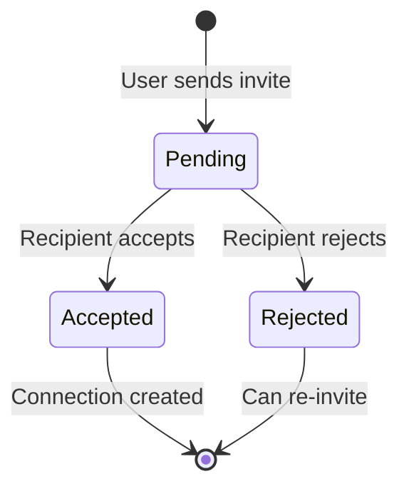
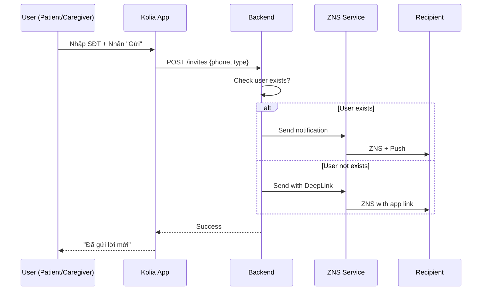

# SRS: KOLIA-1517 - Kết nối Người thân (Connection Flow)

> **Version:** v2.0  
> **Date:** 2026-01-28  
> **Author:** BA Team  
> **Status:** Ready for Dev Review

---

## 1. Giới thiệu

### 1.1 Mục đích

Tài liệu SRS này mô tả các yêu cầu chức năng và phi chức năng cho tính năng **Kết nối Người thân** trong ứng dụng Kolia - cho phép Người bệnh (Patient) và Người thân (Caregiver) kết nối với nhau để giám sát sức khỏe từ xa.

**Cấu trúc SRS:** Được tổ chức theo **3 phần**:
- **PHẦN A:** Role Người bệnh (Patient)
- **PHẦN B:** Role Người thân (Caregiver)
- **PHẦN C:** Yêu cầu chung (Shared)

### 1.2 Phạm vi (In/Out)

**TRONG SCOPE:**
- ✅ Gửi lời mời kết nối (**BI-DIRECTIONAL**: Patient ↔ Caregiver)
- ✅ Nhận/Chấp nhận/Từ chối lời mời
- ✅ Quản lý danh sách người thân đã kết nối
- ✅ Phân quyền chi tiết (6 categories)
- ✅ Hủy kết nối (từ cả 2 phía)
- ✅ Xem chi tiết Patient (Caregiver view)

**NGOÀI SCOPE (SRS #2):**
- ❌ Dashboard nâng cao cho Caregiver
- ❌ Thực hiện nhiệm vụ thay Patient
- ❌ Gửi tin nhắn động viên (chỉ define permission)

### 1.3 Thuật ngữ (Glossary)

| Thuật ngữ | Định nghĩa |
|-----------|------------|
| **Patient** | Người bệnh - người cao tuổi sử dụng Kolia để quản lý sức khỏe |
| **Caregiver** | Người thân - con cháu theo dõi sức khỏe Patient từ xa |
| **Connection** | Mối quan hệ đã được thiết lập giữa Patient và Caregiver |
| **Invite** | Lời mời kết nối, **KHÔNG CÓ thời hạn**, có thể gửi từ cả 2 phía |
| **Permission** | Quyền truy cập cụ thể mà Patient cấp cho Caregiver |
| **ZNS** | Zalo Notification Service - kênh gửi thông báo chính |
| **Deep Link** | Liên kết `kolia://...` để mở/tải app |
| **Badge** | Icon số trên menu hiển thị pending items |

### 1.4 Dependencies & Assumptions

| Dependency | Status | Ghi chú |
|------------|:------:|---------|
| ZNS (Zalo Notification Service) | 🟡 Cần setup | Kênh chính gửi lời mời |
| Deep Link Infrastructure | 🟡 Cần setup | `kolia://invite?id={xxx}` |
| Push Notification Service | ✅ Available | Đã có từ features khác |
| SMS Gateway | ✅ Available | Fallback khi ZNS fail |

**Assumptions:**
1. User đã hoàn thành onboarding trước khi sử dụng tính năng
2. Mỗi user chỉ đăng nhập 1 thiết bị tại 1 thời điểm
3. Phase 1: Không giới hạn số lượng người thân
4. **1 user có thể vừa là Patient vừa là Caregiver** (xem cả 2 phần A & B)
5. **Bi-directional invites:** Cả Patient và Caregiver đều có thể gửi lời mời

---

# PHẦN A: ROLE NGƯỜI BỆNH (PATIENT)

> **Mô tả:** Các chức năng dành cho người bệnh - người quản lý ai được theo dõi mình.

---

## A.1 Gửi lời mời kết nối

**User Story:** Là một **Patient**, tôi muốn **gửi lời mời cho người thân**, để **họ có thể theo dõi sức khỏe của tôi**.

### Kịch bản A1.1: Gửi lời mời cho người ĐÃ CÓ tài khoản Kolia (Happy Path)

```gherkin
Given Patient đang ở màn hình "Kết nối người thân"
  And Patient nhấn nút "Thêm người theo dõi bạn"
  And Patient nhập SĐT "0912345678" của Caregiver
When Patient nhấn "Tiếp tục"
Then Hệ thống chuyển đến **Invite Bottom Sheet** (SCR-02-BS)
  And Hiển thị form với 3 trường: Tên người thân, Số điện thoại, Mối quan hệ
When Patient nhập đủ thông tin và nhấn "Tiếp tục"
Then Hệ thống chuyển đến màn hình "Cấu hình quyền" (SCR-02B)
  And Hiển thị 6 permissions (mặc định tất cả ON)
When Patient điều chỉnh permissions theo ý muốn và nhấn "Gửi lời mời"
  And Server kiểm tra SĐT và phát hiện ĐÃ CÓ tài khoản
Then Hệ thống tạo invite record với status = "pending", type = "patient_to_caregiver"
  And Lưu permissions đã config vào invite record
  And Hệ thống gửi ZNS + Push Notification đến Caregiver
  And Patient thấy message "Đã gửi lời mời thành công"
  And Ref: BR-001, BR-002, BR-027

When Patient nhấn "Tiếp tục" tại màn hình cấu hình quyền (SCR-02B)
  And Patient nhấn nút back (←)
Then Quay lại Bottom Sheet và GIỮ NGUYÊN thông tin đã nhập (Tên, SĐT, Quan hệ)
  And Ref: UX-FORM-01
```

### Kịch bản A1.2: Gửi lời mời cho người CHƯA CÓ tài khoản Kolia

```gherkin
Given Patient đang ở màn hình "Mời người thân"
  And Patient nhập SĐT "0987654321" của Caregiver
When Patient nhấn "Gửi lời mời"
  And Server kiểm tra SĐT và phát hiện CHƯA CÓ tài khoản
Then Hệ thống tạo invite record với status = "pending"
  And Hệ thống gửi ZNS với Deep Link đến SĐT
  And Patient thấy message "Đã gửi lời mời. Người thân cần tải app để kết nối."
  And Ref: BR-001, BR-003
```

### Kịch bản A1.3: Gửi lời mời cho chính mình (Edge Case)

```gherkin
Given Patient đang ở màn hình "Mời người thân"
When Patient nhập chính SĐT của mình
  And Patient nhấn "Gửi lời mời"
Then Hệ thống hiển thị error: "Bạn không thể mời chính mình"
  And Lời mời KHÔNG được gửi
  And Ref: BR-006
```

### Kịch bản A1.4: Gửi lời mời cho người đã kết nối (Edge Case)

```gherkin
Given Patient đã kết nối với Caregiver có SĐT "0912345678"
When Patient cố gắng gửi lời mời đến cùng SĐT
Then Hệ thống hiển thị error: "Bạn đã kết nối với người này"
  And Lời mời KHÔNG được gửi
  And Ref: BR-007
```

### Kịch bản A1.5: Gửi lời mời cho người có pending invite (Edge Case)

```gherkin
Given Patient đã gửi lời mời cho SĐT "0912345678" (status = pending)
When Patient cố gắng gửi lại lời mời đến cùng SĐT
Then Hệ thống hiển thị: "Bạn đã gửi lời mời. Đang chờ phản hồi."
  And Lời mời mới KHÔNG được tạo
  And Ref: BR-007
```

---

## A.2 Nhận lời mời từ Caregiver

**User Story:** Là một **Patient**, tôi muốn **xem và chấp nhận lời mời** từ người thân, để **họ có thể theo dõi sức khỏe của tôi**.

### Kịch bản A2.1: Chấp nhận lời mời từ Caregiver (with permission config)

```gherkin
Given Patient mở màn hình "Kết nối người thân" (SCR-01)
  And Block "Lời mời mới" hiển thị: "{Tên Caregiver} muốn theo dõi sức khỏe của bạn"
When Patient nhấn nút ✓ (Accept)
Then Navigate đến màn hình cấu hình quyền SCR-02B-ACCEPT
  And Hiển thị 6 permissions với default = ALL ON
  And Patient có thể toggle ON/OFF từng quyền
  And Ref: BR-008, BR-023

When Patient nhấn "Xác nhận" trên SCR-02B-ACCEPT  
Then Connection được tạo với status = "active"
  And Permissions được lưu theo cấu hình đã chọn
  And Caregiver nhận notification: "{Tên Patient} đã chấp nhận lời mời"
  And Navigate về SCR-01
  And Lời mời biến mất khỏi Block
  And Ref: BR-009, BR-010
```

### Kịch bản A2.1b: Chấp nhận nhanh (quick accept - Alternative)

```gherkin
Given Patient đang ở màn hình cấu hình quyền SCR-02B-ACCEPT
When Patient nhấn "Chấp nhận tất cả" (nếu có)
Then Connection được tạo với 6 default permissions = ALL ON
  And Skip việc configure từng quyền
  And Ref: BR-009
```

### Kịch bản A2.2: Từ chối lời mời từ Caregiver

```gherkin
Given Patient thấy lời mời trong Block "Lời mời mới" (SCR-01)
When Patient nhấn nút ✗ (Reject)
Then Hiển thị popup xác nhận:
  | Title: "Xác nhận từ chối" |
  | Content: "Từ chối lời mời từ {Tên Caregiver}?" |
  | Buttons: [Xác nhận] [Quay lại] |
When Patient nhấn "Xác nhận"
Then Invite record cập nhật status = "rejected"
  And Caregiver nhận notification: "{Tên Patient} đã từ chối lời mời"
  And Lời mời biến mất khỏi Block
  And Ref: BR-011
```

---

## A.3 Quản lý danh sách "Người thân của tôi"

**User Story:** Là một **Patient**, tôi muốn **xem danh sách người thân đang theo dõi tôi**, để **kiểm soát ai có quyền truy cập**.

### Kịch bản A3.1: Xem danh sách Caregivers

```gherkin
Given Patient đang ở màn hình "Kết nối người thân"
When Patient scroll section "Người thân của tôi"
Then Hiển thị list Caregivers đã kết nối
  And Mỗi item hiển thị: Avatar, Tên, Last active (KHÔNG có nút action)
  And Tap vào item → Navigate đến SCR-04 (Chi tiết Caregiver)
  And Tại SCR-04 mới hiển thị các hành động: Cấu hình quyền, Hủy kết nối
  And Ref: BR-014
```

### Kịch bản A3.2: Xem danh sách lời mời đang chờ

```gherkin
Given Patient có lời mời pending (từ Caregiver hoặc gửi đi)
When Patient tap vào Badge số trên menu "Kết nối NT"
Then Điều hướng đến màn hình "Kết nối người thân"
  And Section "Lời mời đang chờ" hiển thị đầu tiên
  And Ref: BR-023
```

### Kịch bản A3.2b: Hiển thị lời mời đã gửi (Sender View - "Người đang theo dõi tôi")

```gherkin
Given Patient đã gửi lời mời cho người khác theo dõi mình (chưa được phản hồi)
When Patient mở Dropdown "Danh sách kết nối"
Then Section "Người đang theo dõi tôi" hiển thị pending item với:
  | Element | Chi tiết |
  | Avatar | Avatar mặc định |
  | Tên | "{Tên người nhận}" |
  | Badge | "⏳ Chờ phản hồi" (màu cam, style warning-light) |
  | Meta | "Đã gửi lời mời X thời gian trước" |
  | Section count | "(N + M chờ)" ví dụ "(2 + 1 chờ)" |
  | Button ❌ | Hủy lời mời (có confirm popup) |
  | Tap item | → Navigate đến SCR-04B (Chi tiết pending) có button "Hủy lời mời" |
  
  And Ref: BR-028, BR-029

When Patient nhấn ❌ (Hủy lời mời)
Then Hiển thị popup xác nhận:
  | Title: "Hủy lời mời" |
  | Content: "Hủy lời mời đến {Tên}?" |
  | Buttons: [Xác nhận] [Quay lại] |
When Patient nhấn "Xác nhận"
Then Invite record bị xóa
  And Item biến mất khỏi danh sách
```

### Kịch bản A3.3: Empty State - Chưa có ai theo dõi

```gherkin
Given User chưa có kết nối nào
When User mở màn hình "Kết nối Người thân"
Then Hiển thị illustration + message: "Chưa có kết nối nào. Bắt đầu kết nối với người thân ngay!"
  And 2 CTA buttons:
    | [Mời người thân theo dõi] (primary) | Mời người khác theo dõi sức khỏe của mình |
    | [Theo dõi người thân] (outline) | Gửi yêu cầu theo dõi sức khỏe người khác |
  And Ref: BR-015
```

---

## A.4 Quyền truy cập Caregiver

**User Story:** Là một **Patient**, tôi muốn **kiểm soát từng quyền của Caregiver**, để **bảo vệ quyền riêng tư**.

### Bảng 6 Permissions

| # | Quyền | Mô tả | UI Block | Default |
|---|-------|-------|----------|:-------:|
| 1 | Xem tổng quan sức khỏe | Chỉ số HA, báo cáo | Block "Chỉ số sức khỏe" | ✅ ON |
| 2 | Nhận cảnh báo khẩn cấp | Alert khi HA bất thường, SOS | Block "Cảnh báo" | ✅ ON |
| 3 | Thiết lập nhiệm vụ tuân thủ | Tạo/sửa nhiệm vụ | Block "Thiết lập" | ✅ ON |
| 4 | Theo dõi kết quả tuân thủ | Xem lịch sử | Block "Kết quả" | ✅ ON |
| 5 | Thực hiện nhiệm vụ thay | Đánh dấu hoàn thành | Block "Thực hiện" | ✅ ON |
| 6 | Gửi lời động viên | Gửi tin nhắn | Block "Nhắn tin" | ✅ ON |

### Kịch bản A4.1: Chỉnh sửa permission (với Warning)

```gherkin
Given Patient đang xem màn hình "Quyền truy cập" của Caregiver X
When Patient cố gắng toggle OFF bất kỳ permission nào
Then Hệ thống hiển thị confirmation popup:
  | Title: "Xác nhận thay đổi quyền" |
  | Content: "Bạn có chắc muốn TẮT quyền '{Tên quyền}' cho {Tên Caregiver}?" |
  | Buttons: [Xác nhận] [Hủy] |
When Patient nhấn "Xác nhận"
Then Permission được cập nhật ngay lập tức
  And Caregiver X nhận notification: "Quyền của bạn đã được thay đổi"
  And Block tương ứng bị ẨN trên màn hình Caregiver
  And Ref: BR-016, BR-017, BR-024
```

### Kịch bản A4.2: Warning đặc biệt khi TẮT cảnh báo khẩn cấp

```gherkin
Given Patient đang chỉnh permission cho Caregiver X
When Patient cố gắng toggle OFF "Nhận cảnh báo khẩn cấp"
Then Hệ thống hiển thị warning popup (màu đỏ):
  | Title: "⚠️ Cảnh báo quan trọng" |
  | Content: "Nếu tắt, {Tên} sẽ KHÔNG nhận được thông báo khi bạn gặp nguy hiểm. Điều này có thể ảnh hưởng đến sự an toàn của bạn." |
  | Buttons: [Vẫn tắt] [Giữ nguyên] |
  And Ref: BR-018
```

---

## A.5 Hủy kết nối với Caregiver

**User Story:** Là một **Patient**, tôi muốn **hủy kết nối với Caregiver**, để **họ không còn theo dõi tôi nữa**.

### Kịch bản A5.1: Patient hủy kết nối

```gherkin
Given Patient đang xem list Caregivers
When Patient nhấn ❌ trên Caregiver X
Then Hiển thị popup xác nhận:
  | Title: "Xác nhận hủy kết nối?" |
  | Content: "Sau khi hủy, {Tên} sẽ không còn theo dõi sức khỏe của bạn." |
  | Buttons: [Hủy kết nối] [Quay lại] |
When Patient nhấn "Hủy kết nối"
Then Connection status = "disconnected"
  And Caregiver X nhận notification: "{Tên Patient} đã hủy kết nối"
  And Caregiver X không còn thấy Patient trong list "Đang theo dõi"
  And Ref: BR-019
```

---

# PHẦN B: ROLE NGƯỜI THÂN (CAREGIVER)

> **Mô tả:** Các chức năng dành cho người thân - người theo dõi sức khỏe Patient.

---

## B.1 Gửi lời mời kết nối

**User Story:** Là một **Caregiver**, tôi muốn **gửi lời mời cho người thân**, để **tôi có thể theo dõi sức khỏe của họ**.

### Kịch bản B1.1: Gửi lời mời cho Patient (Happy Path)

```gherkin
Given Caregiver đang ở màn hình "Kết nối người thân"
  And Caregiver nhấn nút "Mời theo dõi"
  And Caregiver nhập SĐT của Patient
When Caregiver nhấn "Gửi lời mời"
  And Server kiểm tra SĐT và phát hiện ĐÃ CÓ tài khoản
Then Hệ thống tạo invite record với status = "pending", type = "caregiver_to_patient"
  And Hệ thống gửi ZNS + Push Notification đến Patient
  And Caregiver thấy message "Đã gửi lời mời. Đợi người thân chấp nhận."
  And Ref: BR-001, BR-002
```

### Kịch bản B1.2: Gửi lời mời cho người CHƯA CÓ tài khoản

```gherkin
Given Caregiver nhập SĐT của Patient
When Caregiver nhấn "Gửi lời mời"
  And Server phát hiện CHƯA CÓ tài khoản
Then Hệ thống gửi ZNS với Deep Link
  And Caregiver thấy: "Đã gửi lời mời. Người thân cần tải app để kết nối."
  And Ref: BR-003
```

---

## B.2 Nhận và xử lý lời mời từ Patient

**User Story:** Là một **Caregiver**, tôi muốn **xem và chấp nhận lời mời**, để **tôi có thể theo dõi sức khỏe người thân**.

### Kịch bản B2.1: Chấp nhận lời mời (Inline - Happy Path)

```gherkin
Given User mở màn hình "Kết nối người thân"
  And Block "Lời mời mới" hiển thị lời mời từ "{Tên}" với nội dung "{Tên} mời bạn theo dõi sức khỏe của họ"
When User nhấn nút ✓ (Accept)
Then Hiển thị popup xác nhận:
  | Title: "Chấp nhận lời mời" |
  | Content: "Chấp nhận lời mời từ {Tên}?" |
  | Buttons: [Xác nhận] [Quay lại] |
When User nhấn "Xác nhận"
Then Connection được tạo với status = "active"
  And 6 default permissions được apply (tất cả ON)
  And Người gửi nhận notification: "{Tên} đã chấp nhận lời mời"
  And Lời mời biến mất khỏi Block "Lời mời mới"
  And Người được thêm vào Profile Switcher dropdown
  And Ref: BR-008, BR-009, BR-010
```

### Kịch bản B2.2: Từ chối lời mời (Inline)

```gherkin
Given User thấy lời mời trong Block "Lời mời mới"
When User nhấn nút ✗ (Reject)
Then Hiển thị popup xác nhận:
  | Title: "Xác nhận từ chối" |
  | Content: "Từ chối lời mời từ {Tên}?" |
  | Buttons: [Xác nhận] [Quay lại] |
When User nhấn "Xác nhận"
Then Invite record cập nhật status = "rejected"
  And Người gửi nhận notification: "{Tên} đã từ chối lời mời"
  And Lời mời biến mất khỏi Block
  And Ref: BR-011
```

### Kịch bản B2.3: Lời mời trong Bản tin Hành động

```gherkin
Given User nhận lời mời mới
Then Lời mời xuất hiện ở 2 nơi:
  | Vị trí 1: Block "Lời mời mới" trong SCR-01 |
  | Vị trí 2: Action item trong "Bản tin Hành động" |
When User tap vào action item trong Bản tin
Then Điều hướng đến SCR-01 để xử lý
  And Ref: BR-012
```

### Kịch bản B2.4: Xử lý nhiều lời mời pending

```gherkin
Given User có 3 lời mời pending từ A, B, C
When User mở màn hình "Kết nối người thân"
Then Block "Lời mời mới (3)" hiển thị với list tất cả invites
  And Badge menu hiển thị số "3"
  And User có thể Accept/Reject từng lời mời riêng lẻ
  And Ref: BR-013
```

---

## B.3 Xem danh sách "Tôi đang theo dõi"

**User Story:** Là một **Caregiver**, tôi muốn **xem danh sách Patients tôi đang theo dõi**, để **dễ dàng truy cập thông tin sức khỏe của họ**.

### Kịch bản B3.1: Xem danh sách Patients

```gherkin
Given Caregiver đang ở màn hình "Kết nối người thân"
When Caregiver scroll section "Tôi đang theo dõi"
Then Hiển thị list Patients đã kết nối
  And Mỗi item hiển thị: Avatar, Tên, Last active (KHÔNG có nút action)
  And Tap vào item → Quay về màn hình chính SCR-01 và hiển thị các khối thông tin sức khỏe của Patient bên dưới Block Người theo dõi
  And Các UI Blocks chi tiết sẽ được bổ sung ở user stories tiếp theo
```

### Kịch bản B3.2: Tap Badge → Xem lời mời đang chờ

```gherkin
Given Caregiver có lời mời pending
When Caregiver tap vào Badge số trên menu "Kết nối NT"
Then Điều hướng đến màn hình "Kết nối người thân"
  And Section "Lời mời đang chờ" hiển thị đầu tiên
  And Ref: BR-023
```

### Kịch bản B3.2b: Hiển thị yêu cầu theo dõi đã gửi (Sender View - "Tôi đang theo dõi")

```gherkin
Given Caregiver đã gửi yêu cầu theo dõi Patient (chưa được phản hồi)
When Caregiver mở Dropdown "Danh sách kết nối"
Then Section "Tôi đang theo dõi" hiển thị pending item với:
  | Element | Chi tiết |
  | Avatar | Avatar mặc định |
  | Tên | "{Tên Patient}" |
  | Badge | "⏳ Chờ phản hồi" (màu cam) |
  | Meta | "Đã gửi yêu cầu X thời gian trước" |
  | Button ❌ | Hủy yêu cầu (có confirm popup) |
  | (Không có ⚙️) | Patient sẽ cấu hình quyền khi accept |
  
  And Ref: BR-028

When Caregiver nhấn ❌ (Hủy yêu cầu)
Then Hiển thị popup xác nhận:
  | Title: "Hủy yêu cầu" |
  | Content: "Hủy yêu cầu theo dõi {Tên Patient}?" |
  | Buttons: [Xác nhận] [Quay lại] |
When Caregiver nhấn "Xác nhận"
Then Invite record bị xóa
  And Item biến mất khỏi danh sách
```

### Kịch bản B3.3: Empty State - Chưa theo dõi ai

```gherkin
Given User chưa theo dõi ai
When User xem section "Tôi đang theo dõi"
Then Hiển thị message: "Bạn chưa theo dõi ai."
  And 2 CTA buttons:
    | [Theo dõi người thân] (primary) | Gửi yêu cầu theo dõi sức khỏe người khác |
    | [Mời người thân theo dõi] (outline) | Mời người khác theo dõi sức khỏe của mình |
```

---

## B.4 Xem Chi tiết Patient (Dashboard)

**User Story:** Là một **Caregiver**, tôi muốn **xem thông tin sức khỏe của Patient**, để **theo dõi tình trạng của họ**.

> **Scope:** Dashboard hiển thị sau khi chọn Patient từ Profile Switcher  
> **Dependency:** Các UI Blocks phụ thuộc vào Permissions được Patient cấp

> **UI Layout:** Xem [Section 5.2 - Dashboard View](#52-screen-layout-scr-01-bottom-sheet-based)

### Kịch bản B4.1: Xem Dashboard Patient (Happy Path)

```gherkin
Given Caregiver đang ở màn "Kết nối người thân"
When Caregiver tap vào Patient X trong list "Tôi đang theo dõi"
Then SCR-01 reload với Profile Switcher = Patient X
  And Hiển thị các UI Blocks theo permissions đang ON
  And Blocks của permissions OFF sẽ bị ẨN
  And Ref: BR-017, BR-DB-011
```

---

### B.4.2 US 1.1: Xem tổng quan sức khỏe người bệnh

> **Permission Required:** Quyền #1 - "Xem tổng quan sức khỏe" (Default: ON)  
> **Status:** ✅ Ready for Dev  
> **Wireframe:** [us_1_1_wireframe_health_overview.png](../../01_input/ket_noi_nguoi_than/reference/us_1_1_wireframe_health_overview.png)

**User Story:** Là một **Caregiver**, tôi muốn **xem tổng quan sức khỏe của Patient**, để **nắm bắt tình trạng sức khỏe của họ một cách nhanh chóng**.

#### Kịch bản B4.2.1: Xem biểu đồ xu hướng huyết áp

```gherkin
Given Caregiver đang ở SCR-01 Dashboard
  And Caregiver đã chọn Patient từ Profile Switcher
  And Patient có data huyết áp trong tháng hiện tại
  And Permission #1 = ON
When Màn hình load xong
Then Hệ thống hiển thị block "Xu hướng huyết áp"
  And Hiển thị Line Chart với 2 đường:
    | Đường | Màu | Ý nghĩa |
    | Tâm thu | Xanh lá | Systolic BP |
    | Tâm trương | Xanh dương | Diastolic BP |
  And Toggle filter theo logic auto-select (xem BR-DB-002)
  And Chip filter mặc định = "Tất cả"
  And Trục X = ngày trong tháng (dd/MM)
  And Trục Y = mmHg (dynamic range theo data)
  Ref: BR-DB-001, BR-DB-004
```

#### Kịch bản B4.2.2: Chọn xem chi tiết ngày cụ thể

```gherkin
Given Caregiver đang xem biểu đồ HA tháng
  And Chip filter "Tất cả" đang được chọn
When Caregiver tap chip "Ngày 15/1"
Then Biểu đồ chuyển sang view CHI TIẾT NGÀY
  And Trục X = Giờ trong ngày (HH:00)
  And Hiển thị tất cả lần đo trong ngày 15/1
  Ref: BR-DB-006, SRS Báo cáo BR-006
```

#### Kịch bản B4.2.3: Quay lại từ chi tiết ngày

```gherkin
Given Caregiver đang xem biểu đồ chi tiết ngày 15/1
When Caregiver tap chip "Tất cả"
Then Biểu đồ quay lại view TỔNG QUAN
  And Trục X = ngày trong khoảng thời gian
```

#### Kịch bản B4.2.4: Đổi filter Tuần/Tháng

```gherkin
Given Caregiver đang xem biểu đồ HA với filter "Tháng"
When Caregiver tap toggle "Tuần"
Then Biểu đồ reload với data 7 ngày gần nhất
  And Chip filter reset về "Tất cả"
  Ref: BR-DB-002
```

#### Kịch bản B4.2.5: Auto-select tab khi Tuần empty

```gherkin
Given Caregiver vừa chọn Patient từ Profile Switcher
  And Patient KHÔNG có data HA trong 7 ngày gần nhất (Tuần)
  And Patient CÓ data HA trong tháng hiện tại
When Dashboard load xong
Then Toggle filter tự động chọn "Tháng" (fallback)
  And Hiển thị data tháng thay vì empty state
  Ref: BR-DB-002
```

#### Kịch bản B4.2.6: Tap điểm dữ liệu xem tooltip

```gherkin
Given Caregiver đang xem biểu đồ HA
When Caregiver tap vào 1 điểm dữ liệu trên chart
Then Hiển thị tooltip với:
  | Field | Ví dụ |
  | Ngày | 15/01/2026 |
  | Tâm thu | 125 mmHg |
  | Tâm trương | 78 mmHg |
  Ref: BR-DB-005
```

#### Kịch bản B4.2.7: Xem danh sách báo cáo sức khỏe

```gherkin
Given Caregiver đang ở SCR-01 Dashboard
  And Patient có ít nhất 1 báo cáo định kỳ
When Caregiver tap button "Xem thêm" trong Block Báo cáo sức khỏe
Then Navigate đến màn hình danh sách báo cáo (SCR-REPORT-LIST)
  And Header title = "Báo cáo sức khỏe của [Danh xưng]" (VD: "Báo cáo sức khỏe của Mẹ")
  And Toggle filter: Ngày | Tuần | Tháng (default = Tuần)
  And Báo cáo chưa đọc có chấm đỏ (●) trên icon và viền trái xanh
  And Không hiển thị toast khi chuyển tab filter
  Ref: BR-DB-007, BR-RPT-001, BR-RPT-002
  Impact: CR_003 Scenario #1 (Notification gửi cho Caregiver khi có báo cáo mới)
```

#### Kịch bản B4.2.8: Xem chi tiết báo cáo

```gherkin
Given Caregiver đang ở màn hình danh sách báo cáo
When Caregiver tap vào "Báo cáo Tuần 3 - Tháng 12"
Then Navigate đến màn chi tiết báo cáo (reuse Patient UI)
  And Hiển thị TẤT CẢ sections trong báo cáo
  Ref: BR-DB-008, SRS Báo cáo BR-005
```

#### Kịch bản B4.2.9: Empty State - Không có data HA

```gherkin
Given Caregiver đang ở SCR-01 Dashboard
  And Patient KHÔNG có data huyết áp trong CẢ Tuần VÀ Tháng
When Màn hình load xong
Then Block "Xu hướng huyết áp" hiển thị empty state
  And Message: "[Danh xưng Patient] chưa có lần đo nào trong khoảng thời gian này."
  Ref: BR-DB-009
```

#### Kịch bản B4.2.10: Empty State - Không có báo cáo (User mới)

> **Lưu ý:** Báo cáo định kỳ (ngày/tuần/tháng) **LUÔN được tạo theo lịch**, kể cả khi Patient không có dữ liệu hoạt động. Kịch bản này chỉ xảy ra với **user mới** chưa đủ thời gian để hệ thống tạo báo cáo đầu tiên.

```gherkin
Given Caregiver đang ở màn hình danh sách báo cáo
  And Patient là user mới, chưa có báo cáo nào được tạo
When Màn hình load xong
Then Hiển thị empty state
  And Message: "Chưa có báo cáo nào. Báo cáo sẽ được tạo tự động theo lịch định kỳ."
  Ref: BR-DB-010
```

#### Kịch bản B4.2.11: Permission OFF - Block bị ẩn

```gherkin
Given Caregiver đang ở SCR-01 Dashboard
  And Permission #1 "Xem tổng quan sức khỏe" = OFF
When Màn hình load xong
Then Block "Xu hướng huyết áp" KHÔNG hiển thị
  And Button "Xem báo cáo sức khỏe" KHÔNG hiển thị
  Ref: BR-DB-011, SEC-DB-001
```

#### Kịch bản B4.3: Caregiver ngừng theo dõi Patient

> **Updated:** 2026-01-30 - Added Default View State logic (Option E)

```gherkin
Given Caregiver đang xem Dashboard của Patient
  And Link "Ngừng theo dõi" hiển thị ở cuối màn hình (text link, màu xám)
When Caregiver nhấn "Ngừng theo dõi"
Then Hiển thị popup xác nhận:
  | Title: "Ngừng theo dõi?" |
  | Content: "Bạn sẽ không còn theo dõi sức khỏe của [Danh xưng] nữa. [Danh xưng] sẽ nhận được thông báo về việc này." |
  | Buttons: [Quay lại] [Ngừng theo dõi] |

When Caregiver nhấn "Ngừng theo dõi"
Then Connection status = "disconnected"
  And Patient nhận notification: "[Tên Caregiver] đã ngừng theo dõi bạn"
  And Hiển thị popup thông báo thành công:
    | Icon: ✅ |
    | Title: "Đã ngừng theo dõi" |
    | Note: "ℹ️ Nếu muốn theo dõi lại, bạn cần gửi lời mời kết nối mới." |
    | Button: [Đã hiểu] |

When Caregiver nhấn "Đã hiểu"
Then selectedPatient = null
  And localStorage.removeItem('selectedPatient')
  And Navigate về màn danh sách kết nối (SCR-01)
  And Patient không còn trong list "Tôi đang theo dõi"
  And Hiển thị "Default View Prompt" (Option E)
  Ref: BR-019, UX-DVS-001
  Impact: CR_002 Scenario #5 (Kết nối bị hủy → Notification đến Patient)
  Impact: CR_003 Scenario #2 (Caregiver ngừng theo dõi)
```

#### Kịch bản B4.3b: Default View State - Khi chưa chọn Patient (Option E)

> **Context:** Áp dụng khi `selectedPatient = null` nhưng `followingCount > 0`

```gherkin
Given Caregiver đang ở SCR-01
  And selectedPatient = null
  And Caregiver đang theo dõi ít nhất 1 Patient
When Màn hình load xong
Then Hiển thị "Default View Prompt" gồm:
  | Element | Chi tiết |
  | Icon | 👋 (48px) |
  | Title | "Chọn người thân để bắt đầu" |
  | Subtitle | "Nhấn nút bên dưới để chọn người bạn muốn theo dõi" |
  | CTA Button | "📋 Xem danh sách người thân" → toggleBottomSheet() |

When Caregiver nhấn CTA "Xem danh sách người thân"
Then toggleBottomSheet() → Mở Bottom Sheet "Danh sách kết nối"
  And Caregiver có thể chọn Patient từ list "Tôi đang theo dõi"
  Ref: UX-DVS-001, UX-DVS-002
```

#### Kịch bản B4.3c: Đóng Bottom Sheet mà không chọn Patient

```gherkin
Given Caregiver đã mở Bottom Sheet "Danh sách kết nối"
  And selectedPatient = null
When Caregiver đóng Bottom Sheet (tap overlay hoặc button X)
Then hideBottomSheet()
  And Call updateStopFollowUI(selectedPatient) để refresh UI
  And "Default View Prompt" vẫn hiển thị
  And Link "Ngừng theo dõi" ẨN (vì chưa chọn Patient)
  Ref: UX-DVS-003
```

#### Kịch bản B4.3d: Visibility của Link "Ngừng theo dõi"

```gherkin
Given Caregiver đang ở SCR-01
Then Link "Ngừng theo dõi" hiển thị theo điều kiện:
  | Điều kiện | Hiển thị Link |
  | selectedPatient = null | ❌ ẨN |
  | selectedPatient != null AND emptyState = visible | ❌ ẨN |
  | selectedPatient != null AND emptyState = hidden | ✅ HIỆN |
  Ref: UX-DVS-004
```

#### UX Rules (Default View State)

| Rule-ID | Category | Mô tả | Priority |
|---------|----------|-------|:--------:|
| UX-DVS-001 | First Load | Khi page load lần đầu (không có localStorage), hiển thị Default View Prompt thay vì auto-select Patient | P0 |
| UX-DVS-002 | CTA Action | CTA "Xem danh sách người thân" gọi toggleBottomSheet() để mở profile list | P0 |
| UX-DVS-003 | Close Sheet | Khi đóng Bottom Sheet, call updateStopFollowUI(selectedPatient) để refresh UI state | P0 |
| UX-DVS-004 | Stop Follow Link | Link "Ngừng theo dõi" chỉ hiện khi có Patient được chọn VÀ không ở Empty State | P0 |
| UX-DVS-005 | Modal Validation | showStopFollowModal() kiểm tra selectedPatient trước khi hiện modal, toast nếu null | P1 |


#### Business Rules (US 1.1)

| BR-ID | Category | Mô tả Rule | Priority |
|-------|----------|------------|:--------:|
| BR-DB-001 | Display | Line Chart với 2 đường: Tâm thu (xanh lá), Tâm trương (xanh dương) | P0 |
| BR-DB-002 | Filter | Toggle Tuần/Tháng: **Ưu tiên Tuần** nếu có data. Nếu Tuần empty → Auto-select Tháng. Manual switch vẫn hoạt động bình thường | P0 |
| BR-DB-003 | Filter | Chip ngày: Swipe ngang, thứ tự từ cũ → mới | P1 |
| BR-DB-004 | Aggregation | Nếu 1 ngày có nhiều lần đo → Hiển thị giá trị TRUNG BÌNH | P1 |
| BR-DB-005 | Interaction | Tap điểm dữ liệu → Hiển thị tooltip | P1 |
| BR-DB-006 | Drill-down | Tap chip ngày cụ thể → Chuyển biểu đồ sang view theo GIỜ | P1 |
| BR-DB-007 | Navigation | "Xem báo cáo sức khỏe" → Navigate đến danh sách báo cáo với phân trang | P1 |
| BR-DB-008 | Scope | Permission #1 = ON → Xem TOÀN BỘ sections trong báo cáo | P0 |
| BR-DB-009 | Empty State | Không có data HA → Message custom cho Caregiver | P1 |
| BR-DB-010 | Empty State | Không có báo cáo → Message custom cho Caregiver | P1 |
| BR-DB-011 | Authorization | Permission #1 = OFF → Ẩn block HA và button Báo cáo | P0 |
| **BR-RPT-001** | Display | Block "Báo cáo sức khỏe" trên Dashboard: **Tối đa 3 báo cáo chưa đọc mới nhất** của mỗi loại (Ngày/Tuần/Tháng). Badge đỏ = tổng số chưa đọc. Nếu còn nhiều hơn → Hiển thị text "Còn X báo cáo [loại] khác chưa đọc" (optional) | P0 |
| **BR-RPT-002** | Display | Màn danh sách báo cáo (SCR-REPORT-LIST): Header title = **"Báo cáo sức khỏe của [Danh xưng]"** để phân biệt với báo cáo cá nhân. Báo cáo chưa đọc có chấm đỏ (●) trên icon. Không toast khi chuyển tab | P1 |

#### Security Requirements (US 1.1)

| SEC-ID | Mô tả | Priority |
|--------|-------|:--------:|
| SEC-DB-001 | **API Authorization:** Endpoint `/patients/{id}/health-overview` PHẢI check permission #1 ở server | P0 |
| SEC-DB-002 | **Permission Revoke:** API check mỗi lần gọi. Permission OFF → Return 403 | P0 |
| SEC-DB-003 | **Deep Link Protection:** Validate quyền trước khi render chi tiết báo cáo | P1 |

#### Empty State Messages

> **Reference:** Tương tự [Kolia]_SRS_MVP_v1.0_Báo cáo.md BR-006, BR-007 nhưng adapt cho Caregiver context

| Trường hợp | Component | Message/Logic |
|------------|-----------|---------------|
| Biểu đồ trống (không có data HA trong khoảng thời gian) | Block "Xu hướng huyết áp" | **Title:** "Biểu đồ biểu diễn huyết áp" <br>**Illustration:** Kolia mascot <br>**Message:** "Không có đủ dữ liệu để tạo biểu đồ" |
| Danh sách báo cáo trống (user mới) | SCR-REPORT-LIST | "Chưa có báo cáo nào. Báo cáo sẽ được tạo tự động theo lịch định kỳ." |
| Chi tiết báo cáo không có dữ liệu cho 1 phần | Chi tiết báo cáo | Hiển thị "--" cho các chỉ số. Nhận xét vẫn hiển thị với nội dung: (1) Nêu thực trạng, (2) Lợi ích theo dõi, (3) Nhắc nhở |

> **Lưu ý:** Không dùng message Patient ("Bạn chưa đo...") vì Caregiver không thể đo thay.

#### Impact Analysis: Push Notification Service

> **Reference:** [CR_003_notification_health_report.md](../../../04_impact/ket_noi_nguoi_than/change_requests/CR_003_notification_health_report.md)

| # | Scenario | Trigger | Recipients | Content |
|:-:|:---------|:--------|:-----------|:--------|
| 1 | Báo cáo định kỳ mới | Hệ thống auto-generate báo cáo | Caregivers có Permission #1 = ON | "[Danh xưng Patient] có báo cáo [loại] mới" |
| 2 | Caregiver ngừng theo dõi | Caregiver confirm "Ngừng theo dõi" | Patient | "[Tên Caregiver] đã ngừng theo dõi sức khỏe của bạn" |

| Aspect | Detail |
|--------|--------|
| **Dependency** | Push Notification Service (✅ đã có) |
| **Priority** | P1 |


---

### B.4.4 Placeholder Components (Pending User Stories)

> **Prototype Reference:** [prototype_us1.1_health_overview.html](prototype/prototype_us1.1_health_overview.html)

#### Block Cảnh báo bất thường
- **US ID:** US 1.x (TBD) | **Permission:** #1
- **Loại:** HA bất thường, Uống thuốc sai liều, Không tuân thủ, SOS
- **Components:** Alert card với icon + message + timestamp

#### Block Kết quả tuân thủ
- **US ID:** US 1.2 | **Permission:** #1
- **Components:** Stat cards hiển thị:
  - Tuân thủ thuốc (%)
  - Số ngày đo HA (n/7)
- **Behavior:** Tap → Navigate đến chi tiết tuân thủ (TBD)

#### Block Nhiệm vụ hôm nay
- **US ID:** US 2.x | **Permission:** #2
- **Components:** Task list với:
  - Task items (done/pending/upcoming states)
  - Icon + text + time
- **Behavior:** Tap task → Toggle status

#### Block Gửi lời nhắn nhủ
- **US ID:** US 3.x | **Permission:** #3
- **Components:**
  - Quick reply chips (e.g., "Uống thuốc đi mẹ nhé 💊", "Con yêu mẹ ❤️", "+ Thêm")
  - Text input field ("Nhập lời nhắn...")
  - Gửi button
- **Behavior:** Tap chip hoặc nhập text → Gửi notification đến Patient


## B.5 Ngừng theo dõi Patient

**User Story:** Là một **Caregiver**, tôi muốn **ngừng theo dõi một Patient**, nếu **tôi không muốn tiếp tục**.

### Kịch bản B5.1: Caregiver tự rời

```gherkin
Given Caregiver đang xem list Patients đang theo dõi
When Caregiver nhấn "Ngừng theo dõi" trên Patient X
Then Hiển thị popup xác nhận:
  | Title: "Ngừng theo dõi?" |
  | Content: "Bạn sẽ không còn theo dõi sức khỏe của {Tên} nữa." |
  | Buttons: [Ngừng theo dõi] [Quay lại] |
When Caregiver nhấn "Ngừng theo dõi"
Then Connection status = "disconnected"
  And Patient X nhận notification: "{Tên Caregiver} đã ngừng theo dõi bạn"
  And Patient X không còn thấy trong list của Caregiver
  And Ref: BR-020
```

---

# PHẦN C: YÊU CẦU CHUNG (SHARED)

---

## 3. Business Rules

| BR-ID | Category | Mô tả Rule | Priority |
|-------|----------|------------|:--------:|
| **BR-001** | Authorization | **Cả Patient và Caregiver** đều có thể gửi lời mời (bi-directional) | P0 |
| **BR-002** | Notification | Gửi ZNS + Push cho user ĐÃ CÓ tài khoản | P0 |
| **BR-003** | Notification | Gửi ZNS với Deep Link cho user MỚI | P0 |
| **BR-004** | Fallback | ZNS fail → SMS fallback, retry 3x (30s interval mỗi lần) | P0 |
| **BR-006** | Constraint | Không thể mời chính mình | P0 |
| **BR-007** | Constraint | Không thể mời người đã kết nối hoặc có pending invite | P0 |
| **BR-008** | State | Accept → Create connection + Apply 6 permissions | P0 |
| **BR-009** | Authorization | 6 permissions default = ALL ON | P0 |
| **BR-010** | Notification | Notify người gửi khi recipient accept/reject | P1 |
| **BR-011** | State | Reject → Update status, allow re-invite | P1 |
| **BR-012** | State | Pending invite → LUÔN hiển thị Action item trong Bản tin Hành động | P1 |
| **BR-013** | State | Multiple invites → FIFO order | P1 |
| **BR-014** | Display | List: Avatar, Tên, Last active (thời gian online cuối) | P1 |
| **BR-015** | Display | Empty state với CTA phù hợp từng role | P2 |
| **BR-016** | State | Permission change → Notify Caregiver | P1 |
| **BR-017** | Display | Permission OFF → Hide UI block on Caregiver view | P0 |
| **BR-018** | Authorization | Warning popup **ĐỎ** khi TẮT "Cảnh báo khẩn cấp" | P0 |
| **BR-019** | State | Patient disconnect → Notify Caregiver | P0 |
| **BR-020** | State | Caregiver exit → Notify Patient | P1 |
| **BR-021** | Limit | Phase 1: KHÔNG GIỚI HẠN số connections | P1 |
| **BR-022** | State | Account deleted → Cascade delete + Notify | P0 |
| **BR-023** | Navigation | Badge tap → Navigate to "Kết nối NT" screen, show pending section | P1 |
| **BR-024** | Authorization | **Confirmation popup cho TẤT CẢ permission changes** | P0 |
| **BR-025** | Display | **Message phải phân biệt rõ invite type** (xem 3.2) | P0 |
| **BR-028** | Data | **Relationship type phải được lưu khi tạo connection và hiển thị trong UI** | P0 |
| **BR-029** | Display | **Display format: "{Mối quan hệ} ({Họ tên})". Nếu relationship = "khac" → thay "Khác" bằng "Người thân"** (VD: "Người thân (Nguyễn Văn A)") | P1 |

### 3.2 Message Catalog

**Lời mời hiển thị trong Block "Lời mời mới":**

| invite_type | Display Message | Giải thích |
|------------|-----------------|------------|
| `patient_to_caregiver` | "{Tên} mời [danh xưng] **theo dõi** sức khỏe của họ" | Patient mời Caregiver theo dõi |
| `caregiver_to_patient` | "{Tên} muốn **được theo dõi** sức khỏe của [danh xưng]" | Caregiver xin quyền theo dõi Patient |

**Toast Messages (sau actions):**

| Action | Current | Recommended |
|--------|---------|-------------|
| Accept invite | "Đã chấp nhận lời mời!" | "Đã kết nối với **{Tên}**!" |
| Reject invite | "Đã từ chối lời mời" | "Đã từ chối lời mời từ **{Tên}**" |
| Disconnect | "Đã hủy kết nối" | "Đã hủy kết nối với **{Tên}**" |
| Permission ON | "Đã bật quyền" | "Đã bật quyền **{Tên quyền}**" |
| Permission OFF | "Đã tắt quyền" | "Đã tắt quyền **{Tên quyền}**" |


---

## 3.1 System Behaviors

### Kịch bản SYS.1: ZNS fail → SMS fallback

```gherkin
Given User đã gửi lời mời
  And ZNS gửi thất bại (recipient không có Zalo)
When System phát hiện ZNS fail
Then Hệ thống tự động gửi SMS fallback
  And Retry tối đa 3 lần nếu SMS cũng fail (interval 30s)
  And Ref: BR-004
```

---

## 4. Validation Rules

| Field | Business Rule | Placeholder | Ví dụ hợp lệ | Ví dụ không hợp lệ |
|-------|---------------|-------------|--------------|-------------------|
| **Số điện thoại** | 10 digits, bắt đầu bằng 0 | `Ví dụ: 0912 345 678` | 0912345678 | 912345678 |
| **Tên người thân** | Min 2 ký tự, max 50 ký tự | `Ví dụ: Nguyễn Văn A` | "Nguyễn Văn A" | "A" (quá ngắn) |
| **Mối quan hệ** | Required, enum (14 values) | `-- Chọn mối quan hệ --` | "con_trai", "me" | Empty, invalid |
| **Tên hiển thị** | From profile, fallback masked SĐT (090***567) | - | "Nguyễn Văn A" | Empty |
| **Permission** | Boolean ON/OFF | - | true, false | - |
| **Last active** | Timestamp của lần online gần nhất | - | "5 phút trước" | - |

---

## 5. UI Specifications

### 5.1 Screen Inventory

| Screen ID | Screen Name | Role | Description |
|-----------|-------------|:----:|-------------|
| **SCR-01** | Kết nối Người thân | Both | Profile Selector + Lời mời mới (inline) |
| **SCR-02-BS** | Invite Bottom Sheet | Both | Form nhập Tên + SĐT + Quan hệ (slide-up) |
| **SCR-02** | Mời Người thân | Both | Form nhập SĐT (legacy, deprecated) |
| **SCR-02B** | Cấu hình quyền (Invite) | Patient | Toggle 6 quyền trước khi gửi invite |
| **SCR-02B-ACCEPT** | Cấu hình quyền (Accept) | Patient | Toggle 6 quyền sau khi nhận invite từ Caregiver |
| **SCR-04** | Chi tiết Caregiver | Patient | Xem info + permissions (connected) |
| **SCR-04B** | Chi tiết Pending Invite | Patient | Xem info pending + Hủy lời mời |
| **SCR-05** | Quyền truy cập | Patient | Toggle 6 quyền (sau khi đã kết nối) |
| **SCR-06** | Chi tiết Patient | Caregiver | = SCR-01 với profile đã chọn từ "Tôi đang theo dõi"¹ |
| **SCR-REPORT-LIST** | Danh sách Báo cáo | Caregiver | Danh sách báo cáo định kỳ của Patient (reuse Patient UI) |

> ¹ **SCR-06 Scope Note:** SCR-06 thực chất là SCR-01 khi Caregiver đã chọn 1 profile Patient từ danh sách "Tôi đang theo dõi". Các UI Blocks chi tiết (Dashboard sức khỏe) sẽ implement trong SRS #2 - user stories tiếp theo.

### 5.2 Screen Layout: SCR-01 (Bottom Sheet-based)

**Main View:**
```
┌─────────────────────────────────────┐
│ 👤 Tài khoản của bạn ▼             │ ← Profile Selector
│    2 người đang theo dõi           │   Tap → Show Bottom Sheet
├─────────────────────────────────────┤
│ 📬 LỜI MỜI MỚI (1)                 │ ← Block (chỉ hiện khi có)
│ ┌─────────────────────────────────┐ │
│ │ Chú Út (Lê Văn..)       [✓][✗] │ │
│ │ Mời bạn theo dõi sức khỏe họ    │ │
│ └─────────────────────────────────┘ │
├─────────────────────────────────────┤
│  🏠    🌳  👥  ⚙️                │
└─────────────────────────────────────┘
```

**Bottom Sheet (tap vào Profile Selector):**
```
┌─────────────────────────────────────┐
│ ━━━━━━━━━━━━━━━━━━━━━━━━━━         │ ← Handle bar (kéo để đóng)
├─────────────────────────────────────┤
│ Danh sách kết nối              [✕] │ ← Header + Close button
├─────────────────────────────────────┤
│ 📋 TÔI ĐANG THEO DÕI (1)           │ ← Section 1 (ưu tiên)
│ ┌─────────────────────────────────┐ │
│ │ ● Mẹ                    [📊]   │ │ ← Tap để chọn (xem SK)
│ └─────────────────────────────────┘ │
│         [+ THÊM NGƯỜI ĐỂ THEO DÕI] │
├─────────────────────────────────────┤
│ 📋 NGƯỜI ĐANG THEO DÕI TÔI (2)     │
│ ┌─────────────────────────────────┐ │
│ │ ● Con trai      [⚙️][❌]        │ │
│ │ ○ Con gái       [⚙️][❌]        │ │
│ └─────────────────────────────────┘ │
│         [+ THÊM NGƯỜI THEO DÕI BẠN] │
└─────────────────────────────────────┘
```

**UI Elements:**
| Element | Mô tả |
|---------|----- -|
| **Profile Selector** | Tap → Show Bottom Sheet slide-up |
| **Bottom Sheet Handle** | 40x4px bar, kéo xuống để đóng |
| **Block Lời mời** | Always visible on main (if pending) |
| **Section 1** | Tôi đang theo dõi (ưu tiên - chọn để xem sức khỏe) |
| **Section 2** | Người đang theo dõi tôi |

---

**Dashboard View (sau khi chọn Patient từ "Tôi đang theo dõi"):**

> **Scope:** Layout này hiển thị cho Caregiver sau khi chọn 1 Patient profile  
> **Ref:** US 1.1, B.4.3

```
┌─────────────────────────────────────┐
│ 👵 Mẹ ▼                            │ ← Profile Switcher (đã chọn)
├─────────────────────────────────────┤
│ 📋 Lời mời mới (nếu có)            │ ← Block từ B.2
├─────────────────────────────────────┤
│ ⚠️ CẢNH BÁO (n)                    │ ← Placeholder: US 1.x
│ ┌────────────────────────────────┐ │
│ │ 🔴 HA bất thường: 180/110      │ │
│ │ 🟠 Quên uống thuốc 2 ngày      │ │
│ └────────────────────────────────┘ │
├─────────────────────────────────────┤
│ 📈 XU HƯỚNG HUYẾT ÁP               │ ← US 1.1 ✅
│ ┌────────────────────────────────┐ │
│ │  [Tuần]  [Tháng ✓]             │ │
│ │  (Line chart 2 đường)          │ │
│ └────────────────────────────────┘ │
│  [Tất cả] [Ngày 1/1] [Ngày 2/1]    │ ← Chip filters (scroll)
├─────────────────────────────────────┤
│  [📊 Xem kết quả tuân thủ]         │ ← Placeholder: US 1.2
├─────────────────────────────────────┤
│  [⚙️ Thiết lập nhiệm vụ tuân thủ]  │ ← Placeholder: US 2.x
├─────────────────────────────────────┤
│  [📋 Xem báo cáo sức khỏe]         │ ← US 1.1 ✅
├─────────────────────────────────────┤
│ 💬 GỬI LỜI NHẮN NHỦ                │ ← Placeholder: US 3.x
│ ┌────────────────────────────────┐ │
│ │  [Quick chips] [Nhập...]       │ │
│ └────────────────────────────────┘ │
└─────────────────────────────────────┘
```

**Dashboard Components:**

| # | Component | US ID | Status | Permission |
|---|-----------|-------|--------|------------|
| 1 | Profile Switcher | B.3 | ✅ | N/A |
| 2 | Lời mời mới | B.2 | ✅ | N/A |
| 3 | Cảnh báo bất thường | US 1.x | 📝 Pending | #1 |
| 4 | Xu hướng Huyết áp | US 1.1 | ✅ | #1 |
| 5 | Xem kết quả tuân thủ | US 1.2 | 📝 Pending | #1 |
| 6 | Thiết lập nhiệm vụ | US 2.x | 📝 Pending | #2 |
| 7 | Xem báo cáo SK | US 1.1 | ✅ | #1 |
| 8 | Gửi lời nhắn nhủ | US 3.x | 📝 Pending | #3 |

### 5.2.1 Profile Selection Logic (BR-026)

**Mục đích:** Phần trống bên dưới SCR-01 sẽ hiển thị các khối thông tin sức khỏe của Patient được chọn (future US). Do đó cần định nghĩa logic chọn profile.

#### A. Profile Selector States (5 states):

| State | Điều kiện | Avatar | Name | Status Text |
|:-----:|-----------|:------:|------|-------------|
| **E** | Đã chọn Patient X | 👵 Avatar X | Tên Patient X ▼ | "Hoạt động X phút trước" |
| **A** | Có cả 2 loại, chưa chọn ai | 👤 | Tài khoản của [danh xưng] ▼ | "2 người theo dõi, theo dõi 1 người" |
| **B** | Chỉ có Caregivers | 👤 | Tài khoản của [danh xưng] ▼ | "2 người theo dõi" |
| **C** | Chỉ [danh xưng] theo dõi (auto-chọn) | 👵 | Tên người đầu tiên ▼ | Last active của họ |
| **D** | Không có kết nối nào | 👤 | Tài khoản của [danh xưng] ▼ | "Chưa có kết nối nào" |

#### B. Auto-Select Rules:

| # | Điều kiện | Hành vi |
|:-:|-----------|---------|
| 1 | Lần đầu vào + List "Tôi đang theo dõi" có ≥1 người | **Auto-chọn người đầu tiên** |
| 2 | User đã chọn profile trước đó | **Load profile đã lưu** (localStorage/API) |
| 3 | Profile đã lưu không còn tồn tại | Fallback → người đầu tiên hoặc "Tài khoản của bạn" |
| 4 | List "Tôi đang theo dõi" rỗng | Hiển thị "Tài khoản của bạn" với status text bình thường |

#### C. Selection Behavior:

```gherkin
Given User đang ở SCR-01 và Bottom Sheet đang mở
When User tap vào 1 người trong section "Tôi đang theo dõi"
Then Bottom Sheet đóng với animation slide-down
  And Profile Selector cập nhật:
  | Avatar: Avatar của người được chọn |
  | Name: Tên người được chọn ▼ |
  | Status: Last active của họ |
  And profile_id được lưu vào local storage
  And Các khối thông tin sức khỏe bên dưới update theo Patient được chọn (future US)
```


### 5.3 Navigation Flow

```mermaid
flowchart TD
    subgraph Main["SCR-01: Kết nối Người thân"]
        A[Home] -->|Bottom Nav #4| B[SCR-01]
        B -->|Tap "Mời người thân"| SCR2A[SCR-02: Mời để theo dõi mình]
        B -->|Tap "Mời theo dõi"| SCR2B[SCR-02: Mời để mình theo dõi]
        B -->|Tap Patient in Section 2| SCR6[SCR-06: Chi tiết Patient]
    end
    
    subgraph Invites["Xử lý Lời mời (Inline)"]
        B -->|Có lời mời| INV[Block: Lời mời mới]
        INV -->|Tap ✓| ACC[Accept → Connection]
        INV -->|Tap ✗| REJ[Reject → Remove]
    end
    
    subgraph PatientActions["Patient Actions (Section 1)"]
        B -->|Tap Caregiver| E[SCR-04: Chi tiết Caregiver]
        E -->|Tap ⚙️| F[SCR-05: Phân quyền]
        E -->|Tap ❌| G[Disconnect]
    end
```

---

## 6. Flow Diagrams

### 6.1 State Diagram: Invite Lifecycle



### 6.2 Sequence Diagram: Send Invite (Bi-directional)



---

## 7. UX Writing & Templates

### 7.1 ZNS Templates

**Mời người khác theo dõi mình:**
```
🔔 Kolia - Lời mời kết nối

{Tên} mời bạn theo dõi sức khỏe của họ trên Kolia.

👉 Nhấn để mở app:
{deep_link}
```

**Mời để được theo dõi người khác:**
```
🔔 Kolia - Lời mời theo dõi

{Tên} muốn theo dõi sức khỏe của bạn trên Kolia.

👉 Nhấn để mở app:
{deep_link}
```

### 7.2 Error Messages

| Error Code | Context | Message |
|------------|---------|---------|
| ERR-001 | Invite self | "Bạn không thể mời chính mình" |
| ERR-002 | Already connected | "Bạn đã kết nối với người này" |
| ERR-003 | Send failed | "Không thể gửi lời mời. Vui lòng thử lại." |
| ERR-004 | Network error | "Không có kết nối mạng" |
| ERR-005 | Invalid phone | "Số điện thoại không hợp lệ" |
| ERR-006 | Pending exists | "Bạn đã gửi lời mời. Đang chờ phản hồi." |
| ERR-007 | Name too short | "Tên phải có ít nhất 2 ký tự" |
| ERR-008 | Relationship missing | "Vui lòng chọn mối quan hệ" |

---

## Appendix

### A.1 Revision History

| Version | Date | Author | Changes |
|---------|------|--------|---------|
| v1.0 | 2026-01-27 | BA Team | Initial draft |
| v1.1 | 2026-01-28 | BA Team | Restructured by Role |
| v1.2 | 2026-01-28 | BA Team | Post QA Review fixes: Bi-directional invites, SCR-06, warning all permissions, badge navigation |
| v1.3 | 2026-01-28 | BA Team | Dual-role message updates: section headers, empty states, ZNS templates |
| v1.4 | 2026-01-28 | BA Team | Simplified UI: Profile Switcher + Inline invites, removed popup SCR-03 |
| v1.5 | 2026-01-28 | BA Team | Unified UI: 2 sections (Người theo dõi tôi + Tôi theo dõi) with CTAs in both, cleaned deprecated items |
| v1.6 | 2026-01-28 | BA Team | QA Review fixes: A2.1/A2.2 inline pattern, Message Catalog (BR-025), Toast messages enhanced, SRS-Prototype sync |
| v1.7 | 2026-01-28 | BA Team | QA Review v2: 'Phân quyền' → 'Quyền truy cập', SCR-06 scope clarified, SRS-Prototype full sync |
| v1.8 | 2026-01-28 | BA Team | QA Review v3: Section order (TÔI THEO DÕI first), Profile Selection Logic, 5 dropdown states, terminology fixes |
| v1.9 | 2026-01-28 | BA Review | Bottom Sheet UI sync, Invite form fields (Name + Relationship), BR-028, new validation rules |
| v2.0 | 2026-01-28 | BA Team | **A2.1 Permission Config on Accept:** Patient cấu hình quyền sau khi nhận invite từ Caregiver (SCR-02B-ACCEPT) |
| v2.1 | 2026-01-28 | BA Team | **A3.2b Pending Display for Sender:** Badge "⏳ Chờ phản hồi", count "(N + M chờ)", no cancel button in list view |
| v2.2 | 2026-01-28 | BA Team | **Fix 6 Issues:** (1) A2.2, B2.1, B2.2 thêm confirm popup, (2) A3.1 bỏ ❌ trong list - chỉ vào SCR-04 mới hủy, (3) B3.2b pending cho "Tôi đang theo dõi" với ❌ only, (6) A3.2b pending invite có ❌+⚙️ |
| v2.3 | 2026-01-28 | BA Team | **Simplified List UI:** Bỏ tất cả nút action (⚙️, 👁️) trong danh sách. Tap item: "Tôi đang theo dõi" → main screen, "Người đang theo dõi tôi" → SCR-04 detail. Pending items chỉ còn ❌. |
| v2.4 | 2026-01-28 | BA Team | **SCR-04B:** Thêm màn hình chi tiết cho pending invite với button "Hủy lời mời" (giống popup khi nhấn ❌ ở list). Pending tap → SCR-04B. |
| v2.5 | 2026-01-29 | BA Team | **UX Fixes:** (1) SCR-02B back → Bottom Sheet (không về legacy scr02-invite), (2) Phone validation hiển thị lỗi khi nhập số không hợp lệ, (3) Form data giữ nguyên khi nhấn back từ màn cấu hình quyền. |
| v2.6 | 2026-01-29 | BA Team | **Flow Clarification:** (1) B2.1 chấp nhận lời mời theo dõi PATIENT → trực tiếp accept, KHÔNG cần cấu hình quyền (Patient đã config lúc gửi). (2) Popup xác nhận hủy/từ chối: button primary luôn là "Quay lại". |
| v2.7 | 2026-01-29 | BA Team | **B.4 Dashboard + US 1.1:** Layout v4 gộp vào Section 5.2 UI Specs, B.4 giữ scenarios + BR + SEC |
| v2.8 | 2026-01-29 | BA Team | **QA Fixes:** Renumber B4.3.x→B4.2.x, BR-DB-002 auto-select Tuần (fallback Tháng), thêm scenario B4.2.5 |
| v2.9 | 2026-01-29 | BA Team | **QA Round 2:** B4.2.9 làm rõ scope (CẢ Tuần VÀ Tháng empty), thêm SCR-REPORT-LIST vào Screen Inventory |

### A.2 Open Questions

All questions resolved. No open questions.

### A.3 Cross-Feature Dependencies

| Feature | Relationship | Notes |
|---------|--------------|-------|
| Màn hình chính | Bottom Nav #4 | Slot available |
| Bản tin Hành động | Invite action item | Tap → navigate to SCR-01 |
| SRS #2: Caregiver Dashboard | SCR-01 (profile selected) | Advanced features TBD - pending user stories |

#### 📌 Chi tiết ảnh hưởng đến SRS Existing Features

**CR_001: Bản tin Hành động** ([Bản tin hành động SRS](../../../00_context/SRS%20existing%20features/[Kolia]_SRS_MVP_v1.0_Bản%20tin%20hành%20động.md))
- **Thay đổi:** Thêm action type `INVITE_CONNECTION` vào bảng BR-004
- **Vị trí:** Đầu danh sách Ưu tiên (trước "Thiết lập lịch đo huyết áp")
- **Tên hành động:** Lời mời kết nối người thân
- **Trigger:** User có ít nhất 1 lời mời pending
- **Flow:** Tap → Navigate to SCR-01
- **Điều kiện dừng:** Không còn lời mời pending

**CR_002: Phân hệ Notification** ([Notification SRS](../../../00_context/SRS%20existing%20features/SRS_MVP0.3_Phân_hệ_Notification%20(1).md))
- **Thay đổi:** Thêm section `CHỨC NĂNG: KẾT NỐI NGƯỜI THÂN` với 5 kịch bản:

| # | Kịch bản | Mức độ | Thời gian gửi | Receiver |
|---|----------|--------|---------------|----------|
| 1 | Nhận lời mời | Cao | Ngay lập tức | Invitee |
| 2 | Được chấp nhận | Trung bình | Ngay lập tức | Sender only |
| 3 | Bị từ chối | Thấp | Ngay lập tức | Sender only |
| 4 | Quyền thay đổi | Trung bình | Ngay lập tức | Caregiver |
| 5 | Kết nối bị hủy | Cao | Ngay lập tức | Bên còn lại |

**CR_003: Phân hệ Notification - Báo cáo Sức khỏe** ([CR_003 Detail](../../04_impact/ket_noi_nguoi_than/change_requests/CR_003_notification_health_report.md))
- **Thay đổi:** Thêm notification cho Caregiver khi có báo cáo mới + khi ngừng theo dõi

| # | Kịch bản | Mức độ | Thời gian gửi | Receiver |
|---|----------|--------|---------------|----------|
| 1 | Báo cáo định kỳ mới | Trung bình | Scheduled | Caregivers (Permission #1 ON) |
| 2 | Caregiver ngừng theo dõi | Cao | Ngay lập tức | Patient |

> **Tham chiếu:** [CR Summary](../../04_impact/ket_noi_nguoi_than/change_requests/CR_summary.md)
