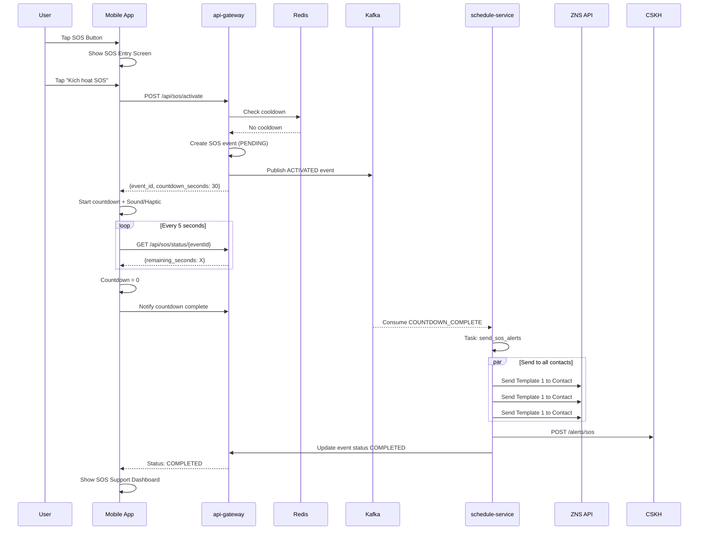
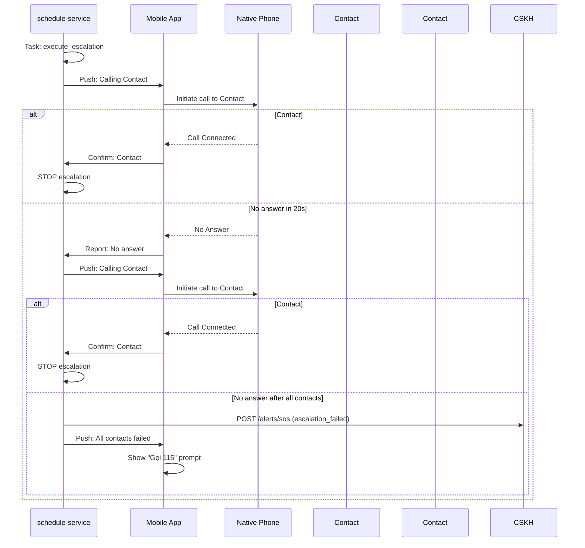
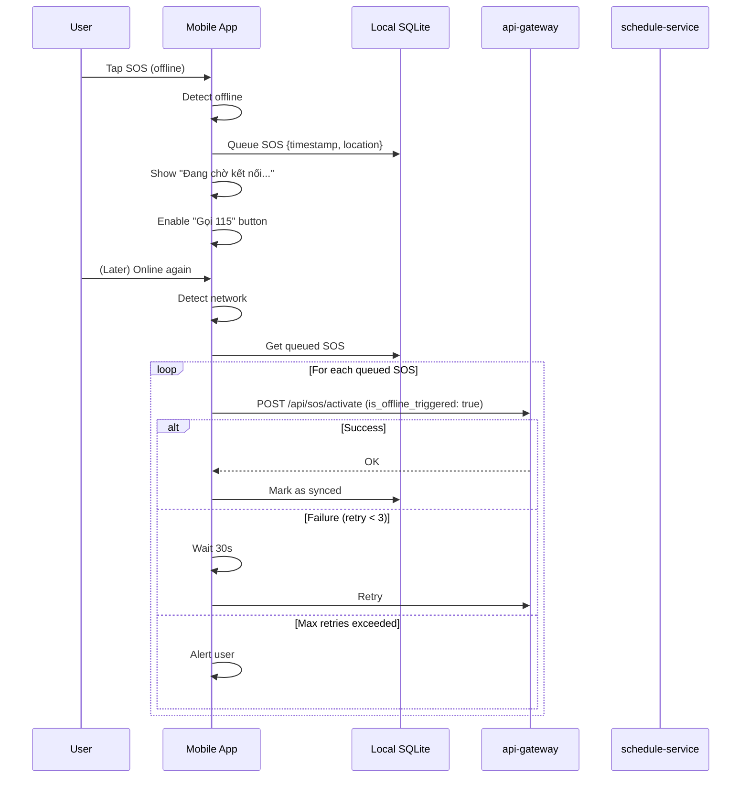

# 🔀 Sequence Diagram & Dependency Planning

## Feature Context

| Attribute | Value |
|-----------|-------|
| **Feature Name** | `sos_emergency` |
| **Total Tasks** | 32 |
| **Critical Path** | 21 tasks |

---

## 1. Task Dependency Graph

### 1.1 Database Layer (Foundation)

```
DB-001 ─────────────────────────────────────────────────────────┐
   │                                                             │
   ▼                                                             │
US-001 → US-002 → US-003 → US-004 ──────────────────────────────┤
                                                                 │
DB-002 ────────────────────────────────────────────────────────┐│
   │                                                            ││
   ├── DB-003                                                   ││
   │                                                            ││
   └── DB-004                                                   ││
                                                                ││
DB-005 ─────────────────────────────────────────────────────┐  ││
                                                            │  ││
                                                            ▼  ▼▼
                                                         READY FOR
                                                         API-GATEWAY
```

### 1.2 Backend Services

```
┌─────────────────────────────────────────────────────────────────┐
│                       API-GATEWAY-SERVICE                        │
├─────────────────────────────────────────────────────────────────┤
│                                                                  │
│  GW-001 (SOS Endpoints) ─────────┬──────────────────────────┐   │
│       │                          │                          │   │
│       ▼                          ▼                          ▼   │
│  GW-002 (Cooldown)          GW-006 (Kafka)            GW-008    │
│                                  │                              │
│                                  │                              │
│  GW-003 (Contact Endpoints) ◄────┼──── US-004 (gRPC Service)   │
│       │                          │                              │
│       ▼                          │                              │
│  GW-004 (gRPC Client)            │                              │
│                                  │                              │
│  GW-005 (First Aid) ◄────────────┼──── DB-005                  │
│                                  │                              │
│  GW-007 (CSKH Client)            │                              │
│                                  │                              │
└──────────────────────────────────┼──────────────────────────────┘
                                   │
                                   ▼
┌─────────────────────────────────────────────────────────────────┐
│                       SCHEDULE-SERVICE                           │
├─────────────────────────────────────────────────────────────────┤
│                                                                  │
│  SS-001 (Module Setup) ──────────┬──────────────────┐           │
│       │                          │                  │           │
│       ▼                          ▼                  ▼           │
│  SS-002 (Kafka Consumer)    SS-004 (ZNS)       SS-006 (Retry)  │
│       │                          │                  │           │
│       └─────────────┬────────────┘                  │           │
│                     │                               │           │
│                     ▼                               │           │
│                SS-003 (send_sos_alerts) ────────────┘           │
│                     │                                           │
│                     ▼                                           │
│                SS-005 (execute_escalation)                      │
│                                                                  │
│  SS-007 (Offline Queue)                                         │
│                                                                  │
│  SS-008 (Cleanup) ◄─────── DB-002                              │
│                                                                  │
└─────────────────────────────────────────────────────────────────┘
```

### 1.3 Mobile App

```
┌─────────────────────────────────────────────────────────────────┐
│                         MOBILE APP                               │
├─────────────────────────────────────────────────────────────────┤
│                                                                  │
│  MOB-007 (API Service) ◄────── GW-001, GW-003                   │
│       │                                                          │
│       ▼                                                          │
│  MOB-001 (Core Screens) ─────────────────────┐                  │
│       │                                       │                  │
│       ▼                                       ▼                  │
│  MOB-002 (Offline Queue)               MOB-006 (Error States)   │
│                                                                  │
│  MOB-003 (Contact List) ◄────── GW-003                          │
│                                                                  │
│  MOB-004 (Hospital Map) ◄────── Google Maps SDK                 │
│                                                                  │
│  MOB-005 (First Aid) ◄────── GW-005                             │
│                                                                  │
└─────────────────────────────────────────────────────────────────┘
```

---

## 2. Critical Path Analysis

### 2.1 Critical Path (Longest Dependency Chain)

```
DB-001 → US-001 → US-002 → US-003 → US-004 → GW-003 → GW-004 → MOB-003
  2h       2h       3h       4h       3h       3h       2h       4h
                                                                = 23h

DB-002 → SS-001 → SS-002 → SS-003 → SS-004 → SS-005
  2h       2h       3h       4h       4h       5h
                                            = 20h
```

**Critical Path Duration:** ~23 hours (≈ 3 working days)

### 2.2 Parallel Execution Opportunities

| Stream | Tasks | Duration |
|--------|-------|:--------:|
| **Stream A** (Database) | DB-001..005 | Day 1 |
| **Stream B** (user-service) | US-001..004 | Day 1-2 |
| **Stream C** (api-gateway) | GW-001..008 | Day 2-3 |
| **Stream D** (schedule) | SS-001..008 | Day 2-4 |
| **Stream E** (mobile) | MOB-001..007 | Day 3-5 |

---

## 3. Execution Sequence

### 3.1 Day-by-Day Plan

| Day | Tasks | Deliverables |
|:---:|-------|--------------|
| **1** | DB-001, DB-002, DB-003, DB-004, DB-005 | All database tables |
| **2** | US-001, US-002, US-003, US-004 | user-service gRPC ready |
| **3** | GW-001, GW-002, GW-003, GW-004, GW-006 | api-gateway core endpoints |
| **4** | SS-001, SS-002, SS-003, SS-004 | schedule-service core tasks |
| **5** | SS-005, GW-005, GW-007, GW-008 | Escalation + supporting endpoints |
| **6-7** | MOB-001, MOB-002, MOB-007 | Mobile core screens |
| **8-9** | MOB-003, MOB-004, MOB-005, MOB-006 | Mobile supporting screens |
| **10** | SS-006, SS-007, SS-008 | Background tasks + cleanup |

### 3.2 Sprint Allocation

#### Sprint 1: Foundation (Week 1-2)
| Track | Tasks | Owner |
|-------|-------|-------|
| Database | DB-001..005 | Backend Dev 1 |
| user-service | US-001..004 | Backend Dev 1 |
| api-gateway core | GW-001..004, GW-006 | Backend Dev 2 |

**Sprint 1 Demo:** API endpoints + gRPC services working

#### Sprint 2: Integration (Week 3-4)
| Track | Tasks | Owner |
|-------|-------|-------|
| schedule-service | SS-001..005 | Backend Dev 1 |
| api-gateway integration | GW-005, GW-007, GW-008 | Backend Dev 2 |
| Mobile core | MOB-001, MOB-002, MOB-007 | Mobile Dev |

**Sprint 2 Demo:** E2E SOS flow working (without escalation calls)

#### Sprint 3: Complete (Week 5-6)
| Track | Tasks | Owner |
|-------|-------|-------|
| schedule-service | SS-006, SS-007, SS-008 | Backend Dev 1 |
| Mobile remaining | MOB-003..006 | Mobile Dev |
| Integration testing | All | QA |

**Sprint 3 Demo:** Full feature complete + E2E tested

---

## 4. Sequence Diagrams

### 4.1 SOS Activation Flow



### 4.2 Escalation Flow



### 4.3 Offline Queue Flow



---

## 5. Risk Mitigations in Sequence

### 5.1 Server-Client Sync Risk

```
Client:  | Start | -------- 30s countdown -------- | Complete |
Server:  | Start | -------- 30s countdown -------- | Complete |
                      ↑                    ↑
                  Sync point #1       Sync point #2
                  (polling)           (polling)

Tolerance: ≤ 5 seconds
Decision point: SERVER
```

### 5.2 ZNS Failure Fallback

```
ZNS → [Fail] → Retry #1 (10s) → [Fail] → Retry #2 (10s) → [Fail] → Retry #3 (10s)
                                                                        ↓
                                                              SMS Fallback (optional)
                                                                        ↓
                                                              CSKH Alert (manual)
```

---

## 6. Integration Points Summary

| Source | Target | Protocol | Data |
|--------|--------|:--------:|------|
| Mobile → api-gateway | REST | REST/HTTPS | SOS requests |
| api-gateway → user-service | gRPC | gRPC | Contact queries |
| api-gateway → schedule-service | Kafka | Kafka | SOS events |
| api-gateway → Redis | Redis | Redis | Cooldown, sync |
| schedule-service → ZNS | HTTPS | HTTPS | Templates |
| api-gateway → CSKH | HTTPS | HTTPS | Alerts |
| Mobile → Phone | Native | Intent | 115 calls |
| Mobile → Maps | SDK | SDK | Hospital search |

---

## Next Phase

✅ **Phase 6: Sequence & Dependency Planning** - COMPLETE

➡️ **Phase 7: Review & Confirmation**
